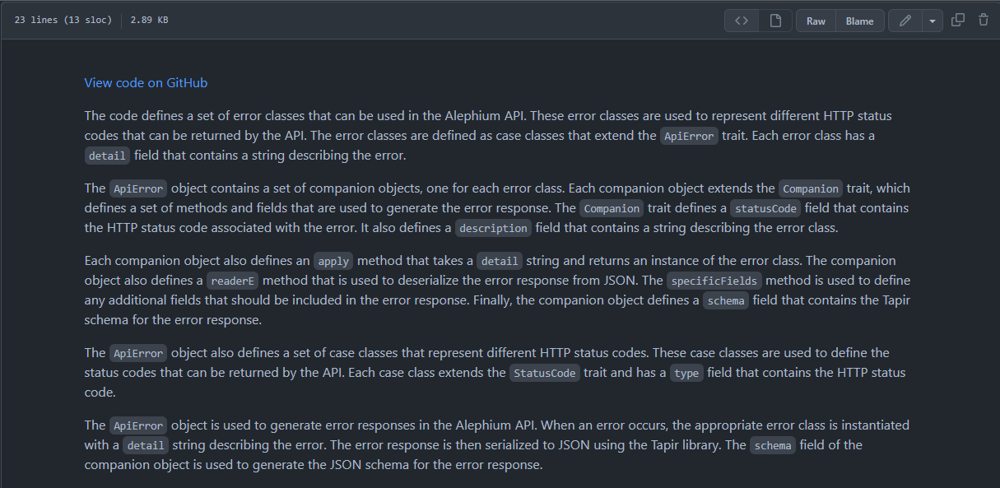
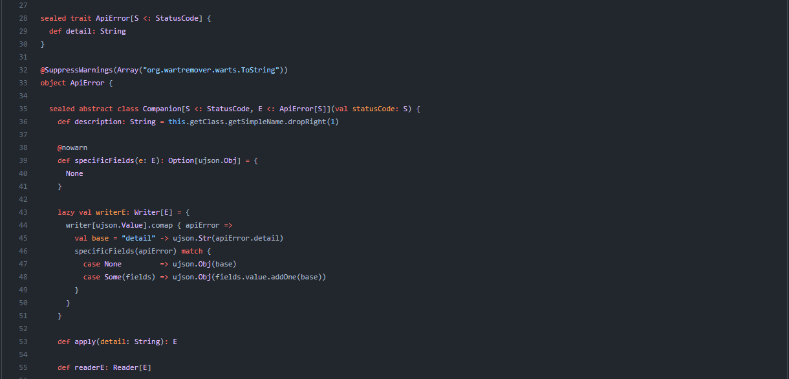

### AI-Powered Improved Docs: Explaining Alephium Full Node Code

#### New documentation was created with the help of Autodoc

AI-powered tools have become increasingly popular for various tasks, including code documentation. <a href="https://github.com/context-labs/autodoc" class="markup--anchor markup--p-anchor" data-href="https://github.com/context-labs/autodoc" rel="noopener" target="_blank">Autodoc</a> by <a href="https://github.com/context-labs/autodoc" class="markup--anchor markup--p-anchor" data-href="https://github.com/context-labs/autodoc" rel="noopener" target="_blank">Sam Hogan</a> leverages OpenAI’s GPT-4 to parse automatically and document source code. This article will discuss how Alephium used Autodoc to generate documentation for the Alephium full-node source code.

#### About Autodoc

Autodoc is a tool that can help developers create documentation for their code more easily. It works by analyzing the codebase, which is all the files and folders that make up a software project, and automatically writing descriptions of what each part does. It uses a type of artificial intelligence called Large Language Models (LLM) to understand the code and write the documentation.

The generated documentation is stored in the codebase, so developers can easily access it while working on the project. This makes it easier to understand what each part of the code does without reading through all the code files themselves.

### Using Autodoc for Alephium Full Node Source Code

Alephium used Autodoc to parse and document the Alephium full-node source code. After installing the Autodoc CLI tool and setting up the OpenAI API key, the next step was to run the **_doc init_** and **_doc index_** commands to generate the documentation for the codebase. Autodoc created markdown files for each file and folder in the repository, making it easy to navigate and understand the different components of the Alephium full node source code. You can access the docs here:

🔗<a href="https://github.com/alephium/alephium/tree/master/autodoc/docs/markdown" class="markup--anchor markup--p-anchor" data-href="https://github.com/alephium/alephium/tree/master/autodoc/docs/markdown" rel="noopener" target="_blank">https://github.com/alephium/alephium/tree/master/autodoc/docs/markdown</a>

Each file created has a link to the code file in the repository.

Each doc created has a link to the code file in the repository, followed by a description and explanation of the components of the Alephium source code.

This was a great addition to the source code documentation, freeing the Alephium core devs to focus on writing code and not having to write the documentation from the ground up. It also helps the new developers’ onboarding process, as the documentation is even more complete now.

---

You are invited to take a look at the documentation, and if you need any assistance, you are welcome to reach out in the community channels on <a href="https://alephium.org/discord" class="markup--anchor markup--p-anchor" data-href="https://alephium.org/discord" rel="noopener" target="_blank">Discord</a>, and <a href="https://t.me/alephiumgroup" class="markup--anchor markup--p-anchor" data-href="https://t.me/alephiumgroup" rel="noopener" target="_blank">Telegram</a>. And follow <a href="https://twitter.com/alephium" class="markup--anchor markup--p-anchor" data-href="https://twitter.com/alephium" rel="noopener" target="_blank">@alephium on Twitter</a> to stay up-to-date.
