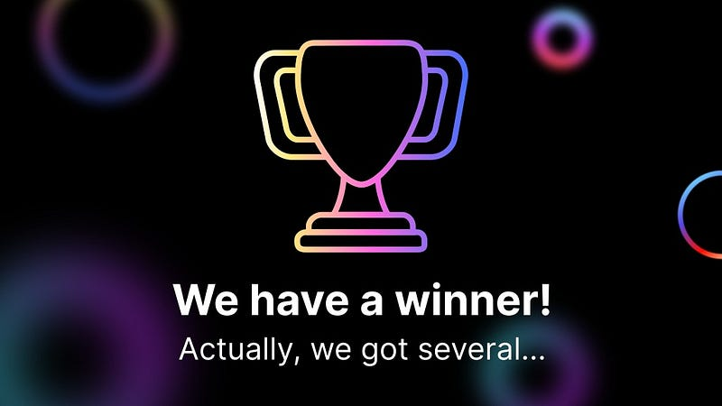

### ALEPHIUM/FLUX Tutorial Winners

#### On December 1st in 2022, the community was encouraged to <a href="https://medium.com/@alephium/alephium-flux-tutorial-contest-81054caf926" class="markup--anchor markup--h4-anchor" data-href="https://medium.com/@alephium/alephium-flux-tutorial-contest-81054caf926" target="_blank">enter a contest</a> to produce the best tutorial about how to run an <a href="https://github.com/alephium/alephium/" class="markup--anchor markup--h4-anchor" data-href="https://github.com/alephium/alephium/" rel="noopener" target="_blank">Alephium full node</a> on <a href="https://runonflux.io/" class="markup--anchor markup--h4-anchor" data-href="https://runonflux.io/" rel="noopener" target="_blank">FLUX</a>. The results came in and we are pleased with them.

It might seem like a trivial exercise but decentralization is not only about tools: in order to happen the skills required need to be evenly distributed. By participating the contestants have helped their peers to run their own full-node: everybody wins. A big thank you to everyone who participated.

### WE GOT A WINNER!

Actually… we got several. Picking the champion was no easy task, we loved your creations! But three contestants stood out sharing 1st place in different categories. Four runners up share the 2nd place and two contestants share the 3rd place. Everyone wins, quite literally.

### 1st place (video)

#### A <a href="https://youtu.be/xelpHE1Z0hA" class="markup--anchor markup--h4-anchor" data-href="https://youtu.be/xelpHE1Z0hA" rel="noopener" target="_blank">video</a> by <a href="https://www.youtube.com/@Crypto-Animation" class="markup--anchor markup--h4-anchor" data-href="https://www.youtube.com/@Crypto-Animation" rel="noopener" target="_blank">Crypto Animation</a>

<figure id="5fcf" class="graf graf--figure graf--iframe graf-after--h4">

<h1 id="ein-fehler-ist-aufgetreten." class="message">Ein Fehler ist aufgetreten.</h1>
<a href="https://www.youtube.com/watch?v=xelpHE1Z0hA" target="_blank">Sieh dir dieses Video auf www.youtube.com an</a> oder aktiviere JavaScript, falls es in deinem Browser deaktiviert sein sollte.
</figure>

### 1st place (article) A <a href="https://medium.com/@Oheka/2134def9b7d0" class="markup--anchor markup--h3-anchor" data-href="https://medium.com/@Oheka/2134def9b7d0" target="_blank">blog post</a> by <a href="https://medium.com/@Oheka" class="markup--anchor markup--h3-anchor" data-href="https://medium.com/@Oheka" target="_blank">Oheka</a>

<figure id="05a2" class="graf graf--figure graf--iframe graf-after--h3">
<blockquote>

</blockquote>
</figure>

### 1st place (Twitter thread) <a href="https://emojipedia.org/thread/" class="markup--anchor markup--h3-anchor" data-href="https://emojipedia.org/thread/" rel="noreferrer noopener noopener" target="_blank">🧵</a> by <a href="https://twitter.com/CryptoBlock177" class="markup--anchor markup--h3-anchor" data-href="https://twitter.com/CryptoBlock177" rel="noopener" target="_blank">@CryptoBlock177</a>

<figure id="bfb6" class="graf graf--figure graf--iframe graf-after--h3">
<blockquote>

</blockquote>
</figure>

### 2nd place

- A <a href="https://www.youtube.com/watch?v=nj4Ypgj0Xow" class="markup--anchor markup--li-anchor" data-href="https://www.youtube.com/watch?v=nj4Ypgj0Xow" rel="noopener" target="_blank">video</a> by <a href="https://www.youtube.com/@leftychris1058" class="markup--anchor markup--li-anchor" data-href="https://www.youtube.com/@leftychris1058" rel="noopener" target="_blank">LeftyChris</a>
- A <a href="https://www.youtube.com/watch?v=ALrV-axWowY" class="markup--anchor markup--li-anchor" data-href="https://www.youtube.com/watch?v=ALrV-axWowY" rel="noopener" target="_blank">video</a> by <a href="https://www.youtube.com/@galosf" class="markup--anchor markup--li-anchor" data-href="https://www.youtube.com/@galosf" rel="noopener" target="_blank">Galo Salame</a>
- A <a href="https://steemit.com/alephium/@cryptoraspberry/host-your-own-alephium-node-on-decentralized-web-3-0-flux-tutorial" class="markup--anchor markup--li-anchor" data-href="https://steemit.com/alephium/@cryptoraspberry/host-your-own-alephium-node-on-decentralized-web-3-0-flux-tutorial" rel="noopener" target="_blank">blog post</a> by <a href="https://steemit.com/@cryptoraspberry" class="markup--anchor markup--li-anchor" data-href="https://steemit.com/@cryptoraspberry" rel="noopener" target="_blank">Cryptoraspberry</a>
- A <a href="https://twitter.com/weineil_/status/1612568785948495903" class="markup--anchor markup--li-anchor" data-href="https://twitter.com/weineil_/status/1612568785948495903" rel="noopener" target="_blank">Twitter thread</a> by <a href="https://twitter.com/weineil_" class="markup--anchor markup--li-anchor" data-href="https://twitter.com/weineil_" rel="noopener" target="_blank">@weineil\_</a>

Other participants will receive a small participation prize as a token of appreciation.

### The Prizes

- 1st place, each gets **100 FLUX and 400 ALPH**
- 2nd place, each gets **50 FLUX and 200 ALPH**

### The Process

A jury of team-members from Flux and Alephium collaborated to pick the winner. The judges observed technical depth, accuracy, visual form. They also made sure the contributions adhere to <a href="https://medium.com/@alephium/alephium-flux-tutorial-contest-81054caf926#6cf2" class="markup--anchor markup--p-anchor" data-href="https://medium.com/@alephium/alephium-flux-tutorial-contest-81054caf926#6cf2" target="_blank">the rules and submissions guidelines</a> and applications were bound to the <a href="https://github.com/alephium/community/blob/master/RewardProgramRules.md#eligibility-criteria" class="markup--anchor markup--p-anchor" data-href="https://github.com/alephium/community/blob/master/RewardProgramRules.md#eligibility-criteria" rel="noopener" target="_blank">eligibility criterias</a>. **The winners will soon be contacted individually and asked for the necessary information to receive their prizes.**

### Thank You

We enjoyed every minute of your amazing creations. Thank you for your time, your creativity and dedication to elevate your peers!
