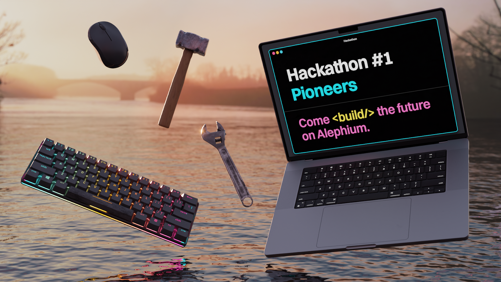

### Alephium \#1 Hackathon — Pioneers!

#### Applications are open, <a href="https://docs.google.com/forms/d/e/1FAIpQLSdDsa1CwJeg-fxrWb1gVWefP4iJoNoZwNe0PNwk94GqmcMkHg/viewform?usp=sharing" class="markup--anchor markup--h4-anchor" data-href="https://docs.google.com/forms/d/e/1FAIpQLSdDsa1CwJeg-fxrWb1gVWefP4iJoNoZwNe0PNwk94GqmcMkHg/viewform?usp=sharing" rel="noopener" target="_blank">apply now</a>!

_TL;DR — The Alephium hackathon will take place from 12th to 26th February 2024. With a prize pool of up to_ **_\$70,000 in ALPH_** _tokens, sponsored by Alephium,_ <a href="https://www.bitmain.com/" class="markup--anchor markup--p-anchor" data-href="https://www.bitmain.com/" rel="noopener" target="_blank"><em>Bitmain</em></a>_, the_ <a href="https://twitter.com/Blockflow_DAO" class="markup--anchor markup--p-anchor" data-href="https://twitter.com/Blockflow_DAO" rel="noopener" target="_blank"><em>Blockflow Alliance DAO</em></a>_,_ <a href="https://cetacean.capital/" class="markup--anchor markup--p-anchor" data-href="https://cetacean.capital/" rel="noopener" target="_blank"><em>Cetacean Capital</em></a> _&_ <a href="https://dappnode.com/" class="markup--anchor markup--p-anchor" data-href="https://dappnode.com/" rel="noopener" target="_blank"><em>Dappnode</em></a>_. It will reward teams building across 3 main categories (dApps, tooling & interoperability) as well as offering bounties for solo hackers & teams!_

### When & where?

The hackathon will happen exclusively online, from February 12th to 26th. Main communication hub for the hackathon will be <a href="http://www.alephium.org/discord" class="markup--anchor markup--p-anchor" data-href="http://www.alephium.org/discord" rel="noopener noreferrer noopener" target="_blank">our Discord</a> and you can join the hackathon channels already:

<a href="https://discord.com/channels/747741246667227157/1070646731106172928" class="markup--anchor markup--p-anchor" data-href="https://discord.com/channels/747741246667227157/1070646731106172928" rel="noopener noreferrer noopener" target="_blank">Hackathon-Lounge</a> — ⁠This is where you can find a team, share tips & brainstorm! All of our updates will be shared here, leave your notifications on for this one!

<a href="https://discord.com/channels/747741246667227157/1203001780703727626" class="markup--anchor markup--p-anchor" data-href="https://discord.com/channels/747741246667227157/1203001780703727626" rel="noopener noreferrer noopener" target="_blank">Hackathon-Projects</a> — This is where teams will regroup around their projects, document progress & interact in their own forum-like post. The channel is open, but you can’t post in there yet, only when the hackathon starts!

> <a href="https://docs.google.com/forms/d/e/1FAIpQLSdDsa1CwJeg-fxrWb1gVWefP4iJoNoZwNe0PNwk94GqmcMkHg/viewform?usp=sharing" class="markup--anchor markup--pullquote-anchor" data-href="https://docs.google.com/forms/d/e/1FAIpQLSdDsa1CwJeg-fxrWb1gVWefP4iJoNoZwNe0PNwk94GqmcMkHg/viewform?usp=sharing" rel="noopener" target="_blank">Applications are open: apply here now!</a>

---

### What are the Prizes?

The main prizes are tiered to recognize the top five submissions:

> **First Prize: \$15'000** in ALPH tokens

> **Second Prize:** \$8'000 in ALPH tokens

> **Third to Fifth Prizes:** Each will receive \$4'000 in ALPH tokens

> Sixth to ninth Prizes: Each will receive \$1'000 in ALPH tokens

In addition to the main prizes, special partner prizes add an extra chance to get recognized & rewarded:

- **Bitmain’s Choice:** A project aligning with the Bitmain’s values will receive \$2,500 in ALPH tokens.
- **Blockflow’s Choice:** A project aligning with the Blockflow Alliance’s ethos will receive \$2,500 in ALPH tokens.
- **Cetacean’s Choice:** An award of \$2,500 in ALPH tokens for a project that resonates with Cetacean Capital’s vision.
- **Dappnode’s Choice:** The project which encourages self-hosting & desintermediation the most will win a <a href="https://dappnode.com/collections/all/products/home-i532-4n" class="markup--anchor markup--li-anchor" data-href="https://dappnode.com/collections/all/products/home-i532-4n" rel="noopener" target="_blank">Dappnode home i532–4N model</a> (1745€ value!)

The hackathon also features bounties and honors to encourage a wide range of contributions:

- **Bounties:** A dedicated pool of up to \$15,000 in ALPH tokens for specific challenges called bounties.
- **Honors:** An additional fund of up to \$8,500 in ALPH tokens, distributed at the jury’s discretion to acknowledge special achievements.

_Note: The distribution of prizes is subject to the discretion of the jury and may be adjusted based on the quality of submissions received. All prizes will be paid in \$ALPH. The conversion rate for prizes will use the \$ALPH price average over the 14 days of the hackathon (12–26th of February)._

---

### What can I build?

Participants can engage in one of two primary participation methods: embarking on the main quests or tackling side quests called bounties.

#### **Main quests**

Participants can participate either as teams or as solo hackers and complete projects in the following categories: and complete projects in the following categories:

- **dApps Development:** Challenge your skills in decentralized application development.
- **Tooling:** Innovate and create new tools to enhance the UX or DevX.
- **Interoperability:** Augment Alephium’s reach & accessibility with other blockchains, wallets or services.

_Can I join with an existing project? Those who wish to start with a pre-existing project can do so, but only the progress made during the hackathon will be considered for evaluation and judging. Clear objectives will need to be set at the beginning of the hackathon to facilitate this assessment._

#### **Bounties**

These are specific/smaller tasks or challenges that participants can complete for rewards. If you are a solo hacker and want to participate in the hackathon, this is the way (teams can also do bounties!).

The general goal of bounties is to provide improvements to the user/developer experience. Bounties are divided into 4 focus areas:

**Documentation**

Enhancing/creating developer documentation. (Create a PR in the relevant repo)

- 1 — improve the <a href="https://docs.alephium.org/dapps/alephium-web3" class="markup--anchor markup--li-anchor" data-href="https://docs.alephium.org/dapps/alephium-web3" rel="noopener noreferrer noopener" target="_blank">SDK doc</a>
- 2 — improve the <a href="https://docs.alephium.org/dapps/alephium-web3" class="markup--anchor markup--li-anchor" data-href="https://docs.alephium.org/dapps/alephium-web3" rel="noopener noreferrer noopener" target="_blank">dApp recipes doc</a>
- 3 — improve the <a href="https://docs.alephium.org/ralph/getting-started" class="markup--anchor markup--li-anchor" data-href="https://docs.alephium.org/ralph/getting-started" rel="noopener noreferrer noopener" target="_blank">Ralph language doc</a>

**Coding PoC**

Creating proof-of-concepts / code examples that help to explain Alephium. (Create a PR in <a href="https://github.com/alephium/ralph-example" class="markup--anchor markup--p-anchor" data-href="https://github.com/alephium/ralph-example" rel="noopener noreferrer noopener" target="_blank">this repo</a>)

- 4 — Merkle tree proof for allowlist
- 5 — Crowdfund platform
- 6 — Simple price Oracle
- 7 — Simple DAO
- 8 — Airdrop contract

**Front-End Task**

Developing a front-end feature.

- 9 — <a href="https://github.com/alephium/alephium-frontend/issues/273" class="markup--anchor markup--li-anchor" data-href="https://github.com/alephium/alephium-frontend/issues/273" rel="noopener noreferrer noopener" target="_blank">Payment request flow feature</a>
- 10 — <a href="https://github.com/alephium/alephium-frontend/issues/158" class="markup--anchor markup--li-anchor" data-href="https://github.com/alephium/alephium-frontend/issues/158" rel="noopener noreferrer noopener" target="_blank">Register the Alephium chain in the WalletConnect Cloud</a>
- 11 — <a href="https://github.com/alephium/alephium-frontend/issues?q=is%3Aissue+is%3Aopen+label%3Acommunity" class="markup--anchor markup--li-anchor" data-href="https://github.com/alephium/alephium-frontend/issues?q=is%3Aissue+is%3Aopen+label%3Acommunity" rel="noopener noreferrer noopener" target="_blank">Any pending issue</a> marked with the community tag.

**Community Dashboards & Calculators**

Designing a dashboard & calculators for useful information.

- 12 — Dune analytics board for the wALPH Uniswap ppol
- 13 — ETH wALPH stats
- 14 — dApps stats dashboard
- 15 — Mining reward calculator
- 16 — Burned tokens calculator

**Your own idea**

If you have an idea for a bounty, propose it to us in the general chat of the hackathon!

_For submission, the process is the same as for main quests. Once you have chosen a bounty, please create a post in the Hackathon-Projects channel with the name of the bounty as a title. You can document your progress there or ask us for help or advice in the post. At the end of the hackathon, you will provide a link to your work in the submission form, to be evaluated by the jury!_

---

> <a href="https://docs.google.com/forms/d/e/1FAIpQLSdDsa1CwJeg-fxrWb1gVWefP4iJoNoZwNe0PNwk94GqmcMkHg/viewform?usp=sharing" class="markup--anchor markup--pullquote-anchor" data-href="https://docs.google.com/forms/d/e/1FAIpQLSdDsa1CwJeg-fxrWb1gVWefP4iJoNoZwNe0PNwk94GqmcMkHg/viewform?usp=sharing" rel="noopener" target="_blank">Applications are open: apply here now!</a>

---

### What is the Hackathon Schedule?

- J̶**a̶n̶u̶a̶r̶y̶ ̶1̶9̶t̶h̶ ̶-̶ ̶**A̶n̶n̶o̶u̶n̶c̶e̶m̶e̶n̶t̶ ̶a̶n̶d̶ ̶O̶p̶e̶n̶i̶n̶g̶ ̶o̶f̶ ̶A̶p̶p̶l̶i̶c̶a̶t̶i̶o̶n̶s̶.̶
- ̶**J̶a̶n̶u̶a̶r̶y̶ ̶3̶1̶s̶t̶ ̶-̶ ̶**O̶p̶e̶n̶i̶n̶g̶ ̶o̶f̶ ̶t̶h̶e̶ ̶s̶p̶e̶c̶i̶a̶l̶ ̶D̶i̶s̶c̶o̶r̶d̶ ̶C̶h̶a̶n̶n̶e̶l̶ ̶f̶o̶r̶ ̶t̶e̶a̶m̶ ̶f̶i̶n̶d̶i̶n̶g̶ ̶a̶n̶d̶ ̶g̶e̶n̶e̶r̶a̶l̶ ̶c̶h̶a̶t̶.̶
- ̶**F̶e̶b̶r̶u̶a̶r̶y̶ ̶1̶2̶t̶h̶ ̶-̶** ̶H̶a̶c̶k̶a̶t̶h̶o̶n̶ ̶K̶i̶c̶k̶-̶o̶f̶f̶ ̶L̶i̶v̶e̶ ̶E̶v̶e̶n̶t̶ ̶&̶ ̶O̶f̶f̶i̶c̶i̶a̶l̶ ̶s̶t̶a̶r̶t̶ ̶o̶f̶ ̶t̶h̶e̶ ̶h̶a̶c̶k̶a̶t̶h̶o̶n̶!̶ ̶  
  ̶A̶ ̶o̶n̶e̶-̶h̶o̶u̶r̶ ̶k̶i̶c̶k̶o̶f̶f̶ ̶L̶i̶v̶e̶ ̶E̶v̶e̶n̶t̶ ̶w̶i̶t̶h̶ ̶t̶h̶e̶ ̶t̶e̶a̶m̶.̶ ̶@̶h̶0̶n̶g̶c̶h̶a̶o̶ ̶w̶i̶l̶l̶ ̶h̶e̶l̶p̶ ̶s̶e̶t̶ ̶u̶p̶ ̶y̶o̶u̶r̶ ̶d̶e̶v̶e̶l̶o̶p̶m̶e̶n̶t̶ ̶e̶n̶v̶i̶r̶o̶n̶m̶e̶n̶t̶,̶ ̶@̶z̶i̶p̶p̶y̶ ̶r̶e̶c̶a̶p̶ ̶t̶h̶e̶ ̶p̶r̶o̶c̶e̶s̶s̶,̶ ̶@̶M̶a̶u̶d̶ ̶,̶ ̶@̶m̶i̶k̶a̶ ̶&̶ ̶@̶c̶h̶e̶n̶g̶ ̶w̶i̶l̶l̶ ̶b̶e̶ ̶t̶h̶e̶r̶e̶.̶ ̶T̶h̶i̶s̶ ̶w̶i̶l̶l̶ ̶b̶e̶ ̶f̶o̶l̶l̶o̶w̶e̶d̶ ̶b̶y̶ ̶a̶n̶ ̶o̶p̶e̶n̶ ̶o̶f̶f̶i̶c̶e̶ ̶&̶ ̶Q̶&̶A̶!̶
- ̶**F̶e̶b̶r̶u̶a̶r̶y̶ ̶1̶6̶t̶h̶ ̶&̶ ̶2̶0̶t̶h̶ ̶-̶** ̶O̶p̶e̶n̶ ̶O̶f̶f̶i̶c̶e̶ ̶H̶o̶u̶r̶s̶ ̶&̶ ̶L̶i̶v̶e̶ ̶S̶u̶p̶p̶o̶r̶t̶  
  ̶T̶h̶e̶s̶e̶ ̶o̶n̶e̶-̶h̶o̶u̶r̶ ̶s̶e̶s̶s̶i̶o̶n̶s̶ ̶w̶i̶l̶l̶ ̶a̶l̶l̶o̶w̶ ̶p̶a̶r̶t̶i̶c̶i̶p̶a̶n̶t̶s̶ ̶t̶o̶ ̶e̶n̶g̶a̶g̶e̶ ̶w̶i̶t̶h̶ ̶t̶h̶e̶ ̶c̶o̶r̶e̶ ̶c̶o̶n̶t̶r̶i̶b̶u̶t̶o̶r̶s̶ ̶a̶n̶d̶ ̶s̶e̶e̶k̶ ̶a̶s̶s̶i̶s̶t̶a̶n̶c̶e̶ ̶o̶r̶ ̶c̶l̶a̶r̶i̶f̶i̶c̶a̶t̶i̶o̶n̶ ̶o̶n̶ ̶t̶h̶e̶i̶r̶ ̶p̶r̶o̶j̶e̶c̶t̶s̶.̶
- **February 26th** — Submission deadline: All projects must be submitted by 11:59 PM CET.
- **First Half of March** — Winners Announcement

Throughout the hackathon, the core contributors will be readily available on the Discord channels to provide assistance and guidance.

---

### How can I participate?

First, you need to apply! Join by completing the form <a href="https://docs.google.com/forms/d/e/1FAIpQLSdDsa1CwJeg-fxrWb1gVWefP4iJoNoZwNe0PNwk94GqmcMkHg/viewform?usp=sharing" class="markup--anchor markup--p-anchor" data-href="https://docs.google.com/forms/d/e/1FAIpQLSdDsa1CwJeg-fxrWb1gVWefP4iJoNoZwNe0PNwk94GqmcMkHg/viewform?usp=sharing" rel="noopener" target="_blank"><strong>here</strong></a>!

For the duration of the hackathon, the main communication Hub will be the hackathon’s general channel. Ping us there if you didn’t get the special discord role! You’ll find resources, updates, and support there. You’ll be able to use the channel to find teammates, mentorship from core-contributors or just chat!

Additionally, each team will have access to a dedicated Discord sub-channel in a dedicated forum channel for discussion, progress reporting, and collaboration.

At the end of the hackathon, the teams & individuals will need to submit their work through this <a href="https://forms.gle/5DFjrsRGmFVfhVUg6" class="markup--anchor markup--p-anchor" data-href="https://forms.gle/5DFjrsRGmFVfhVUg6" rel="noopener" target="_blank">form</a> (not yet open, check back after the 20th of February).

---

### Who’s in the Jury?

We’ve assembled a knowledgeable, exigent but amicable & engaged jury. This jury will distribute the main prizes, bounties rewards & honorable mentions:

<a href="https://twitter.com/wachmc" class="markup--anchor markup--p-anchor" data-href="https://twitter.com/wachmc" rel="noopener" target="_blank">wachmc </a>— core-contributor — core dev  
<a href="https://twitter.com/hongchao" class="markup--anchor markup--p-anchor" data-href="https://twitter.com/hongchao" rel="noopener" target="_blank">h0ngcha0</a> — core-contributor — core dev  
<a href="https://twitter.com/mika_pote" class="markup--anchor markup--p-anchor" data-href="https://twitter.com/mika_pote" rel="noopener" target="_blank">Mika</a> — core-contributor — front-end dev  
<a href="https://twitter.com/MaudBannwart" class="markup--anchor markup--p-anchor" data-href="https://twitter.com/MaudBannwart" rel="noopener" target="_blank">s0ukie</a> — core-contributor — COO  
<a href="https://twitter.com/_polto_" class="markup--anchor markup--p-anchor" data-href="https://twitter.com/_polto_" rel="noopener" target="_blank">Polto</a> — core-contributor — strategist  
<a href="https://twitter.com/Estragon77" class="markup--anchor markup--p-anchor" data-href="https://twitter.com/Estragon77" rel="noopener" target="_blank">zippy9999</a> — core-contributor — CMO

Partners will have their own juries & will choose the partner prizes independently:

Partner jury —Bitmain   
Partner jury — Blockflow DAO  
Partner jury — Cetacean Capital DAO  
Partner jury — Dappnode

---

### What will be the jury’s criteria?

Participants are encouraged to be creative and propose projects that resonate with their interests, as long as they align with Alephium’s framework and fit into one of the proposed categories.

Here is how the jury will evaluate your project:

- **Implementation — **Does the interaction with Alephium demonstrate quality software development?
- **From idea to finish** — Does the idea/intention announced at the beginning match with the output at the end?
- **UX/Design** — Is the user experience and design of the project well thought out?
- **Potential Impact — **How big of an impact could the project have on the Alephium ecosystem?
- **Quality of the Idea** — How creative and unique is the project?

---

### What are the rules?

- **Age and Legal Requirements:** Participants must be at least 18 years old, or have reached the age of majority in their jurisdiction, whichever is greater. Compliance with the terms and conditions outlined <a href="https://drive.google.com/file/d/1l6zPHBKYiJshTbEBB__W1a8nxOrNDfZF/view?usp=sharing" class="markup--anchor markup--li-anchor" data-href="https://drive.google.com/file/d/1l6zPHBKYiJshTbEBB__W1a8nxOrNDfZF/view?usp=sharing" rel="noopener" target="_blank">here</a> is mandatory.
- **Adherence to Themes:** Projects should align with the hackathon’s themes and categories. Creativity is encouraged, but relevance to Alephium’s ecosystem is essential.
- **Progress and Development:** Projects can build upon existing work, but only advancements made during the hackathon will be considered for judging.
- **Where will the teams submit their projects:** The submissions must include links to code repositories. You can also include text, video, or audio with relevant graphics and links to webapps you may find relevant.

Participants will be required to submit their work through a form that will be communicated during the hackathon.

---

### What happens after the hackathon?

Participating projects can subsequently apply to Alephium’s <a href="https://github.com/alephium/community/blob/master/Grant%26RewardProgram.md#grants" class="markup--anchor markup--p-anchor" data-href="https://github.com/alephium/community/blob/master/Grant%26RewardProgram.md#grants" rel="noopener" target="_blank">grant program</a>.

<a href="https://cetaceancapital.medium.com/bringing-the-a-game-2024-outlook-of-our-alephium-investment-4afd9a86606f" class="markup--anchor markup--p-anchor" data-href="https://cetaceancapital.medium.com/bringing-the-a-game-2024-outlook-of-our-alephium-investment-4afd9a86606f" rel="noopener" target="_blank">Cetacean Capital is also interested to support participating projects as the DAO</a> _“is dedicated to supporting standout projects that align with their criteria in the upcoming Hackathon, providing investment/seed funding ranging from \$50.000 to \$1.000.000”._

The Blockflow DAO also expressed interest in helping quality projects develop further after the hackathon.

---

### Where do I start? Where’s the doc?

<a href="https://docs.google.com/forms/d/e/1FAIpQLSdDsa1CwJeg-fxrWb1gVWefP4iJoNoZwNe0PNwk94GqmcMkHg/viewform?usp=sf_link" class="markup--anchor markup--p-anchor" data-href="https://docs.google.com/forms/d/e/1FAIpQLSdDsa1CwJeg-fxrWb1gVWefP4iJoNoZwNe0PNwk94GqmcMkHg/viewform?usp=sf_link" rel="noopener" target="_blank">Fill out the form</a> to apply and start your project!

For the doc, start here!

- Developer <a href="https://twitter.com/alephium/status/1752028946399654269" class="markup--anchor markup--li-anchor" data-href="https://twitter.com/alephium/status/1752028946399654269" rel="noopener" target="_blank">onboarding thread</a>
- The full <a href="http://docs.alephium.org" class="markup--anchor markup--li-anchor" data-href="http://docs.alephium.org" rel="noopener" target="_blank">documentation</a>
- Getting started with RALPH Alephium’s <a href="https://docs.alephium.org/ralph/getting-started" class="markup--anchor markup--li-anchor" data-href="https://docs.alephium.org/ralph/getting-started" rel="noopener" target="_blank">programming language</a>
- RALPH <a href="https://docs.alephium.org/ralph/getting-started" class="markup--anchor markup--li-anchor" data-href="https://docs.alephium.org/ralph/getting-started" rel="noopener" target="_blank">Documentation</a> & Tokens <a href="https://docs.alephium.org/tokens/overview" class="markup--anchor markup--li-anchor" data-href="https://docs.alephium.org/tokens/overview" rel="noopener" target="_blank">Documentation</a>
- dApps <a href="https://docs.alephium.org/dapps/ecosystem#prototypes" class="markup--anchor markup--li-anchor" data-href="https://docs.alephium.org/dapps/ecosystem#prototypes" rel="noopener" target="_blank">Proof of concepts (PoC)</a> (DEX, NFT marketplace, bridge)
- Workshop \#1 with h0ngchao <a href="https://medium.com/@alephium/first-developer-workshop-build-a-token-faucet-a6bb2aa7bf68" class="markup--anchor markup--li-anchor" data-href="https://medium.com/@alephium/first-developer-workshop-build-a-token-faucet-a6bb2aa7bf68" target="_blank">How to Build a Faucet</a> — <a href="https://www.youtube.com/watch?time_continue=2&amp;v=YblUxEcXQuY&amp;embeds_widget_referrer=https%3A%2F%2Fmedium.com%2F%40alephium%2Ffirst-developer-workshop-build-a-token-faucet-a6bb2aa7bf68&amp;embeds_referring_euri=https%3A%2F%2Fcdn.embedly.com%2F&amp;embeds_referring_origin=https%3A%2F%2Fcdn.embedly.com&amp;source_ve_path=Mjg2NjY&amp;feature=emb_logo" class="markup--anchor markup--li-anchor" data-href="https://www.youtube.com/watch?time_continue=2&amp;v=YblUxEcXQuY&amp;embeds_widget_referrer=https%3A%2F%2Fmedium.com%2F%40alephium%2Ffirst-developer-workshop-build-a-token-faucet-a6bb2aa7bf68&amp;embeds_referring_euri=https%3A%2F%2Fcdn.embedly.com%2F&amp;embeds_referring_origin=https%3A%2F%2Fcdn.embedly.com&amp;source_ve_path=Mjg2NjY&amp;feature=emb_logo" rel="noopener" target="_blank">video</a>
- Workshop \#2 with h0ngchao <a href="https://medium.com/@alephium/second-developer-workshop-re-implementing-friend-techs-smart-contract-in-ralph-806e3f6551aa" class="markup--anchor markup--li-anchor" data-href="https://medium.com/@alephium/second-developer-workshop-re-implementing-friend-techs-smart-contract-in-ralph-806e3f6551aa" target="_blank">How to implement friend.tech on Alephium, part 1</a> and <a href="https://medium.com/@alephium/second-developer-workshop-re-implementing-friend-techs-smart-contract-in-ralph-part-2-8f9959742b47" class="markup--anchor markup--li-anchor" data-href="https://medium.com/@alephium/second-developer-workshop-re-implementing-friend-techs-smart-contract-in-ralph-part-2-8f9959742b47" target="_blank">part 2</a> — <a href="https://www.youtube.com/watch?v=gi2sxvB9Np8" class="markup--anchor markup--li-anchor" data-href="https://www.youtube.com/watch?v=gi2sxvB9Np8" rel="noopener" target="_blank">video 1</a>, <a href="https://www.youtube.com/watch?v=Xgt3_HwoUOc" class="markup--anchor markup--li-anchor" data-href="https://www.youtube.com/watch?v=Xgt3_HwoUOc" rel="noopener" target="_blank">video 2</a>

To know more about Alephium in general, start <a href="https://x.com/alephium/status/1726249933374959943?s=20" class="markup--anchor markup--p-anchor" data-href="https://x.com/alephium/status/1726249933374959943?s=20" rel="noopener" target="_blank">here</a> and in our <a href="https://docs.alephium.org/" class="markup--anchor markup--p-anchor" data-href="https://docs.alephium.org/" rel="noopener" target="_blank">docs</a>! And read more <a href="https://x.com/alephium/status/1744795616818217432?s=20" class="markup--anchor markup--p-anchor" data-href="https://x.com/alephium/status/1744795616818217432?s=20" rel="noopener" target="_blank">there</a>! Our bible of content is <a href="https://docs.alephium.org/Content" class="markup--anchor markup--p-anchor" data-href="https://docs.alephium.org/Content" rel="noopener" target="_blank">here</a>, and our medium is <a href="https://medium.com/@alephium" class="markup--anchor markup--p-anchor" data-href="https://medium.com/@alephium" target="_blank">here</a>.

We can’t wait to be there!

> <a href="https://docs.google.com/forms/d/e/1FAIpQLSdDsa1CwJeg-fxrWb1gVWefP4iJoNoZwNe0PNwk94GqmcMkHg/viewform?usp=sharing" class="markup--anchor markup--pullquote-anchor" data-href="https://docs.google.com/forms/d/e/1FAIpQLSdDsa1CwJeg-fxrWb1gVWefP4iJoNoZwNe0PNwk94GqmcMkHg/viewform?usp=sharing" rel="noopener" target="_blank">Applications are open: apply here now!</a>

---

### Who are the hackathon partners & sponsors?

<a href="https://www.bitmain.com/" class="markup--anchor markup--p-anchor" data-href="https://www.bitmain.com/" rel="noopener noreferrer noopener" target="_blank">BITMAIN</a> is a global leader in digital currency mining servers and is committed to creating a better digital world. With cutting-edge hash-rate efficiency technologies, they drive secure, stable hashrate infrastructure, fueling innovation in the web 3.0 era.

<a href="https://twitter.com/Blockflow_DAO" class="markup--anchor markup--p-anchor" data-href="https://twitter.com/Blockflow_DAO" rel="noopener" target="_blank">The Blockflow DAO</a> is Alephium’s first ever community DAO, dedicated to boosting adoption & usage, expanding the community, nurturing development & promoting the Alephium ecosystem.

<a href="https://cetacean.capital/" class="markup--anchor markup--p-anchor" data-href="https://cetacean.capital/" rel="noopener" target="_blank">Cetacean Capital</a> aims to be DeFi’s most loved, efficient, and profitable Investment DAO. As individuals, its members have incredible skills, experience knowledge and contacts, in the crypto-space for many years.

<a href="https://dappnode.com/" class="markup--anchor markup--p-anchor" data-href="https://dappnode.com/" rel="noopener" target="_blank">Dappnode</a> is the self-owned infrastructure layer for a human-centric, data-sovereign, private-by-design internet. DAppNode lowers the barrier of entry for non tech-savvy participants.
