### **Alephium Multisig GUI is here!**

#### The Alephium Toolkit: A Guide to Creating a Multisig Wallet

_Multisignature wallets are essential to a maturing infrastructure, as they provide more granularity & security in managing \$ALPH wallets. The core-team is very happy to unveil the Multisig Wallet Creation tool, the first in the_ <a href="https://alephium.github.io/alephium-toolkit/" class="markup--anchor markup--p-anchor" data-href="https://alephium.github.io/alephium-toolkit/" rel="noopener" target="_blank"><em>Alephium Toolkit</em></a>_!_

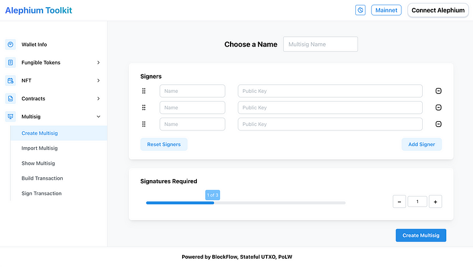

#### **Why use a Multisig?**

A multisig (multi-signature) wallet in cryptocurrency is used for enhanced security and joint control of assets. It requires multiple signatures to authorize a transaction, making it harder for attackers to access funds. It’s useful for people or organizations needing consensus before spending, serves as a backup solution if one key is lost, helps in regulatory compliance, and reduces the single point of failure risk associated with single key wallets.

Whether you want to have a setup where more than one person is in charge of funds (for example when funds belong to a company or association), or you want to have multiple keys for your own wallet, it is a good security practice to have it in a multisig wallet. We’ve talked about it <a href="https://medium.com/@alephium/ttxoo-2-the-road-to-self-custody-cfea4ae89444" class="markup--anchor markup--p-anchor" data-href="https://medium.com/@alephium/ttxoo-2-the-road-to-self-custody-cfea4ae89444" target="_blank">in the past</a>!

Use the following guide to create a multisig wallet, and learn how to prepare transactions, sign and send them. Do not hesitate to let us know if you have any questions in our <a href="http://alephium.org/discord" class="markup--anchor markup--p-anchor" data-href="http://alephium.org/discord" rel="noopener" target="_blank">Discord</a>.

#### **How does the multisig work?**

While multisig transactions are similar in nature to simple transactions, there are some structural differences in the process.

First someone needs to _build the transaction_, that means to indicate the recipient, amount and how many (and which) signers need to sign it.

Then the _signers_ need to sign the transaction and report back with their _signatures_.

Finally, the _builder_ assembles the signatures, and sends the transaction.

In this example tutorial, we’ll conceive of a multisig where M out of N people need to sign to be able to send transactions.

#### **1 — Get all the Public Keys**

The first step is to get the Public keys of all signers, who are going to be part of the multisig.

All the signers need to complete the following steps:

- Access <a href="https://alephium.github.io/alephium-toolkit/" class="markup--anchor markup--li-anchor" data-href="https://alephium.github.io/alephium-toolkit/" rel="noopener" target="_blank">https://alephium.github.io/alephium-toolkit/</a>.
- The landing page is the “Wallet Info”.
- Click on the “Connect Alephium” button in the top right.
- Choose the wallet type you want to connect with the dApp.
- After the successful connection, your wallet information will appear in the wallet info section.
- Copy your public key, and send it to the creator of the multisig.

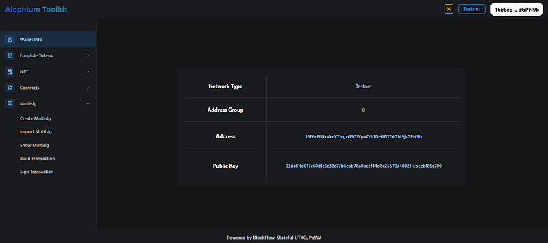

#### **2 — Create the Wallet**

The second step consists of creating the multisig with the public keys of all signers. The creator of the multisig (which can be any of the signers (or someone else) has to complete the following steps:

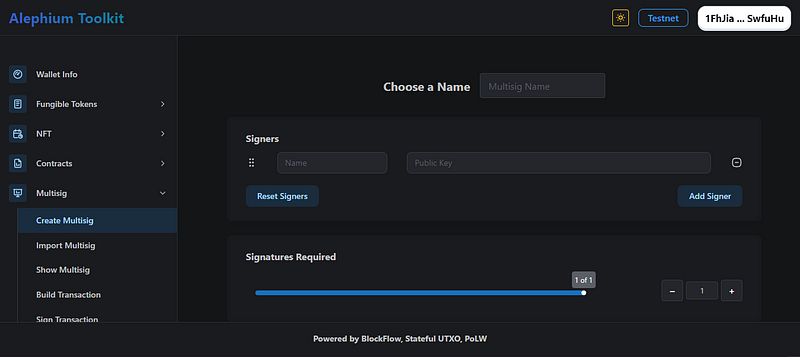

- Navigate to <a href="https://alephium.github.io/alephium-toolkit/" class="markup--anchor markup--li-anchor" data-href="https://alephium.github.io/alephium-toolkit/" rel="noopener" target="_blank">Create Multisig Wallet</a>
- Choose a name for your multisig wallet
- “Add Signer” and input all “public keys” from each signer (and name them correctly!). Add as many as there are potential signers.
- Choose the number of signatures required to send a transaction (2 out of 3, 3 out of 5, or any M out of N): this is the quorum required by your multisig to actually send a transaction.
- Click on “Create Multisig”
- The next screen shows a recap of the multisig’s configuration. Check that it’s all good.
- Click “Export”: this will copy the wallet information you need to send back to all other signers so that they can import it.

#### **3 — Import the multisig wallet**

In this third step, the signers will import the multisig wallet, so they are able to subsequently sign transactions. All the signers have to complete the following:

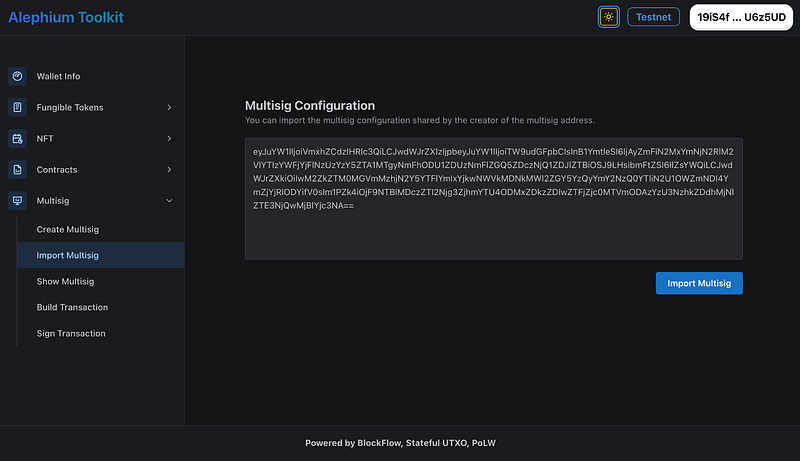

- Navigate to <a href="https://alephium.github.io/alephium-toolkit/#/multisig/import" class="markup--anchor markup--li-anchor" data-href="https://alephium.github.io/alephium-toolkit/#/multisig/import" rel="noopener" target="_blank">Import Multisig Wallet</a>
- Click on “Import Multisig”
- You can now either build and/or sign transactions in that particular multisig

The next step is to put some money on the multisig, so you can actually build, sign and then send a transaction!

#### **4 — Send \$ALPH to the multisig**

Before you can make transactions with the multisig, you need to send some \$ALPH to it.

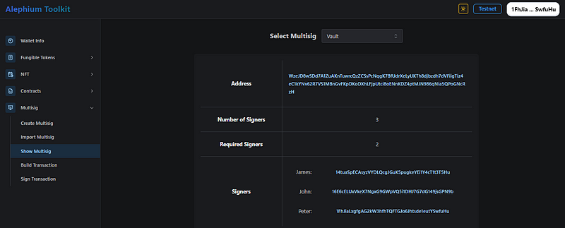

- Go to <a href="https://alephium.github.io/alephium-toolkit/#/multisig/show" class="markup--anchor markup--li-anchor" data-href="https://alephium.github.io/alephium-toolkit/#/multisig/show" rel="noopener" target="_blank">Show Multisig Wallet</a>
- Copy the “address” content
- Go to your wallet of choice (can be another multisig, the desktop, or extension wallet) and paste the address in the recipient field, choose the amount, the token, and send! — You can also give this address to someone else to pay to the multisig!
- (If you want to send a token, remember you will need some \$ALPH to pay for gas anyway, so send some too)

#### **5 — Build a transaction**

Any party to a multisig wallet can now act as the builder of a transaction. So get on your builder’s hat, and start building a transaction:

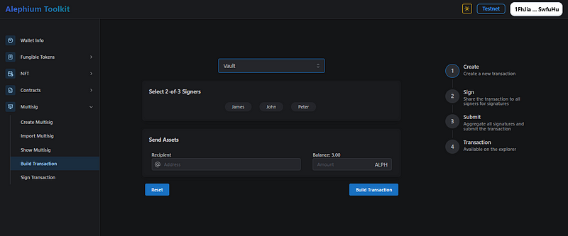

- Navigate to <a href="https://alephium.github.io/alephium-toolkit/#/multisig/build-tx" class="markup--anchor markup--li-anchor" data-href="https://alephium.github.io/alephium-toolkit/#/multisig/build-tx" rel="noopener" target="_blank">Build Transaction</a>
- Choose your multisig from the list, select the signers you need/want, the amount and the recipient’s address for the transaction. Check well that you selected the correct signers, and that you are satisfying the quorum requirement!
- Click “Build Transaction”. You’ll get a text blurb which is essentially an unsigned transaction.
- Copy this, and send it to the signers you selected.

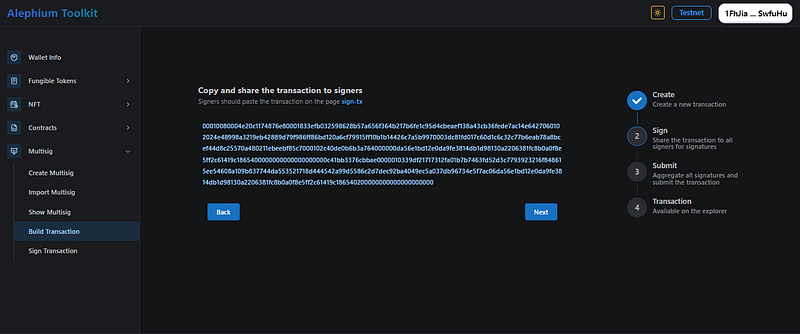

#### **6 — Sign the Transaction**

You are a party to a multisig transaction, the builder of the transaction sent you a transaction to sign in the form of a long text blurb, this is what you need to do:

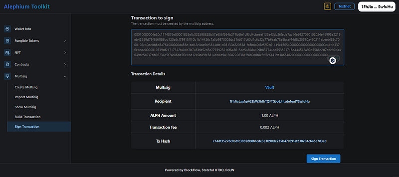

- Go to <a href="https://alephium.github.io/alephium-toolkit/#/multisig/sign-tx" class="markup--anchor markup--li-anchor" data-href="https://alephium.github.io/alephium-toolkit/#/multisig/sign-tx" rel="noopener" target="_blank">Sign Transaction</a>
- Make sure you are a party to the multisig (if you haven’t imported the multisig wallet, this is not going to work, see step 3)
- Input the transaction details
- Verify the transaction parameters!
- Click on “Sign”
- Your wallet will open and show the transaction: sign the transaction.
- On the “sign transaction” page, below the transaction hash, a signature will appear
- Copy the signature & paste it on the “Build Transaction” page (or send it back to the transaction builder!)

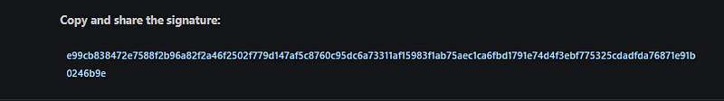

#### **7— Send the Transaction**

At this stage, the wallet has been created, a transaction has been built and distributed to all signers, they have signed the transaction and sent back the signatures to the builder. He must now do the following:

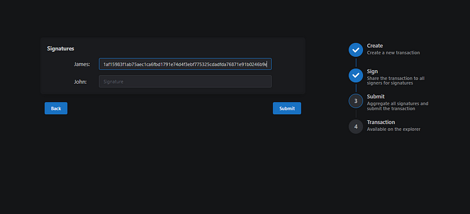

- Go back to the “<a href="https://alephium.github.io/alephium-toolkit/#/multisig/build-tx" class="markup--anchor markup--li-anchor" data-href="https://alephium.github.io/alephium-toolkit/#/multisig/build-tx" rel="noopener" target="_blank">build transaction</a>” page
- Input the signatures in the relevant field
- Click “submit”: the transaction will be sent.
- You can click on “view on explorer” to check it on the explorer

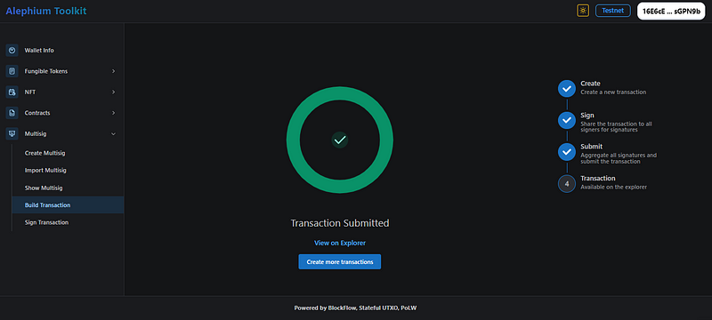

And that’s it!

You have successfully created and created and used a Multisig wallet to send a transaction on Alephium. For those who value both security and flexibility and need a way to share the funds ownership with others, a Multisig wallet is a powerful tool to have in your crypto arsenal. Remember, the future of finance is not just about owning digital assets but <a href="https://medium.com/@alephium/ttxoo-2-the-road-to-self-custody-cfea4ae89444" class="markup--anchor markup--p-anchor" data-href="https://medium.com/@alephium/ttxoo-2-the-road-to-self-custody-cfea4ae89444" target="_blank">securing them smartly</a>.

_Let us know what you think, follow the evolution of the code on_ <a href="https://github.com/alephium" class="markup--anchor markup--p-anchor" data-href="https://github.com/alephium" rel="noopener" target="_blank"><em>Github</em></a>_, follow the news on_ <a href="https://twitter.com/alephium" class="markup--anchor markup--p-anchor" data-href="https://twitter.com/alephium" rel="noopener" target="_blank"><em>Twitter</em></a> _&_ <a href="https://medium.com/@alephium" class="markup--anchor markup--p-anchor" data-href="https://medium.com/@alephium" target="_blank"><em>Medium</em></a> _or come interact onboard on_ <a href="https://discord.com/invite/GEbcpajCJG" class="markup--anchor markup--p-anchor" data-href="https://discord.com/invite/GEbcpajCJG" rel="noopener" target="_blank"><em>Discord</em></a> _&_ <a href="https://t.me/alephiumgroup" class="markup--anchor markup--p-anchor" data-href="https://t.me/alephiumgroup" rel="noopener" target="_blank"><em>Telegram</em></a>_!_

#### **Multisig FAQ:**

**Why is the multisig wallet address so long?**

We wanted to make the native multisig as simple as possible, so the address contains more information for now. Eventually, we may implement shorter multisig addresses based on smart contracts as well, similar to what’s usable on Ethereum.

**Does 3 out of 5 mean that any 3 out of all 5 signers can sign?**

No. When you build a transaction, you need to designate specifically which 3 signers out of the 5 have to sign. A transaction is only valid if signed by the 3 signers designated during the building process. If you’d like to change the set of signers for a transaction, you have to rebuild it.

**Is the toolkit the only way to create and use multi-signature wallets?**

No, multi-signature wallets can be created and managed using the node wallet. Find the tutorial for this <a href="https://docs.alephium.org/misc/multisig-guide/" class="markup--anchor markup--p-anchor" data-href="https://docs.alephium.org/misc/multisig-guide/" rel="noopener" target="_blank">here</a>.
