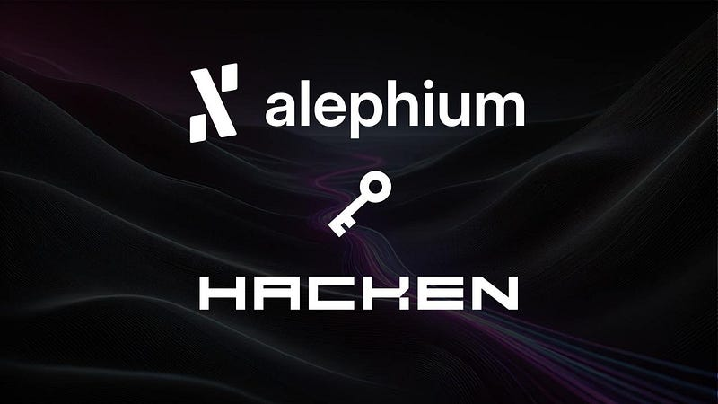

### Alephium Partners with Hacken to Enhance Blockchain Security

We are pleased to announce a strategic partnership between **Alephium** and **Hacken**, a leading cybersecurity firm specializing in blockchain and Web3 security. This collaboration underscores Alephium’s commitment to building a secure, scalable, and resilient blockchain ecosystem.

As the first operational sharded blockchain operating on Proof of Less Work, Alephium is designed to deliver high scalability, energy efficiency, and decentralization. By partnering with Hacken, we aim to further strengthen the security of our ecosystem, ensuring that anyone can interact with Alephium with confidence.

### What This Partnership Entails

Under this agreement, Hacken will provide a comprehensive suite of security services tailored to the Alephium ecosystem, including:

- Smart Contract Audits: Ensuring the reliability and security of on-chain code.
- Blockchain Protocol Audits: Evaluating the integrity and resilience of Alephium’s core infrastructure.
- Penetration Testing: Identifying vulnerabilities in web, mobile, API, and cloud applications.
- dApp Audits: Enhancing the security of decentralized applications running on Alephium.
- Bug Bounty Programs: Leveraging ethical hacking through HackenProof to uncover and resolve vulnerabilities.
- Proof of Reserves: Strengthening transparency and compliance for ecosystem participants.
- CCSS Audit & Tokenomics Audit: Validating security measures for token models and custodial services.

### Benefits for Alephium Projects

Projects building on Alephium will gain exclusive access to Hacken’s security expertise, including:

**DualDefense Audits:** A 30-day crowdsourced audit via HackenProof at no additional cost to qualifying projects, following the initial audit.

**Priority Queue:** Expedited security assessments with reduced wait times of 10–15 days (subject to documentation availability).

**Discounts:** Alephium-based projects receive a 20% discount on Hacken’s core security services and a 30% discount on post-deployment security solutions via Hacken Extractor.

**Bug Bounty Hosting:** Free listing on HackenProof, including triage services at no cost to participating projects.

### A Shared Commitment to Security

This partnership reflects a shared vision between Alephium and Hacken to create a safer and more secure Web3 ecosystem. Hacken’s extensive experience in blockchain security, combined with Alephium’s innovative technology, will set a new standard for ecosystem-wide security.

By integrating Hacken’s expertise, Alephium aims to provide developers and users with the tools and confidence they need to innovate and grow within a secure environment.

### Looking Ahead

The collaboration between Alephium and Hacken marks a significant step forward in our mission to build the safest infrastructure in Web3. Together, we will work to ensure that Alephium remains a trusted and resilient ecosystem for developers, businesses, and users worldwide.

Stay tuned for updates on joint initiatives and security enhancements as we continue to strengthen the Alephium ecosystem.

For more information about Hacken’s security services, visit <a href="https://hackenio.cc/3Qko1S9" class="markup--anchor markup--p-anchor" data-href="https://hackenio.cc/3Qko1S9" rel="noopener" target="_blank">hacken.io</a>.

To learn more about Alephium, visit alephium.org.
