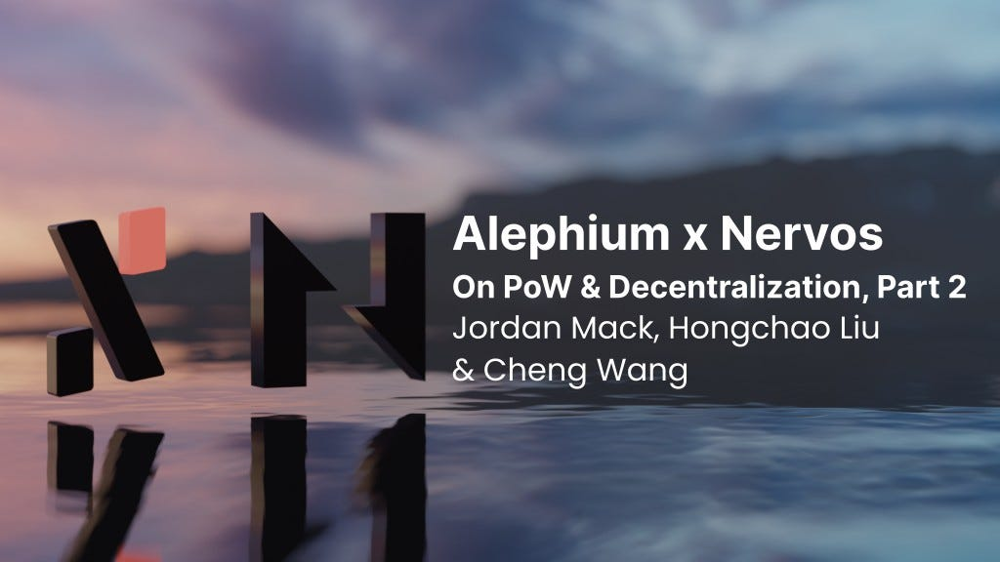

### Alephium Twitter Space — PoW and Decentralization, part II

#### Alephium hosted a Twitter Space on 24/01/2023 with <a href="https://twitter.com/jordan_mack" class="markup--anchor markup--h4-anchor" data-href="https://twitter.com/jordan_mack" rel="noopener" target="_blank">Jordan</a> from <a href="http://www.nervos.com" class="markup--anchor markup--h4-anchor" data-href="http://www.nervos.com" rel="noopener" target="_blank">Nervos Network</a> and <a href="https://twitter.com/wachmc" class="markup--anchor markup--h4-anchor" data-href="https://twitter.com/wachmc" rel="noopener" target="_blank">Cheng Wang</a> & <a href="https://twitter.com/hongchao" class="markup--anchor markup--h4-anchor" data-href="https://twitter.com/hongchao" rel="noopener" target="_blank">Hongchao Liu</a> from <a href="http://www.alephium.org" class="markup--anchor markup--h4-anchor" data-href="http://www.alephium.org" rel="noopener" target="_blank">Alephium</a> to talk about Proof of Work (PoW) and Decentralization.

It was a great conversation, and a series of articles will transcript the main topics discussed. You can find part I <a href="https://medium.com/@alephium/alephium-twitter-space-pow-and-decentralization-part-i-a7c84ed91f90" class="markup--anchor markup--p-anchor" data-href="https://medium.com/@alephium/alephium-twitter-space-pow-and-decentralization-part-i-a7c84ed91f90" target="_blank">here</a> and access the whole conversation <a href="https://www.youtube.com/watch?v=FLmxAHolDMc" class="markup--anchor markup--p-anchor" data-href="https://www.youtube.com/watch?v=FLmxAHolDMc" rel="noopener" target="_blank">here</a>.

This post will focus on why both protocols chose the UTXO model over the account model, their scaling mechanism, and thoughts about governance.

### UTXO

Question: **Why did both projects choose UTXO as the underlying accounting model? Can you explain the respective innovations of the Cell model and Stateful UTXO?**

**Jordan:** This could be a pretty deep topic, but I’m going to try to keep it really, really simple. In short, when you look at certain things about the account model and certain things about UTXOs, they’re very different in their structure. But ultimately, what you’re trying to achieve is usually very similar types of smart contract functionality. I’ve typically explained it to developers trying to learn it for the first time in this way: the account model is closer to a single-core processor, and the UTXO is similar to a multi-core processor. And if you look at what’s going on in hardware today, we all started in single core, but now even your smartphone is multi-core, and every desktop processor is multi-core.

It’s necessary for scaling. The account model is difficult to scale because the state is one single element and runs in a single thread, meaning it’s only a single core. And while that is easier for the developer experience, you end up with scalability problems. In contrast, UTXOs, akin to a multi-core processor, allow things to happen in parallel. So you can execute multiple smart contracts at the same time. And this is something that scales horizontally, which is one of the main reasons we wanted UTXOs: it does scale a lot better.

Some other things are a little less apparent, which are also UTXO-related. Because they’re individual, they can fit better for state rent than the account model. Whereas we know that Ethereum has many proposals for various methods of state rent, none of which are implemented. And we don’t know if they ever will implement something. It’s very difficult to do it on the account model because a smart contract owns everything, and how do you divide the smart contract? But with UTXOs, every individual state is on it, and an actual user can own every little data. And because of that, that subtle difference there, it makes certain implementations of state rent to be much, much easier. So even though they’re less intuitive to the developers, in general, UTXOs seem like a much better option for the future when you’re looking forward to a blockchain trying to scale globally to encompass all users.

**Hongchao:** I agree with many of the things that Jordan said. We picked UTXO because it is a proven technology from Bitcoin, a very good abstraction to manage assets, and an immutable data structure. Therefore, it’s easier for us to create our sharding algorithm with it. Because of the mutable state, having a sharding algorithm for the account model is difficult. And it turns out that the UTXO is a crucial data structure for us to implement the Blockflow algorithm in Alephium. The UTXO has inputs and outputs at a high level, so the transaction spends inputs and produces outputs. So visually, it’s established like a graph or DAG (<a href="https://en.wikipedia.org/wiki/Directed_acyclic_graph" class="markup--anchor markup--p-anchor" data-href="https://en.wikipedia.org/wiki/Directed_acyclic_graph" rel="noopener" target="_blank">directed acyclic graph</a>) for the transactions.

In the traditional blockchain or sharded blockchains, all those transactions are structured into one chain, with many unnecessary dependencies in one block after another. So you have these two blocks that do not necessarily depend on each other but, structurally, in this chain, they have dependencies. If the dependencies are unnecessary, the Blockflow algorithm, at a high level, finds a way to structure these graphs into Alephium’s multiple shards. And it manages all these dependencies in a better way. That’s how we implemented the 16 shards in production right now.

The UTXO is also used to manage the tokens, unlike Ethereum, which manages them in the contract. So a token in Alephium is a first-class citizen. We feel that we have deeper asset security for tokens. Because of the input and output model, some MEV attacks, like arbitrage, are a little harder to execute on Alephium, as they would require multiple transactions.

However, the UTXO model can be challenging for developers to program since it is less intuitive than the account model. Furthermore, the UTXO model can face issues with concurrent execution when multiple parties try to access the same UTXO simultaneously, which is not a problem for the account model. To address these challenges, Alephium chose a combination of the UTXO and account models to leverage the advantages of both approaches. In <a href="https://medium.com/p/8de3b0f76749" class="markup--anchor markup--p-anchor" data-href="https://medium.com/p/8de3b0f76749" target="_blank">our stateful UTXO model</a>, we use the UTXO to manage assets like the native ALPH token and other tokens resulting in much higher scalability. And we use the account model to manage smart contracts, which have a global state, and those smart contrasts have partial scalability, and achieve higher expressiveness than the UTXO model. Powering this solution, <a href="https://medium.com/@alephium/meet-alphred-a-virtual-machine-like-no-others-85ce86540025" class="markup--anchor markup--p-anchor" data-href="https://medium.com/@alephium/meet-alphred-a-virtual-machine-like-no-others-85ce86540025" target="_blank">we have our own VM (Alphred)</a> and our own programming language (Ralph), and we don’t feel that we have sacrificed our expressiveness when it comes to programming smart contracts. Whereas, if you look at Bitcoin, the bitcoin script is much more limited.

### Sharding & Scalability

Question: **Both chains have scalability as a key value proposition. But accomplish that ambitious goal in very different ways. Can you explain how each one achieved this?**

**Cheng:** Alephium’s sharding foundation is a new algorithm called Blockflow, and it is based on proof of work and the UTXO model, as we have discussed earlier. In our context, sharding has multiple blockchains that can process blocks and transactions in parallel, so you get the highest throughput. But all chains are similar, so the users don’t have the learning curve to adapt to a new blockchain. More importantly, all of the transactions between those blockchains are atomic, meaning they happen in a single step. So, compared to other approaches, where one blockchain is connected to another completely different blockchain, our cross-chain experience is better. Users don’t even notice it.

**Jordan:** Nervos uses L2s to achieve scalability instead of sharding, but both are trying to do the same thing. They’re taking the dataset and the execution and breaking it up between multiple computers. So it’s kind of a philosophical difference. One of the advantages of sharding is that when you create multiple shards, they’re generally pretty much identical in their environment, which is great for developers who want to move from shard to shard.

On the flip side, L2s have an advantage in that not every single L2 does not necessarily have to be the same. They can have different attributes. When a developer needs a different type of environment for a project, or if their existing project starts in one state and grows and changes over time, they can move between different environments with different attributes. L2s generally have a bit more of a track record in the sense of being understood and working very well. So, when you look at the experience for the user, sharding and L2s are typically very similar. You do use some type of bridge interface for both. Eventually, we hope these interfaces will be simplified in the future.

Nervos went on the L2 route, and I think it achieves pretty much a similar thing. We can add many L2s on top of our L1, and they, in certain ways, inherit the security of L1, which is the reason why it was so important for it to be decentralized and secure. And if the L2 at some point in the future are so popular that they fill up, we can simply add L3s or even L4s to continue that scalability indefinitely.

### Governance

Question: **Nervos had its** <a href="https://www.nervos.org/blog/the-nervos-layer-1-major-protocol-upgrade-has-arrived" class="markup--anchor markup--p-anchor" data-href="https://www.nervos.org/blog/the-nervos-layer-1-major-protocol-upgrade-has-arrived" rel="noopener" target="_blank"><strong>first hardfork</strong></a> **last year, and Jan Xie said, “The most difficult challenge was explaining what would happen after the hard fork to ecosystem players.” What advice could you give Alephium, which is getting to its first hardfork in the next few weeks?**

**Jordan:** I could give you a couple of pieces of advice on that. First, “hardfork” is a scary term in our industry, so you must reassure your community about the real situation and the benefits. We say hardfork, but in more realistic terms, **we’re just making a network upgrade**. Make sure that that message is very clear to your users. Also, ensure you get the word out to everybody who needs to upgrade and get the updated tooling as soon as possible because we’ve learned the hard way that you cannot get your teams out there, from development teams to exchanges. You cannot get them to upgrade immediately, and it sometimes takes time. Usually, they’re going to know well in advance, but they’re still going to miss that deadline. So you need to have contingency plans built in for that.

The third thing is you need to leverage your community the best you can to amplify your message to development teams and exchanges because sometimes they just don’t update, and it isn’t enough to go out there and say: “Hey, you need to update or this is going to happen.” They need to hear it from their customers. Their customers have to go out there and complain and say: “Hey, this isn’t working because you didn’t update properly.”

That’s the way we’ve found it is best to get business as exchanges to update when there are breaking changes because they don’t, they simply just don’t listen to us. We don’t know why this happens, but they surely will listen to their customers. So make sure that that message is getting out there.

Question: **Based on your experience in crypto in general, and in Nervos/Alephium in particular, what is, in your opinion, the ideal governance and decision-making system?**

**Cheng:** I believe that governance in the blockchain is a challenging and evolving field of research. Many projects are still trying and experimenting with different solutions. Personally, I don’t believe there is a perfect solution yet. Token-based voting, which is widely used, has its own problems, such as the possibility of manipulation by whales and exploitation by hackers. Therefore, I see governance suitable for only limited scenarios or specific use cases. When it comes to an L1 blockchain, which is both complex and crucial, I think the approach taken by Bitcoin, which is essentially no governance, is the best option.

Suppose your blockchain has a large community and two different groups of people who don’t agree with each other and want the protocol to go in different directions. In that case, governance does not solve the problem. Deciding with governance would only separate minority rights. In this situation, governance does not help. Forking could be beneficial if a large enough group of people want the protocol to go in a different direction by introducing new innovations. This has happened in the past.

**Jordan:** I share many of the sentiments that Cheng expressed there. Governance is a really, really a huge topic. And when I say governance, I’m speaking both of, not just of technology, but also of people because that’s all that blockchains are trying to do. They’re trying to find ways that we can use technology to get everybody to agree with each other in certain ways, or at least if they disagree, it’s organized, so that they can peacefully disagree in their respective chains. Now, forking is a very important thing, hard forking in particular, because, in my opinion, this is absolutely necessary for any type of platform to be truly decentralized. And it’s a natural thing to experiment and try different directions. It’s natural for people to disagree and for different teams to disagree with each other. And so if there’s any project out there that forbids the ability to fork it, it is a centralized product. And in my opinion, this is not something that should even be considered for any project that is serious about decentralization.

But if you want to talk in a very broad general sense: “What does the future of governance look like?” I think that DAOs, in particular, have a role in that future. Definitely, that’s one of the best solutions we have today. I don’t think that it’s by any means the end solution, but it’s a part of it. That, combined with certain things, maybe proof of authority, representing somebody’s reputation as a person, a non-anonymous person that is out there voting, is probably another component because ultimately there are advantages to remaining anonymous in voting, and there’s also it’s clear advantages to remaining well-known into the community in your voting.

And so these different aspects working together, I think, can help shape what we’ll see in the future of governance.

---

This closes part II! The next and last one will focus on Decentralization and how to contribute to both projects. If you have questions or want to know more, please come to Alephium’s <a href="https://alephium.org/discord" class="markup--anchor markup--p-anchor" data-href="https://alephium.org/discord" rel="noopener" target="_blank">Discord</a>, <a href="https://t.me/alephiumgroup" class="markup--anchor markup--p-anchor" data-href="https://t.me/alephiumgroup" rel="noopener" target="_blank">Telegram</a>, or reach out on <a href="https://twitter.com/alephium" class="markup--anchor markup--p-anchor" data-href="https://twitter.com/alephium" rel="noopener" target="_blank">Twitter</a>! 📺
