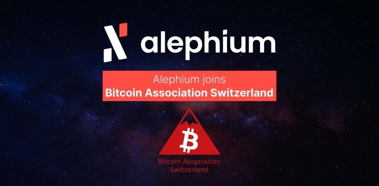

### Alephium becomes a member of Bitcoin Association Switzerland.

#### Alephium is thrilled to join forces with the oldest Fintech association in Switzerland and one of the oldest still active Bitcoin Associations in the world.

Alephium is thrilled to join forces with the oldest Fintech association in Switzerland and one of the oldest still active Bitcoin Associations in the world.

<a href="https://www.bitcoinassociation.ch/" class="markup--anchor markup--p-anchor" data-href="https://www.bitcoinassociation.ch/" rel="noopener" target="_blank">Bitcoin Association Switzerland (BAS)</a> forms an active community of enthusiasts who organize events, resolve open legal questions and provide a contact point for media inquiries to educate the public. Switzerland is a great place of international reach making BAS an ideal environment to gain honest and upfront visibility while contributing to the Bitcoin and FinTech ecosystem.

Bitcoin’s core technologies (PoW & UTXO) are the cornerstones of Alephium’s innovations. The platform’s consensus algorithm, called **Proof of Less Work,** uses a clever combination of physical work and token economics to dynamically adjust the work required to mine new blocks, ensuring a reduced energy footprint compared to classic Nakamoto PoW mining.  
Alephium proposes a stateful UTXO model which offers both layer-1 scalability and the same level of programmability as the account model.   
Fun fact, as a homage, the timestamp of the Alephium genesis block on the mainnet was set to be the same as the first Bitcoin block.

Alephium wouldn’t be here if it wasn’t for the groundbreaking innovation that Bitcoin funneled from the realm of ideas into reality. We’re looking forward to helping blockchain technology to flourish and unfold its full potential as part of Bitcoin Association Switzerland.
