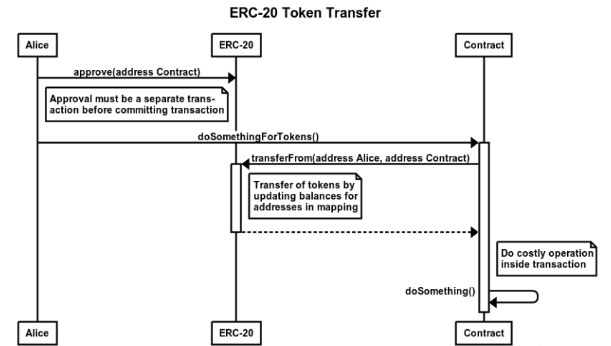
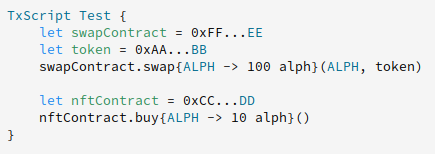

### Alephium’s APS: Eliminating EVM Token Approval Risks

This article will explore Alephium’s Asset Permission System (APS) and discuss its security enhancements over the Ethereum Virtual Machine (EVM) token approval/allowance mechanism. APS is a flexible and secure solution for managing assets on the Alephium blockchain, providing developers with the tools they need to build robust and safe decentralized applications.

### TL;DR

- EVM’s token approvals, especially the unlimited ones, can cause users to lose control over their assets, and expose their wallets to hackers.
- Alephium’s APS eliminates EVM’s token approval risk by allowing users and contracts to approve tokens on demand and in the same transaction.

### EVM’s Token Approval Explained

Ethereum assets are managed by contracts. So, for example, if Uniswap wants to swap token A for token B, the token A holder should first approve its spending on token A’s contract for Uniswap, and then Uniswap will have permission to do the swapping.

The mechanism used for this purpose is usually called Approvals, which enables token holders to authorize another account or smart contract to spend a specified amount of tokens on their behalf.

Although approvals play a crucial role in numerous decentralized applications on the EVM, they present critical risks for users:

- **There is room for unsafe choices:** This method leaves to the user’s discretion how much they will allow the smart contract to spend. The user can allow infinite spending, leaving an open door for his assets to be drained if an exploit compromises this smart contract.
- **Broken User Experience**: First, the user needs to send a transaction to approve an amount. And later, execute the transfer he wants. If the user only allows the amount spent in that particular transaction, the next time he interacts with this smart contract, all the steps will be necessary again.

### Understanding Alephium’s Asset Permission System

Alephium’s APS is designed to provide a flexible and safer way for developers to build applications on the Alephium blockchain. One important feature of the Alephium blockchain is that it doesn’t require separate approval specifically for the assets. Instead, the assets are managed by UTXOs, which can be spent using a transaction. These transactions can support TxScript.

A TxScript (short for transaction script) is a piece of code to interact with smart contracts. Within this code, it is possible to use the APS to manage how the assets will be spent. The APS can:

- Mark functions with annotations to explicitly state if it requires preapproved assets or contract assets (and check if the annotation is consistent with the code);
- Ensure explicit assets approval for functions requiring assets, and ensure that, at maximum, only the explicitly specified amount of assets (ALPH and tokens) can be spent.

For example:

In this example, the braces explicitly define the asset approval, following the notation in the image below.

Using the APS, in combination with the UTXO model, all the approvals can be defined beforehand. In one transaction, **both the approval and the transfer of the assets are done** following the TxScript conditions, resulting in a **seamless and more secure User Experience.**

### How is the APS token approval mechanism different from the EVM’s ?

The APS built on Alephium provides several tools to improve the security of the transactions, generating multiple benefits for developers and users alike. When comparing APS with EVM’s asset approval mechanism:

- **Assets Flow:** In Ethereum, assets are managed by contracts, and approvals need to be pre-requested separately, breaking the transfer flow. In Alephium, funds can be sent (approval and transfer) using one transaction. It contains a TxScript using the APS functions, which manages the flow of funds together with smart contracts.
- **Assets Approval:** Ethereum’s token approval only allows for the approval of a specific asset. That equals multiple approvals when using more than one asset in a transaction. In contrast, Alephium’s APS allows asset management from multiple sources.
- **Built-in Functions:** Alephium’s APS provides built-in functions for committing assets and using them immediately, whereas Ethereum requires explicit approval and transfer calls.
- **User Experience**: The APS controls all fund management on demand, so the user manual interaction with the dApps is restricted to the transaction they want to make.

### What difference does the APS make?

Removing the token approval transaction in the asset management flow is an important upgrade provided by Alephium’s Asset Permission System, as, unfortunately, several exploits and hacks use this type of transaction.

For example, <a href="https://slowmist.medium.com/slow-mist-blank-check-eth-sign-phishing-analysis-741115bd0b1f" class="markup--anchor markup--p-anchor" data-href="https://slowmist.medium.com/slow-mist-blank-check-eth-sign-phishing-analysis-741115bd0b1f" rel="noopener" target="_blank"><strong>Blank eth_sign signatures</strong></a> were used by hackers after alluring users to sign transactions in phishing attacks, authorizing them to empty the users’ wallets. The <a href="https://rekt.news/transit-swap-rekt/" class="markup--anchor markup--p-anchor" data-href="https://rekt.news/transit-swap-rekt/" rel="noopener" target="_blank"><strong>Transit Swap Hack</strong></a> is another example where any assets approved for trading on Transit Swap could be transferred directly from users’ wallets to the unknown exploiter’s address.

This type of attack demonstrates how Alephium’s APS provides a more secure environment for developers and users, reducing the attack vector by removing the approval transaction, the risk of fund loss due to smart contract vulnerabilities, and enhancing the user experience.

### Conclusion

Alephium’s Asset Permission System (APS) offers a safer and more flexible solution to eliminate Ethereum’s token approval risks. Controlling the flow of assets, APS provides enhanced security and greater control over transactions.

As blockchain technology evolves, innovations like APS pave the way for safer and more robust decentralized applications. Developers and users alike stand to benefit from this improved approach to managing and securing digital assets on Alephium.

---

If you want to know more about the APS or have additional questions, you can reach out in <a href="https://alephium.org/discord/" class="markup--anchor markup--p-anchor" data-href="https://alephium.org/discord/" rel="noopener" target="_blank">Discord</a> or on the Alephium <a href="https://t.me/alephiumgroup" class="markup--anchor markup--p-anchor" data-href="https://t.me/alephiumgroup" rel="noopener" target="_blank">Telegram</a> channel. Also, don’t forget to follow <a href="https://twitter.com/alephium" class="markup--anchor markup--p-anchor" data-href="https://twitter.com/alephium" rel="noopener" target="_blank">@alephium on Twitter</a> to stay up-to-date.
