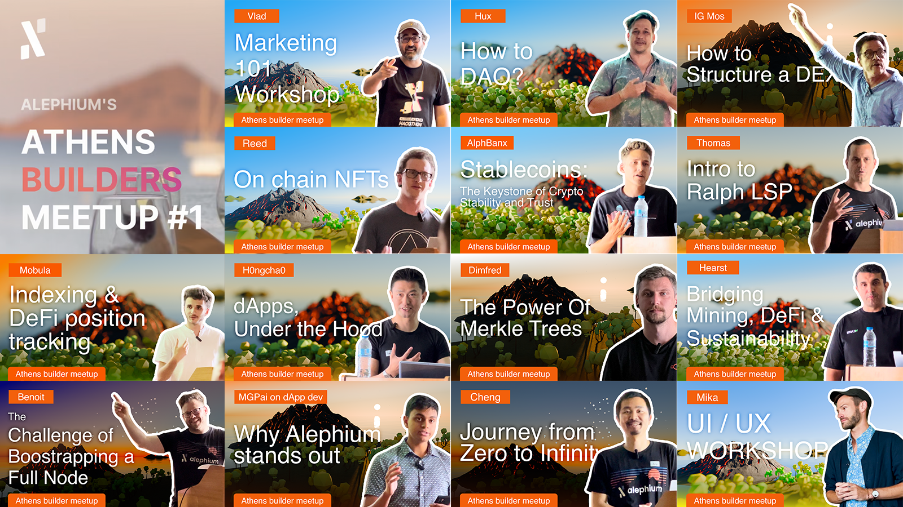
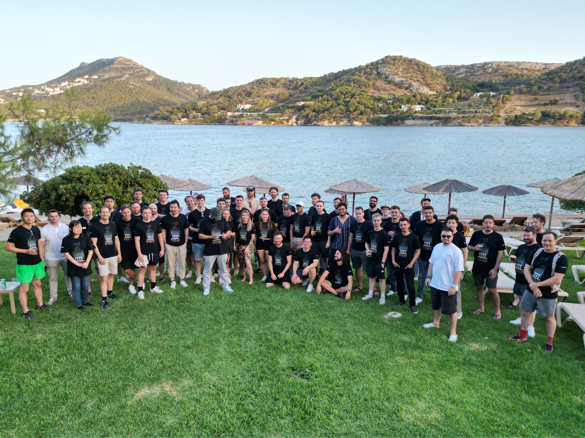

### **All the Athens Meetup Presentations!**

_If you couldn’t come… Doesn’t mean you can’t see the presentations! Find them all here and watch them at your convenience._

Alephium’s first builders meetup was held in Athens June 21–23 2024. It has been an incredible gathering where the builders of ecosystem’s projects were able to meet & mingle with core contributors in an insightful, joyous & studious atmosphere.

### **Who Attended?**

In total, more than 60 participants turned up! Some came from as far as Vancouver, Michigan, Argentina or Canada to Athens for a 2 day summit! We are absolutely humbled & elated by this level of effort and dedication.

Most of the attendees were builders of a lot of the ecosystem’s biggest projects: <a href="https://x.com/ayincoin" class="markup--anchor markup--p-anchor" data-href="https://x.com/ayincoin" rel="noopener" target="_blank">Ayin</a>, <a href="https://x.com/PyreplayDotCom" class="markup--anchor markup--p-anchor" data-href="https://x.com/PyreplayDotCom" rel="noopener" target="_blank">Pyreplay</a>/<a href="https://x.com/fugashu_codes" class="markup--anchor markup--p-anchor" data-href="https://x.com/fugashu_codes" rel="noopener" target="_blank">Alph.land</a>, <a href="https://x.com/ulamlabs" class="markup--anchor markup--p-anchor" data-href="https://x.com/ulamlabs" rel="noopener" target="_blank">Ulam</a>, <a href="https://x.com/invariant_labs" class="markup--anchor markup--p-anchor" data-href="https://x.com/invariant_labs" rel="noopener" target="_blank">Invariant</a>, <a href="https://x.com/linx_labs" class="markup--anchor markup--p-anchor" data-href="https://x.com/linx_labs" rel="noopener" target="_blank">Linx</a>, <a href="https://x.com/SesameWallet" class="markup--anchor markup--p-anchor" data-href="https://x.com/SesameWallet" rel="noopener" target="_blank">Sezame</a>, <a href="https://x.com/alephiumbank" class="markup--anchor markup--p-anchor" data-href="https://x.com/alephiumbank" rel="noopener" target="_blank">Alphbanx</a>, <a href="https://x.com/DeadRareNFT" class="markup--anchor markup--p-anchor" data-href="https://x.com/DeadRareNFT" rel="noopener" target="_blank">Deadrare</a>, <a href="https://mobula.io/chain/alephium" class="markup--anchor markup--p-anchor" data-href="https://mobula.io/chain/alephium" rel="noopener" target="_blank">Mobula</a>, <a href="https://x.com/notrustverif" class="markup--anchor markup--p-anchor" data-href="https://x.com/notrustverif" rel="noopener" target="_blank">NTV</a>, <a href="https://x.com/Alphdotpro" class="markup--anchor markup--p-anchor" data-href="https://x.com/Alphdotpro" rel="noopener" target="_blank">AlphPro</a>, <a href="https://x.com/AlphagaMarket" class="markup--anchor markup--p-anchor" data-href="https://x.com/AlphagaMarket" rel="noopener" target="_blank">Alphaga</a>, <a href="https://x.com/GoldCastleClub" class="markup--anchor markup--p-anchor" data-href="https://x.com/GoldCastleClub" rel="noopener" target="_blank">GoldcastleClub</a>, <a href="https://x.com/Shin_Inu_Aleph" class="markup--anchor markup--p-anchor" data-href="https://x.com/Shin_Inu_Aleph" rel="noopener" target="_blank">Shin</a>, <a href="https://x.com/AlephiumBattle" class="markup--anchor markup--p-anchor" data-href="https://x.com/AlephiumBattle" rel="noopener" target="_blank">Alephium Battle</a>, <a href="https://x.com/PhoenixErgo" class="markup--anchor markup--p-anchor" data-href="https://x.com/PhoenixErgo" rel="noopener" target="_blank">HodlAlph</a> & <a href="https://x.com/gigacheng" class="markup--anchor markup--p-anchor" data-href="https://x.com/gigacheng" rel="noopener" target="_blank">GigaCheng</a> were all represented there.

11 of the core contributors were there & gave presentations on very diverse topics and made sure things ran as smoothly as possible! Some well-known community moderators & friends from <a href="https://x.com/bity" class="markup--anchor markup--p-anchor" data-href="https://x.com/bity" rel="noopener" target="_blank">Bity</a>, <a href="https://x.com/nymproject" class="markup--anchor markup--p-anchor" data-href="https://x.com/nymproject" rel="noopener" target="_blank">Nym</a>, & <a href="https://x.com/ergo_platform" class="markup--anchor markup--p-anchor" data-href="https://x.com/ergo_platform" rel="noopener" target="_blank">Ergo</a> also showed up.

Some of our sponsors who made the meetup possible were able to attend. We were lucky enough to have <a href="https://x.com/Hearst_io" class="markup--anchor markup--p-anchor" data-href="https://x.com/Hearst_io" rel="noopener" target="_blank">Hearst</a>, <a href="https://x.com/AntPoolofficial" class="markup--anchor markup--p-anchor" data-href="https://x.com/AntPoolofficial" rel="noopener" target="_blank">Antpool</a> & <a href="http://hodling.ch/" class="markup--anchor markup--p-anchor" data-href="http://hodling.ch/" rel="noopener" target="_blank">Hodling</a> with us. <a href="https://banxa.com/" class="markup--anchor markup--p-anchor" data-href="https://banxa.com/" rel="noopener" target="_blank">Banxa</a> we missed you there! The <a href="https://x.com/Blockflow_DAO" class="markup--anchor markup--p-anchor" data-href="https://x.com/Blockflow_DAO" rel="noopener" target="_blank">Blockflow DAO</a> was well represented with 3 of its members there. It has greatly supported that meetup with its travel grant helped many of the builders to attend who wouldn’t have been able to otherwise.

### **Show me the meetup!**

In general, the aim of the meetup was to provide a time for cross-pollinating ideas, meeting long-known discord usernames IRL & learn from each other. The following presentations follow the schedule of the meetup (if you want more details on the schedule, find it <a href="https://medium.com/@alephium/full-builders-meetup-program-announced-cda1af0e1355" class="markup--anchor markup--p-anchor" data-href="https://medium.com/@alephium/full-builders-meetup-program-announced-cda1af0e1355" target="_blank">here</a>.).

We’ve worked hard at making them accessible in a simple way. If you can’t hear well enough, you can activate the subtitles. If for some reason you can’t read well enough on the presentations, we have included them as a link so you can download them:

#### **Alephium: Journey from Zero to Infinity**

_An overview of Alephium’s history, current developments and what’s on the roadmap. — _<a href="https://drive.google.com/file/d/1-MFgpjilqH8LxITpHz5Itv9q6Bt6Mmtw/view?usp=sharing" class="markup--anchor markup--p-anchor" data-href="https://drive.google.com/file/d/1-MFgpjilqH8LxITpHz5Itv9q6Bt6Mmtw/view?usp=sharing" rel="noopener" target="_blank"><strong>Deck</strong></a>

<figure id="74c1" class="graf graf--figure graf--iframe graf-after--p">

<h1 id="ein-fehler-ist-aufgetreten." class="message">Ein Fehler ist aufgetreten.</h1>
<a href="https://www.youtube.com/watch?v=Xz87UAsqbJA" target="_blank">Sieh dir dieses Video auf www.youtube.com an</a> oder aktiviere JavaScript, falls es in deinem Browser deaktiviert sein sollte.
</figure>

#### **Exploring Dapp Development Across Blockchain Ecosystems: Why Alephium Stands Out**

\*Presentation covering a range of UTXO-based blockchains, highlighting the development experience on each of them & the strong points of Alephium. **\*— **<a href="https://drive.google.com/file/d/16z2ATyTi5U6aQpb6b-zSSWFnswNCUVWU/view?usp=sharing" class="markup--anchor markup--p-anchor" data-href="https://drive.google.com/file/d/16z2ATyTi5U6aQpb6b-zSSWFnswNCUVWU/view?usp=sharing" rel="noopener" target="_blank"><strong>Deck</strong></a>

<figure id="49a6" class="graf graf--figure graf--iframe graf-after--p">

<h1 id="ein-fehler-ist-aufgetreten." class="message">Ein Fehler ist aufgetreten.</h1>
<a href="https://www.youtube.com/watch?v=jhzjXJjMDSk" target="_blank">Sieh dir dieses Video auf www.youtube.com an</a> oder aktiviere JavaScript, falls es in deinem Browser deaktiviert sein sollte.
</figure>

#### **Bridging Mining, DeFi & Sustainability**

By Loïc Ricci of <a href="https://x.com/Hearst_io" class="markup--anchor markup--p-anchor" data-href="https://x.com/Hearst_io" rel="noopener" target="_blank">Hearst</a> (<a href="https://x.com/Hearst_io" class="markup--anchor markup--p-anchor" data-href="https://x.com/Hearst_io" rel="noopener" target="_blank">X profile</a>, <a href="https://hearst-capital.com/" class="markup--anchor markup--p-anchor" data-href="https://hearst-capital.com/" rel="noopener" target="_blank">Website</a>)  
\*Hearst’s overview, focusing on the solutions offering: An integrated experience of running mining equipments, leveraging DeFi protocols to increase returns and exploring sustainability in energy sources & how it interacts with Alephium & its ecosystem. **\*— **<a href="https://drive.google.com/file/d/1mpi4aOMAVg8fTt3qiVYlGC0Z8iIWfgNB/view?usp=sharing" class="markup--anchor markup--p-anchor" data-href="https://drive.google.com/file/d/1mpi4aOMAVg8fTt3qiVYlGC0Z8iIWfgNB/view?usp=sharing" rel="noopener" target="_blank"><strong>Deck</strong></a>

<figure id="a947" class="graf graf--figure graf--iframe graf-after--p">

<h1 id="ein-fehler-ist-aufgetreten." class="message">Ein Fehler ist aufgetreten.</h1>
<a href="https://www.youtube.com/watch?v=8QwhDKPVqhY" target="_blank">Sieh dir dieses Video auf www.youtube.com an</a> oder aktiviere JavaScript, falls es in deinem Browser deaktiviert sein sollte.
</figure>

#### **dApps, under the hood**

_Presentation of the “_<a href="https://alephium-decoder.softfork.se/" class="markup--anchor markup--p-anchor" data-href="https://alephium-decoder.softfork.se/" rel="noopener" target="_blank"><em>Alephium Decoder</em></a>\*”, a powerful tool that enables developers to investigate smart contracts and transaction scripts to verify their correctness + a description of all the steps of a transaction!**\* — **<a href="https://drive.google.com/file/d/1YKPXM2J7UBGkTCDH_0l8YfHPZAbc5ifE/view?usp=sharing" class="markup--anchor markup--p-anchor" data-href="https://drive.google.com/file/d/1YKPXM2J7UBGkTCDH_0l8YfHPZAbc5ifE/view?usp=sharing" rel="noopener" target="_blank"><strong>Deck</strong></a>

<figure id="4fee" class="graf graf--figure graf--iframe graf-after--p">

<h1 id="ein-fehler-ist-aufgetreten." class="message">Ein Fehler ist aufgetreten.</h1>
<a href="https://www.youtube.com/watch?v=sEZaT2zG6jo" target="_blank">Sieh dir dieses Video auf www.youtube.com an</a> oder aktiviere JavaScript, falls es in deinem Browser deaktiviert sein sollte.
</figure>

#### **Leveraging Merkle Trees for Scalable and Secure Offchain Storage on Alephium**

\*Merkle trees are an efficient way to ensure that data is verifiable without needing to store it on-chain. Dimfred’s presentation shows their benefits, trade-offs, and possible applications. **\*— **<a href="https://drive.google.com/file/d/1tHcHYLBdEWw_gM2O9AK0pUPUBk2Hubfw/view?usp=sharing" class="markup--anchor markup--p-anchor" data-href="https://drive.google.com/file/d/1tHcHYLBdEWw_gM2O9AK0pUPUBk2Hubfw/view?usp=sharing" rel="noopener" target="_blank"><strong>Deck</strong></a>

<figure id="29c9" class="graf graf--figure graf--iframe graf-after--p">

<h1 id="ein-fehler-ist-aufgetreten." class="message">Ein Fehler ist aufgetreten.</h1>
<a href="https://www.youtube.com/watch?v=iVoNJRzxLGU" target="_blank">Sieh dir dieses Video auf www.youtube.com an</a> oder aktiviere JavaScript, falls es in deinem Browser deaktiviert sein sollte.
</figure>

#### **An introduction to** <a href="https://github.com/alephium/ralph-lsp" class="markup--anchor markup--h4-anchor" data-href="https://github.com/alephium/ralph-lsp" rel="noopener" target="_blank"><strong>Ralph LSP</strong></a>

By Thomas, core-contributor, Alephium.

\*Thomas introduces the Ralph LSP tool, designed to make it easier for devs to code on Alephium. It has features like auto-completion and others, helping developers to check their code. He also provides a live demonstration of its main features. **\*— **<a href="https://drive.google.com/file/d/1bzHdmHFXHmVAVt4kLzMXU1GFZZYAIEo4/view?usp=sharing" class="markup--anchor markup--p-anchor" data-href="https://drive.google.com/file/d/1bzHdmHFXHmVAVt4kLzMXU1GFZZYAIEo4/view?usp=sharing" rel="noopener" target="_blank"><strong>Deck</strong></a>

<figure id="6aa3" class="graf graf--figure graf--iframe graf-after--p">

<h1 id="ein-fehler-ist-aufgetreten." class="message">Ein Fehler ist aufgetreten.</h1>
<a href="https://www.youtube.com/watch?v=fQ78BlgAEEM" target="_blank">Sieh dir dieses Video auf www.youtube.com an</a> oder aktiviere JavaScript, falls es in deinem Browser deaktiviert sein sollte.
</figure>

#### **Stablecoins: The Keystone of Crypto Stability and Trust**

By Timothy of <a href="https://x.com/alephiumbank" class="markup--anchor markup--p-anchor" data-href="https://x.com/alephiumbank" rel="noopener" target="_blank">AlphBanx</a> (<a href="https://www.alphbanx.com/" class="markup--anchor markup--p-anchor" data-href="https://www.alphbanx.com/" rel="noopener" target="_blank">Website</a>, <a href="https://discord.com/invite/56rgKJ9HGW" class="markup--anchor markup--p-anchor" data-href="https://discord.com/invite/56rgKJ9HGW" rel="noopener" target="_blank">Discord</a>, <a href="https://t.me/AlphBanX" class="markup--anchor markup--p-anchor" data-href="https://t.me/AlphBanX" rel="noopener" target="_blank">Telegram</a>)  
\*In this presentation, Timothy explains how Alphbanx works and all the protection layers built into the protocol to sustain its stablecoin peg. **\*— **<a href="https://drive.google.com/file/d/1rirr4fYKju9kfHCxLCLufszFWZUzIx58/view?usp=sharing" class="markup--anchor markup--p-anchor" data-href="https://drive.google.com/file/d/1rirr4fYKju9kfHCxLCLufszFWZUzIx58/view?usp=sharing" rel="noopener" target="_blank"><strong>Deck</strong></a>

<figure id="b402" class="graf graf--figure graf--iframe graf-after--p">

<h1 id="ein-fehler-ist-aufgetreten." class="message">Ein Fehler ist aufgetreten.</h1>
<a href="https://www.youtube.com/watch?v=9hAYzsLmIBc" target="_blank">Sieh dir dieses Video auf www.youtube.com an</a> oder aktiviere JavaScript, falls es in deinem Browser deaktiviert sein sollte.
</figure>

#### **On-chain NFTs**

\*Reed presents his latest creation, an NFT collection in which all data (including images) is on the chain. He shows how he leveraged SVG images to build the collection & evokes the flexibility of Alephium’s smart contract language. **\*— **<a href="https://drive.google.com/file/d/1DBSAqPMi54H9DufeLWDlqPhhzyI1aftg/view?usp=sharing" class="markup--anchor markup--p-anchor" data-href="https://drive.google.com/file/d/1DBSAqPMi54H9DufeLWDlqPhhzyI1aftg/view?usp=sharing" rel="noopener" target="_blank"><strong>Deck</strong></a>

<figure id="0e93" class="graf graf--figure graf--iframe graf-after--p">

<h1 id="ein-fehler-ist-aufgetreten." class="message">Ein Fehler ist aufgetreten.</h1>
<a href="https://www.youtube.com/watch?v=_eIxfM-O09Q" target="_blank">Sieh dir dieses Video auf www.youtube.com an</a> oder aktiviere JavaScript, falls es in deinem Browser deaktiviert sein sollte.
</figure>

#### **How to work with Alephium blockchain data? Indexing & defi position tracking**

by <a href="https://x.com/Mobulaio" class="markup--anchor markup--p-anchor" data-href="https://x.com/Mobulaio" rel="noopener" target="_blank">Mobula</a> (<a href="https://mobula.io/" class="markup--anchor markup--p-anchor" data-href="https://mobula.io/" rel="noopener" target="_blank">Website</a>, <a href="https://discord.com/invite/2a8hqNzkzN" class="markup--anchor markup--p-anchor" data-href="https://discord.com/invite/2a8hqNzkzN" rel="noopener" target="_blank">Discord</a>, <a href="https://t.me/MobulaFi" class="markup--anchor markup--p-anchor" data-href="https://t.me/MobulaFi" rel="noopener" target="_blank">Telegram</a>)  
\*Mobula shows what it takes to index data on Alephium and what the requisites are to ensure the data collected is reliable! **\*— **<a href="https://drive.google.com/file/d/1PrkX1nUZ5cc89MJ2YvpbKC2ssrnx8VZi/view?usp=sharing" class="markup--anchor markup--p-anchor" data-href="https://drive.google.com/file/d/1PrkX1nUZ5cc89MJ2YvpbKC2ssrnx8VZi/view?usp=sharing" rel="noopener" target="_blank"><strong>Deck</strong></a>

<figure id="f315" class="graf graf--figure graf--iframe graf-after--p">

<h1 id="ein-fehler-ist-aufgetreten." class="message">Ein Fehler ist aufgetreten.</h1>
<a href="https://www.youtube.com/watch?v=YdPTqEx8sZQ" target="_blank">Sieh dir dieses Video auf www.youtube.com an</a> oder aktiviere JavaScript, falls es in deinem Browser deaktiviert sein sollte.
</figure>

#### **How to structure a DEX**

_Ignacio Mosqueira lays the foundation for building a DEX that solves the issues of attracting liquidity, high-selling pressure of the DEX’s native token and how to protect liquidity providers against MEV, IL and LRV._

<figure id="25aa" class="graf graf--figure graf--iframe graf-after--p">

<h1 id="ein-fehler-ist-aufgetreten." class="message">Ein Fehler ist aufgetreten.</h1>
<a href="https://www.youtube.com/watch?v=dM_n35widic" target="_blank">Sieh dir dieses Video auf www.youtube.com an</a> oder aktiviere JavaScript, falls es in deinem Browser deaktiviert sein sollte.
</figure>

#### **The challenge of bootstrapping a full node**

\*Benoit shows 3 different ways of bootstrapping an Alephium full node and compares the benefits and drawbacks of each. **\*— **<a href="https://drive.google.com/file/d/1cNmOIspqu7NOwwFb61LMahgNNdBL4Evf/view?usp=sharing" class="markup--anchor markup--p-anchor" data-href="https://drive.google.com/file/d/1cNmOIspqu7NOwwFb61LMahgNNdBL4Evf/view?usp=sharing" rel="noopener" target="_blank"><strong>Deck</strong></a>

<figure id="7ffd" class="graf graf--figure graf--iframe graf-after--p">

<h1 id="ein-fehler-ist-aufgetreten." class="message">Ein Fehler ist aufgetreten.</h1>
<a href="https://www.youtube.com/watch?v=MPH6zIB3xA0" target="_blank">Sieh dir dieses Video auf www.youtube.com an</a> oder aktiviere JavaScript, falls es in deinem Browser deaktiviert sein sollte.
</figure>

#### **How to DAO? A Workshop**

_Hux explains the origins of DAOs and shows that they are one natural way of organizing populations/companies/communities. To achieve this goal, the participants need to learn how to make coordinated decisions and align together._

<figure id="3e00" class="graf graf--figure graf--iframe graf-after--p">

<h1 id="ein-fehler-ist-aufgetreten." class="message">Ein Fehler ist aufgetreten.</h1>
<a href="https://www.youtube.com/watch?v=gGL4KkMjcd4" target="_blank">Sieh dir dieses Video auf www.youtube.com an</a> oder aktiviere JavaScript, falls es in deinem Browser deaktiviert sein sollte.
</figure>

#### **UI/UX Workshop**

\*Mika explains the concepts behind Alephium’s UI/UX approach, and opens a Q&A session with the participants, brainstorming ideas and collecting feedback on the current versions of the wallets and explorer. **\*— **<a href="https://drive.google.com/file/d/1IJ0hH9znBS5GGVVIQrILfn1Cz4VJAQj-/view?usp=sharing" class="markup--anchor markup--p-anchor" data-href="https://drive.google.com/file/d/1IJ0hH9znBS5GGVVIQrILfn1Cz4VJAQj-/view?usp=sharing" rel="noopener" target="_blank"><strong>Deck</strong></a>

<figure id="86c1" class="graf graf--figure graf--iframe graf-after--p">

<h1 id="ein-fehler-ist-aufgetreten." class="message">Ein Fehler ist aufgetreten.</h1>
<a href="https://www.youtube.com/watch?v=cmFdfcPPTgk" target="_blank">Sieh dir dieses Video auf www.youtube.com an</a> oder aktiviere JavaScript, falls es in deinem Browser deaktiviert sein sollte.
</figure>

#### **Twitter Marketing 101 Workshop**

_Vlad details the strategy behind Alephium’s Twitter presence, and how projects could manage their Twitter accounts by becoming real Medias. Participants are gathered in teams to analyze a few projects and work on target, tone & key messages._

<figure id="0455" class="graf graf--figure graf--iframe graf-after--p">

<h1 id="ein-fehler-ist-aufgetreten." class="message">Ein Fehler ist aufgetreten.</h1>
<a href="https://www.youtube.com/watch?v=IYyoDoZ_IYw" target="_blank">Sieh dir dieses Video auf www.youtube.com an</a> oder aktiviere JavaScript, falls es in deinem Browser deaktiviert sein sollte.
</figure>

### **Our Sponsors & Supporters**

This event wouldn’t have been possible without our incredible sponsors and supporters. We extend our deepest gratitude to:

**Gold Sponsor — **<a href="https://hearst-capital.com/" class="markup--anchor markup--p-anchor" data-href="https://hearst-capital.com/" rel="noopener" target="_blank"><strong>Hearst 
</strong></a>Leading the way with innovative Proof of Work mining, sustainable energy solutions, and advanced AI and DeFi integrations.

**Bronze Sponsor — **<a href="https://www.antpool.com/login" class="markup--anchor markup--p-anchor" data-href="https://www.antpool.com/login" rel="noopener" target="_blank"><strong>AntPool 
</strong></a>Providing top-tier multi-currency mining services and commitment to security and compliance.

**Bronze Sponsor — **<a href="https://hodling.ch/" class="markup--anchor markup--p-anchor" data-href="https://hodling.ch/" rel="noopener" target="_blank"><strong>Hodling SA 
</strong></a>Experts in secure self-custody solutions and long-time supporters of the Alephium ecosystem.

**Bronze Sponsor — **<a href="https://openocean.banxa.com/" class="markup--anchor markup--p-anchor" data-href="https://openocean.banxa.com/" rel="noopener" target="_blank"><strong>Banxa 
</strong></a>Offering compliant fiat-to-crypto payment solutions with extensive global and local payment methods.

**Special Supporter — **<a href="https://x.com/Blockflow_DAO" class="markup--anchor markup--p-anchor" data-href="https://x.com/Blockflow_DAO" rel="noopener" target="_blank"><strong>The Blockflow Alliance 
</strong></a>Alephium’s first community DAO, dedicated to expanding and nurturing the ecosystem.

For any questions or feedback, reach out to us on <a href="http://alephium.org/discord" class="markup--anchor markup--p-anchor" data-href="http://alephium.org/discord" rel="noopener" target="_blank">Discord</a> or <a href="https://t.me/alephiumgroup" class="markup--anchor markup--p-anchor" data-href="https://t.me/alephiumgroup" rel="noopener" target="_blank">Telegram</a>, and follow <a href="https://x.com/alephium" class="markup--anchor markup--p-anchor" data-href="https://x.com/alephium" rel="noopener" target="_blank">@alephium on Twitter</a> for the latest updates!
