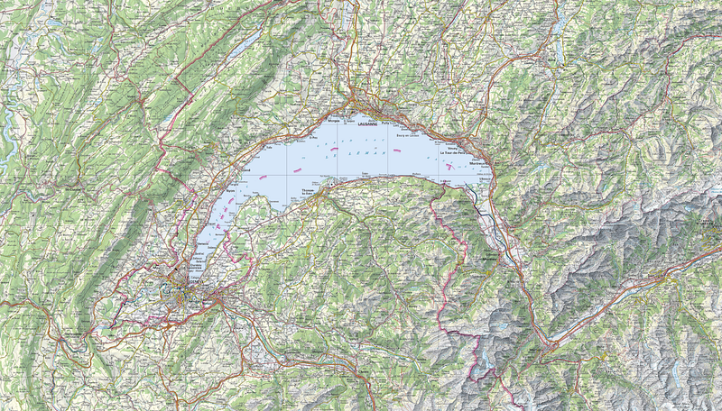

### Announcing the Leman Network Upgrade

Alephium is announcing its first Network Upgrade: **The Leman Network Upgrade**. This name is a tribute to the lake around which a significant part of the team is located and the biggest lake in Europe.

**Why a network upgrade?**

In the past few months, the Alephium team has been working on improvements for its whole tech stack: the <a href="https://wiki.alephium.org/ralph/getting-started" class="markup--anchor markup--p-anchor" data-href="https://wiki.alephium.org/ralph/getting-started" rel="noopener" target="_blank">Ralph programming language</a>, the <a href="https://github.com/alephium/alephium/tree/master/protocol/src/main/scala/org/alephium/protocol/vm" class="markup--anchor markup--p-anchor" data-href="https://github.com/alephium/alephium/tree/master/protocol/src/main/scala/org/alephium/protocol/vm" rel="noopener" target="_blank">Alphred Virtual Machine</a>, <a href="https://github.com/alephium/alephium" class="markup--anchor markup--p-anchor" data-href="https://github.com/alephium/alephium" rel="noopener" target="_blank">Node APIs</a>, etc…

The goal has been to increase the performance and security of the whole stack, as well as enabling a top-of-the-class dApp developer experience. Some of you might already have tested these changes on the latest version of the testnet that was deployed past July.

To become the best version of what it can be, Alephium believes in continuous innovation and improvements. In some scenarios, new features and improvements can be introduced in a backwards-compatible way, meaning that the transaction blocks produced by the newer node versions are still valid for the older versions.

However, as the tech stack is evolving and new features and components are being built , Alephium is approaching a place where these new features need to be introduced in a not backward-compatible way.

**What will change with this upgrade?**

The Leman Network Upgrade (Leman Upgrade from now on) will lay the foundation on which we’ll build new features that can’t be deployed within our current network. These will allow the following:

_Bridge deployment_: One key feature unlocked by this upgrade is our first Bridge (a tailor-made Wormhole implementation)! It will connect our ecosystem and other blockchains, allowing complete interaction & interoperability between the integrated parties.

_Improve the developer experience:_ New Virtual Machine instructions and built-in functions will make dApp devX much better. We introduced the concept of “subcontract” and new built-in functions for debugging, asserting, logging, migrating existing contracts, burning tokens, etc…

_Improve security:_ New and more powerful features at the language and VM level will assist developers in writing complex dApps more easily. For example, the built-in asset permission system for contract calls will be more detailed, and the programming syntax will be more developer friendly.

_Improve development cycles:_ New Node/Explorer APIs, web3 library, and wallets (through both WalletConnect & browser extension) will help shorten the software development cycle for building dApps on Alephium.

**This is just the beginning**

For Alephium, there’s still an extensive list of things to do to prepare for a smooth Leman Upgrade!

In the coming weeks, we will share more on the technical roadmap and the timeline as well as deeper dives into what will change and what actions are required by the different network participants !

We’re expecting to activate the Leman Upgrade on the mainnet at the beginning of 2023. Please, be aware that this might change, as we will always prioritize thorough testing and security!

**Find the** <a href="https://medium.com/@alephium/the-leman-upgrade-2-232e3374abc4" class="markup--anchor markup--p-anchor" data-href="https://medium.com/@alephium/the-leman-upgrade-2-232e3374abc4" target="_blank"><strong>2nd part of this article here.</strong></a> **If you want to know more about it’s** <a href="https://medium.com/@alephium/the-front-end-leman-upgrade-948a98a3e2d" class="markup--anchor markup--p-anchor" data-href="https://medium.com/@alephium/the-front-end-leman-upgrade-948a98a3e2d" target="_blank"><strong>impact on the frontend, head over here.</strong></a>

As always, you can follow the evolution of our code on <a href="https://github.com/alephium" class="markup--anchor markup--p-anchor" data-href="https://github.com/alephium" rel="noopener" target="_blank">Github</a>, our news on <a href="https://twitter.com/alephium" class="markup--anchor markup--p-anchor" data-href="https://twitter.com/alephium" rel="noopener" target="_blank">Twitter</a> & <a href="https://medium.com/@alephium" class="markup--anchor markup--p-anchor" data-href="https://medium.com/@alephium" target="_blank">Medium</a> or come interact with us on <a href="https://discord.com/invite/GEbcpajCJG" class="markup--anchor markup--p-anchor" data-href="https://discord.com/invite/GEbcpajCJG" rel="noopener" target="_blank">Discord</a> & <a href="https://t.me/alephiumgroup" class="markup--anchor markup--p-anchor" data-href="https://t.me/alephiumgroup" rel="noopener" target="_blank">Telegram</a>.
