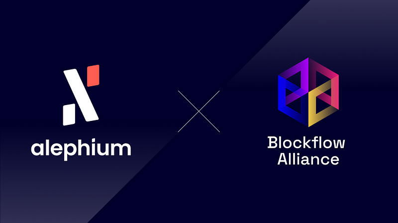

### **Blockflow Alliance DAO grant request approved**

The Blockflow Alliance, the first ever DAO for community development on Alephium, has recently been <a href="https://discord.com/channels/747741246667227157/1156214551939919962/1158432340951961733" class="markup--anchor markup--p-anchor" data-href="https://discord.com/channels/747741246667227157/1156214551939919962/1158432340951961733" rel="noopener" target="_blank">created</a>. Its main contributors and founders have applied for a grant from the Ecosystem Funds through the <a href="https://github.com/alephium/community/blob/master/Grant%26RewardProgram.md" class="markup--anchor markup--p-anchor" data-href="https://github.com/alephium/community/blob/master/Grant%26RewardProgram.md" rel="noopener" target="_blank">grants &amp; rewards program</a>.

Alephium is very happy to announce that **the grant request has been approved**, the Blockflow Alliance will receive 20’000 \$ALPH to kickstart its first month of operations. The grant will be renewed monthly as long as the funds are effectively used and spent in accordance with the objectives initially defined.

The Alephium core-contributors are very excited to have such an energetic and creative group of community members willing to spend time and energy contributing to the growth of the Alephium world!

Join the <a href="https://discord.com/channels/747741246667227157/1156214551939919962" class="markup--anchor markup--p-anchor" data-href="https://discord.com/channels/747741246667227157/1156214551939919962" rel="noopener" target="_blank">DAO</a> channels & <a href="https://discord.com/channels/747741246667227157/1156240220530938017" class="markup--anchor markup--p-anchor" data-href="https://discord.com/channels/747741246667227157/1156240220530938017" rel="noopener" target="_blank">contribute</a> your ideas!

The ecosystem fund is supporting projects and initiatives who contribute positively to the development of the Alephium community and ecosystem. If you have an idea, a project or a pilot in development, do not hesitate to <a href="https://github.com/alephium/community/blob/master/Grant%26RewardProgram.md" class="markup--anchor markup--p-anchor" data-href="https://github.com/alephium/community/blob/master/Grant%26RewardProgram.md" rel="noopener" target="_blank">apply</a>!
