### Browser Wallet Extension v0.7.0 has been released

Featuring: Ledger Integration

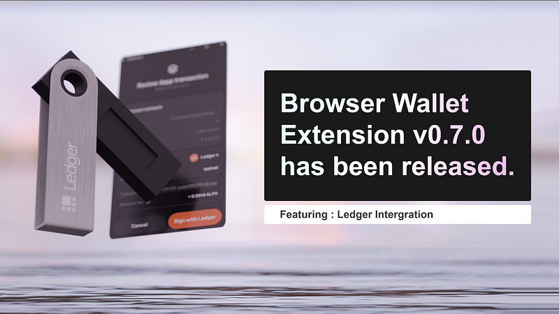

> UPDATE: Alephium has an official integration with Ledger! you can find all details <a href="https://medium.com/@alephium/alephium-available-on-ledger-hardware-wallets-27fa77f928ab" class="markup--anchor markup--pullquote-anchor" data-href="https://medium.com/@alephium/alephium-available-on-ledger-hardware-wallets-27fa77f928ab" target="_blank">here</a>

> UPDATE 2: If you are a Ledger Nano S owner, the installation process is detailed <a href="https://medium.com/p/7a86570f4089/edit" class="markup--anchor markup--blockquote-anchor" data-href="https://medium.com/p/7a86570f4089/edit" target="_blank">here</a>.

---

🚨 _Important information: The Alephium App for Ledger Devices is a custom/community App developed by Alephium. It is not available on Ledger Live (yet!). It requires you to download other software on your computer and has several manual technical steps. Proceed only if you are sure that you understand how to perform this operation!_

🚨 _Since this is an early Alpha version, it is advisable to use a new/fresh ledger with no other coins managed on it._

🚨 _The Ledger app only works with the latest version (v0.7.0) of the extension wallet for now._

**1 — Download the new wallet release** from: Chrome — <a href="https://chrome.google.com/webstore/detail/alephium-extension-wallet/gdokollfhmnbfckbobkdbakhilldkhcj" class="markup--anchor markup--p-anchor" data-href="https://chrome.google.com/webstore/detail/alephium-extension-wallet/gdokollfhmnbfckbobkdbakhilldkhcj" rel="noopener" target="_blank">Extension Wallet</a> / Firefox — <a href="https://addons.mozilla.org/en-US/firefox/addon/alephiumextensionwallet/" class="markup--anchor markup--p-anchor" data-href="https://addons.mozilla.org/en-US/firefox/addon/alephiumextensionwallet/" rel="noopener" target="_blank">Extension Wallet</a>

**2 — Install the necessary software (if you already have PIP & Python installed, jump to step 3)**

You will need Python and PIP installed on your computer to get the Alephium App on your Ledger:

- Python (<a href="https://www.simplilearn.com/tutorials/python-tutorial/python-installation-on-windows#:~:text=To%20download%20Python%2C%20you%20need,then%20select%20the%20Windows%20option." class="markup--anchor markup--li-anchor" data-href="https://www.simplilearn.com/tutorials/python-tutorial/python-installation-on-windows#:~:text=To%20download%20Python%2C%20you%20need,then%20select%20the%20Windows%20option." rel="noopener" target="_blank">how to for Windows</a>, <a href="https://docs.python.org/3/using/mac.html" class="markup--anchor markup--li-anchor" data-href="https://docs.python.org/3/using/mac.html" rel="noopener" target="_blank">how to for Mac</a>, <a href="https://docs.python-guide.org/starting/install3/linux/" class="markup--anchor markup--li-anchor" data-href="https://docs.python-guide.org/starting/install3/linux/" rel="noopener" target="_blank">how to for Linux</a>)
- PIP (<a href="https://www.dataquest.io/blog/install-pip-windows/" class="markup--anchor markup--li-anchor" data-href="https://www.dataquest.io/blog/install-pip-windows/" rel="noopener" target="_blank">how to for Windows</a>, <a href="https://www.groovypost.com/howto/install-pip-on-a-mac/" class="markup--anchor markup--li-anchor" data-href="https://www.groovypost.com/howto/install-pip-on-a-mac/" rel="noopener" target="_blank">how to for Mac</a>, <a href="https://docs.python-guide.org/starting/install3/linux/" class="markup--anchor markup--li-anchor" data-href="https://docs.python-guide.org/starting/install3/linux/" rel="noopener" target="_blank">how to for Linux</a>)

**3 — Install the Ledger Python Library**

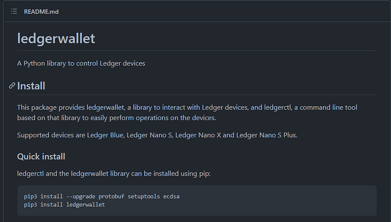

We are going to use the Ledger Python Library (you can find it <a href="https://github.com/LedgerHQ/ledgerctl#quick-install" class="markup--anchor markup--p-anchor" data-href="https://github.com/LedgerHQ/ledgerctl#quick-install" rel="noopener" target="_blank">here</a>). It is necessary because you are going to install a custom App onto your Ledger Device.

To install the Ledger Python Library just open a terminal window and type the following:

> **_pip3 install — — upgrade protobuf setuptools ecdsa  
> pip3 install ledgerwallet_**

This will make all upgrades and install the Ledger Wallet Library that will be needed for the next step.

**4 — Download the Alephium Ledger App to your computer**

Go to the following GitHub repository: <a href="https://github.com/alephium/ledger-alephium/tree/master/release" class="markup--anchor markup--p-anchor" data-href="https://github.com/alephium/ledger-alephium/tree/master/release" rel="noopener" target="_blank">https://github.com/alephium/ledger-alephium</a> and download it.

_🚨To download the repository, click on the “Code” green button and choose “Download Zip.”_

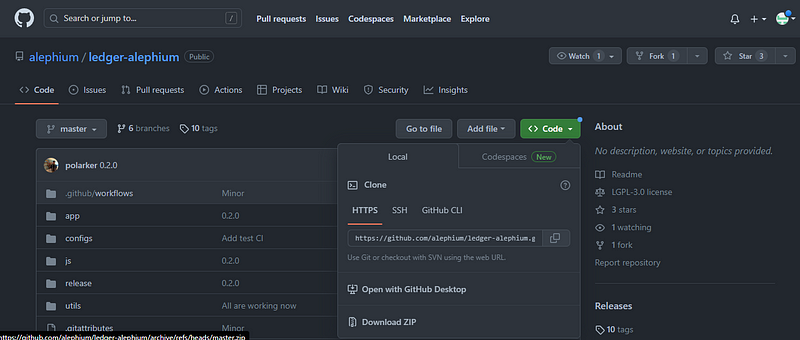

Download and unzip it in a folder you have easy access to and all read/write permissions.

**5 — Install the Alephium App on your Ledger Device**

Your Ledger now needs to be connected to your computer and unlocked.

Go to the GitHub repository (<a href="https://github.com/alephium/ledger-alephium/tree/master" class="markup--anchor markup--p-anchor" data-href="https://github.com/alephium/ledger-alephium/tree/master" rel="noopener" target="_blank">https://github.com/alephium/ledger-alephium/tree/master</a>) and scroll down to find the command that applies to your Ledger version:

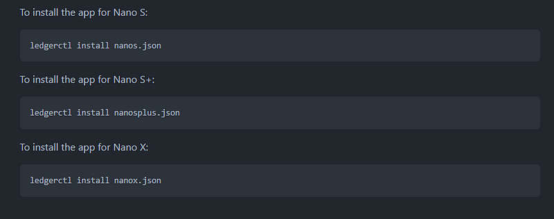

With this information, go to the console terminal and run the command to install the Alephium App:

🚨 _Important information: You need to run the command inside the folder you downloaded the files from GitHub._

In this example, the **Ledger Nano S** is being used:

After running this command you will need to validate the installation of the Alephium App in your Ledger Device. Go through all approvals and add your pin to validate the installation.

When successful, the Alephium icon will appear on your device.

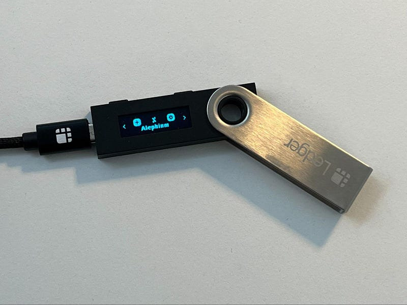

Now you are ready to use your Ledger to sign transactions on Alephium! **🎉**

**6 — Use your Ledger with the Extension Wallet**

Go to the browser where you installed the browser extension wallet, and open it.

🚨 _The Ledger app only works with the latest version (v0.7.0) of the extension wallet for now. If you don’t have it, you can install it from_ <a href="https://chrome.google.com/webstore/detail/alephium-extension-wallet/gdokollfhmnbfckbobkdbakhilldkhcj/related" class="markup--anchor markup--p-anchor" data-href="https://chrome.google.com/webstore/detail/alephium-extension-wallet/gdokollfhmnbfckbobkdbakhilldkhcj/related" rel="noopener" target="_blank"><em>here</em></a>_._

Create a new address in your extension wallet: Click on the current address name, and then in the “+” icon. That will lead you to Ledger Connection page:

- Plug in your Ledger and unlocked it;
- Open the Alephium App (make sure you validated all steps!)
- Select your Ledger device from the list;
- Finish the configuration.

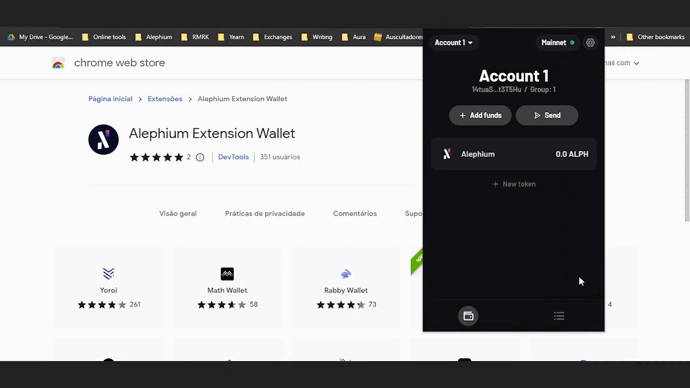

**7 — Use the Ledger Device to send a transaction!**

All the steps here are the usual ones we have seen before using the extension wallet:

- Click on the “Send” button

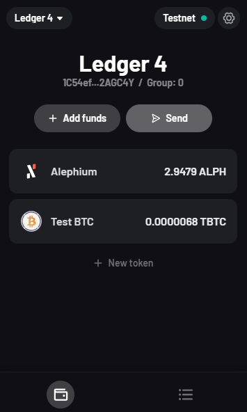

Choose the token you want to send:

Select the recipient’s address:

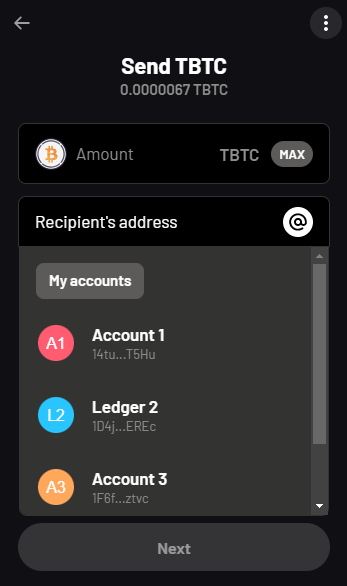

Review the transaction details and click on “Sign with Ledger.”

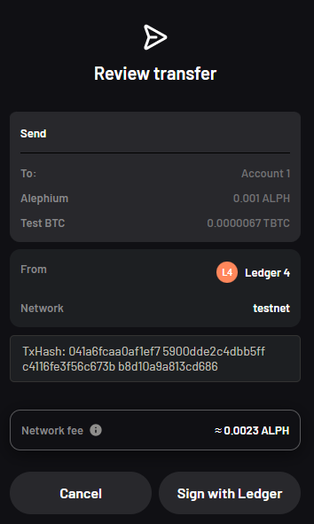

Sign the transaction in your Ledger Device, and follow its completion in “Activity” section:

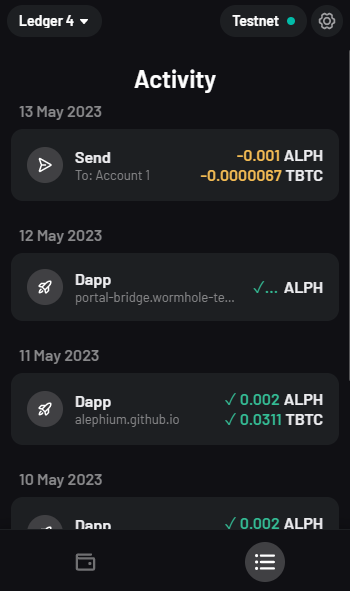

**8 — Use the Ledger Device to interact with dApps in Alephium**

Now that you have a already sign a transaction with yout Ledger Device, it is time to connect it to a dApp. This process is also straightforward.

Access the <a href="https://alephium.github.io/alephium-dex" class="markup--anchor markup--p-anchor" data-href="https://alephium.github.io/alephium-dex" rel="noopener" target="_blank">Alephium DEX on Testnet</a>. Click in the “Connect Alephium” button on the top right. Select the extension wallet in the prompt and the Ledger account.

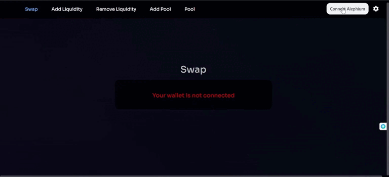

Now you are connected to the Alephium DEX. Make a swap transaction and use your Ledger to sign it. The process is similar to a transfer.

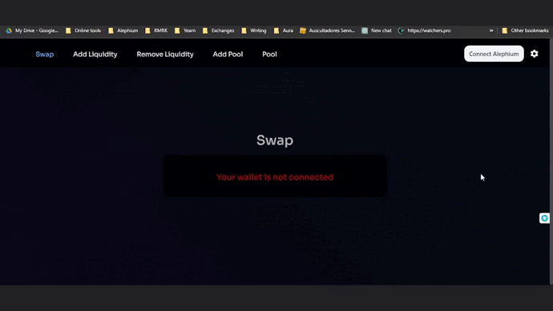

If you have questions or suggestions, please come to Alephium’s <a href="http://alephium.org/discord" class="markup--anchor markup--p-anchor" data-href="http://alephium.org/discord" rel="noopener" target="_blank">Discord</a>, <a href="https://t.me/alephiumgroup" class="markup--anchor markup--p-anchor" data-href="https://t.me/alephiumgroup" rel="noopener" target="_blank">Telegram</a>, or reach out on <a href="https://twitter.com/alephium" class="markup--anchor markup--p-anchor" data-href="https://twitter.com/alephium" rel="noopener" target="_blank">Twitter</a>!
