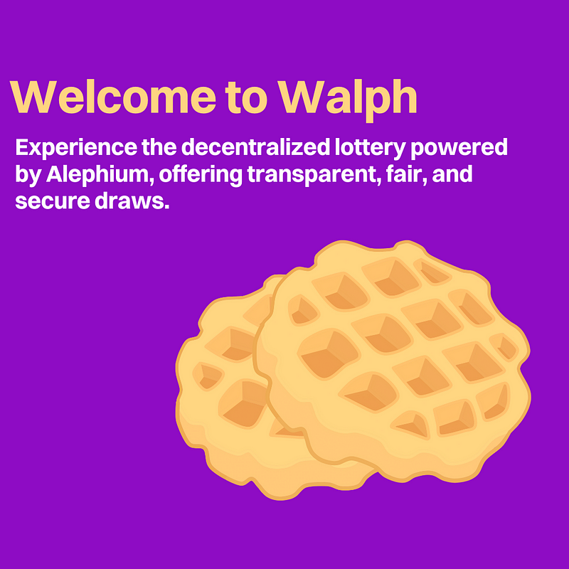
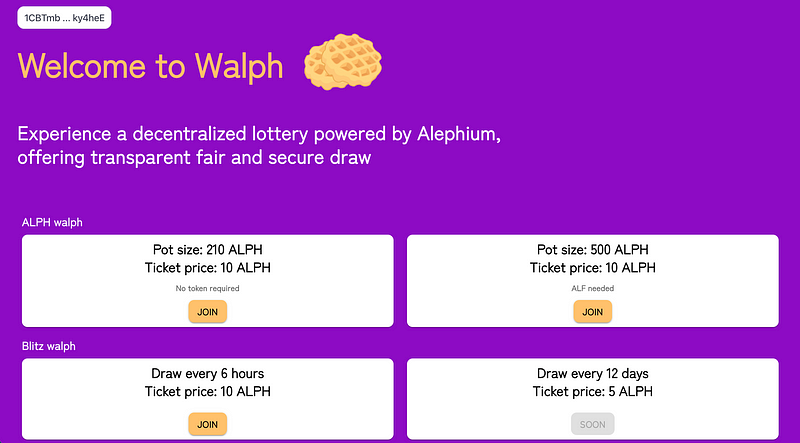
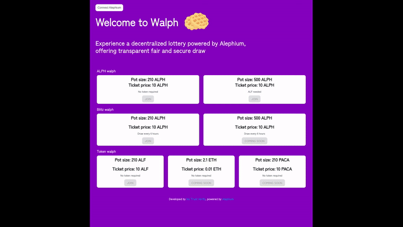
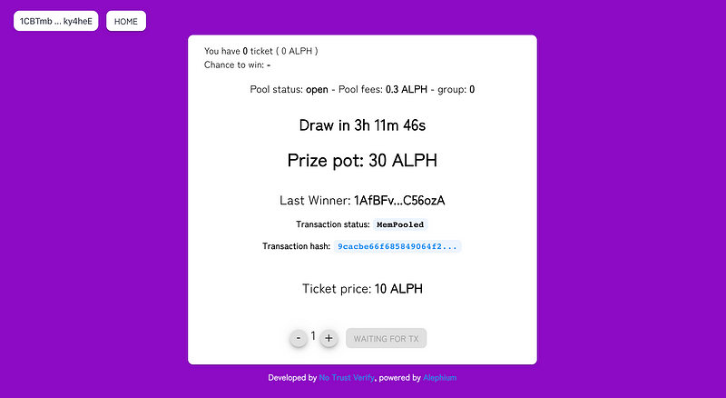

### Builders Highlight \#4: No Trust Verify

_Our ecosystem thrives with developers building amazing stuff on top of Alephium (services, dApps, etc…) that deliver a unique experience and provide real utility for the users. In the Builders Highlight series, these builders will share more about their projects, thoughts, and insights on why building on Alephium! You can find_ <a href="https://medium.com/@alephium/builders-highlight-sezame-wallet-ddb4aeb61881" class="markup--anchor markup--p-anchor" data-href="https://medium.com/@alephium/builders-highlight-sezame-wallet-ddb4aeb61881" rel="noopener" target="_blank"><em>#1 here</em></a>_,_ <a href="https://medium.com/@alephium/builders-highlight-alphpaca-nfts-99c69775f04c" class="markup--anchor markup--p-anchor" data-href="https://medium.com/@alephium/builders-highlight-alphpaca-nfts-99c69775f04c" rel="noopener" target="_blank"><em>#2 here</em></a> _and_ <a href="https://medium.com/@alephium/builders-highlight-3-ayin-6be4a6bd4ec2" class="markup--anchor markup--p-anchor" data-href="https://medium.com/@alephium/builders-highlight-3-ayin-6be4a6bd4ec2" target="_blank"><em>#3</em></a>_!_

This episode is about No Trust Verify, creator of the first ever token on mainnet (ALF), now introducing <a href="https://walph.io" class="markup--anchor markup--p-anchor" data-href="https://walph.io" rel="noopener" target="_blank">Walph</a>, the first decentralized lottery powered by Alephium! <a href="https://twitter.com/cg1_bin" class="markup--anchor markup--p-anchor" data-href="https://twitter.com/cg1_bin" rel="noopener" target="_blank">cgi-bin</a> and <a href="https://twitter.com/Oheka32" class="markup--anchor markup--p-anchor" data-href="https://twitter.com/Oheka32" rel="noopener" target="_blank">Oheka</a> & other NTV members are hyperactive community members & fantastic builders, and we thank them for their time!

### **Tell us a bit about yourself. Who are you? Where are you from? What’s your training & main activity? (this one is optional, but is always nice to know a bit about the founder/dev)**

We are going by <a href="https://notrustverify.ch" class="markup--anchor markup--p-anchor" data-href="https://notrustverify.ch" rel="noopener" target="_blank">No Trust Verify</a>, mostly from Switzerland and our main activity is experimenting with a fondness for privacy, self-sovereignty and trustless organization. We actively <a href="https://github.com/notrustverify" class="markup--anchor markup--p-anchor" data-href="https://github.com/notrustverify" rel="noopener" target="_blank">contribute</a> to many projects, such as Nym, where we manage the infrastructure, develop applications such as <a href="https://pastenym.ch/" class="markup--anchor markup--p-anchor" data-href="https://pastenym.ch/" rel="noopener" target="_blank">pastenym.ch</a>, and educate and raise awareness of privacy issues. Likewise, we are also active on Alephium in various ways, whether by managing certain components such as full node or backend explorer, being active in the community or helping to integrate NymConnect into the Alephium ecosystem.

### **Tell us a little bit about your project. What is it, what does it do, and how does it interact with the Alephium blockchain?**

The project, named “Walph,” draws its inspiration from the concept of a waffle or raffle lottery game. In this innovative platform, users can purchase a specific number of tickets. When the ticket pool reaches its capacity, a draw is conducted, and one fortunate participant is awarded the jackpot prize.

Walph takes this basic idea and expands upon it by introducing additional features. For instance, there’s the “Blitz Walph,” where draws occur at regular intervals, such as every 6 hours. Additionally, there’s the “Token Walph” variant, where participants have the chance to win ALF, PACA, or AYIN tokens as prizes.

Finally, Walph offers a unique “Pool” mode, accessible exclusively to ALF token holders. This exclusive feature adds an extra layer of excitement and engagement for ALF token holders, providing them with access to unique pools and prizes.

### What motivated you to develop on Alephium, and what sets it apart from other blockchain platforms?

We know most of the Alephium team well because of their Swiss origins. Moreover, being at the forefront of the first sharding blockchain with proof of work (PoW) represents a revolutionary and highly innovative undertaking. Our team is intrinsically motivated to continue experimenting with new systems. In addition, we highly appreciate the seriousness and quality of the Alephium team's work and their availability.

One of our No Trust Verify team members took the initiative to launch the first smart contract and token on Alephium’s main network. This pivotal moment piqued our curiosity, prompting us to embark on a journey to discover the vast possibilities and opportunities for development within the Alephium ecosystem.

### What tech stack did you use in your project? What did you consider when choosing the right tech stack for your project?

Ralph for the smart-contract with NextJS for the frontend. Basically, we stayed with the stack that Alephium used for the template, and it works well.

### What features are you most proud of?

> That everything is happening on-chain. We want to limit our power over the system and “let the user draw”

### What’s your roadmap? How do you wish to make your product/service evolve?

Rather than adhering to a rigid roadmap, our approach is fueled by motivation and a commitment to continuous experimentation. In the future, we’d like to propose either as a new feature to walph.io or make a new dapp, christened “PredictALPH” (The real name will be revealed in due course). This would be a prediction game that would allow participants to bet on whether the price of the ALPH token would rise or fall. In addition, there could be other intriguing prediction options, but we’ll leave you to guess for now (hint: it won’t be about when the bridge… joke). Stay tuned for more details

### Could you tell us about some of the challenges you faced while building, and how you overcame them?

The biggest challenge was to catch how APS (Asset Permission System) works, but with some help from Alephium and the documentation, we managed to get it and start building pretty fast

Having to explicitly declare which assets and the amount will be sent is a major improvement to limit on-chain hacks.

### What has been the most rewarding part of developing your project, and why?

At the moment, our project is only on the testnet. We intend to spend some time improving the interface before going any further. Consequently, the most rewarding aspect of our journey so far has been the information and enthusiasm we’ve gleaned from those who have actively tested the application.

### What do you think are some of the future potential use cases of Alephium that could be explored?

Thanks to its inherent features such as sharding, APS and low transaction costs, Alephium has all the attributes needed to establish itself as a secure, user-friendly ecosystem for DeFi dApps.

In the future, it will be fascinating to explore the opportunities sharding offers and study the various tools that will facilitate communication between these shards. And to play with the possibilities offered by the stateful UTXO model.

### Lastly, what advice would you give to someone looking to build on Alephium, based on your experience?

Be sure to consult the documentation, join our Discord community, and don’t hesitate to ask questions. Doing so will not only enhance your understanding but also contribute to Ralph becoming the best smart-contract language.

_Thanks, No Trust Verify, for your answers! Alephium is thrilled to have such talent builders in the community! You can find the WALPH_ <a href="https://walph.io" class="markup--anchor markup--p-anchor" data-href="https://walph.io" rel="noopener" target="_blank"><em>here</em></a>_, and the WALPH Twitter account_ <a href="https://twitter.com/WalphLottery" class="markup--anchor markup--p-anchor" data-href="https://twitter.com/WalphLottery" rel="noopener" target="_blank"><em>here</em></a>_._

---

_Disclaimer: While Alephium is happy to support a growing developer community, it would like to clarify that it does not endorse, audit, or review any software presented in this series and encourages all users to make informed decisions and take personal responsibility for their actions._

Have you built something or have a nice idea and want to request a grant or reward? You can access the <a href="https://github.com/alephium/community/blob/master/Grant%26RewardProgram.md" class="markup--anchor markup--p-anchor" data-href="https://github.com/alephium/community/blob/master/Grant%26RewardProgram.md" rel="noopener ugc nofollow noopener noopener noopener" target="_blank">Alephium Community Grants &amp; Reward Program page</a> for more info!

If you need help or have extra questions, you are welcome to reach out in the \# 🎨dev-dapp channel on <a href="https://alephium.org/discord/" class="markup--anchor markup--p-anchor" data-href="https://alephium.org/discord/" rel="noopener ugc nofollow noopener noopener noopener" target="_blank">Discord</a>, or in the Alephium <a href="https://t.me/alephiumgroup" class="markup--anchor markup--p-anchor" data-href="https://t.me/alephiumgroup" rel="noopener ugc nofollow noopener noopener noopener" target="_blank">Telegram</a> channel. Don’t forget to follow <a href="https://twitter.com/alephium" class="markup--anchor markup--p-anchor" data-href="https://twitter.com/alephium" rel="noopener ugc nofollow noopener noopener noopener" target="_blank">@alephium on Twitter</a> to stay up-to-date.
