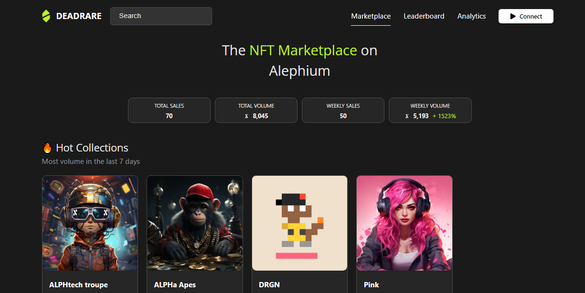
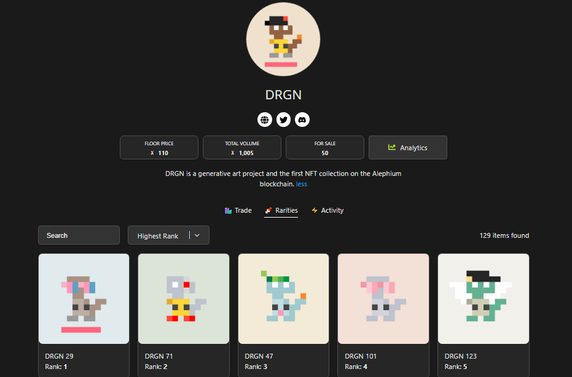
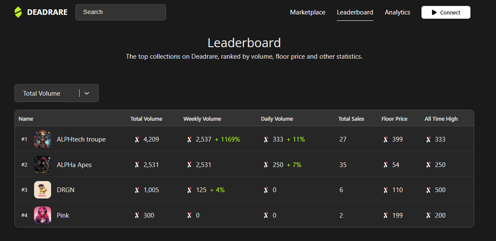

### Builders Highlight \#5: Deadrare

_Our ecosystem thrives with developers building amazing projects on top of Alephium delivering a unique experience and providing real utility for users. In the Builders Highlight series, they share more about their projects, thoughts, and insights on why building on Alephium. You can find_ <a href="https://medium.com/@alephium/builders-highlight-sezame-wallet-ddb4aeb61881" class="markup--anchor markup--p-anchor" data-href="https://medium.com/@alephium/builders-highlight-sezame-wallet-ddb4aeb61881" rel="noopener" target="_blank"><em>#1 here</em></a>_,_ <a href="https://medium.com/@alephium/builders-highlight-alphpaca-nfts-99c69775f04c" class="markup--anchor markup--p-anchor" data-href="https://medium.com/@alephium/builders-highlight-alphpaca-nfts-99c69775f04c" rel="noopener" target="_blank"><em>#2 here</em></a>, <a href="https://medium.com/@alephium/builders-highlight-3-ayin-6be4a6bd4ec2" class="markup--anchor markup--p-anchor" data-href="https://medium.com/@alephium/builders-highlight-3-ayin-6be4a6bd4ec2" rel="noopener" target="_blank"><em>#3 here</em></a> _and_ <a href="https://medium.com/@alephium/builders-highlight-4-no-trust-verify-9ea495ca826f" class="markup--anchor markup--p-anchor" data-href="https://medium.com/@alephium/builders-highlight-4-no-trust-verify-9ea495ca826f" target="_blank"><em>#4 here</em></a>_!_

This episode is about <a href="https://deadrare.io/" class="markup--anchor markup--p-anchor" data-href="https://deadrare.io/" rel="noopener" target="_blank">Deadrare.io</a>, the first ever NFT Marketplace on mainnet, discover a little bit more about its values, the team’s vision of Alephium, and the tech behind a cool NFT Marketplace!

#### Tell us a bit about yourself. Who are you? Where are you from? What’s you’re training & main activity?

Deadrare’s team is anonymous, known only as <a href="http://twitter.com/Splinter" class="markup--anchor markup--p-anchor" data-href="http://twitter.com/Splinter" rel="noopener" target="_blank" title="Twitter profile for @Splinter">@Splinter</a> on discord. We focus on making services which don’t rely on trust and live forever on the blockchain.

#### Tell us a little bit about your project. What is it, what does it do, and how does it interact with the Alephium blockchain?

Deadrare is an NFT Marketplace, similar to Opensea or Magic Eden. Our UI is designed for mobile first, and we focus on making the process of buying and selling NFTs as simple as possible.

#### What motivated you to develop on Alephium, and what sets it apart from other blockchain platforms?

When searching for the perfect home for our marketplace we built prototypes for several chains, including Solana, Elrond and Stacks. We also looked deeply into Arweave, Kaspa and Kadena.

> Our experience showed that the two most important aspects that we were looking for were decentralisation and scalability.

The major flaw of Proof of Stake is the ability of the ‘token rich’ to control the network. Proof of Work is infinitely more decentralised.

We also view native sharding as the best way to scale trustless computing.

Alephium is the first blockchain we have found that have both of these requirements. Alephium additionally has a brilliant Smart Contract system and a very clean programming paradigm.

#### What tech stack did you use in your project? What did you consider when choosing the right tech stack for your project?

This could be a whole article of its own, let's keep it simple:

**Frontend:** React, Typescript, Apollo, GraphQL

**Backend:** Microservices built mainly using Rust and SQL. Designing for change is really important, especially in crypto, where technology changes quickly. By splitting our system into independent functioning services, we can rapidly adopt any new technology into our system.

#### What features are you most proud of?

There are so many features we take pride in, we spend lots of time browsing the site and asking how we can refine our experience.

Off the top of my head here are some highlights… Part of the fun of NFTs if knowing who holds the rarest in a collection which is why we baked Rarities right into the Deadrare UI.

Superfast loading time, really important for the overall user experience and improving Google search ranking.   
Image previews whenever you share an NFT on social media.

#### What’s your roadmap? How do you wish to make your product/service evolve?

The NFT Marketplace is pretty much complete, we don’t want to overload it with features. We believe in the Philosophy of doing one thing and doing it well. Instead, we like to develop new products to complement Deadrare and the rest of the ALPH ecosystem.

> We are looking into making a Twitter clone next!

We also have an on-chain Order Book DEX in the works.

#### Could you tell us about some of the challenges you faced while building, and how you overcame them?

If you look at the Alephium discord, we spent a lot of time debating with the core team regarding the best implementation for NFTs in Alephium Smart Contracts. That was probably the hardest part of development because you know that the decisions you make will be around for a long time.

#### What has been the most rewarding part of developing your project, and why?

We created Deadrare because we love creating NFT collections and watching people have fun with them. There is an immense sense of joy when you see people getting excited about the NFT they just minted from the collection you crafted. DRGN was the first generative art project on Alephium and we have lots of other innovative ideas coming soon.

#### What do you think are some of the future potential use cases of Alephium that could be explored?

Sharding opens up a massive number of use cases which just cannot scale on legacy blockchains. Decentralised versions of Twitter and Twitch are something we would like to see built next.

#### Lastly, what advice would you give to someone looking to build on Alephium, based on your experience?

Head on over to the Alephium discord and start chatting to the core developers and myself! We are always online.

We highly value the core team's approach to growing the ecosystem, remaining neutral and inviting other developers to build independently. This will be crucial for creating a thriving ecosystem on Alephium.

_Thanks, Deadrare, for your answers! Alephium is thrilled to have such talent builders in the community! You can find the Deadrare site_ <a href="https://deadrare.io/" class="markup--anchor markup--p-anchor" data-href="https://deadrare.io/" rel="noopener" target="_blank"><em>here</em></a>_, and the Deadrare Twitter account_ <a href="https://twitter.com/DeadRareNFT" class="markup--anchor markup--p-anchor" data-href="https://twitter.com/DeadRareNFT" rel="noopener" target="_blank"><em>here</em></a>_._

---

_Disclaimer: While Alephium is happy to support a growing developer community, it would like to clarify that it does not endorse, audit, or review any software presented in this series and encourages all users to make informed decisions and take personal responsibility for their actions._

Have you built something or have a nice idea and want to request a grant or reward? You can access the <a href="https://github.com/alephium/community/blob/master/Grant%26RewardProgram.md" class="markup--anchor markup--p-anchor" data-href="https://github.com/alephium/community/blob/master/Grant%26RewardProgram.md" rel="noopener ugc nofollow noopener" target="_blank">Alephium Community Grants &amp; Reward Program page</a> for more info!

If you need help or have extra questions, you are welcome to reach out in the \# 🎨dev-dapp channel on <a href="https://alephium.org/discord/" class="markup--anchor markup--p-anchor" data-href="https://alephium.org/discord/" rel="noopener ugc nofollow noopener" target="_blank">Discord</a>, or in the Alephium <a href="https://t.me/alephiumgroup" class="markup--anchor markup--p-anchor" data-href="https://t.me/alephiumgroup" rel="noopener ugc nofollow noopener" target="_blank">Telegram</a> channel. Don’t forget to follow <a href="https://twitter.com/alephium" class="markup--anchor markup--p-anchor" data-href="https://twitter.com/alephium" rel="noopener ugc nofollow noopener" target="_blank">@alephium on Twitter</a> to stay up-to-date.
