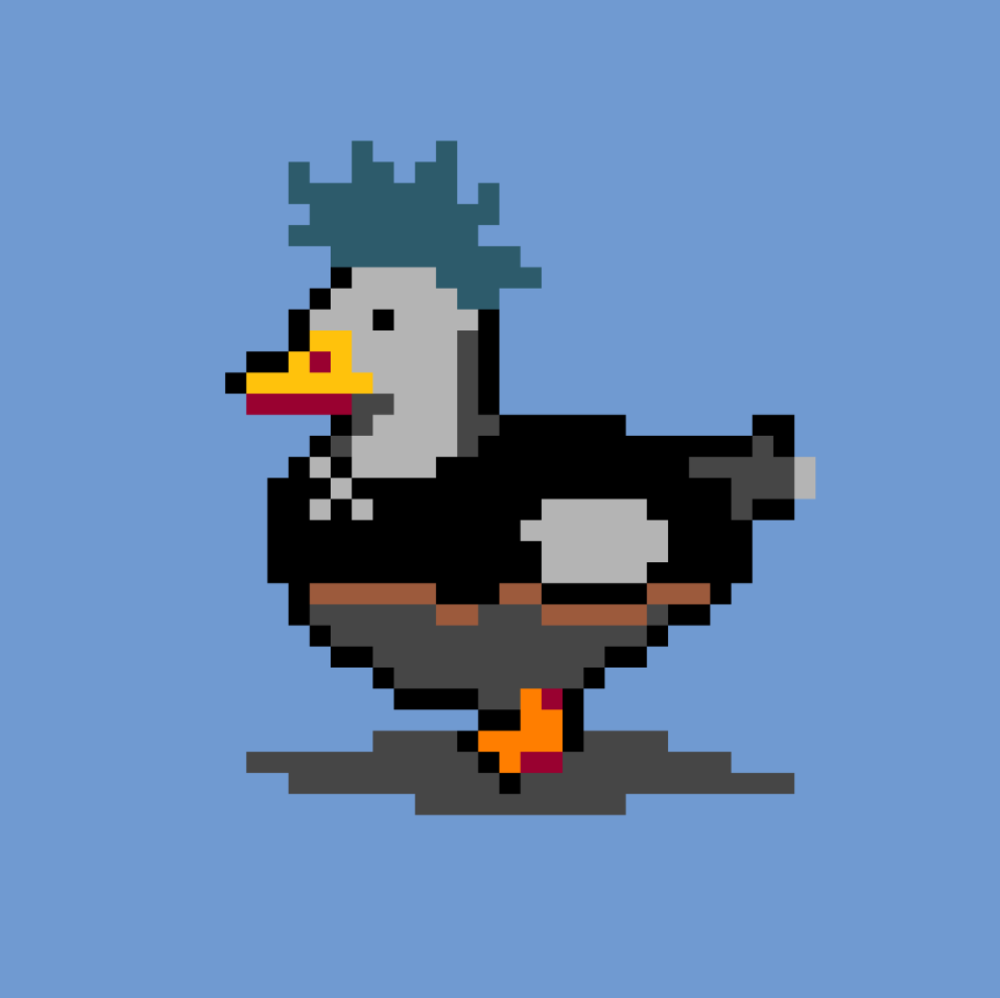

### **Builders Highlight \#6: What the Duck**

<figure id="2030" class="graf graf--figure graf-after--h3">

<figcaption>Quack!</figcaption>
</figure>

_Our ecosystem thrives with developers building amazing projects on top of Alephium, delivering a unique experience and providing real utility for users. In the Builders Highlight series, they share more about their projects, thoughts, and insights on why building on Alephium. You can find_ <a href="https://medium.com/@alephium/builders-highlight-sezame-wallet-ddb4aeb61881" class="markup--anchor markup--p-anchor" data-href="https://medium.com/@alephium/builders-highlight-sezame-wallet-ddb4aeb61881" rel="noopener" target="_blank"><em>#1 here</em></a>_,_ <a href="https://medium.com/@alephium/builders-highlight-alphpaca-nfts-99c69775f04c" class="markup--anchor markup--p-anchor" data-href="https://medium.com/@alephium/builders-highlight-alphpaca-nfts-99c69775f04c" rel="noopener" target="_blank"><em>#2 here</em></a>, <a href="https://medium.com/@alephium/builders-highlight-3-ayin-6be4a6bd4ec2" class="markup--anchor markup--p-anchor" data-href="https://medium.com/@alephium/builders-highlight-3-ayin-6be4a6bd4ec2" rel="noopener" target="_blank"><em>#3 here</em></a>, <a href="https://medium.com/@alephium/builders-highlight-4-no-trust-verify-9ea495ca826f" class="markup--anchor markup--p-anchor" data-href="https://medium.com/@alephium/builders-highlight-4-no-trust-verify-9ea495ca826f" rel="noopener" target="_blank"><em>#4 here</em></a>, _and_ <a href="https://medium.com/@alephium/builders-highlight-5-deadrare-d5ff90d6161e" class="markup--anchor markup--p-anchor" data-href="https://medium.com/@alephium/builders-highlight-5-deadrare-d5ff90d6161e" target="_blank"><em>#5 here</em></a>_!_

This episode is about <a href="https://theducklounge.com/#/" class="markup--anchor markup--p-anchor" data-href="https://theducklounge.com/#/" rel="noopener" target="_blank">What The Duck</a>, a one-man project by <a href="https://twitter.com/0x_reed" class="markup--anchor markup--p-anchor" data-href="https://twitter.com/0x_reed" rel="noopener" target="_blank">0x_reed</a> that blends <a href="https://deadrare.io/collection/what-the-duck" class="markup--anchor markup--p-anchor" data-href="https://deadrare.io/collection/what-the-duck" rel="noopener" target="_blank">an NFT collection</a> and online gaming. Here he shares a little bit about his inspiration, the challenges this project brought, and some plans for the future.

#### **Can you tell us a bit about yourself? What is it you do? (as a job, as a hobby, or in general!)**

Hi! I have been a full-time developer in the crypto space for the past three years. I primarily focused on backend web3 development but occasionally touched all layers of the stack. Before this, I founded (the now defunct) degen.watch, which was the first portfolio management dashboard on the Fantom network. Outside work, I spend time with my family, track my investments, and explore new development stacks and ideas.

#### **Tell us a little bit about your project. What is it, what does it, and how does it interact with the Alephium blockchain?**

<a href="https://twitter.com/alph_ducks" class="markup--anchor markup--p-anchor" data-href="https://twitter.com/alph_ducks" rel="noopener" target="_blank">What The Duck</a> is primarily an exploration into dynamic on-chain NFTs on alephium. I’m working on it in steps to incorporate community feedback as I go, with this in mind I’m currently developing a game which will allow holders to interact with each other in a multiplayer duck world.

#### **What’s the story behind choosing ducks for your NFT collection? Was there a particular feathered friend that inspired this quacky idea? Can you share a fun fact about ducks that most people might not know and that influenced your NFT designs?**

It actually started as a series of elves I was working on to release for Christmas, but although I really liked the elves, the ideas I wanted to explore I knew would take longer than Christmas to accomplish, so I didn’t want to limit the appeal to a specific season. No single feathered friend inspired the ducks directly, but after brainstorming through several different ideas, the ducks just felt like the most fun. My wife was actually the one who thought of the name “What The Duck”. A fun fact about ducks is they are one of the few animals which are as cute as they are delicious. Wait, no, I would never say that. An actual fact is ducks can close one eye and put half their brain to sleep while keeping watch with the other half. I feel this could be an extremely helpful skill in crypto.

#### **How did you find out about Alephium? What motivated you to develop on Alephium blockchain, and what set it apart from other blockchain platforms?**

It was Dr. Jekyll from the Ayin team who told me about Alephium. I knew him and other team members from previous projects and wanted to see what they built. I was learning Rust at that time already and started digging into Ralph and around the SDK to see what development was like. I really enjoyed the existing community. When I released my “<a href="https://deadrare.io/collection/shades-of-defi" class="markup--anchor markup--p-anchor" data-href="https://deadrare.io/collection/shades-of-defi" rel="noopener" target="_blank">Shades Of Defi</a>” NFT series, I didn’t know what the response would be like. Everyone was very nice and supportive, further reinforcing my desire to be part of this community.

#### **What tech stack did you use in your project? What did you consider when choosing the right tech stack for your project?**

It was a fun build. I used an online pixel art editor to draw the ducks, but this output .PNG files and the layers weren’t labelled. I wrote a script to convert and sort these .png layers into .svg layers and flatten them to generate all the duck images based on a weighted rarity system. I generated the metadata json files with this same script, and also generated <a href="https://vuejs.org/" class="markup--anchor markup--p-anchor" data-href="https://vuejs.org/" rel="noopener" target="_blank">Vue.js</a> components that get used on <a href="https://theducklounge.com/#/" class="markup--anchor markup--p-anchor" data-href="https://theducklounge.com/#/" rel="noopener" target="_blank">theducklounge.com</a> on the <a href="https://theducklounge.com/#/nest" class="markup--anchor markup--p-anchor" data-href="https://theducklounge.com/#/nest" rel="noopener" target="_blank">rarity explorer page</a>. This was all done with typescript+bun. The website is a small Vue.js app with some <a href="https://en.wikipedia.org/wiki/CSS" class="markup--anchor markup--p-anchor" data-href="https://en.wikipedia.org/wiki/CSS" rel="noopener" target="_blank">CSS</a> animations for the clouds and other interactive bits. It’s hosted on IPFS through <a href="https://fleek.co/hosting/" class="markup--anchor markup--p-anchor" data-href="https://fleek.co/hosting/" rel="noopener" target="_blank">Fleek</a>.

#### **What features are you most proud/happy of?**

Regarding released features, the rarity & trait explorer on the website. I think it’s pretty smooth and a fun way to explore new possible combinations. For unreleased, I’m excited to get my upcoming game to a stable state. Multiplayer seems to work well in testing, and most smart contracts are completed. It still has more work to be done before it’s in a production-ready state, but I think it will be really fun. I’m looking forward to making a release.

#### **Could you tell us about some of the challenges you faced while building, and how you overcame them?**

One of the challenges I faced was learning what sets Ralph apart from other languages I have used. Reading through <a href="http://alephium.org/discord" class="markup--anchor markup--p-anchor" data-href="http://alephium.org/discord" rel="noopener" target="_blank">Discord</a> and the <a href="http://docs.alephium.org" class="markup--anchor markup--p-anchor" data-href="http://docs.alephium.org" rel="noopener" target="_blank">docs</a> helped a lot, but I brute-forced a lot of the subtler things through trial and error and reading through the source code from <a href="http://github.com/alephium" class="markup--anchor markup--p-anchor" data-href="http://github.com/alephium" rel="noopener" target="_blank">GitHub</a>. I don’t know how many hours I have spent reading through all the <a href="https://github.com/alephium/alephium-web3" class="markup--anchor markup--p-anchor" data-href="https://github.com/alephium/alephium-web3" rel="noopener" target="_blank">SDK code</a> and various Ralph example projects, and other Alephium repos. Another challenge was trying to choose an art direction. I have some fun ideas ahead for the ducks, but they are mostly technically focused, so trying to think of a fun and original theme that I could create was difficult. I played around with various AI image generators for inspiration and tried a lot of variations before I found something I was happy with. Although I like to think I’m pretty creative, I wouldn’t define myself as an artist, so figuring out what I wanted to draw and what tools I should be using took time.

#### What has been the most rewarding part of developing your project, and why?

Seeing people mention my project online is always fun. I have seen people talk about it on Twitter and Discord, and it’s cool to me that I created something that made enough of an impact to spawn some discussion between strangers. Whenever I deploy anything online that people like and use, it’s always a good feeling and makes me want to build more.

#### **How do you see the future of your project? Do you have a roadmap?**

In the spirit of trying to under-promise and over-deliver, I don’t have a public roadmap but with that said I have thrown ideas around in private with a few fellow ducks. I have the game coming out soon, so that should be fun, and I have some ideas that I think are pretty exciting for after that. It’s difficult to give accurate timelines when you are learning the tech for the first time, have a team of 1, and already have a full-time job and a family. Instead of the added pressure of a roadmap, for now, I just have ideas I’m looking forward to and working towards.

#### Lastly, what advice would you give to someone looking to build on Alephium, based on your experience? In your opinion, how can the Alephium ecosystem foster a more vibrant developer community?

I think some developer tooling and documentation are lacking, but that’s the price of such an early ecosystem. You get a very helpful and close-knit community in exchange for these difficulties. People ask good questions in the \#developer channel in the Alephium discord; there are knowledgeable people there and really good responses. Also, the <a href="https://github.com/alephium/alephium-web3" class="markup--anchor markup--p-anchor" data-href="https://github.com/alephium/alephium-web3" rel="noopener" target="_blank">SDK codebase</a> is very approachable, which makes up for some of the missing docs. I think more open-source example projects will help developers. Some good examples exist, such as the <a href="https://github.com/alephium/alephium-nft" class="markup--anchor markup--p-anchor" data-href="https://github.com/alephium/alephium-nft" rel="noopener" target="_blank">alephium-nft rep</a>o and <a href="https://github.com/notrustverify/walph-contracts" class="markup--anchor markup--p-anchor" data-href="https://github.com/notrustverify/walph-contracts" rel="noopener" target="_blank">Walph</a> from <a href="https://twitter.com/cg1_bin" class="markup--anchor markup--p-anchor" data-href="https://twitter.com/cg1_bin" rel="noopener" target="_blank">cgi-bin</a>. I think more simple examples, such as a basic NFT collection or token, and more examples for common EVM patterns translated to Ralph. This will come with time, though.

#### **How do you engage with the Alephium community, and how has this community influenced your project development?**

I mostly hang out in Ayin Discord or the developer channel on Alephium Discord, and of course, I’m always available on Ducks Discord. I usually check my Twitter daily, but I don’t spend most of my time there. As for how the community influenced the project development, this game idea 100% originated from the community and wasn’t in my plans at all, but they were enthusiastic, and I thought it sounded like a lot of fun, so I dove in.

_Thanks, 0x_reed, for your answers! Alephium is thrilled to have such talent builders in the community! You can find the What the Duck site_ <a href="http://theducklounge.com" class="markup--anchor markup--p-anchor" data-href="http://theducklounge.com" rel="noopener" target="_blank"><em>here</em></a>_, and the Twitter account_ <a href="http://twitter.com/alph_ducks" class="markup--anchor markup--p-anchor" data-href="http://twitter.com/alph_ducks" rel="noopener" target="_blank"><em>here</em></a>_._

---

_Disclaimer: While Alephium is happy to support a growing developer community, it would like to clarify that it does not endorse, audit, or review any software presented in this series and encourages all users to make informed decisions and take personal responsibility for their actions._

Have you built something or have a nice idea and want to request a grant or reward? You can access the <a href="https://github.com/alephium/community/blob/master/Grant%26RewardProgram.md" class="markup--anchor markup--p-anchor" data-href="https://github.com/alephium/community/blob/master/Grant%26RewardProgram.md" rel="noopener ugc nofollow noopener" target="_blank">Alephium Community Grants &amp; Reward Program page</a> for more info!

If you need help or have extra questions, you are welcome to reach out in the \# 🎨dev-dapp channel on <a href="https://alephium.org/discord/" class="markup--anchor markup--p-anchor" data-href="https://alephium.org/discord/" rel="noopener ugc nofollow noopener" target="_blank">Discord</a>, or in the Alephium <a href="https://t.me/alephiumgroup" class="markup--anchor markup--p-anchor" data-href="https://t.me/alephiumgroup" rel="noopener ugc nofollow noopener" target="_blank">Telegram</a> channel. Don’t forget to follow <a href="https://twitter.com/alephium" class="markup--anchor markup--p-anchor" data-href="https://twitter.com/alephium" rel="noopener ugc nofollow noopener" target="_blank">@alephium on Twitter</a> to stay up-to-date.
