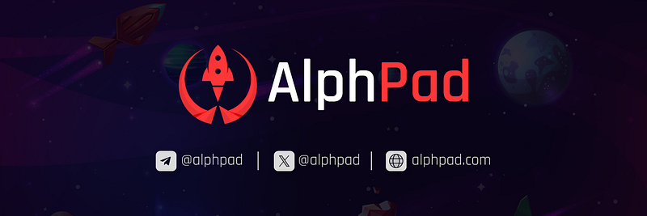

### Builders Highlight \#7: AlphPad

_Our ecosystem thrives with developers building amazing projects on top of Alephium, delivering a unique experience and providing real utility for users. In the Builders Highlight series, they share more about their projects, thoughts, and insights on why building on Alephium. You can find_ <a href="https://medium.com/@alephium/builders-highlight-sezame-wallet-ddb4aeb61881" class="markup--anchor markup--p-anchor" data-href="https://medium.com/@alephium/builders-highlight-sezame-wallet-ddb4aeb61881" rel="noopener" target="_blank"><em>#1 here</em></a>_,_ <a href="https://medium.com/@alephium/builders-highlight-alphpaca-nfts-99c69775f04c" class="markup--anchor markup--p-anchor" data-href="https://medium.com/@alephium/builders-highlight-alphpaca-nfts-99c69775f04c" rel="noopener" target="_blank"><em>#2 here</em></a>, <a href="https://medium.com/@alephium/builders-highlight-3-ayin-6be4a6bd4ec2" class="markup--anchor markup--p-anchor" data-href="https://medium.com/@alephium/builders-highlight-3-ayin-6be4a6bd4ec2" rel="noopener" target="_blank"><em>#3 here</em></a>, <a href="https://medium.com/@alephium/builders-highlight-4-no-trust-verify-9ea495ca826f" class="markup--anchor markup--p-anchor" data-href="https://medium.com/@alephium/builders-highlight-4-no-trust-verify-9ea495ca826f" rel="noopener" target="_blank"><em>#4 here</em></a>, <a href="https://medium.com/@alephium/builders-highlight-5-deadrare-d5ff90d6161e" class="markup--anchor markup--p-anchor" data-href="https://medium.com/@alephium/builders-highlight-5-deadrare-d5ff90d6161e" rel="noopener" target="_blank"><em>#5 here</em></a>, _and_ <a href="https://medium.com/@alephium/builders-highlight-6-what-the-duck-0aedc602ecfd" class="markup--anchor markup--p-anchor" data-href="https://medium.com/@alephium/builders-highlight-6-what-the-duck-0aedc602ecfd" target="_blank"><em>#6 here</em></a>_!_

This episode is about <a href="https://alphpad.com" class="markup--anchor markup--p-anchor" data-href="https://alphpad.com" rel="noopener" target="_blank">AlphPad</a>, an Alephium-native launchpad for IDOs. Here they share a little bit about his inspiration, the challenges this project brought, and some plans for the future.

#### **Please tell us a bit about yourself. What is it you do? (as a job, as a hobby, or in general!)**

<a href="https://twitter.com/tinfoilhatc4t" class="markup--anchor markup--p-anchor" data-href="https://twitter.com/tinfoilhatc4t" rel="noopener" target="_blank">Tinfoil Cat</a>: We are a small and lean team that has been deeply involved in the crypto space for a long time. We’ve witnessed the inception of many trends like DeFi, NFTs, etc. Passionate about crypto, we both started as miners, transitioned to investing and on-chain ecosystems, and are now focusing on development.

#### Tell us a little bit about your project. What is it, what does it do, and how does it interact with the Alephium blockchain?

<a href="https://twitter.com/krk0d3r" class="markup--anchor markup--p-anchor" data-href="https://twitter.com/krk0d3r" rel="noopener" target="_blank">krk0d3r</a>: We’re developing a <a href="https://twitter.com/alphpad" class="markup--anchor markup--p-anchor" data-href="https://twitter.com/alphpad" rel="noopener" target="_blank">token launchpad</a> with a clear mission: to empower the next wave of innovative blockchain projects on Alephium. As strong believers in Alephium’s potential, we want to contribute to its burgeoning ecosystem.

#### How did you find out about Alephium? What motivated you to develop on the Alephium blockchain, and what sets it apart from other blockchain platforms?

Tinfoil Cat: We’ve been engaged with Alephium for over a year, focusing on mining and investing. Its unique features and growing community motivated us to develop on this blockchain, setting it apart from others.

#### What tech stack did you use in your project? What did you consider when choosing the right tech stack for your project?

krk0d3r: Our project utilizes proven technologies in the crypto space. We’ve built the frontends using React and Next.js, while the contracts are developed with Ralph. For optimal performance, we host our frontends on Cloudflare.

#### What features are you most proud/happy of?

Tinfoil Cat: We’re particularly proud of our unique reward distribution mechanism. It’s designed to circumvent common pitfalls in launchpads; as far as we know, it’s the first of its kind.

#### Could you tell us about some of the challenges you faced while building and how you overcame them?

krk0d3r: We’re in the midst of building and face challenges daily. We prefer to share specific experiences post-completion, taking it one step at a time.

#### What has been the most rewarding part of developing your project, and why?

Krk0der: The most rewarding aspect has been learning new technologies and becoming part of an emerging ecosystem. It’s an exciting challenge that we look forward to every day.

#### How do you see the future of your project? Do you have a roadmap?

krk0der: Our roadmap, which you can find on our website and in our documentation, lays out our direction for the upcoming year. While we have a strategic vision extending beyond four years, we reveal these longer-term plans incrementally as they transition into our immediate roadmap.

#### What advice would you give to someone looking to build on Alephium, based on your experience? In your opinion, how can the Alephium ecosystem foster a more vibrant developer Community?

Tinfoil Cat: Building on Alephium now is promising, given the limited competition and the new VM that challenges developers to innovate. We look forward to the evolution of Alph’s VM and its documentation, making it more inviting for developers.

#### How do you engage with the Alephium community, and how has this community influenced your project development?

Tinfoil Cat: Presenting our project to the Alephium community was met with incredible support and engagement, exceeding our expectations. Their response has positively influenced our development.

#### Where can we stay in touch with your project & with you? Is it possible to contribute?

Tinfoil cat: You can follow us on major <a href="https://twitter.com/alphpad" class="markup--anchor markup--p-anchor" data-href="https://twitter.com/alphpad" rel="noopener" target="_blank">social platforms</a>; find the links at the bottom of our website. Currently, we’re focused on a small, dedicated team, but as the project evolves, more opportunities for community contribution will open up.

#### Anything else you’d want to add?

Tinfoil cat: Embarking on this journey with Alph at this moment is exhilarating. It’s a golden opportunity to be early in a rising ecosystem. We have ambitious plans for the future and hope the community will join us on this exciting journey.

_Thanks,_ <a href="https://twitter.com/tinfoilhatc4t" class="markup--anchor markup--p-anchor" data-href="https://twitter.com/tinfoilhatc4t" rel="noopener" target="_blank"><em>Tinfoil Cat</em></a> _and_ <a href="https://twitter.com/krk0d3r" class="markup--anchor markup--p-anchor" data-href="https://twitter.com/krk0d3r" rel="noopener" target="_blank"><em>krk0der</em></a>, _for your answers! Alephium is thrilled to have such talent builders in the community! You can find the AlphPad site_ <a href="https://alphpad.com/" class="markup--anchor markup--p-anchor" data-href="https://alphpad.com/" rel="noopener" target="_blank"><em>here</em></a>_, and the Twitter account_ <a href="https://twitter.com/alphpad" class="markup--anchor markup--p-anchor" data-href="https://twitter.com/alphpad" rel="noopener" target="_blank"><em>here</em></a>_._

_Disclaimer: While Alephium is happy to support a growing developer community, it would like to clarify that it does not endorse, audit, or review any software presented in this series and encourages all users to make informed decisions and take personal responsibility for their actions._

---

Have you built something or have a nice idea and want to request a grant or reward? You can access the <a href="https://github.com/alephium/community/blob/master/Grant%26RewardProgram.md" class="markup--anchor markup--p-anchor" data-href="https://github.com/alephium/community/blob/master/Grant%26RewardProgram.md" rel="noopener ugc nofollow noopener" target="_blank">Alephium Community Grants &amp; Reward Program page</a> for more info!

If you need help or have extra questions, you are welcome to reach out in the \# 🎨dev-dapp channel on <a href="https://alephium.org/discord/" class="markup--anchor markup--p-anchor" data-href="https://alephium.org/discord/" rel="noopener ugc nofollow noopener" target="_blank">Discord</a>, or in the Alephium <a href="https://t.me/alephiumgroup" class="markup--anchor markup--p-anchor" data-href="https://t.me/alephiumgroup" rel="noopener ugc nofollow noopener" target="_blank">Telegram</a> channel. Don’t forget to follow <a href="https://twitter.com/alephium" class="markup--anchor markup--p-anchor" data-href="https://twitter.com/alephium" rel="noopener ugc nofollow noopener" target="_blank">@alephium on Twitter</a> to stay up-to-date.
