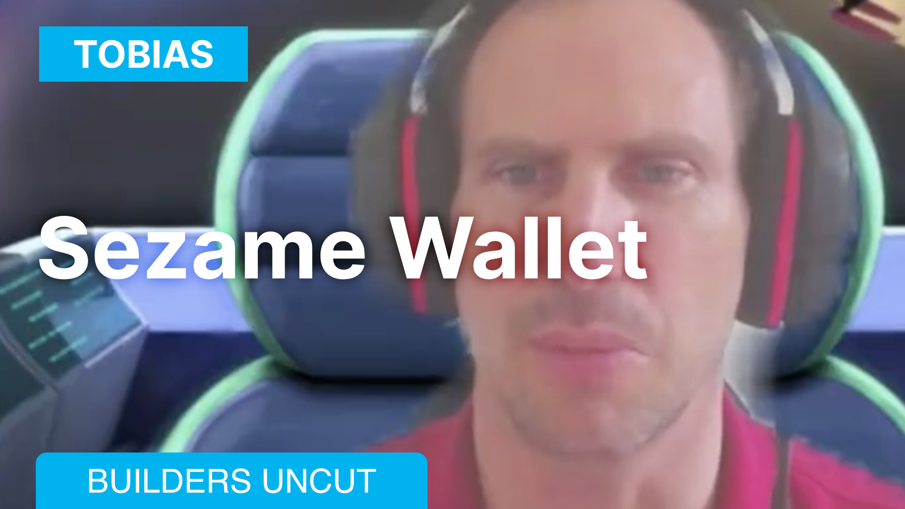
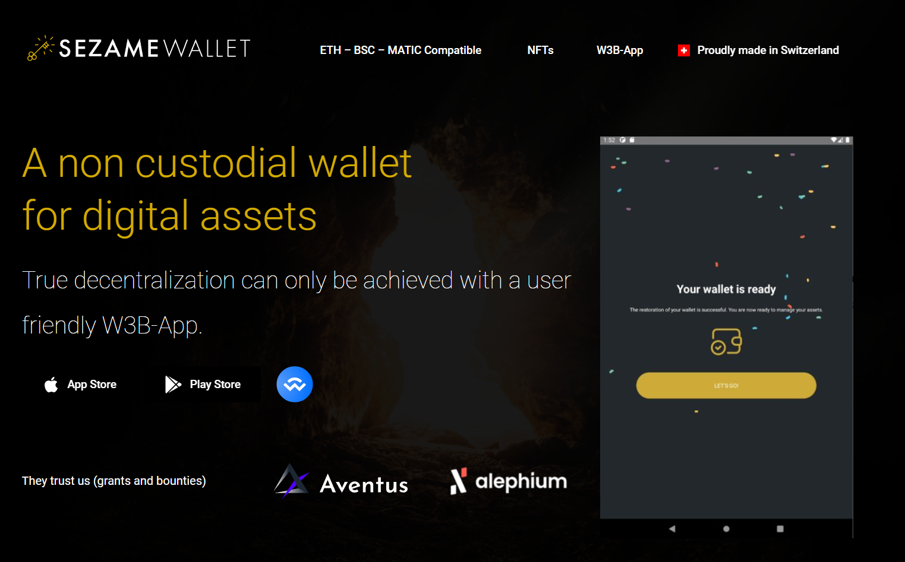

### Builders Uncut — Sezame Wallet

_This interview was conducted around the Athens Builders Meetup, which took place at the end of June 2024. If you’re just discovering Alephium’s ecosystem, it’s a great way to learn about all the main projects!_

Here, Tobias (a founding member of <a href="https://sezame.app/" class="markup--anchor markup--p-anchor" data-href="https://sezame.app/" rel="noopener" target="_blank">Sezame Wallet</a>) discusses the project’s journey in the Alephium ecosystem. He highlights the creation of a mobile wallet with integrated cloud mining, making Alephium accessible to non-technical users, and shares their plans for the future. Find the full (slightly edited) transcript below if you prefer reading.

<figure id="e49a" class="graf graf--figure graf--iframe graf-after--p">

<h1 id="ein-fehler-ist-aufgetreten." class="message">Ein Fehler ist aufgetreten.</h1>
<a href="https://www.youtube.com/watch?v=_tvCwzxQhdM" target="_blank">Sieh dir dieses Video auf www.youtube.com an</a> oder aktiviere JavaScript, falls es in deinem Browser deaktiviert sein sollte.
</figure>

#### Can you introduce yourself and tell us a bit about Sezame Wallet?

I’m Tobias, one of the founding members of Sezame Wallet. We recognized the potential in Alephium early on and wanted to build something that made this technology accessible. We started with a mobile wallet because having your assets easily accessible on your phone is essential.

We also launched cloud mining, which allowed non-technical users to participate in mining Alephium even before any exchanges or DEXs were available.

#### How did Sezame Wallet get started on Alephium?

We got involved with Alephium during its testnet phase back in 2021. We were among the first to release a mobile wallet integrated with cloud mining on the platform.

Our goal was to make Alephium’s technology available to a broader audience, and we were thrilled to see it scale to thousands of GPUs.

#### How did your team come together, and what drew you to Alephium?

Our team comprises six founders with diverse backgrounds — some in tech, others in crypto investment, and a few just passionate about new technologies.

One of our co-founders, who works at a crypto VC, introduced us to Alephium, and we started off looking at the technology, thinking it does indeed look quite promising, but with big promises, you need to be able to deliver.

And our next question was: is there a team that can deliver on such bold claims? Because, well, it’s a layer one, which is probably one of the most complex adventures. You don’t improvise a layer one. You need a robust team. You need people who have knowledge and experience and that can deliver.

After meeting the team and seeing their ambitious roadmap, we believed they had the skills and experience to deliver something exceptional.

#### How have Alephium and its community evolved since you first got involved?

Initially, we were concerned about whether Cheng’s knowledge could be effectively shared within the community. Over time, though, we’ve seen an incredible increase in the number of people capable of contributing and answering questions.

The ecosystem has grown naturally, with more people adding their expertise, creating a collaborative and dynamic environment. For instance, at some point, we wanted to create a raffle, but we ended up not doing it because we saw that one of the community members had a better idea than we had on the topic.

We see an increasing number of people who can build and exchange their wisdom and experience with others. It’s been a real pleasure to explore the possibilities and see what Alephium is capable of, not only from the core team but also from the ecosystem.

#### What’s the current focus for Sesame Wallet, and what can we expect in the future?

Right now, we’re carefully planning the next update for our wallet. Our focus is on making it more functional and user-friendly, particularly for non-technical users.

Features like lending and swapping are on the roadmap, but we’re taking our time to ensure everything is seamless. The timing of our next release will depend on the partnerships we forge in the coming months.

#### **After meeting with other builders in Athens, what upcoming developments are you most excited about?**

I’m particularly excited about the development of lending platforms like AlphBanX. The idea of using ALPH as collateral while still maintaining liquidity is brilliant.

For those of us who believe in Alephium’s long-term potential, it’s a way to stay invested without selling our assets.

#### Any final thoughts before we wrap up?

I want to thank you for this opportunity to share what we’ve been working on. We’re committed to the Alephium ecosystem and look forward to contributing more as we go forward.

I’m excited about the future and eager to update everyone on our progress.

---

**Links:**

**Sezame Wallet**  
Website: <a href="https://sezame.app/" class="markup--anchor markup--p-anchor" data-href="https://sezame.app/" rel="nofollow noopener" target="_blank">https://sezame.app/</a>  
Twitter: <a href="https://twitter.com/SesameWallet" class="markup--anchor markup--p-anchor" data-href="https://twitter.com/SesameWallet" rel="nofollow noopener" target="_blank">https://twitter.com/SesameWallet</a>  
Telegram: <a href="https://t.me/sesamewalletgroup" class="markup--anchor markup--p-anchor" data-href="https://t.me/sesamewalletgroup" rel="nofollow noopener" target="_blank">https://t.me/sesamewalletgroup</a>

---

For any questions or feedback, reach out to us on <a href="http://alephium.org/discord" class="markup--anchor markup--p-anchor" data-href="http://alephium.org/discord" rel="noopener ugc nofollow noopener" target="_blank">Discord</a> or <a href="https://t.me/alephiumgroup" class="markup--anchor markup--p-anchor" data-href="https://t.me/alephiumgroup" rel="noopener ugc nofollow noopener" target="_blank">Telegram</a>, and follow <a href="https://x.com/alephium" class="markup--anchor markup--p-anchor" data-href="https://x.com/alephium" rel="noopener ugc nofollow noopener" target="_blank">@alephium on Twitter</a> for the latest updates!
