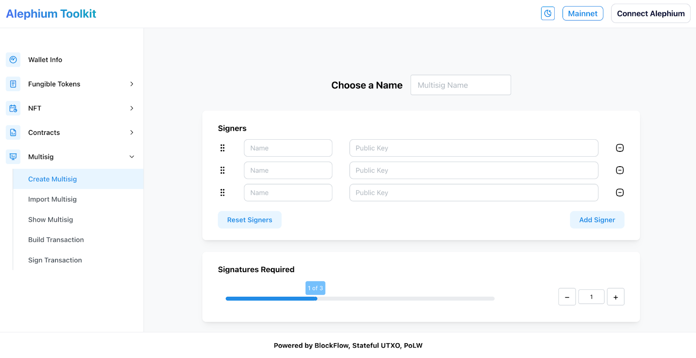

### **Design Contest: A Logo for the toolkit website!**

Propose a design for the Alephium Toolkit website and win 1500 \$ALPH!

The core team released the Multisig Wallet Creation tool last week, the first in the <a href="https://alephium.github.io/alephium-toolkit/" class="markup--anchor markup--p-anchor" data-href="https://alephium.github.io/alephium-toolkit/" rel="noopener" target="_blank">Alephium Toolkit</a>! <a href="https://medium.com/@alephium/alephium-multisig-gui-is-here-4b23bec7e2f" class="markup--anchor markup--p-anchor" data-href="https://medium.com/@alephium/alephium-multisig-gui-is-here-4b23bec7e2f" target="_blank">Here</a>, you’ll find a detailed tutorial on how to use it. The toolkit is a simple web app with handy tools for wallets, tokens, and NFTs. It’s still in the early stage of development, but the long-term goals are to provide:

- Convenient tools for developers to inspect their dApps;
- Advanced tools for advanced use cases, e.g. multisig; and
- A reference implementation for the common tasks working with token, NFT, and wallet.

Whip your creativity, use your design skills & leverage that bear-market energy to produce the best toolkit logo!

### **Here’s the brief:**

_What?_ A logo for the Alephium Toolkit <a href="https://alephium.github.io/alephium-toolkit/" class="markup--anchor markup--p-anchor" data-href="https://alephium.github.io/alephium-toolkit/" rel="noopener" target="_blank">website</a>.

- The logo needs to be in a vector format. Preferably delivered in an <a href="https://en.wikipedia.org/wiki/SVG" class="markup--anchor markup--li-anchor" data-href="https://en.wikipedia.org/wiki/SVG" rel="noopener" target="_blank">SVG</a> file.
- The logo style should match or complement the Alephium Style.
- You can use the <a href="https://befonts.com/switzer-font-family.html" class="markup--anchor markup--li-anchor" data-href="https://befonts.com/switzer-font-family.html" rel="noopener" target="_blank">Switzer</a> font, or another one of your choice!

_When?_ The contest starts on September 7th and ends on September 21st at 15:00 pm CEST. The winner will be announced in the following week on Alephium’s social media channels.

_What prizes?_ The winner gets 1000 \$ALPH — 2 runner-ups get 250 \$ALPH each.

_Where?_ All participants must access the following form to submit their work: <a href="https://forms.gle/WsnEE7tHrFdPfruj6" class="markup--anchor markup--p-anchor" data-href="https://forms.gle/WsnEE7tHrFdPfruj6" rel="noopener" target="_blank">https://forms.gle/WsnEE7tHrFdPfruj6</a> & share their logo as a Quote Tweet of the <a href="https://twitter.com/alephium/status/1699769612249030844" class="markup--anchor markup--p-anchor" data-href="https://twitter.com/alephium/status/1699769612249030844" rel="noopener" target="_blank">Twitter post announcing the contest</a>.

_Who can participate?_ Everyone who can follow all the <a href="https://github.com/alephium/community/blob/master/RewardProgramRules.md" class="markup--anchor markup--p-anchor" data-href="https://github.com/alephium/community/blob/master/RewardProgramRules.md" rel="noopener" target="_blank">Grant &amp; Reward Program Rules rules.</a>

_How does the selection happen?_ The Alephium Jury will review the logos, considering creativity, quality, and adequation to the use case.

_Rights & sharing?_ By submitting their work, participants agree it is bound to a Creative Commons license CC-BY or CC-0.
