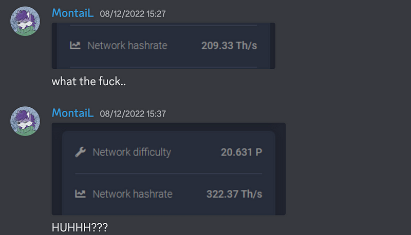
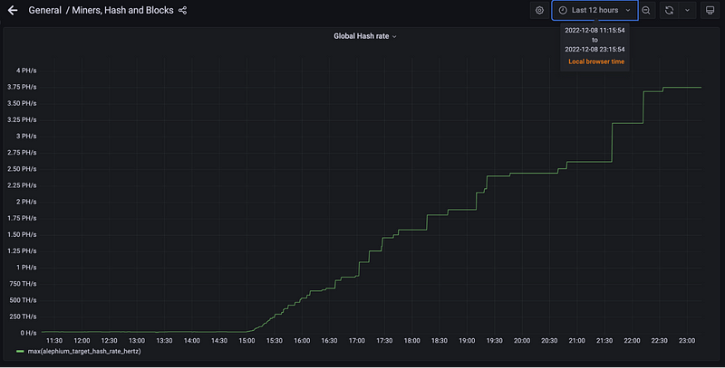
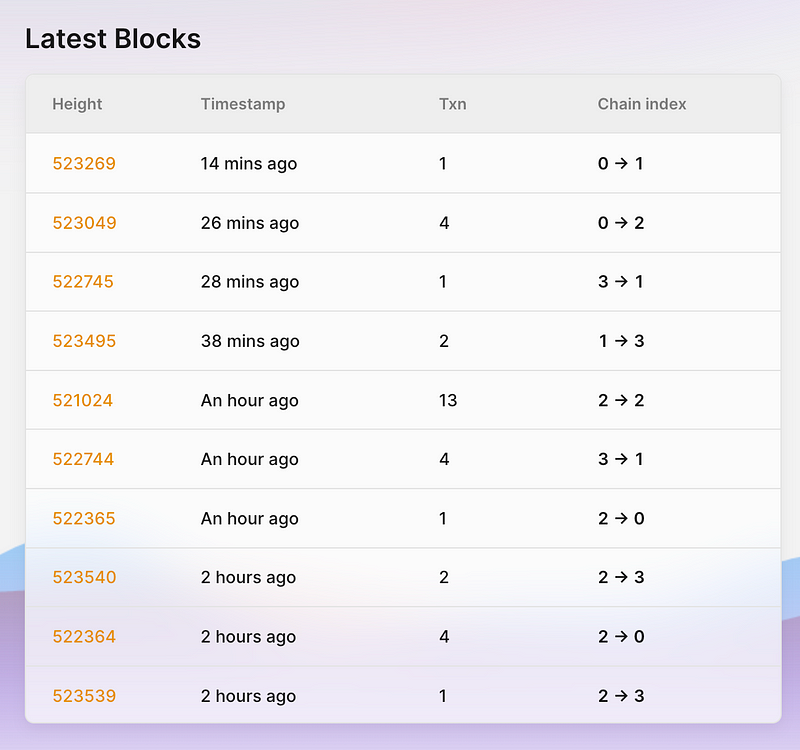
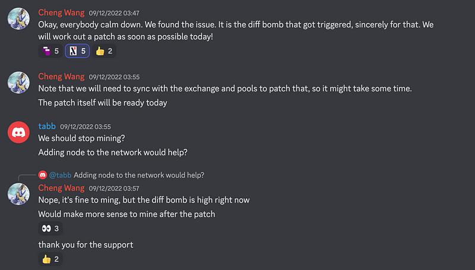
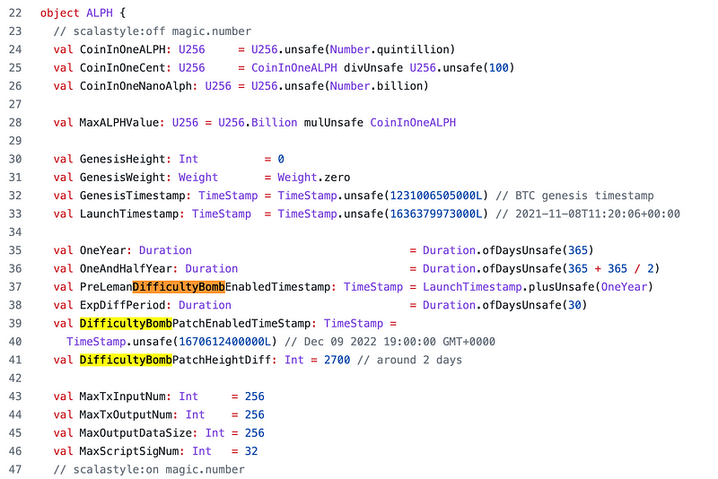
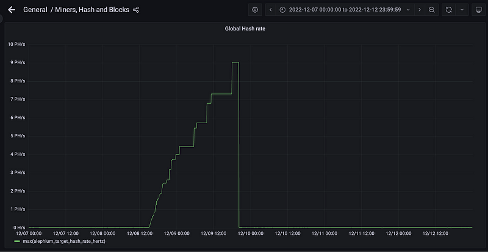

### DiffBomb Day Postmortem

**TL;DR**

In the afternoon (CET) of December 8th, the Alephium community reported that the hashrate displayed to network participants had started increasing significantly.

This increase in hashrate was caused by a very steep increase in difficulty, which had the effect of seriously slowing down block production.

The root cause was soon identified, a patch was issued and deployed by full-node runners, including mining pools and others across the community, and the whole chain was back to a stable functioning in less than 36h.

**What happened?**

First symptoms — At 3:27PM on December 8th, <a href="https://twitter.com/therealmontail" class="markup--anchor markup--p-anchor" data-href="https://twitter.com/therealmontail" rel="noopener" target="_blank">MontaiL</a> was the first to signal on <a href="http://alephium.org/discord" class="markup--anchor markup--p-anchor" data-href="http://alephium.org/discord" rel="noopener" target="_blank">Alephium’s discord</a> that there seemed to be an anomaly with the network hashrate. Over the next few hours, the community could observe a very significant linear **increase in hashrate**, whether it was through mining pools <a href="https://poolbay.io/crypto/5798/alephium" class="markup--anchor markup--p-anchor" data-href="https://poolbay.io/crypto/5798/alephium" rel="noopener" target="_blank">dashboards</a> or other services.

*Cascading effects — *The hashrate that is observable from the full node is an estimation computed from block difficulties during a period of time. During the DiffBomb day, what people could see was in fact a trompe-l’oeil caused by the increase in difficulty.

By the end of the day, it resulted in a significant delay between blocks as you can see in the following screenshot of the <a href="https://explorer.alephium.org/" class="markup--anchor markup--p-anchor" data-href="https://explorer.alephium.org/" rel="noopener" target="_blank">explorer</a> taken at 00:20 CET.

*Identifying the cause — *By that time, the team was entertaining several hypotheses that could potentially explain the observed effects (ASICs testing, a DOS attack, others…).

During the investigations, the team made sure to keep the community informed of its progress (<a href="https://discord.com/channels/747741246667227157/877932296005619754/1050441346445475940" class="markup--anchor markup--p-anchor" data-href="https://discord.com/channels/747741246667227157/877932296005619754/1050441346445475940" rel="noopener" target="_blank">1</a>, <a href="https://discord.com/channels/747741246667227157/877932296005619754/1050477852107214859" class="markup--anchor markup--p-anchor" data-href="https://discord.com/channels/747741246667227157/877932296005619754/1050477852107214859" rel="noopener" target="_blank">2</a>, <a href="https://twitter.com/alephium/status/1600963960781406209?s=20&amp;t=7s71FLpAhPRy3zvgOrycKw" class="markup--anchor markup--p-anchor" data-href="https://twitter.com/alephium/status/1600963960781406209?s=20&amp;t=7s71FLpAhPRy3zvgOrycKw" rel="noopener" target="_blank">3</a>).

A bit before 4am CET, <a href="https://discord.com/channels/747741246667227157/877932296005619754/1050605637433823394" class="markup--anchor markup--p-anchor" data-href="https://discord.com/channels/747741246667227157/877932296005619754/1050605637433823394" rel="noopener" target="_blank">Cheng Wang shared in the Discord</a> that the issue had been identified as well as a remediation plan drafted.

The <a href="https://github.com/alephium/dev-alephium/blob/6ab14d5161b95dacec6b14c47b4f2a8591264920/flow/src/test/scala/org/alephium/flow/core/ChainDifficultyAdjustmentSpec.scala" class="markup--anchor markup--p-anchor" data-href="https://github.com/alephium/dev-alephium/blob/6ab14d5161b95dacec6b14c47b4f2a8591264920/flow/src/test/scala/org/alephium/flow/core/ChainDifficultyAdjustmentSpec.scala" rel="noopener" target="_blank">difficulty bomb</a> was triggered on December 8th, 2022, exactly 1 year and 1 month after mainnet launch (which happened at 3:54PM CET on November 8th, 2021).

The Difficulty Bomb is a mechanism <a href="https://www.nicehash.com/blog/post/the-ethereum-difficulty-bomb-and-its-effects-on-mining-rewards" class="markup--anchor markup--p-anchor" data-href="https://www.nicehash.com/blog/post/the-ethereum-difficulty-bomb-and-its-effects-on-mining-rewards" rel="noopener" target="_blank">designed</a> to ensure coordination on a protocol upgrade at least once every 13 months in the case of Alephium. It was configured to be automatically pushed every time an upgrade happens. The <a href="https://medium.com/@alephium/announcing-the-leman-network-upgrade-c01a81e65f0e" class="markup--anchor markup--p-anchor" data-href="https://medium.com/@alephium/announcing-the-leman-network-upgrade-c01a81e65f0e" target="_blank">Leman Upgrade</a>, coming in early 2023, got more ambitious than anticipated and therefore was not completed in the adjustment window.

The DiffBomb was implemented in the early days of the Alephium network. It was not documented or communicated appropriately. Due to a recent hardware upgrade (and Murphy’s law), some of us didn’t have the usual full node running at home, hindering key team members ability to run comprehensive analytics. Regrettably, in the middle of this stressful situation, it all resulted in a delay identifying the DiffBomb as the root cause for the observed behavior.

**The remediation**

As soon as the issue was identified, the Alephium dev team started to work on a <a href="https://github.com/alephium/dev-alephium/pull/784" class="markup--anchor markup--p-anchor" data-href="https://github.com/alephium/dev-alephium/pull/784" rel="noopener" target="_blank">patch</a> to upgrade the full node code with two objectives:

- Shifting back to the difficulty that was prevalent before the DiffBomb triggering,
- Removing the DiffBomb.

At 10:27AM CET, a <a href="https://twitter.com/alephium/status/1601146526583037953" class="markup--anchor markup--p-anchor" data-href="https://twitter.com/alephium/status/1601146526583037953" rel="noopener" target="_blank">publication</a> informed the community of what was coming, and at 2:40PM CET a <a href="https://twitter.com/alephium/status/1601210162676568065" class="markup--anchor markup--p-anchor" data-href="https://twitter.com/alephium/status/1601210162676568065" rel="noopener" target="_blank">detailed next steps roadmap</a> was released.

After intensive testing & code review, the <a href="https://github.com/alephium/dev-alephium/pull/784" class="markup--anchor markup--p-anchor" data-href="https://github.com/alephium/dev-alephium/pull/784" rel="noopener" target="_blank">patch</a> (including an activation timestamp setup for 8PM CET) was released and <a href="https://twitter.com/alephium/status/1601250719180259333?s=20&amp;t=XS5jD7GJWtkrx6VS0BoswQ" class="markup--anchor markup--p-anchor" data-href="https://twitter.com/alephium/status/1601250719180259333?s=20&amp;t=XS5jD7GJWtkrx6VS0BoswQ" rel="noopener" target="_blank">announced</a> a bit after 5PM CET.

At 7PM, most mining pools and services had updated their full nodes, and the Alephium team released <a href="https://docs.google.com/spreadsheets/d/1xI2hwg0T1C5nv6xTI91El6W5xDozp3fV0XQWwdWx9RM/edit#gid=0" class="markup--anchor markup--p-anchor" data-href="https://docs.google.com/spreadsheets/d/1xI2hwg0T1C5nv6xTI91El6W5xDozp3fV0XQWwdWx9RM/edit#gid=0" rel="noopener" target="_blank">an excel sheet</a> to help the community stay informed of the state of the upgrade.

At 8PM CET, <a href="https://twitter.com/alephium/status/1601302539822977024" class="markup--anchor markup--p-anchor" data-href="https://twitter.com/alephium/status/1601302539822977024" rel="noopener" target="_blank">activation had gone smoothly</a>, the network had upgraded successfully, difficulty was back to normal, hashrate had normalized, and block production was going as expected.

**Lessons learned**

After a year of a fairly smooth ride, Alephium met its first big test with the DiffBomb Day experience. A few lessons were learned in the process:

_Run more full nodes:_ Ensure that more people in the dev team have a full node running at all times, this will decrease reaction time and improve immediate data analysis.

_Expose the difficulty metric in the full node:_ To bring more transparency and ease future analysis, we want to make it easier to <a href="https://github.com/alephium/alephium/issues/806" class="markup--anchor markup--p-anchor" data-href="https://github.com/alephium/alephium/issues/806" rel="noopener" target="_blank">see the difficulty</a> at any point in time, directly from the full node.

_Document more:_ It was always the plan to document the technology and code more, and the team has started a <a href="https://medium.com/@alephium/tech-talk-1-the-ultimate-guide-to-proof-of-less-work-the-universe-and-everything-ba70644ab301" class="markup--anchor markup--p-anchor" data-href="https://medium.com/@alephium/tech-talk-1-the-ultimate-guide-to-proof-of-less-work-the-universe-and-everything-ba70644ab301" target="_blank">significant</a> <a href="https://docs.alephium.org/dapps/getting-started" class="markup--anchor markup--p-anchor" data-href="https://docs.alephium.org/dapps/getting-started" rel="noopener" target="_blank">effort</a> in that regard. Alephium team will up the ante here, and provide more documentation.

_Communicate more:_ The constant communication has been useful to minimize disruption to all parties involved. The community support, questioning, presence and stimulating challenges have been humbling and amazingly helpful.

**In conclusion**

The DiffBomb day has been Alephium’s most serious test so far. With the combined efforts of the entire team and the decisive support of the community, we were able to quickly and smoothly resolve the issue.

The community has been a tremendous help and stimulation the whole time. Once the patch was ready, it’s been deployed quickly by full nodes runners, private individuals, miners, pools or services providers.

Alephium can’t be more grateful to have such a challenging, informed, <a href="https://discord.com/channels/747741246667227157/747998352842686545/1050543317206704178" class="markup--anchor markup--p-anchor" data-href="https://discord.com/channels/747741246667227157/747998352842686545/1050543317206704178" rel="noopener" target="_blank">fun</a> and passionate community.

This pushes us to do better, build better, always.
