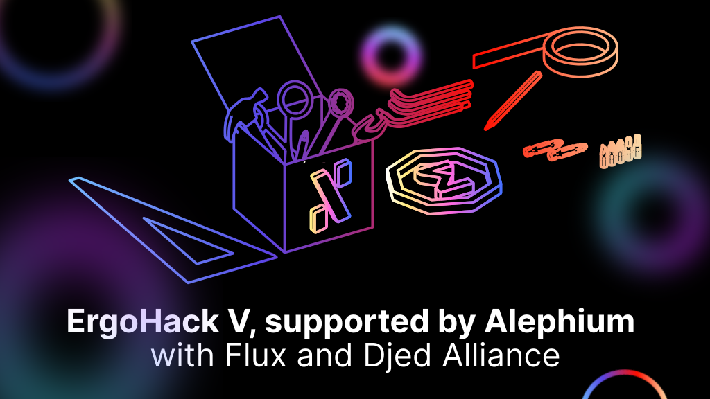

### ErgoHack V — Alephium sponsors Ergo’s Hackathon with Flux & Djed Alliance to foster innovation in the UTXO space

<figure id="b750" class="graf graf--figure graf-after--h3">

<figcaption>Alephium is a proud partner &amp; sponsor of ErgoHack V, along with Flux and Djed Alliance. ErgoHack V, Ergo Foundation’s fifth hackathon runs on Oct 3rd — 20th.</figcaption>
</figure>

#### ErgoHack V — Alephium is a proud partner & sponsor of ErgoHack V, along with Flux and Djed Alliance. ErgoHack V, Ergo Foundation’s fifth hackathon runs on Oct 3rd — 20th.

Alephium is thrilled to support ErgoHack V. With shared ethos and technologies, Ergo and Alephium are committed to pushing forward UTXO and interoperability research and actively support open-source development.

For ErgoHack V, Alephium encourages like-minded communities to collaborate and contribute to building a (better) multi-chain future.

**Alephium Prizes — **To be considered for the Alephium prizes, participants are encouraged to **build multi-chain applications or services** (ie. multi-chain wallet, data service, dual-miners, etc) that include Alephium as part of the build.

The Alephium prize pool will consist of:

1st Prize: 10k ALPH  
2nd Prize: 7k ALPH  
3rd Prize: 3k ALPH

In addition to Alephium’s prizes, participants can earn prizes in sigUSD, DACAU & FLUX! Find out the details on <a href="https://ergoplatform.org/en/blog/ErgoHack-5-Prizes/" class="markup--anchor markup--p-anchor" data-href="https://ergoplatform.org/en/blog/ErgoHack-5-Prizes/" rel="noopener" target="_blank">ErgoHack V Prizes page!</a>

**Evaluation Criterias — **The submissions will be assessed by taking into consideration the following:

- Completed implementation
- Innovation
- Code quality
- Quality of user interface

**Register Now! — **Applications are currently being accepted until October 2nd. Apply <a href="https://q9fwzopidh8.typeform.com/to/hEeZFF4c?typeform-source=3qml8hniame.typeform.com" class="markup--anchor markup--p-anchor" data-href="https://q9fwzopidh8.typeform.com/to/hEeZFF4c?typeform-source=3qml8hniame.typeform.com" rel="noopener" target="_blank">here</a>.

Additional information: <a href="https://ergohack.io/" class="markup--anchor markup--p-anchor" data-href="https://ergohack.io/" rel="noopener" target="_blank">Hackathon website</a>.

Discover our code on <a href="https://github.com/alephium" class="markup--anchor markup--p-anchor" data-href="https://github.com/alephium" rel="noopener" target="_blank">GitHub</a> (<a href="https://github.com/alephium/alephium-web3" class="markup--anchor markup--p-anchor" data-href="https://github.com/alephium/alephium-web3" rel="noopener" target="_blank">SDK</a>, <a href="https://github.com/alephium/alephium" class="markup--anchor markup--p-anchor" data-href="https://github.com/alephium/alephium" rel="noopener" target="_blank">Full Node</a>, <a href="https://github.com/alephium/explorer" class="markup--anchor markup--p-anchor" data-href="https://github.com/alephium/explorer" rel="noopener" target="_blank">Explorer</a>), talk tech on <a href="https://discord.gg/h7cXXy4FEY" class="markup--anchor markup--p-anchor" data-href="https://discord.gg/h7cXXy4FEY" rel="noopener" target="_blank">Discord</a>, meet the community on <a href="https://t.me/Alephium_Announcement" class="markup--anchor markup--p-anchor" data-href="https://t.me/Alephium_Announcement" rel="noopener" target="_blank">Telegram</a> or interact with us on : <a href="https://twitter.com/alephium" class="markup--anchor markup--p-anchor" data-href="https://twitter.com/alephium" rel="noopener" target="_blank">Twitter</a> & <a href="https://www.reddit.com/r/Alephium/" class="markup--anchor markup--p-anchor" data-href="https://www.reddit.com/r/Alephium/" rel="noopener" target="_blank">Reddit</a> .
