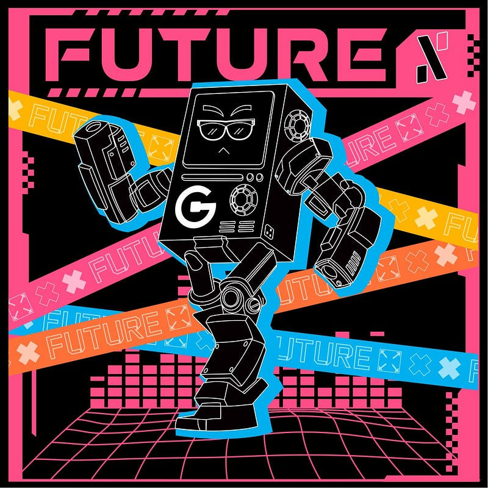
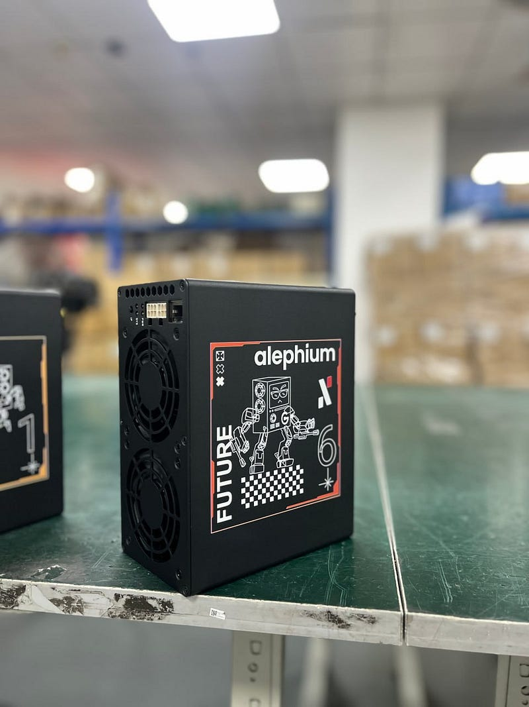
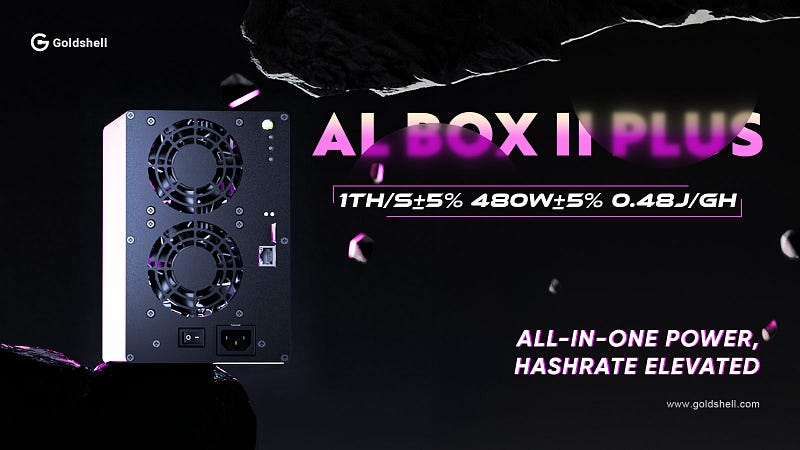
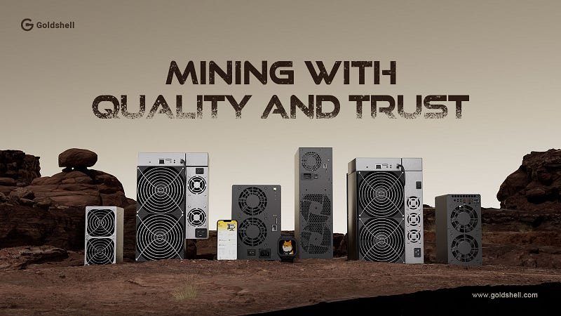

### Hashrate Series \#2: Goldshell

_The blockchain hashrate is directly correlated with network security. As a Proof-of-work blockchain, Alephium relies on active ecosystem actors to sustain and improve Alephium’s reliability. This series is about them, and after Nicehash, please welcome Goldshell._

**Can you tell us a bit about Goldshell? You guys started in 2017! How has been your journey so far?**

Goldshell started in 2017 with a team that’s been deep in the world of integrated circuits and crypto for over a decade. Our mission is pretty clear: to lead altcoins mining scene with reliable, high-quality miners. Over the years, we’ve built an efficient system that covers everything from algorithm research to production. As of May 2024, we’ve delivered over 100,000 miners to more than 150 countries, bringing the excitement of mining right into people’s homes all over the world.

**You guys were the first ASICs suppliers to the Alephium mining community, from April 2024! Before diving in the how & why, can you tell us how your experience of the Alephium core-contributors & the community was?**

Working with the Alephium community has been a bit like a treasure hunt — full of discoveries. We’ve connected through AMA sessions, kept up with their tech updates, and even tried some fun stuff like launching miner-related NFTs on <a href="https://deadrare.io/" class="markup--anchor markup--p-anchor" data-href="https://deadrare.io/" rel="noopener" target="_blank">Deadrare</a>. This was our first time merging physical products with the digital world, and it was a blast. It added a whole new level of engagement for users, turning mining into more than just a technical process.

**You’ve already announced a second generation of ASICs miners (Goldshell AL BOX II PLUS). Can you tell us more about this product?**

We recently rolled out the <a href="https://www.goldshell.com/product/goldshell-al-box-%E2%85%B1-plus/" class="markup--anchor markup--p-anchor" data-href="https://www.goldshell.com/product/goldshell-al-box-%E2%85%B1-plus/" rel="noopener" target="_blank">AL BOX II PLUS</a>, which packs more punch and makes things a lot easier by integrating the power supply right into the machine. Before, we had to remind people, “Hey, don’t forget to buy that power supply!” Now, it’s just plug-and-play, like setting up a toaster. We also introduced the ECHO series, which we like to call our “silent powerhouse.” It’s perfect for those who need solid performance but also want something super quiet — ideal for people with data centers or low energy costs.

**How did you first discover Alephium, and what caught your attention? What factors do you consider when evaluating a PoW chain for investment?**

Alephium stood out to us because it’s got some really cool features. It uses the Blake3 algorithm, which is great for ASIC miners, and it’s got this neat BlockFlow sharding that scales transactions per second way beyond Bitcoin. Plus, after PoLW activation it’ll be super energy efficient, using only a fraction of the power that Bitcoin does. For us, when looking at PoW chains, we focus on security, long-term potential, and how active the community is. Alephium ticked all those boxes.

**What unique challenges did you face when dealing with our Blake3 hashing algorithm?**

Developing an ASIC for Alephium came with its own set of hurdles, especially in terms of timing. During our first tests, we hit a snag with low chip yield, which was a huge deal for us. The pressure was on because Alephium was gaining momentum, and we needed to hit the market fast. Our team worked around the clock, tweaking and optimizing until we boosted the chip yield enough to get the product out on time. It was one of those high-stakes moments that really pushed us.

**Alephium is one of the only Proof of Work chain with a completely functional smart contract/dapps ecosystem. That allows for different economic incentives & dynamics than what we’re used to in other POW ecosystems, as miners can directly reinvest their rewards in an ecosystem built on top of the chain. How do you see that altering the mining market?**

This setup really changes the game. It creates a deeper connection between miners and the ecosystem — they’re not just participants; they’re builders. This approach brings more diversity and stability to the mining market, and it gives miners a way to manage risks and grow their returns over time. For Alephium, it’s a big deal because it turns mining into an ongoing cycle of value creation rather than just a means to an end.

**At some point, Proof of less work is going to kick in and it will have an influence on the hashrate market of Alephium. What’s your expectation for it?**

PoLW brings some great benefits, like reducing energy consumption and boosting efficiency. Based on the current growth, we expect the total network hashrate to reach 100P by 2025, with the potential to hit 1E within the next few years. While there’s no immediate need to worry, rising hashrates will make mining tougher and more costly. But at the same time, Alephium’s network will mature and provide a better experience for everyone involved.

**What was the process like in deciding to develop an ASIC for Alephium? Is Alephium the first chain for which you’ve created a miner, or have there been others?**

Alephium isn’t our first rodeo. We’ve developed ASIC miners for other PoW chains like Kadena, Litecoin, SC, and Kaspa. When we looked at Alephium, we saw potential in its Blake3 algorithm and the buzz around it. We leaned on our past experience to navigate the challenges, fine-tuning things like chip performance and internal design to make sure the miner would run efficiently.

**It seems you have a line of products specifically designed for home miners. Most ASICs are usually conceived for bigger, more professional operations. Can you tell us more about why you are targeting the home miner market?**

We’re all about making mining more accessible. Traditional ASIC miners are often big, complicated, and costly — pretty intimidating for the average person. We wanted to break down those barriers, so we focused on balancing performance with ease of use. Since our acquisition by <a href="https://intchains.com/" class="markup--anchor markup--p-anchor" data-href="https://intchains.com/" rel="noopener" target="_blank">Intchains</a>, we’ve had the resources to create products that really fit the needs of home users, making mining something that’s easy, fun, and open to everyone.

**What new developments and directions will Goldshell explore in the future?**

Looking ahead, we’re diving deeper into blockchain infrastructure and exploring new blockchain applications. Our goal is to build a full stack of capabilities, from the ground up to the user-facing products. We want to keep innovating and pushing boundaries, making blockchain tech more accessible and valuable to a wider audience.

**Anything else you’d like to share with the community?**

We’re always looking for new ways to collaborate, whether it’s with dApps, developer communities, or NFT projects. We’d love to see creative uses of our miners, like designing unique versions that can bring even more exposure. We’re excited to work with more partners and keep building a brighter future for crypto together!

_Twitter & other socials links:_ <a href="https://x.com/goldshellminer" class="markup--anchor markup--p-anchor" data-href="https://x.com/goldshellminer" rel="noopener" target="_blank"><em>https://x.com/goldshellminer</em></a>_,_ <a href="https://t.co/tg2fxjuAR9" class="markup--anchor markup--p-anchor" data-href="https://t.co/tg2fxjuAR9" rel="noopener" target="_blank"><em>discord.gg/goldshellminer</em></a>_  
Here’s the_ <a href="https://x.com/i/spaces/1BRJjPeAbYNKw" class="markup--anchor markup--p-anchor" data-href="https://x.com/i/spaces/1BRJjPeAbYNKw" rel="noopener" target="_blank"><em>X Space with Maud &amp; Goldshell</em></a> _at the occasion of the AL1 launch!_

_Website: goldshell.com_

---

That is the end of this interview! If you are interested or have extra questions, you are welcome to reach out on our <a href="http://alephium.org/discord" class="markup--anchor markup--p-anchor" data-href="http://alephium.org/discord" rel="noopener ugc nofollow noopener" target="_blank">Discord</a>, or in the <a href="https://t.me/alephiumgroup" class="markup--anchor markup--p-anchor" data-href="https://t.me/alephiumgroup" rel="noopener ugc nofollow noopener" target="_blank">Alephium Telegram channel</a>. Don’t forget to follow <a href="https://twitter.com/alephium" class="markup--anchor markup--p-anchor" data-href="https://twitter.com/alephium" rel="noopener ugc nofollow noopener" target="_blank">@alephium on Twitter</a> to stay up-to-date.
