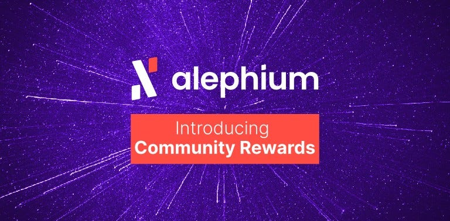

### Introducing Community Rewards

#### It’s been a month since the Alephium mainnet launch and many positive things have been accomplished thanks to the amazing community that has gathered around the project. People from all over the world, exchanging tips, tricks and ideas, building and improving upon Alephium.

**\[UPDATED July 12th 2022 —_ The Grants & Rewards program has been updated and can be found_** <a href="https://github.com/alephium/community/blob/master/Grant%26RewardProgram.md" class="markup--anchor markup--p-anchor" data-href="https://github.com/alephium/community/blob/master/Grant%26RewardProgram.md" rel="noopener" target="_blank"><strong><em>here</em></strong></a>**_\]_**

By design Alephium is public, open and decentralized. However, true decentralization can only be achieved if the community is involved at every level of the project, from mining to development but also content creation as well as project awareness initiatives. This is why it is paramount to encourage community contributions and involvement to foster the healthy growth of Alephium’s ecosystem.

We’d like to introduce you to the first iteration of the **Alephium Community reward program**. It is composed of 3 pillars: Development Bounties, Engagement Rewards & Special “Events” rewards.

Rewards are meant to be distributed at the end of each month from the <a href="https://medium.com/@alephium/tokenomics-of-alephium-61d59b51029c" class="markup--anchor markup--p-anchor" data-href="https://medium.com/@alephium/tokenomics-of-alephium-61d59b51029c" target="_blank">Ecosystem Development allocation</a>. Although the exact moment of each distribution may vary according to workload. The project is young and a lot has to be learned by doing, one thing that is certain is that such a program needs a certain degree of dynamic and will evolve through time. The first distribution will happen this month.

Some of our community’s contributions can be found in the <a href="https://github.com/alephium/awesome-alephium" class="markup--anchor markup--p-anchor" data-href="https://github.com/alephium/awesome-alephium" rel="noopener" target="_blank">Awesome Alephium repository</a>, you are welcome to add yours!

### Development Rewards & Bounties

At this stage of the project, development is the cornerstone of Alephium’s success, therefore development rewards & bounties are not capped.   
Rewards are assigned to Github Issues and Pull Requests proposed by community members in any of the <a href="https://github.com/orgs/alephium/repositories" class="markup--anchor markup--p-anchor" data-href="https://github.com/orgs/alephium/repositories" rel="noopener" target="_blank">project repositories</a>. In addition, we’ll add “bounty” topics or tasks where community support is welcomed in the <a href="https://github.com/alephium/community" class="markup--anchor markup--p-anchor" data-href="https://github.com/alephium/community" rel="noopener" target="_blank">Community repository</a>.

Generally, Pull requests are rewarded once merged, but issues can be rewarded at creation. Each reward is assessed individually and may differ from the general rule.

### Engagement Rewards

Community engagement is very important and can consist of many things, big or small. Documentation is one example, sustained quality technical support in the discord is another. The total monthly reward amount that is distributed is capped and recompenses the community members with the most helpful contributions.

### Special “Events” Rewards

These rewards are linked to specific “events” as well as unforeseen interactions leading to some kind of remarkable progress or positive impact on the project. These rewards will also be distributed at the end of the month in which the event took place. A past example of this could be providing great assistance or feedback during one of our on-line _testnet_ install events. Another example could be running a miner on the _testnet_ for a sustained period of time.

### Community Reward Program Rules

Of course this program needs to be governed by a set of rules. For your convenience we publish them here but you will also be able to find them in this <a href="https://github.com/alephium/community" class="markup--anchor markup--p-anchor" data-href="https://github.com/alephium/community" rel="noopener" target="_blank">GitHub repository</a>. These rules may be subject to change in the near or distant future and read as the following:

This is an experimental and discretionary rewards program for our active Alephium community to encourage and reward those who are contributing and helping to improve the Alephium platform, ecosystem and community. It is not a competition.

Alephium considers a number of variables in determining rewards. Determinations of eligibility, score and all terms related to a reward are at the sole and final discretion of Alephium.

- Participants are responsible for all taxes.
- All rewards are subject to applicable law.
- Participants’ contributions must not violate any law or compromise any data that is not theirs.
- Participants take part in this program at their own risk and expense.
- Participants will be asked to sign a simple contract with their name and physical address before receiving the reward. Failure to do so will result in forfeiture of the reward.
- Participants are responsible for notifying Alephium of any changes to their contact information. Failure to do so may lead to the forfeiture of any rewards participants may become eligible for and receive.

Alephium reserves the right to discontinue the Program at any time without notice.

### Eligibility Criteria

Are not eligible for rewards:

- Individuals who have not reached legal majority age in their country of residence.
- Individuals on sanctions lists or who are in countries listed on <a href="https://www.seco.admin.ch/seco/fr/home/Aussenwirtschaftspolitik_Wirtschaftliche_Zusammenarbeit/Wirtschaftsbeziehungen/exportkontrollen-und-sanktionen/sanktionen-embargos/sanktionsmassnahmen.html" class="markup--anchor markup--li-anchor" data-href="https://www.seco.admin.ch/seco/fr/home/Aussenwirtschaftspolitik_Wirtschaftliche_Zusammenarbeit/Wirtschaftsbeziehungen/exportkontrollen-und-sanktionen/sanktionen-embargos/sanktionsmassnahmen.html" rel="noopener" target="_blank">SECO’s sanctions list</a> or where crypto-assets have been banned.
- Alephium employees, consultants and their families.
