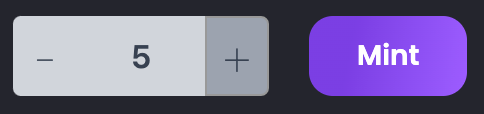
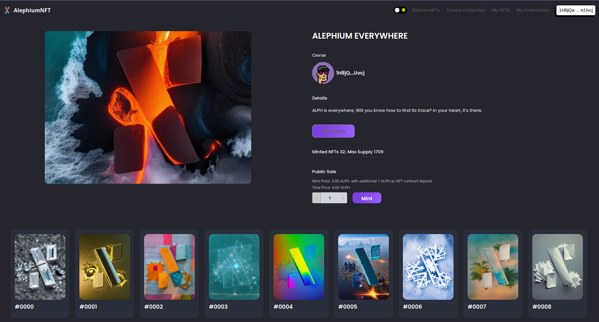
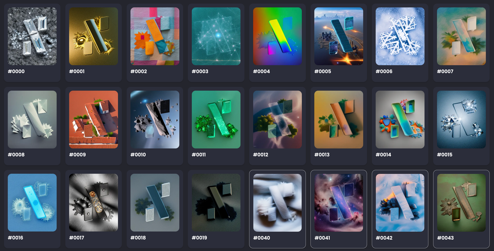

### NFT Marketplace v3

#### We launched the NFT marketplace as a prototype to show what can be done with NFTs on Alephium. We received a lot of feedback from the community. With the v3 we are improving the whole experience and adding a new, exciting feature: the Flow!

Access it here: <a href="https://testnet.nft.alephium.org/" class="markup--anchor markup--p-anchor" data-href="https://testnet.nft.alephium.org/" rel="noopener" target="_blank">https://testnet.nft.alephium.org/</a>

### New Feature: The Flow

We are introducing public sale collections (similar to Drops)! It’s a neat way for creators to allow batch minting and a different way to create a collection.

Until now, you could create collections and individual NFTs, but there was no way to create a drop like on Opensea or Superrare. Now you can!

We call them “Flows”, creators can now create a dedicated page where users mint any number of NFTs from their collection.

It includes the ability to do batch minting: you can set the price and define how many NFTs can be minted at once. All public sales revenue will go to the Flow contract and only the owner can collect the fee, using the “withdraw” button.

**How do you create a public sale collection (Flow)?** For a full breakdown of how to create a flow collection, go <a href="https://docs.alephium.org/tokens/non-fungible-tokens/#create-flows" class="markup--anchor markup--p-anchor" data-href="https://docs.alephium.org/tokens/non-fungible-tokens/#create-flows" rel="noopener" target="_blank">here</a>! You’ll even see how to generate images with AI on the fly!

### The ALEPHIUM EVERYWHERE collection

We’ve created a special collection for you to be able to test Batch Minting for yourself.

Go and test <a href="https://v3.testnet.nft.alephium.org/collection-details?collectionId=c22369b5ab21a3b24db12a883b53a9213f22e713ff486a3b22d2d4cb943a9700" class="markup--anchor markup--p-anchor" data-href="https://v3.testnet.nft.alephium.org/collection-details?collectionId=c22369b5ab21a3b24db12a883b53a9213f22e713ff486a3b22d2d4cb943a9700" rel="noopener" target="_blank">minting one (or more)</a> of our ALPH EVERYWHERE testnet NFTs.

<figure id="b95e" class="graf graf--figure graf--iframe graf-after--p">

<h1 id="ein-fehler-ist-aufgetreten." class="message">Ein Fehler ist aufgetreten.</h1>
<a href="https://www.youtube.com/watch?v=V3RePAazEMY" target="_blank">Sieh dir dieses Video auf www.youtube.com an</a> oder aktiviere JavaScript, falls es in deinem Browser deaktiviert sein sollte.
</figure>

They even have hidden traits ̶a̶n̶d̶ ̶s̶o̶m̶e̶ ̶g̶o̶l̶d̶e̶n̶ ̶t̶i̶c̶k̶e̶t̶s̶…

Who knows, we might airdrop some real NFTs to early testers on mainnet when it’ll be live? 👀

### Other improvements

**Backend-frontend separation:** This architectural change ensures a more flexible development environment, especially for backend logic. It means faster updates, better performance, and an overall smoother user experience.

**Updated fee structure:** In v3, the commission fee is now deducted from the sale price. The listing fee is removed altogether. This transparent fee structure makes sure that sellers are always aware of the costs involved.

**“My Collection” tab:** A dedicated space for creators to view and manage their NFT collections. This tab makes it easy to keep track of your collections and the items within it.

**Many small UI improvements**: From better navigation to enhanced visuals, v2 brings a series of UI enhancements that make the platform more intuitive and enjoyable to use.

### If you see something, say something!

We’d be delighted to see you test it, use it, and create on it.

If you see anything that’s buggy or wants to tell us which features you think we should implement, please come on our <a href="https://discord.com/invite/GEbcpajCJG" class="markup--anchor markup--p-anchor" data-href="https://discord.com/invite/GEbcpajCJG" rel="noopener" target="_blank">Discord</a> and tell us!

We are always grateful for feedback!

_The New_ <a href="https://testnet.nft.alephium.org/" class="markup--anchor markup--p-anchor" data-href="https://testnet.nft.alephium.org/" rel="noopener" target="_blank"><em>NFT Marketplace</em></a> _is now available for testing on the Alephium testnet! Let us know what you think. Follow the evolution of the code on_ <a href="https://github.com/alephium" class="markup--anchor markup--p-anchor" data-href="https://github.com/alephium" rel="noopener" target="_blank"><em>Github</em></a>_, follow the news on_ <a href="https://twitter.com/alephium" class="markup--anchor markup--p-anchor" data-href="https://twitter.com/alephium" rel="noopener" target="_blank"><em>Twitter</em></a> _&_ <a href="https://medium.com/@alephium" class="markup--anchor markup--p-anchor" data-href="https://medium.com/@alephium" target="_blank"><em>Medium</em></a> _or come interact onboard on_ <a href="https://discord.com/invite/GEbcpajCJG" class="markup--anchor markup--p-anchor" data-href="https://discord.com/invite/GEbcpajCJG" rel="noopener" target="_blank"><em>Discord</em></a> _&_ <a href="https://t.me/alephiumgroup" class="markup--anchor markup--p-anchor" data-href="https://t.me/alephiumgroup" rel="noopener" target="_blank"><em>Telegram</em></a>_!_
