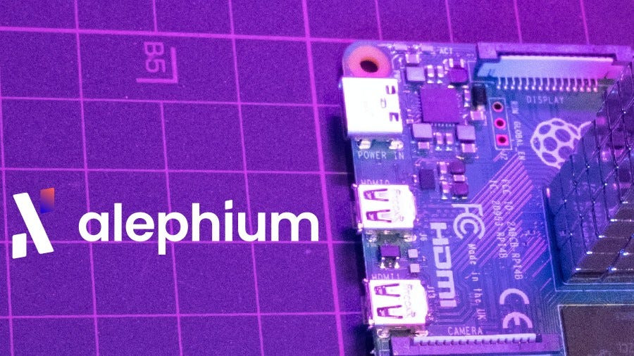

### Running a blockchain node on Raspberry Pi

### The Decentralization bottleneck

Decentralization is one of the biggest promises of crypto-economics. It is the given that draws a perpendicular from the contemporary system of centralized banking. With a little skills and some hardware, anyone can participate in the maintenance of a decentralized blockchain. And we’re invited to! Effectively distributing the power of consensus across many small actors, such as you and me. However, this decentralization may exist in theory, there’s a bottleneck to it: if say, only a few united people were to actually operate a networked blockchain, it would in practice become a centralized system. This means that decentralization relies on a social factor: our willingness to participate in the maintenance of the infrastructure.

When the infrastructure of a blockchain is discussed it is not uncommon that the miners and the process of mining get most of the attention. There are good reasons for that as this part of the process can potentially be lucrative. Also we often hear that the miners secure the network, which is certainly a very important function in a system proposed to uphold the exchange and transport of monetary value. There is no shortage of misunderstandings in the crypto domain and many people believe that the mining is something that is done to create money out of thin air. While it is true that mining produces “coins”, a statement like that is an exaggeration that casts a large shadow over a very important aspect of a healthy blockchain: the nodes.

### Why run a full-node?

A ‘full node’ is a participant on the network that has independently validated the complete copy of the blockchain, and thus has verified all transactions since the beginning. This ensures that the current state of the blockchain is the same for everyone. A very important factor, because if this copy only existed in a few participants’ computers, they could potentially coordinate illegitimate transactions. Hence the best way to ensure that this copy is the same for everyone and that no one is tampering with it, is to distribute it to as many nodes as possible.

Understanding how a blockchain works in theory is a challenge for a layman. Getting the grip on how to operate the software is another one. Some blockchains are user-friendlier than others. And many do not only require some decent terminal magic, they also rely on the possession of a potent machine to run 24/7, consuming a fair share of energy.

### Addressing the Bottleneck issue

The more participants the better distributed. But how to grow the node-base? Unlike mining, running a full node implies practically no losses and certainly no profit. However, what we often oversee is how much there is to _lose_ in not running a node: Access to the data on your terms. Possibility to audit the machine. The security. The privacy… However, an important motivator for many node-operators is the idea of _Economic Self-Sovereignty_. To possess a copy of the entire transaction-history enables Trust-less Independent Verification. The beauty of which resides in the liberation from third parties: we no longer need to trust the goodwill of a legal or a human person because we can all agree on the math.

**It is well known that many would-be node-OPs are kept back by technical difficulties. Lowering the barriers to gaining Economic Self-Sovereignty could certainly grow the node-base. One way to do this is with software that is compliant with cheaper and more energy efficient hardware.**

### Alephium ❤ Raspberry Pi

Raspberry Pi barely needs any introduction. This small single board computer has been around for a while. At the time of writing they have reached their 4th Generation with specs of memory and speed that make them usable as a workstation. They already exist in many homes and because of their affordable price tags are often used to introduce kids to the wonders of coding. They can run many types of Operating Systems most of which are open source, making them a perfect candidate to address the decentralization bottleneck. To be fair Alephium isn’t the only project that can run on a low-power single-board computer. But the way Alephium is dealing with the problem can be summed up pretty neatly:

1.  Proof-of-Work (PoW) is in general more lightweight than Proof-of-Stake (PoS), as the block validation is simpler, the block time is longer and TPS is lower. Because Alephium’s Proof-of-Less-Work (PoLW) is not a memory bound hash algorithm, 100MB RAM is enough to run the full node.
2.  Implementation matters. For example, go-ethereum cannot run on a Raspberry Pi, but there are more efficient implementations of Ethereum that are able to run on Raspis such as erigon.
3.  Virtual-Machine (VM) design is key. The IO footprint of Alephium’s VM is extremely low.
4.  As Alephium is a sharded blockchain, the full-node can be run on multiple single-board computers. This opportunity could give it a higher TPS than a single chain would.

**In general, it is fair to believe that most well-designed PoW single chains could run on a Raspberry Pi, but some of these do not spend the necessary time to support it (optimization, library dependency, etc…)**

### You should do it too

There are many Raspi-enthusiasts in the Alephium community. This is easy to spot as we offer <a href="https://hub.docker.com/r/alephium/alephium/" class="markup--anchor markup--p-anchor" data-href="https://hub.docker.com/r/alephium/alephium/" rel="noopener" target="_blank">docker-images</a> to simplify the installation of a full-node for Single-board computer enthusiasts. Installing an Alephium full-node is as simple as <a href="https://github.com/alephium/alephium/wiki/Full-node-on-raspberry-pi" class="markup--anchor markup--p-anchor" data-href="https://github.com/alephium/alephium/wiki/Full-node-on-raspberry-pi" rel="noopener" target="_blank">downloading a pre-written configuration file</a> to run a docker-compose image. And who knows what the future holds? At the time of writing, Alephium hasn’t yet launched its mainnet and the optimization will not stop when we go live. Perhaps in not too distant times it will be possible to mine on a Raspberry Pi? There have been attempts to create <a href="https://www.kickstarter.com/projects/1962283735/novapi-np01-a-stackable-virtex-5-fpga-hat-for-raspberry-pi?ref=9orwd6&amp;token=9a03bf4e" class="markup--anchor markup--p-anchor" data-href="https://www.kickstarter.com/projects/1962283735/novapi-np01-a-stackable-virtex-5-fpga-hat-for-raspberry-pi?ref=9orwd6&amp;token=9a03bf4e" rel="noopener" target="_blank">stackable FGPA chips for single-board computers</a> in the past…
