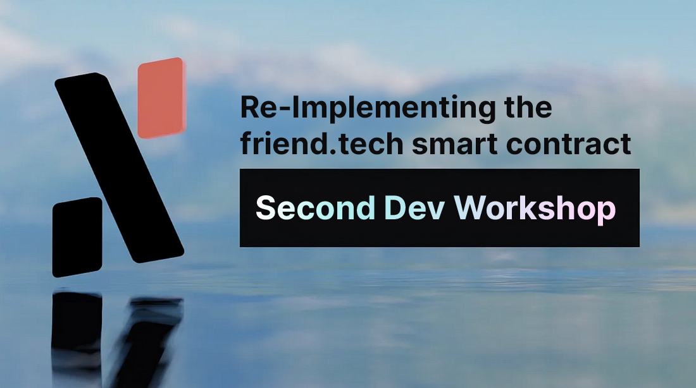

### Second Online Dev Workshop!

#### Re-implementing the friend.tech smart contract to RALPH with <a href="https://github.com/h0ngcha0" class="markup--anchor markup--h4-anchor" data-href="https://github.com/h0ngcha0" rel="noopener ugc nofollow noopener" target="_blank">@h0ngcha0</a>

### When? September 30th (sat) — 3PM CET and October 7th (sat) — 3PM CET Where? <a href="https://meet.google.com/icj-vxpo-hqn" class="markup--anchor markup--h3-anchor" data-href="https://meet.google.com/icj-vxpo-hqn" rel="nofollow noopener" target="_blank">https://meet.google.com/icj-vxpo-hqn</a> Who? <a href="https://github.com/h0ngcha0" class="markup--anchor markup--h3-anchor" data-href="https://github.com/h0ngcha0" rel="noopener ugc nofollow noopener" target="_blank">@h0ngcha0</a>

Following the success of our <a href="https://medium.com/@alephium/first-developer-workshop-build-a-token-faucet-a6bb2aa7bf68" class="markup--anchor markup--p-anchor" data-href="https://medium.com/@alephium/first-developer-workshop-build-a-token-faucet-a6bb2aa7bf68" target="_blank">first dev workshop</a> in July, we are having the next one! We will be re-implementing the <a href="http://friend.tech" class="markup--anchor markup--p-anchor" data-href="http://friend.tech" rel="noopener" target="_blank">friend.tech</a> smart contract in RALPH.

#### What is friend.tech

The core concept of friend.tech is to create a network of friends where users can buy and sell shares (called keys) to access gated content. Once set up, users may have “keys” to their chatroom bought by other users or bots, allowing direct communication with keys holders. Buying a user’s keys enables communication and adds a new asset to the buyer’s portfolio.

For context: <a href="https://beincrypto.com/learn/friend-tech-explained/" class="markup--anchor markup--p-anchor" data-href="https://beincrypto.com/learn/friend-tech-explained/" rel="noopener noreferrer noopener" target="_blank">https://beincrypto.com/learn/friend-tech-explained/</a>

### Workshop Agenda

This time it will require two sessions, one about sub-contracts, and the other one about the <a href="https://medium.com/@alephium/alephiums-aps-eliminating-evm-token-approval-risks-5407e7e70a33" class="markup--anchor markup--p-anchor" data-href="https://medium.com/@alephium/alephiums-aps-eliminating-evm-token-approval-risks-5407e7e70a33" target="_blank">APS (Asset Permission System)</a>.

**For the first session:**

- Overview of the friend.tech smart contract
- Implement friend shares and keep track of friend share balances using sub-contracts

**For the second session:**

- Implement buy & sell friend shares (uses APS)

### Dev environment to setup before the workshop

- Install node and yarn.
- Install docker & docker-compose
- Clone <a href="https://github.com/alephium/alephium-stack" class="markup--anchor markup--li-anchor" data-href="https://github.com/alephium/alephium-stack" rel="noopener ugc nofollow noopener" target="_blank">https://github.com/alephium/alephium-stack</a> repo and able to run _make start-devnet_ to get full node and explorer up and running
- Install extension wallet  
  Chrome: <a href="https://chrome.google.com/webstore/detail/alephium-extension-wallet/gdokollfhmnbfckbobkdbakhilldkhcj" class="markup--anchor markup--li-anchor" data-href="https://chrome.google.com/webstore/detail/alephium-extension-wallet/gdokollfhmnbfckbobkdbakhilldkhcj" rel="noopener ugc nofollow noopener" target="_blank">https://chrome.google.com/webstore/detail/alephium-extension-wallet/gdokollfhmnbfckbobkdbakhilldkhcj</a>  
  Firefox: <a href="https://addons.mozilla.org/en-US/firefox/addon/alephiumextensionwallet/" class="markup--anchor markup--li-anchor" data-href="https://addons.mozilla.org/en-US/firefox/addon/alephiumextensionwallet/" rel="noopener ugc nofollow noopener" target="_blank">https://addons.mozilla.org/en-US/firefox/addon/alephiumextensionwallet/</a> — Create an account for devnet

Set up a reminder <a href="https://discord.gg/2sKnh3mR?event=1155909824341606490" class="markup--anchor markup--p-anchor" data-href="https://discord.gg/2sKnh3mR?event=1155909824341606490" rel="noopener" target="_blank">here</a> and <a href="https://discord.gg/2sKnh3mR?event=1155910155012145223" class="markup--anchor markup--p-anchor" data-href="https://discord.gg/2sKnh3mR?event=1155910155012145223" rel="noopener" target="_blank">here</a> on Discord!

See you on September 30th (sat) — 3PM CET and October 7th (sat) — 3PM CET!

_If you want to know more about the workshop or have additional questions, you can reach out in_ <a href="https://alephium.org/discord/" class="markup--anchor markup--p-anchor" data-href="https://alephium.org/discord/" rel="noopener ugc nofollow noopener" target="_blank"><em>Discord</em></a> _or on the Alephium_ <a href="https://t.me/alephiumgroup" class="markup--anchor markup--p-anchor" data-href="https://t.me/alephiumgroup" rel="noopener ugc nofollow noopener" target="_blank"><em>Telegram</em></a> _channel. Also, don’t forget to follow_ <a href="https://twitter.com/alephium" class="markup--anchor markup--p-anchor" data-href="https://twitter.com/alephium" rel="noopener ugc nofollow noopener" target="_blank"><em>@alephium on Twitter</em></a> _to stay up-to-date!_
