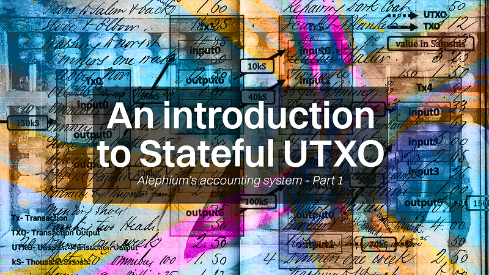

### **TECH TALK \#2 — Mysteries of stateful UTXO: The Ultimate Guide to Alephium’s accounting model (and a little more!) — Part 1**

_A discussion with Cheng Wang, inventor of stateful UTXO and founder of Alephium_

_This is the second of a series of interviews on the technical innovations brought to the world by Alephium. The discussion was conducted in a virtual format in the presence of most of the Alephium team who contributed to the questions and ensuing exchange. The following has been edited for clarity, concision and optimized for readability and cut into 2 parts, this is part 1. It has already been preceded by an_ <a href="https://medium.com/@alephium/an-introduction-to-the-stateful-utxo-model-8de3b0f76749" class="markup--anchor markup--p-anchor" data-href="https://medium.com/@alephium/an-introduction-to-the-stateful-utxo-model-8de3b0f76749" target="_blank"><em>Introduction to sUTXO</em></a> _and_ <a href="https://twitter.com/alephium/status/1615389097744568320" class="markup--anchor markup--p-anchor" data-href="https://twitter.com/alephium/status/1615389097744568320" rel="noopener" target="_blank"><em>many</em></a> <a href="https://twitter.com/alephium/status/1599808960038461447" class="markup--anchor markup--p-anchor" data-href="https://twitter.com/alephium/status/1599808960038461447" rel="noopener" target="_blank"><em>Twitter</em></a> <a href="https://twitter.com/alephium/status/1602684789655420928" class="markup--anchor markup--p-anchor" data-href="https://twitter.com/alephium/status/1602684789655420928" rel="noopener" target="_blank"><em>threads</em></a>_._

_TL;DR — An introduction on ledger-accounting models / What is stateful utxo / About tokens as first class citizen / About merkle trees, separation of contract states and assets / You can find Part 2_ <a href="https://medium.com/@alephium/tech-talk-2-mysteries-of-stateful-utxo-the-ultimate-guide-to-alephiums-accounting-model-and-f6b6868ef873" class="markup--anchor markup--p-anchor" data-href="https://medium.com/@alephium/tech-talk-2-mysteries-of-stateful-utxo-the-ultimate-guide-to-alephiums-accounting-model-and-f6b6868ef873" target="_blank"><em>here</em></a>_!_

#### **AN INTRODUCTION TO LEDGER-ACCOUNTING MODELS**

**Vladimir Moshnyager: Hi Cheng, before we delve into our main subject today, stateful UTXO, I’d like to start with some background to understand what we’re discussing. Could you briefly explain the UTXO model?**

**Cheng Wang:** The UTXO, or Unspent Transaction Output model, was developed by Satoshi Nakamoto for Bitcoin. It’s essentially an accounting system that the first blockchain uses to monitor Bitcoin balances.

It mirrors a physical cash transaction: every transaction includes inputs from the sender, the token to be transferred, and outputs, the amount sent to the recipient (recipient’s output) plus the remaining balance from the initial inputs (change output). This remainder is returned to the sender as “change”. The next time the user initiates a transaction, they can use this UTXO as input.

Although it’s a functional tool for accounting, it does have some drawbacks: it’s not the most user-friendly and limits the possibilities for programming, which is why most blockchains nowadays use the account model for balance storage, making the creation of dApps easier.

**VM: What are the alternatives to the UTXO model?**

CW: There are two big families of accounting systems in blockchain: the various UTXO systems and the account models. From the perspective of a developer, the first one is characterized by its immutability properties (UTXO), and the other is mainly used for its mutability & expressive qualities (the account model)

When Satoshi invented Bitcoin 10 years ago, it was not designed for the dApps use case. It’s very natural that other developers subsequently came up with different models to get around this, like the extended UTXO (eUTXO) popularized by <a href="https://docs.cardano.org/learn/eutxo-explainer/" class="markup--anchor markup--p-anchor" data-href="https://docs.cardano.org/learn/eutxo-explainer/" rel="noopener" target="_blank">Cardano</a> or <a href="https://dav009.medium.com/learning-ergo-101-blockchain-paradigm-eutxo-c90b0274cf5e" class="markup--anchor markup--p-anchor" data-href="https://dav009.medium.com/learning-ergo-101-blockchain-paradigm-eutxo-c90b0274cf5e" rel="noopener" target="_blank">Ergo</a>, the <a href="https://medium.com/nervosnetwork/https-medium-com-nervosnetwork-cell-model-7323fca57571" class="markup--anchor markup--p-anchor" data-href="https://medium.com/nervosnetwork/https-medium-com-nervosnetwork-cell-model-7323fca57571" target="_blank">Nervos</a> cell model, and Alephium’s stateful UTXO (sUTXO) model.

**VM: What problems arise with these alternatives? Why not employ the UTXO model, the account model, or one of the other UTXO variants?**

CW: The UTXO model's main limitation is its essential property: immutability. That which makes it extraordinarily safe to handle assets makes it inconvenient to build applications on top because there’s no access to the mutable “state”.

Conversely, the account model (mainly popularized by Ethereum) gives developers and smart contracts broad access to all information stored in the state and much better, thereby significantly enhancing <a href="https://en.wikipedia.org/wiki/Expressive_power_%28computer_science%29" class="markup--anchor markup--p-anchor" data-href="https://en.wikipedia.org/wiki/Expressive_power_(computer_science)" rel="noopener" target="_blank">expressiveness</a>.

This feature enables the creation of powerful decentralized applications but complicates security. Excessive access and freedom have often led to disastrous consequences, and simple bugs have repeatedly caused significant financial losses for users on many account-based chains due to challenges in effectively securing assets.

The eUTXO model is one of the most well-known UTXO variants. It has advanced the programmability of the UTXO model by allowing arbitrary logic in the lockup scripts of UTXOs. While it preserves the immutability of the classic UTXO model, it raises <a href="https://liberlion.medium.com/concurrency-in-the-eutxo-model-is-not-a-problem-but-a-challenge-db4b395a8eda" class="markup--anchor markup--p-anchor" data-href="https://liberlion.medium.com/concurrency-in-the-eutxo-model-is-not-a-problem-but-a-challenge-db4b395a8eda" rel="noopener" target="_blank">challenges</a> when it comes to the concurrent execution of smart contract transactions.

I like both the immutability, security, and determinism of the UTXO sets, and the expressiveness properties of the account model, so I decided to build stateful UTXO, which would combine the best of both worlds!

#### **WHAT IS STATEFUL UTXO**

**VM: Can you tell us more precisely how you got the idea of stateful UTXO? What’s the context & evolution that led you to invent this?**

**CW:** It’s been the evolution of an idea! In 2017 and 2018, I was laser-focused on how to scale an L1. That’s when I first conceived of the <a href="https://github.com/alephium/white-paper/blob/master/alephium.pdf" class="markup--anchor markup--p-anchor" data-href="https://github.com/alephium/white-paper/blob/master/alephium.pdf" rel="noopener" target="_blank">Blockflow sharding algorithm</a>. It was designed to be way simpler than the (ever-shifting) <a href="https://members.delphidigital.io/reports/the-hitchhikers-guide-to-ethereum/" class="markup--anchor markup--p-anchor" data-href="https://members.delphidigital.io/reports/the-hitchhikers-guide-to-ethereum/" rel="noopener" target="_blank">scaling roadmap</a> of Ethereum 2.0, and was exciting, so I got my hands dirty to build it.

I realized that this could only be achieved with the UTXO model because the input-output paradigm and on-chain immutability were crucial to building the sharding structure. Using the account model would have been impossible due to its mutability and the inability to parallelize transaction execution.

During the DeFi emergence in 2018, another interesting feature of the UTXO model occurred to me: a modified UTXO could potentially enhance the smart contract experience by solving many of the glaring security issues prevalent in virtual machines like the EVM and programming languages such as Solidity.

At the same time, DeFi summer demonstrated the power of decentralized apps to the world, and I wanted this for Alephium. Therefore, the expressivity of the entire system was a goal from the start, but never at the expense of security.

**VM: What do you mean by sharding and scalable UTXO, and in which way is it more scalable than the standard UTXO model?**

CW: Our Blockflow architecture works like this: <a href="https://medium.com/@alephium/an-introduction-to-blockflow-alephiums-sharding-algorithm-bbbf318c3402" class="markup--anchor markup--p-anchor" data-href="https://medium.com/@alephium/an-introduction-to-blockflow-alephiums-sharding-algorithm-bbbf318c3402" target="_blank">We have G groups, and then we have G x G blockchains</a>. UTXO is used on top of this to transact between the groups. This is what I meant by a scalable UTXO model: it is based on the UTXO model, but we scale it via sharding using the Blockflow algorithm and transactions can happen on-chain in parallel.

VM: **What is the stateful UTXO model and how does it work at a high level?**

**CW:** The “one sentence” answer is that stateful UTXO combines the security of UTXOs with the expressiveness of the account model.

The basic concept is that the account model is excellent for creating and managing smart contracts, global data access, and overall logic and information malleability. But this presents risks when handling financial assets.

Meanwhile, the UTXO model is very good at securely managing assets, even if it doesn’t offer the flexibility and expressiveness that developers need and enjoy when writing useful dApps.

The stateful UTXO model decomposes the accounting model into two parts: one part is immutable and handles the digital assets and the contract’s code and immutable states, and the other part, the mutable states.

This separate structure for digital assets enables more checks and guarantees at the VM level, ensuring that all asset operations are properly and securely handled, while still allowing developers to build dApps that can access and update the state with smart contract transactions.

**VM: Other UTXO models that appeared after Bitcoin’s also claim to provide the ability to merge UTXO and account model capabilities into one, what are the differences with eUTXO (extended UTXO, used in Cardano & Ergo) and the Cell Model (used in Nervos) for example?**

CW: It comes down to how the state is managed in the model. In the sUTXO model, the state is global and mutable, with all contracts having access to all their own state. The execution environment is expansive, encompassing the entire blockchain.

In contrast, in the eUTXO (Cardano, Ergo) and cell model (Nervos) transactions are stateless and depend only on the inputs of the transaction, therefore they’re easy to validate, but concurrency can present a challenge.

**VM: Do you have any hypothesis why there are not so many other attempts at doing UTXO stuff? There’s eUTXO, the Nervos cell model, Alephium’s sUTXO, and not many others. It seems like the whole space has moved to the account model. Do you have any hypothesis why it is so?**

**CW:** If you don’t need to shard the network, don’t prioritize security or innovate at the base layer, the account model and the existing EVM stack is a great option. It’s much simpler to bootstrap, and you can use the EVM design as a template and stay compatible with the popular EVM dApps. This allows you to build on top of the work of others without having to fork Bitcoin, which has an outdated codebase and is difficult to fork efficiently.

Bitcoin’s code is complex and requires almost everything to be built from scratch, which is a difficult and time-consuming process. Building the infrastructure takes time, and this is the main challenge here. It’s almost as difficult as creating a brand-new operating system, as you must rebuild many components from scratch.

Alephium has been building such an infrastructure for the past four years, from conceptualizing the sharding algorithm, to actually building a brand new virtual machine and creating a domain specific language to allow developers to build more secure dApps…

#### About tokens as first-class citizen

**VM: The only state equivalent on classic UTXO sets is the native token, but with Alephium, all tokens can run natively, in the UTXOs, without containers. That’s why you’re saying that those are first-class citizens? Can you explain more about how that works and what it allows for?**

**CW:** This feature is not unique to us. Some of the modern blockchains have the capability to support tokens built into the system, but Bitcoin and Ethereum are not among them. Bitcoin does not support tokens, whereas Ethereum does so through the ERC-20 standard, an external standard. While this standard is used to issue new tokens via smart contracts, it has certain drawbacks and limitations.

The first issue is that it’s difficult to design such standards, and there are many different standards for tokens, such as the ERC-20 and ERC-777. Whenever people find a feature they don’t like or that is lacking, they propose something new, leading to ecosystem fragmentation. It took many years for the ecosystem to consolidate the standards.

The second issue is that the security of this approach is not as strong as it could be since **the standard is not the implementation**. The standard is just a few functions that must be implemented in the smart contract, and there’s no guarantee that those functions will be implemented correctly, which can lead to hacks.

The concept of a token as a first-class citizen implies that the blockchain natively supports the token. Thus, new tokens can be issued using the blockchain’s inherent functionality. This addresses the standardization issue, as everyone would use the same method to issue tokens. Being a built-in feature, it’s extensively tested on the blockchain.

Also, the blockchain can add more checks for token handling. For example, we have an asset permission system for all transfers to guarantee that the virtual machine can ensure that all transfers are expected (or defined) by the smart contract.

VM: **Do we not lose a little bit of flexibility? For example, people are still inventing new standards for Ethereum. Standards that maybe they didn’t think about before. For example, there’s the 721 for NFTs, and then there’s a new one, the 1155. If we want, can we also build a container system on Alephium?**

CW: Alephium is a platform that allows the creation of new standards and tokens with additional features. However, the core functions of issuance, transfer, and deposit are built-in.

VM: **If the tokens are native in Alephium, does this mean I can pay GAS in any token?**

CW: No. In our design, only the built-in token can be used to pay for transaction fees (gas). Using arbitrary tokens to pay for gas can be difficult because it requires an oracle to accurately determine the token’s price before the transaction. Additionally, allowing arbitrary tokens to pay for gas can make the design and code more complex, which may not be worth the added complexity. Instead, using the built-in token, or blockchain token, to pay for gas fees ensures that there is demand for the token. This helps to create a sustainable model for the platform.

VM: **Cosmos studied the possibility of** <a href="https://docs.cosmos.network/main/core/tips#fee-payers-market" class="markup--anchor markup--p-anchor" data-href="https://docs.cosmos.network/main/core/tips#fee-payers-market" rel="noopener" target="_blank"><strong>paying for the gas with UST</strong></a> **at one time.**

CW: Using stablecoins as a method to pay transaction fees on a blockchain platform has its pros and cons and can be interesting for future research. On the plus side, it offers stability. However, if a stablecoin loses its peg, it could impact the blockchain’s functionality. This could necessitate updates to the blockchain to either remove or add stablecoins as a valid form of payment, a process which can be complicated and time-consuming.

#### **About Merkle trees, separation of contract states and assets**

VM: **Alephium’s UTXO is called _stateful_ UTXO. Can you just explain what “state” means in the blockchain context? Can you explain what the Alephium state looks like? What is in there, and how is it different from the others?**

CW: State can be defined as a set of variables describing a certain system (in this case the Alephium blockchain) at a specific time. Every action like a transaction between two addresses or a smart contract interaction will create/update the state.

In fact, in Alephium, there are several types of data contained in the state: UTXO sets (describing address balances), smart contract logic (the “programs”) and smart contracts data. All of these together describe the state of Alephium, and are stored in <a href="https://ethereum.org/pt/developers/docs/data-structures-and-encoding/patricia-merkle-trie/" class="markup--anchor markup--p-anchor" data-href="https://ethereum.org/pt/developers/docs/data-structures-and-encoding/patricia-merkle-trie/" rel="noopener" target="_blank">Merkle Trees</a>.

VM: **Can you tell us more about this? Where is the state actually stored, and how? Why have more than one merkle tree?**

CW: Everything is stored in two distinct Merkle Trees:

- One Merkle Tree is for the assets in the UTXOs,
- The second Merkle Tree is for the contracts states, it stores variables and data like the BTC or ETH price in the case of an oracle for example,

We could have put this logic in the same tree as the contract states, but these are different kinds of data. By separating them in different trees, we can do specific optimizations. For example, typically the contract state/data will be much more mutable than the contract logic.

Another advantage of the separation is that one big Merkle tree would lead to IO (Read/write input) performance issues: it would be much bigger, and risk becoming a bottleneck. you’ll access the database more times. Nowadays, one of the main bottlenecks of a smart contract blockchain is the IO.

**VM: Alephium is a sharded blockchain. How are the Merkle Trees stored? Is there a separate Merkle Tree for each group or each shard?**

CW: It’s per group. Each group has distinct states for the data. When a block is executed, it accesses and updates these group states.

Dependencies for every block can be verified to ensure no forking. With this, we can prevent double-spending, and that’s sufficient.

**VM: If my Uniswap is on group one, shard two, is it confined there? Can it be accessed directly by someone in group three, shards seven or twelve?**

CW: States are isolated. You can’t access a different group from your current one. Direct access could cause synchronization issues, and it would also contradict the purpose of sharding. If you needed to access it, you’d have to store it. There’s a trade-off here: segregation of data boosts performance, but at the same time, you lose something.

Ethereum has conducted some experiments on cross-shard transactions, but they’re usually impractical due to needing at least a two-phase or even a three-phase commit protocol. Initially, you lock the states, then the transaction is committed in one shard, and then you carry out your operation on another shard. After the transaction is complete, state changes are pulled back to the originating shard. This proposal by Vitalik seemed overly complex to me. It’s essential to strike a good balance when developing a system, and I don’t think it’s ideal to try to support overly complicated designs.

VM: **How do you solve this? I am a smart contract developer, how do I decide where I put it? What are the factors that I have to consider?**

CW: Different designs exist. One design strategy is to store all data related to a particular smart contract in a single group. Users would need to transfer their tokens to an address within that group to interact with the contract.

It’s like how banking works today: you may hold accounts at multiple banks, but you must move your money to a specific bank to do business with it. In this design, users need to first transfer their tokens from their address in one group to an address in the group that houses the smart contract, and then they can engage with the contract. Our sharding algorithm enables atomic cross-shard transactions in just a single step, significantly enhancing the user experience.

Another design would deploy the same contract across all groups, but this has certain limitations. Using Uniswap as an example, this would split your liquidity, potentially making capital less efficient than with a single liquidity pool. However, a market maker could likely bridge this gap and ensure deep liquidity across different groups.

If the liquidity pool is deep enough, splitting it among four groups won’t pose a problem. We also have applications that aren’t sensitive to liquidity and don’t require a centralized liquidity pool. In such cases, you can simply deploy the contract to different groups for access.

VM: **Okay. In short, it’s not a problem. Can you expand a bit on the native cross-shard assets, it’s a great interoperability feature that is absent from most L2 and other account-based sharding algorithms?**

**CW:**Support for cross-chain/shard assets is a critical requirement for scaling solutions, and Alephium excels in this area. When you have multiple chains/shards with the ability to issue new crypto assets, bridging these assets across shards becomes a challenge. L2 protocols require complex transfer through their main chains or additional bridges across L2s, which can be complex and result in a suboptimal user experience.

Sharding protocols, in general, offer better interoperability, but their support for cross-shard assets varies. Account-based sharding protocols, in particular, face difficulties in supporting cross-shard assets on-chain due to sharded states. In such models, states are not shared between shards, meaning the state on one shard cannot be directly used in another shard.

Eth core researchers are actively researching this direction, but all solutions come with tradeoffs, affecting either user experience (UX) or developer experience (DevX). However, Alephium’s sUTXO design supports native cross-shard assets. This means that one can transfer tokens across different shards in a single step, without requiring additional bridges or tools. This capability provides the best sharding experience for both users and developers.

---

This is the end of Part 1! And you can keep reading Part 2 <a href="https://medium.com/@alephium/tech-talk-2-mysteries-of-stateful-utxo-the-ultimate-guide-to-alephiums-accounting-model-and-f6b6868ef873" class="markup--anchor markup--p-anchor" data-href="https://medium.com/@alephium/tech-talk-2-mysteries-of-stateful-utxo-the-ultimate-guide-to-alephiums-accounting-model-and-f6b6868ef873" target="_blank">here</a>! If you have questions on this topic, please come to Alephium’s <a href="https://discord.gg/XsGpZ5VDTM" class="markup--anchor markup--p-anchor" data-href="https://discord.gg/XsGpZ5VDTM" rel="noopener ugc nofollow noopener noopener" target="_blank"><strong>Discord</strong></a>, <a href="https://t.me/alephiumgroup" class="markup--anchor markup--p-anchor" data-href="https://t.me/alephiumgroup" rel="noopener ugc nofollow noopener noopener" target="_blank"><strong>Telegram</strong></a>, or reach out on <a href="https://twitter.com/alephium" class="markup--anchor markup--p-anchor" data-href="https://twitter.com/alephium" rel="noopener ugc nofollow noopener noopener" target="_blank"><strong>Twitter</strong></a>!
