### The Alephium Bridge is live on Testnet!

#### Bridge assets from and to Ethereum Goerli Testnet and BNB Smart Chain Testnet

<figure id="5852" class="graf graf--figure graf-after--h4">

<figcaption>This is the hitchiker’s guide to Alephium’s first testnet bridge!</figcaption>
</figure>

A key to the future of Alephium is the ability to move tokens cross-chain, and since before the Leman Upgrade was ready, a lot of work has gone on working on the first bridge to another chain.

Today is a big step in that direction: **The Alephium Bridge is live on Testnet**.

This means transferring test tokens from Alephium’s testnet to Ethereum’s and BSC's testnet and back is possible!

You can interact with the testnet bridge using the following addresses:

Connect to the bridge via the portal URL: <a href="https://testnet.bridge.alephium.org/" class="markup--anchor markup--p-anchor" data-href="https://testnet.bridge.alephium.org/" rel="noopener noreferrer noopener" target="_blank">https://testnet.bridge.alephium.org/</a>

Bridge explorer: <a href="https://explorer.wormhole-testnet.alephium.org/explorer/" class="markup--anchor markup--p-anchor" data-href="https://explorer.wormhole-testnet.alephium.org/explorer/" rel="noopener" target="_blank">https://explorer.wormhole-testnet.alephium.org/explorer/</a>

In this article, you will find all you need to successfully bridge two ways from Alephium testnet to Ethereum’s Goerli and BSC’s Testnet!

This includes the following steps:

> What do you need to know beforehand to connect to the bridge?

> How to connect to the Bridge?

> How to connect to the Goerli Ethereum Testnet?

> How to bridge an asset from Alephium to Goerli?

> How to bridge an asset from Goerli to Alephium?

> How to connect to the BSC Testnet?

> How to bridge an asset from Alephium to BSC Testnet?

> How to bridge an asset from BSC Testnet to Alephium?

Let’s get started!

### 1 — What you need to know before connecting to the bridge

<figure id="95fa" class="graf graf--figure graf-after--h3">

<figcaption>Get ready for a transformative experience</figcaption>
</figure>

_🚨 It is not yet possible to use the bridge on the mainnet   
🚨 Before starting, make sure you are connected to Alephium’s testnet!  
🚨 You need an address in Group 0 (on Alephium testnet). And test \$ALPH tokens_

**How to create an address in Group 0?**

- Open the Browser Extension Wallet:
- Click on the current address name, and then in the “+†icon.

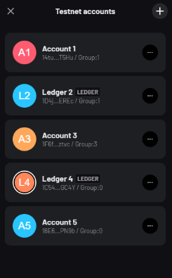

- Click on the Group selector and choose Group 0. Now you have a new address in Group 0!

**How to request test \$ALPH tokens?**

Don’t have \$ALPH in your wallet?

You can ask for some right from the wallet!

- Click “Add funds†on the main page and then “Request \$ALPH.†You will receive 12 Testnet \$ALPH in a few minutes.

### 2 — How to connect to the bridge?

<figure id="c047" class="graf graf--figure graf-after--h3">

<figcaption>Hop on the wagon and let’s go!</figcaption>
</figure>

To connect to the bridge, go to <a href="https://portal-bridge.wormhole-testnet.alephium.org/" class="markup--anchor markup--p-anchor" data-href="https://portal-bridge.wormhole-testnet.alephium.org/" rel="noopener" target="_blank">https://portal-bridge.wormhole-testnet.alephium.org</a>

Once on the page, click on the “connect” button. A prompt will appear, and you can choose which wallet you want to use to connect to the bridge.

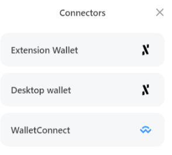

You can use the <a href="https://medium.com/@alephium/alephium-launches-browser-extension-wallet-706dfeda98f5" class="markup--anchor markup--p-anchor" data-href="https://medium.com/@alephium/alephium-launches-browser-extension-wallet-706dfeda98f5" target="_blank">Extension Wallet</a> or the <a href="https://medium.com/@alephium/the-desktop-wallet-2-0-d818bc1c722b" class="markup--anchor markup--p-anchor" data-href="https://medium.com/@alephium/the-desktop-wallet-2-0-d818bc1c722b" target="_blank">Desktop Wallet</a>. (the WalletConnect option is currently not supported).

After choosing your connection method, you can see your address below the two chains form.

The token bridge helps to send a token from one network to another. Now that you’re connected on Alephium’s side, it is time to connect to the other side: The first destination, the Goerli Ethereum testnet.

### 3 — How to connect to the Goerli Ethereum testnet?

<figure id="2747" class="graf graf--figure graf-after--h3">

<figcaption>Goerli workers fixing transactions</figcaption>
</figure>

To connect to the Goerli Ethereum testnet, you will need a wallet. In this example, we’ll use <a href="https://metamask.io/" class="markup--anchor markup--p-anchor" data-href="https://metamask.io/" rel="noopener" target="_blank">Metamask</a> but it would work similarly with other wallets.

🚨 _If using Metamask, before starting the process, go to the “advanced settings”, and make sure that the “show test networks” toggle is activated!_

If you’re on a different chain, you must change to the Goerli Ethereum Testnet.

Click the “Ethereum Mainnet” button and select the “Goerli Testnet” as the network.

You will see that the network name has changed to “Goerli test network.”

You will need enough GoerliETH to pay the fast fee for your incoming transaction on the Goerli Testnet (and send it to the Alephium Testnet).

You can get 0.2 GoerliETH/day (It requires a subscription) here: <a href="https://goerlifaucet.com/" class="markup--anchor markup--p-anchor" data-href="https://goerlifaucet.com/" rel="noopener" target="_blank">https://goerlifaucet.com/</a>

<a href="https://faucet.quicknode.com/ethereum/goerli" class="markup--anchor markup--p-anchor" data-href="https://faucet.quicknode.com/ethereum/goerli" rel="noopener" target="_blank">https://faucet.quicknode.com/ethereum/goerli</a> is another option (no subscription), but not as reliable and fast as the previous one. It provides 0.005 GoerliETH/day.

After receiving the ETH Goerli tokens, your Metamask wallet will be able to pay the transaction fee for the bridge of the target chain.

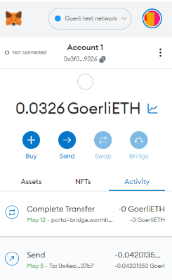

### 4-How to bridge an asset from Alephium to Goerli?

<figure id="f2da" class="graf graf--figure graf-after--h3">

<figcaption>Let’s get those tokens moving.</figcaption>
</figure>

With your Alephium wallet connected on the bridge page, select the asset you want to bridge from Alephium to Goerli.

After choosing the amount, click on “Next.”

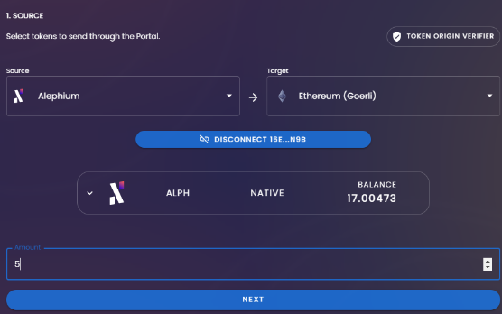

Click on “Connect” to connect your Goerli address to the bridge.

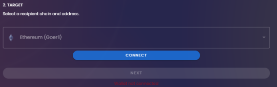

After you are connected to the Goerli Ethereum Testnet, the “next” button will become available.

The page will show the address you are connected to on the Goerli Ethereum Testnet and the current balance of Alephium (Wormhole) on it. This is the bridged \$ALPH in the Goerli Ethereum Testnet

Once you’re ready, click on “Transfer.”

A pop-up will request your confirmation.

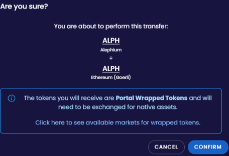

Your wallet will show the transaction for review. If everything is fine, click on “Sign.”

The transaction will take a fair amount of time (at least a few minutes! Please be patient)

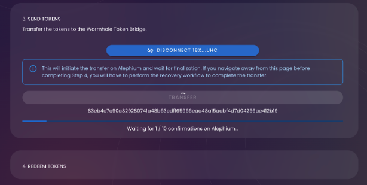

After you get the confirmation that the transaction has been completed, you can redeem your ALPH on the Goerli Ethereum Testnet. To do so, click on the “Redeem” button.

Your Goerli ETH wallet will then show the transaction for your review. Check if everything is fine and click on “Confirm.”

When the transaction is confirmed on the blockchain, the bridge will show the transaction details:

To be able to see your tokens in Metamask, you’ll need to import them. Here are the steps:

Click on “Assets”:

Click on “Import Tokens”.

On this page, add the following information:

> Token Contract Address: 0x1C5252a1996F82495579F16e5932D71d35dB5a03  
> Token Symbol: ALPH  
> Token Decimal: 18

Now you can see your \$ALPH in your Wallet.

**Using the “Redeem” section of the bridge**.

If, for some reason, you left the bridge page before redeeming your tokens, you can always get your transaction hash from <a href="https://explorer.testnet.alephium.org/" class="markup--anchor markup--p-anchor" data-href="https://explorer.testnet.alephium.org/" rel="noopener" target="_blank">https://explorer.testnet.alephium.org/</a>, and then click “Redeem” on the bridge page, paste it into the “source TX” field, and click “Recover.”

Your Goerli ETH wallet will then show the transaction for our review. Check if everything is fine and click on “Confirm.”

### 5- How to bridge an asset from Goerli to Alephium?

<figure id="ada2" class="graf graf--figure graf-after--h3">

<figcaption>And back!</figcaption>
</figure>

🚨 _Before starting the process, make sure you are connected to the Goerli Ethereum Testnet on Metamask!_

With your Goerli ETH wallet connected on the bridge page, select the asset you want to bridge from Goerli to Alephium.

The default asset is ETH, but you can choose ALPH as well by copying the contract address found on this page: <a href="https://goerli.etherscan.io/token/0x1c5252a1996f82495579f16e5932d71d35db5a03" class="markup--anchor markup--p-anchor" data-href="https://goerli.etherscan.io/token/0x1c5252a1996f82495579f16e5932d71d35db5a03" rel="noopener" target="_blank">https://goerli.etherscan.io/token/0x1c5252a1996f82495579f16e5932d71d35db5a03</a>

> Or by copying the contract address: 0x1C5252a1996F82495579F16e5932D71d35dB5a03

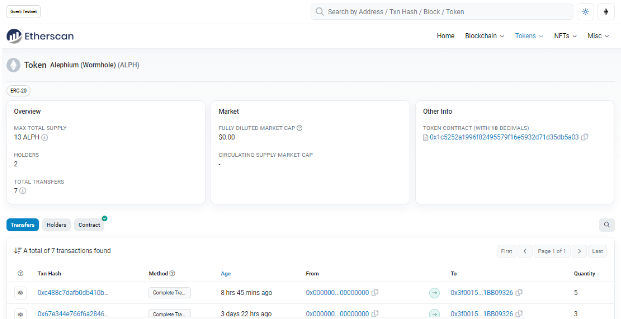

This will change the asset to ALPH on the bridge page.

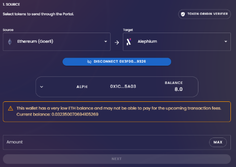

For this test, we will bridge GoerliETH to Alephium. After selecting ETH and clicking the “next” button, the bridge page will ask you to connect your Alephium Wallet.

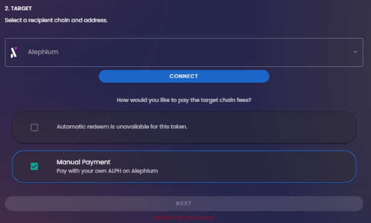

Make sure that your wallet is connected to the Testnet, and choose one option from the prompt:

You can use the Browser extension wallet or the Desktop Wallet (a direct connection with WalletConnect is not available yet).

You be asked for a connection. Review the information and approve, clicking on “Connect.”

With the wallet connected, the bridge page unlocks the “next” button to proceed with the transfer.

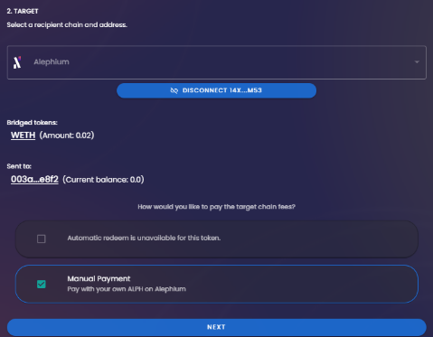

The next step is to send the token on the GoerliETH side. Click on the “transfer” button.

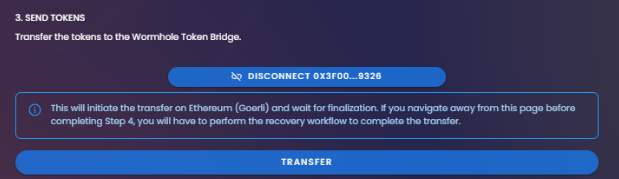

A confirmation screen will appear. Review the transaction and click on the “Confirm” button.

This will send the information to your Goerli ETH Wallet. Review all information and click on the “Confirm” button.

There is a waiting period regarding the <a href="https://medium.com/@alephium/time-to-finality-17d64eeffd25" class="markup--anchor markup--p-anchor" data-href="https://medium.com/@alephium/time-to-finality-17d64eeffd25" target="_blank">time to finality</a>. It can take up to 15 minutes to finalize the transaction.

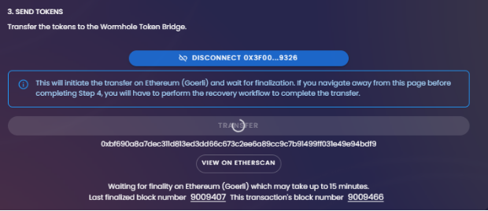

After the confirmation, you can redeem the ETH to your Alephium wallet. Click on the “redeem” button.

Your Alephium Wallet will show you a transaction to sign. Review and information and click “sign.” (If you don’t see the ETH in your wallet, complete the next step).

You can verify the transaction on <a href="https://explorer.testnet.alephium.org/" class="markup--anchor markup--p-anchor" data-href="https://explorer.testnet.alephium.org/" rel="noopener" target="_blank">https://explorer.testnet.alephium.org/</a>

**How to add ETH to your Browser Extension Wallet**

If you bridged ETH to Alephium, you would need to add the token information to your wallet. To do that, click on “New Token”

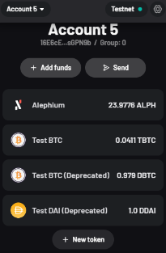

This will show a new page to add the information about the token.

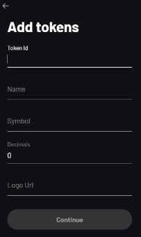

Fill all the fields with the following:

> Token Id: 9a8cda8bc3423347b7fe2932ef7981ed67e8825dba3a5ee36011f578d1d70f00  
> Name: ETH (Portal)  
> Symbol: WETH  
> Decimals: 18  
> Logo URI: https://raw.githubusercontent.com/alephium/tokens-meta/master/logos/WETH.png

The token is now showing in your wallet.

**Using the “Redeem” section of the bridge**.

If, for some reason, you left the bridge page before redeeming your tokens, you can always get your transaction hash from <a href="https://explorer.testnet.alephium.org/" class="markup--anchor markup--p-anchor" data-href="https://explorer.testnet.alephium.org/" rel="noopener" target="_blank">https://explorer.testnet.alephium.org/</a>, and then click “Redeem” on the bridge page, paste it into the “source TX” field, and click “Recover.”

### 6 — How to connect to the BSC Testnet?

To connect to the BSC Testnet, you will need a wallet. <a href="https://metamask.io/" class="markup--anchor markup--p-anchor" data-href="https://metamask.io/" rel="noopener" target="_blank">Metamask</a> is one of the available choices and will be used in this example.

🚨 When _using Metamask, before starting the process, go to the “advanced settings” and make sure that the “show test networks” toggle is activated!_

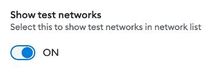

If you don’t have the BSC Testnet in your wallet, go to the <a href="https://chainlist.org/?search=BSC&amp;testnets=true" class="markup--anchor markup--p-anchor" data-href="https://chainlist.org/?search=BSC&amp;testnets=true" rel="noopener" target="_blank">Chainlist website</a> to add it. Then, connect your wallet, ensure the “include testnet” checkbox is checked, and click the “Add to Metamask” button.

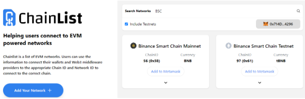

If you have it installed but are on a different chain, you must change to the BSC Testnet.

Click the “Ethereum Mainnet” button and select the “Binance Smart Chain Testnet” as the network.

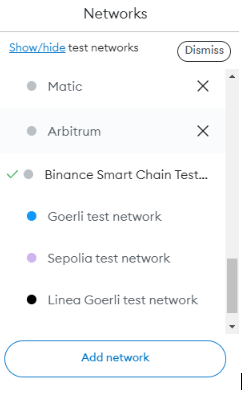

You will see that the network name has changed to “Binace Smart Chain test network.”

You will need enough test BNB to pay the fas fee for your incoming transaction on the BSC Testnet (and send it to the Alephium Testnet).

You can get 0.05 BNB per day from <a href="https://faucet.quicknode.com/binance-smart-chain/bnb-testnet/" class="markup--anchor markup--p-anchor" data-href="https://faucet.quicknode.com/binance-smart-chain/bnb-testnet/" rel="noopener" target="_blank">https://faucet.quicknode.com/binance-smart-chain/bnb-testnet/</a>

After receiving the tBNB funds, your Metamask wallet can pay the transaction fee for the bridge on the target chain.

### 7 — How to bridge an asset from Alephium to BSC Testnet?

With your Alephium wallet connected on the bridge page, select the destination network to the BSC testnet.

Select the asset you want to bridge from Alephium to BSC Testnet.

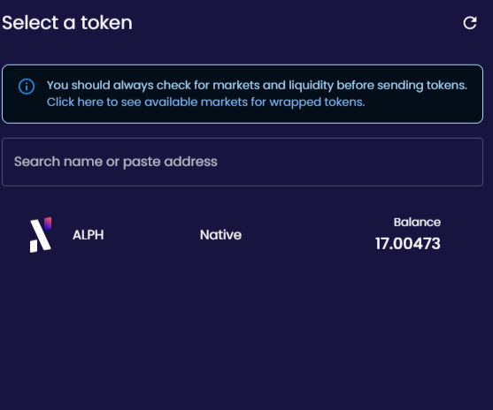

After choosing the amount, click on “Next.”

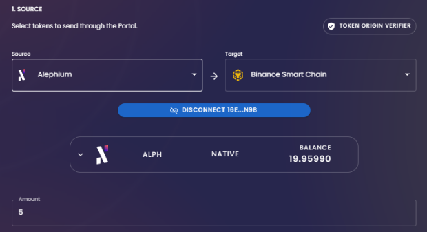

Click “Connect” to connect your BSC Testnet address to the bridge.

After you are connected to the BSC Testnet, the “next” button will become available.

The page will show the address you are connected to on the BSC Testnet and the current balance of Alephium (Wormhole). This is the bridged \$ALPH in the BSC Testnet.

Once you’re ready, click on “Transfer.”

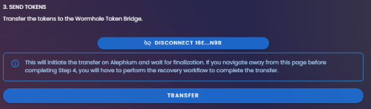

A pop-up will request your confirmation.

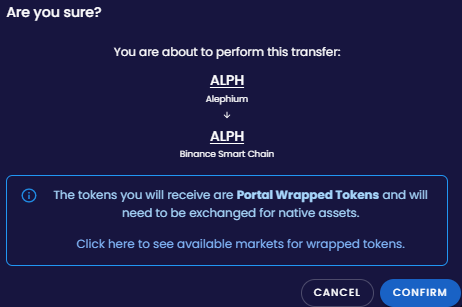

Your wallet will show the transaction for review. If everything is fine, click on “Sign.”

The transaction will take a fair amount of time (at least a few minutes! Please be patient)

After you get the confirmation that the transaction has been completed, you can redeem your ALPH on the BSC Testnet. To do so, click on the “Redeem” button.

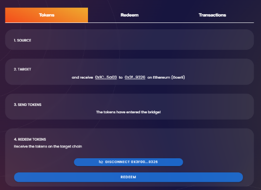

Your BSC Testnet wallet will then show the transaction for your review. Check if everything is fine and click on “Confirm.”

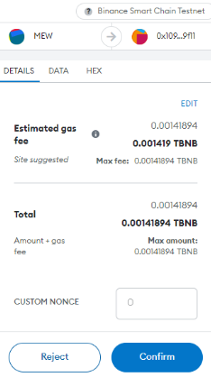

When the transaction is confirmed on the blockchain, you can check the assets in your wallet.

**Using the “Redeem” section of the bridge**.

If, for some reason, you left the bridge page before redeeming your tokens, you can always get your transaction hash from <a href="https://explorer.testnet.alephium.org/" class="markup--anchor markup--p-anchor" data-href="https://explorer.testnet.alephium.org/" rel="noopener" target="_blank">https://explorer.testnet.alephium.org/</a>. Then, click “Redeem” on the bridge page, paste the tx hash into the “source TX” field, and click “Recover.”

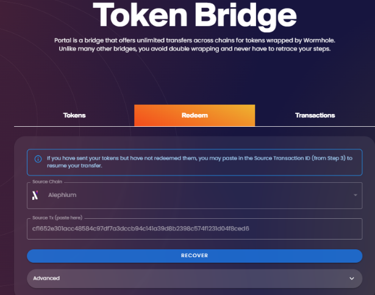

You will be sent to the redemption section and can proceed with the transaction.

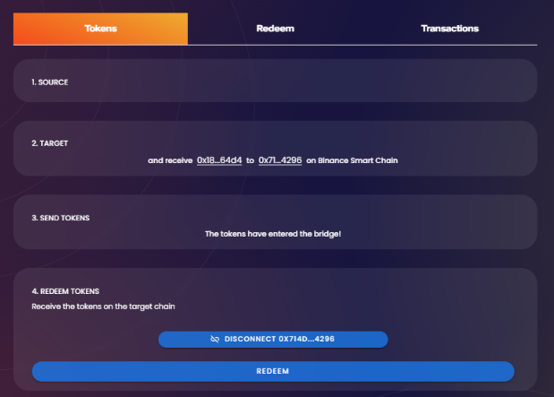

Your BSC testnet wallet will then show the transaction for review. Check if everything is fine and click on “Confirm.”

**How to add ALPH to your Metamask on BSC Testnet**

To add ALPH to your Metamask Wallet, click “Import Tokens.” This will open a pop-up window.

Insert the following information:

> Token Contract Address: 0x18D495a87E176C8d5Dc923c0Bf27ed8Bd03C64d4

> Token Symbol: ALPH

> Decimals: 18

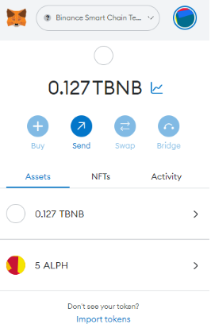

Now the token is displayed in your wallet.

### 8 — How to bridge an asset from BSC Testnet to Alephium?

🚨 _Before starting the process, ensure you are connected to the BSC Testnet!_

With your BSC Testnet wallet connected on the bridge page, select the asset you want to bridge from BSC Testnet to Alephium.

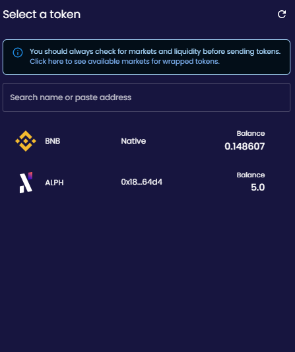

For this test, we will bridge tBNB to Alephium. After selecting BNB and clicking the “next” button, the bridge page will ask you to connect your Alephium Wallet.

Make sure that your wallet is connected to the Testnet, a choose one option from the prompt:

You can use the Browser extension wallet or the Desktop Wallet (a direct connection with WalletConnect is not available yet).

You will be asked for a connection. Review the information and approve, clicking on “Connect.”

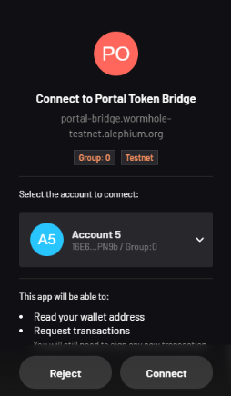

With the wallet connected, the bridge page unlocks the “next” button to proceed with the transfer.

The next step is to send the token from the BSC testnet side. Click on the “transfer” button.

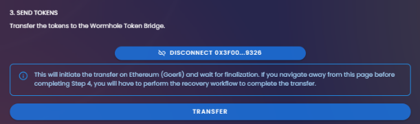

A confirmation screen will appear. Review the transaction and click on the “Confirm” button.

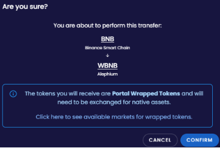

This will send the information to your BSC Testnet Wallet. Review all information and click on the ‘Confirm’ button.

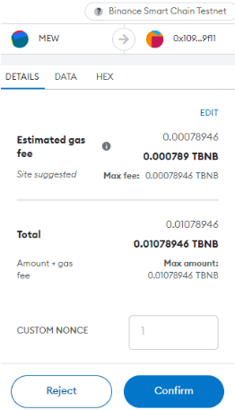

There is a waiting period regarding the <a href="https://medium.com/@alephium/time-to-finality-17d64eeffd25" class="markup--anchor markup--p-anchor" data-href="https://medium.com/@alephium/time-to-finality-17d64eeffd25" target="_blank">time to finality</a>. You will see that it is faster than the 15 minutes to finalize the transaction on the Goerli ETH Testnet.

After the waiting period, you can redeem the WBNB in your Alephium wallet. Then, click on the “redeem” button.

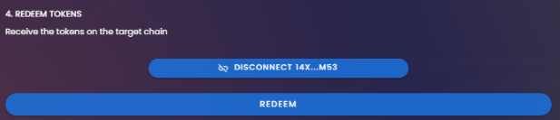

Your Alephium Wallet will show you a transaction to sign. Review and information and click “sign.”

You can verify the transaction on <a href="https://explorer.testnet.alephium.org/" class="markup--anchor markup--p-anchor" data-href="https://explorer.testnet.alephium.org/" rel="noopener" target="_blank">https://explorer.testnet.alephium.org/</a>

**How to add ETH to your Browser Extension Wallet**

If you bridged BNB to Alephium, you must add the token information to your wallet. To do that, click on “New Token.”

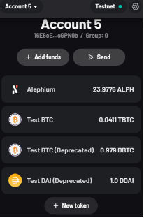

Now you have a new page to add the information about the token.

Fill all the fields with the following:

> Token Id: 4db93c3e58ca4c3392b9d47be17b62fcbabccba61a7d7c1fa1c3baa40181f700;

> Name: BNB (Portal)

> Symbol: WBNB

> Decimals: 18

> Logo URI: <a href="https://raw.githubusercontent.com/alephium/tokens-meta/master/logos/WBNB.png" class="markup--anchor markup--blockquote-anchor" data-href="https://raw.githubusercontent.com/alephium/tokens-meta/master/logos/WBNB.png" rel="noopener" target="_blank">https://raw.githubusercontent.com/alephium/tokens-meta/master/logos/WBNB.png</a>

The token is now showing in your wallet.

**Using the “Redeem” section of the bridge**.

If, for some reason, you left the bridge page before redeeming your tokens, you can always get your transaction hash from <a href="https://explorer.testnet.alephium.org/" class="markup--anchor markup--p-anchor" data-href="https://explorer.testnet.alephium.org/" rel="noopener" target="_blank">https://explorer.testnet.alephium.org/</a>, and then click “Redeem” on the bridge page, paste it into the “source TX” field, and click “Recover.”

---

This finishes the basic tutorial, but there are other transfers you can do, like:

- WBNB from Alephium to the Goerli Testnet
- ALPH from the Goerli Testnet to BSC Testnet
- WETH from Alephium to the BSC Testnet

If you need help or have extra questions, you are welcome to reach out in the \# 🎨dev-dapp channel on <a href="https://alephium.org/discord/" class="markup--anchor markup--p-anchor" data-href="https://alephium.org/discord/" rel="noopener" target="_blank">Discord</a>, or in the Alephium <a href="https://t.me/alephiumgroup" class="markup--anchor markup--p-anchor" data-href="https://t.me/alephiumgroup" rel="noopener" target="_blank">Telegram</a> channel. Don’t forget to follow <a href="https://twitter.com/alephium" class="markup--anchor markup--p-anchor" data-href="https://twitter.com/alephium" rel="noopener" target="_blank">@alephium on Twitter</a> to stay up-to-date.
