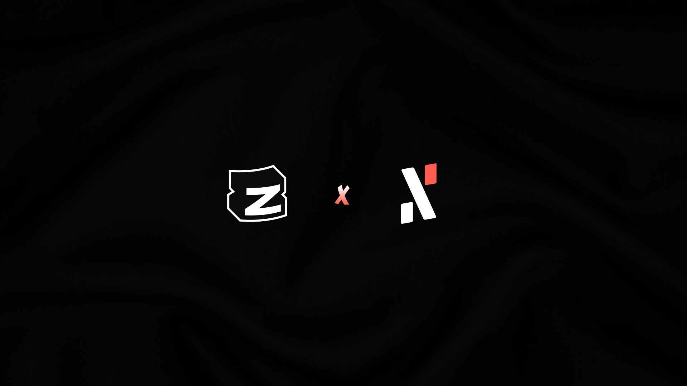

### Weekly \#DevUpdate

#### Week 33 Milestones & progress on dev on Alephium!

Greetings to the Alephium community and all tech enthusiasts! We’re back with another weekly development update to keep you informed about our latest advancements and milestones.

**1. NFT Marketplace V2 Enhancements**

The NFT Marketplace V2 is gearing up with new features. We’re introducing batch minting and optional royalties, enhancing the overall experience for creators and collectors.

**2. Desktop Wallet v2.1.4 Release**

Ensure you’re running the latest version of our Desktop Wallet (v2.1.4) to benefit from all the recent updates and improvements.

**Frontend Team Updates:**

- Mobile Wallet: We’ve been refining animations and buttons for a smoother user experience. Additionally, our team is researching app store publishing workflows to make the mobile wallet more accessible.
- JS-SDK: The JS-SDK has seen improvements in amount formatting, enhancing the displayed precision for smaller amounts. We’ve also released version 0.7.6.

**Backend Updates**

- dApps: The NFT Marketplace v2 now supports optional royalties for NFT collections.
- Browser Extension: Our browser extension wallet now supports signing unsigned transactions.
- SDK: We’ve addressed several bugs and released version 0.18.1. Additionally, we’ve removed the collectionId from the NFT standard interface.
- Bridge: We’ve implemented fixes for the Monitoring Dashboard.

**Marketing & Content Team Updates**

- In collaboration with <a href="https://twitter.com/zealy_io" class="markup--anchor markup--li-anchor" data-href="https://twitter.com/zealy_io" rel="noopener" target="_blank">Zealy.io</a>, we’re putting the final touches on the pre-launch.
- Dive deep into the sUTXO world with the second part of our long-form interview where <a href="https://twitter.com/wachmc" class="markup--anchor markup--li-anchor" data-href="https://twitter.com/wachmc" rel="noopener" target="_blank">@wachmc</a> explores the advantages of sUTXO, emphasizing its developer-friendly nature, enhanced security, and optimized state size for better dApps.
- Additional content includes a guide on acquiring testnet tokens, the 12th edition of our Community Highlight, and more.

**Community (Discord hot topics)**

- The main conversations in our <a href="https://discord.com/" class="markup--anchor markup--li-anchor" data-href="https://discord.com/" rel="noopener" target="_blank">Discord</a> community revolved around topics like hashrate distribution, the shutdown of txbit, and the identification of BOT scammers disrupting the server. We also discussed the launch of a new LP staking pool on <a href="https://twitter.com/ayincoin" class="markup--anchor markup--li-anchor" data-href="https://twitter.com/ayincoin" rel="noopener" target="_blank">Ayincoin</a> by <a href="https://twitter.com/AlfnotAlph" class="markup--anchor markup--li-anchor" data-href="https://twitter.com/AlfnotAlph" rel="noopener" target="_blank">@AlfnotAlph</a>, the MEXC listing, the bridge, and the conversation around <a href="https://twitter.com/ben_larkey" class="markup--anchor markup--li-anchor" data-href="https://twitter.com/ben_larkey" rel="noopener" target="_blank">@ben_larkey’s</a> NFT marketplace.

For those interested in the technical details, everything in Alephium is open source. You can check our progress and dive into the code on our <a href="https://github.com/alephium" class="markup--anchor markup--p-anchor" data-href="https://github.com/alephium" rel="noopener" target="_blank">GitHub</a>.

---

We’re grateful for the unwavering support of our community. Your feedback, contributions, and enthusiasm drive us to innovate and push the boundaries. Stay tuned for more updates, and as always, feel free to reach out with any questions or suggestions.
