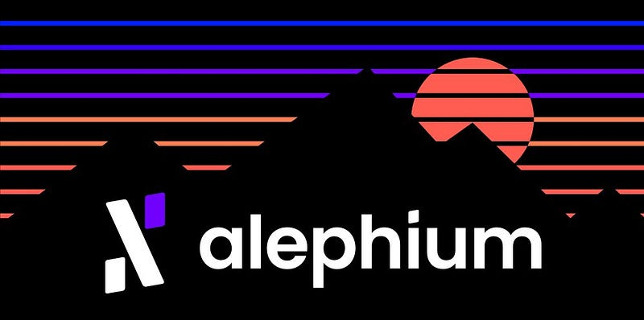

### 🚀 Welcome to Alephium (ALPH)

#### Here’s all the information you need to get started with Alephium ! And if that’s not enough, check our <a href="https://alephium.org/" class="markup--anchor markup--h4-anchor" data-href="https://alephium.org/" rel="noopener" target="_blank">website</a> or come talk to us on <a href="https://discord.gg/JErgRBfRSB" class="markup--anchor markup--h4-anchor" data-href="https://discord.gg/JErgRBfRSB" rel="noopener ugc nofollow noopener" target="_blank">Discord</a>, <a href="https://t.me/alephiumgroup" class="markup--anchor markup--h4-anchor" data-href="https://t.me/alephiumgroup" rel="noopener ugc nofollow noopener" target="_blank">Telegram</a> or <a href="https://www.reddit.com/r/Alephium/" class="markup--anchor markup--h4-anchor" data-href="https://www.reddit.com/r/Alephium/" rel="noopener ugc nofollow noopener" target="_blank">Reddit</a> !

---

### 🐥 What is Alephium?<a href="https://wiki.alephium.org/5min-overview#-what-is-alephium" class="markup--anchor markup--h3-anchor" data-href="https://wiki.alephium.org/5min-overview#-what-is-alephium" rel="noopener" target="_blank" title="Direct link to heading">​</a>

Alephium is the first live Layer 1 sharded blockchain scaling and improving on Bitcoin core technologies, Proof of Work & UTXO. It delivers a highly performant, secure DeFi & Dapps platform with enhanced energy efficiency.

- Like Bitcoin, but more programmable & energy efficient.
- Like Ethereum, but more secure & scalable.
- Like Solana, but more decentralised & trustless.

---

### 💎 Why is Alephium special?<a href="https://wiki.alephium.org/5min-overview#-why-is-alephium-special" class="markup--anchor markup--h3-anchor" data-href="https://wiki.alephium.org/5min-overview#-why-is-alephium-special" rel="noopener" target="_blank" title="Direct link to heading">​</a>

On top of an awesome team, an outstanding community and a lot of energy, here are our technical specificities:

It scales through sharding. Alephium is built on a novel and complete sharding algorithm called BlockFlow. It improves on the UTXO model of BTC to make it scalable, and uses DAG data structure to reach consensus between different shards. This will allow up to 10’000 Transactions Per Second (currently more than 400 TPS vs Bitcoins 7 TPS).

It is programmable & secure. Alephium proposes a stateful UTXO model offering layer-1 scalability and the same level of programmability as the account model implemented on ETH, whilst being more secure.

It is less energy consuming thanks to POLW. Proof of Less Work combines physical work and Coin economics to dynamically adjust the work required to mine new blocks. Given the same network conditions, Alephium only uses ⅛ of the energy compared to Bitcoin.

It improves on chain structure with its own custom VM (Alphred). It resolves many of the critical issues of the current dApps platforms with huge improvements on security, development experience and introductions of new paradigms such as trustless P2P smart contracts transactions.

It has its own programming language for dApps. Ralph is similar to the Rust syntax, hence its name. It allows to build efficient and secure smart contracts easier than Solidity for example. It is specifically designed to facilitate the creation of Decentralized Finance applications!

Putting all these innovations together, Alephium delivers a highly demanded solution in the industry: a scalable blockchain improving on mature ideas from Bitcoin to deliver reliable, powerful and secure DeFi and dApps capabilities. And we’re live!

Check out our <a href="https://github.com/alephium/white-paper" class="markup--anchor markup--p-anchor" data-href="https://github.com/alephium/white-paper" rel="noopener noreferrer noopener" target="_blank">whitepapers</a>!

---

### Milestones & Roadmap<a href="https://wiki.alephium.org/5min-overview#milestones--roadmap" class="markup--anchor markup--h3-anchor" data-href="https://wiki.alephium.org/5min-overview#milestones--roadmap" rel="noopener" target="_blank" title="Direct link to heading">​</a>

### 🚀 Completed Milestones<a href="https://wiki.alephium.org/5min-overview#-completed-milestones" class="markup--anchor markup--h3-anchor" data-href="https://wiki.alephium.org/5min-overview#-completed-milestones" rel="noopener" target="_blank" title="Direct link to heading">​</a>

Core Platform

- 02.2019 — Whitepapers publicly released
- Q1.2020 — Alpha version of the core sharding protocol implemented and tested on AWS
- 12.2020 — Testnet Launch
- Q1.2021 — Smart contract support
- 09.2021 — Desktop wallet & explorer public release
- 08.11.2021 — Mainnet launch & 3rd party cloud mining service
- 01.2022–1st dApp proof-of-concept

Ecosystem

- 11.2021 — Joined the UTXO alliance & Bitcoin Association Switzerland
- Q4.2021 — Mining ecosystem development: miners development, reference mining pool and pool integration.
- 13.12.2021 — First community mining pool
- 12.01.2022 — First exchange listing: Gate.io
- 02.2022–9 mining pools on Alephium

### 🛣️ Roadmap<a href="https://wiki.alephium.org/5min-overview#%EF%B8%8F-roadmap" class="markup--anchor markup--h3-anchor" data-href="https://wiki.alephium.org/5min-overview#%EF%B8%8F-roadmap" rel="noopener" target="_blank" title="Direct link to heading">​</a>

The network is young and growing rapidly. We will update the roadmap to reflect the latest priorities.

Core Platform

- Improve the robustness, efficiency and dev-experience of the full node
- Improve documentation of the core infrastructure
- Improve the Alephium SDK with more features
- Improve the robustness and efficiency of the explorer backend
- Include chain statistics and information on the explorer
- Bridge development, testing, and launch
- Leman Network Upgrade for cross-chain interoperability
- dApp support in the desktop wallet
- DEX development, testing, and launch
- Mobile wallet
- Hardware wallet integration

Ecosystem

- Website revamp
- Build-up community engagement & marketing initiatives (hackathon, AMAs, community competitions, campaigns, etc)
- Key industry events (PBWS, EthCCand others)
- DEX listing (after the deployment of the bridge)
- Additional CEX listing
- 3rd party dApps (NFT, DEX, stablecoin) on Alephium

### 🛡 Our tokenomics<a href="https://wiki.alephium.org/5min-overview#-our-tokenomics" class="markup--anchor markup--h3-anchor" data-href="https://wiki.alephium.org/5min-overview#-our-tokenomics" rel="noopener" target="_blank" title="Direct link to heading">​</a>

The token supply on Alephium is limited with a hardcap of 1 billion. At Mainnet Launch (11.8.21), an initial supply of 140M tokens (14% of the hardcap) was mined with the genesis block. The remaining supply of ALPH tokens will be mined over the years. Of these 140M tokens:

80M tokens (8%) 🤝 Pre-sales and future strategic private sales. Vesting periods varying from 2 to 4 years.

30M tokens (3%) 💡 Community and ecosystem development. Locked on-chain for 4 years and vested quarterly.

30M tokens (3%) 🧑‍💻 Treasury & Team. Locked on-chain for 3 years, and vested quarterly.

860M tokens (86%) 🌊 Mining Rewards. These tokens will be used for mining rewards over years. They ensure the processing of transactions and the execution of smart contracts on the Alephium blockchain.

In addition, half of the transaction fees are burned with each block and Proof of Less Work enables internal mining cost through burning when the hashrate and energy consumption are significantly high.

Find more details in our <a href="https://medium.com/@alephium/tokenomics-of-alephium-61d59b51029c" class="markup--anchor markup--p-anchor" data-href="https://medium.com/@alephium/tokenomics-of-alephium-61d59b51029c" rel="noopener noreferrer" target="_blank">Tokenomics Medium article</a>.

---

### 🏋️‍♀️ Our team<a href="https://wiki.alephium.org/5min-overview#%EF%B8%8F%EF%B8%8F-our-team" class="markup--anchor markup--h3-anchor" data-href="https://wiki.alephium.org/5min-overview#%EF%B8%8F%EF%B8%8F-our-team" rel="noopener" target="_blank" title="Direct link to heading">​</a>

The core team counts 14 members. 9 are tech team members and the remaining 5 are part of the operations team. Come say hello on Discord!

<a href="https://twitter.com/wachmc" class="markup--anchor markup--p-anchor" data-href="https://twitter.com/wachmc" rel="noopener noreferrer noopener" target="_blank">@ChengWang#1571</a> 🛠 is our founder, core dev, double PhD dropout in Math & CS, grand wizard of Alephium, working from Lausanne, Switzerland 🇨🇭

<a href="https://twitter.com/s0ukie" class="markup--anchor markup--p-anchor" data-href="https://twitter.com/s0ukie" rel="noopener noreferrer noopener" target="_blank">@s0ukie#8277</a> ⚙️ is our Chief of Staff, without whom nothing moves, previously @Lykke and @Bestmile. Working from Zürich, Switzerland 🇨🇭

<a href="http://twitter.com/heptazoid" class="markup--anchor markup--p-anchor" data-href="http://twitter.com/heptazoid" rel="noopener noreferrer noopener" target="_blank">@setto#4764</a> 🕹 is our community magician ! Creative, attentive and a constant presence on our Discord & Telegram, working from Sweden 🇸🇪

Meet the rest of the team on our <a href="https://alephium.org/" class="markup--anchor markup--p-anchor" data-href="https://alephium.org/" rel="noopener noreferrer noopener" target="_blank">website</a> or on <a href="https://www.linkedin.com/company/alephium/people/" class="markup--anchor markup--p-anchor" data-href="https://www.linkedin.com/company/alephium/people/" rel="noopener noreferrer noopener" target="_blank">Linkedin</a>.

---

### 🎯 Meet us, join us, talk to us\!<a href="https://wiki.alephium.org/5min-overview#-meet-us-join-us-talk-to-us" class="markup--anchor markup--h3-anchor" data-href="https://wiki.alephium.org/5min-overview#-meet-us-join-us-talk-to-us" rel="noopener" target="_blank" title="Direct link to heading">​</a>

### Talk with us<a href="https://wiki.alephium.org/5min-overview#talk-with-us" class="markup--anchor markup--h3-anchor" data-href="https://wiki.alephium.org/5min-overview#talk-with-us" rel="noopener" target="_blank" title="Direct link to heading">​</a>

- <a href="https://discord.gg/JErgRBfRSB" class="markup--anchor markup--li-anchor" data-href="https://discord.gg/JErgRBfRSB" rel="noopener noreferrer noopener" target="_blank">Discord</a>
- <a href="https://t.me/alephiumgroup" class="markup--anchor markup--li-anchor" data-href="https://t.me/alephiumgroup" rel="noopener noreferrer noopener" target="_blank">Telegram</a>
- <a href="https://www.reddit.com/r/Alephium/" class="markup--anchor markup--li-anchor" data-href="https://www.reddit.com/r/Alephium/" rel="noopener noreferrer noopener" target="_blank">Reddit</a>

### Connect with us<a href="https://wiki.alephium.org/5min-overview#connect-with-us" class="markup--anchor markup--h3-anchor" data-href="https://wiki.alephium.org/5min-overview#connect-with-us" rel="noopener" target="_blank" title="Direct link to heading">​</a>

- <a href="https://twitter.com/alephium" class="markup--anchor markup--li-anchor" data-href="https://twitter.com/alephium" rel="noopener noreferrer noopener" target="_blank">Twitter</a>
- <a href="https://www.linkedin.com/company/alephium" class="markup--anchor markup--li-anchor" data-href="https://www.linkedin.com/company/alephium" rel="noopener noreferrer noopener" target="_blank">LinkedIn</a>
- <a href="https://www.facebook.com/alephium" class="markup--anchor markup--li-anchor" data-href="https://www.facebook.com/alephium" rel="noopener noreferrer noopener" target="_blank">Facebook</a>

### Read, setup, explore, contribute<a href="https://wiki.alephium.org/5min-overview#read-setup-explore-contribute" class="markup--anchor markup--h3-anchor" data-href="https://wiki.alephium.org/5min-overview#read-setup-explore-contribute" rel="noopener" target="_blank" title="Direct link to heading">​</a>

- <a href="https://alephium.org/" class="markup--anchor markup--li-anchor" data-href="https://alephium.org/" rel="noopener noreferrer noopener" target="_blank">Website</a>
- <a href="https://github.com/alephium/white-paper" class="markup--anchor markup--li-anchor" data-href="https://github.com/alephium/white-paper" rel="noopener noreferrer noopener" target="_blank">Whitepapers</a>
- <a href="https://medium.com/@alephium" class="markup--anchor markup--li-anchor" data-href="https://medium.com/@alephium" rel="noopener noreferrer" target="_blank">Medium</a>
- <a href="https://github.com/alephium" class="markup--anchor markup--li-anchor" data-href="https://github.com/alephium" rel="noopener noreferrer noopener" target="_blank">GitHub</a>
