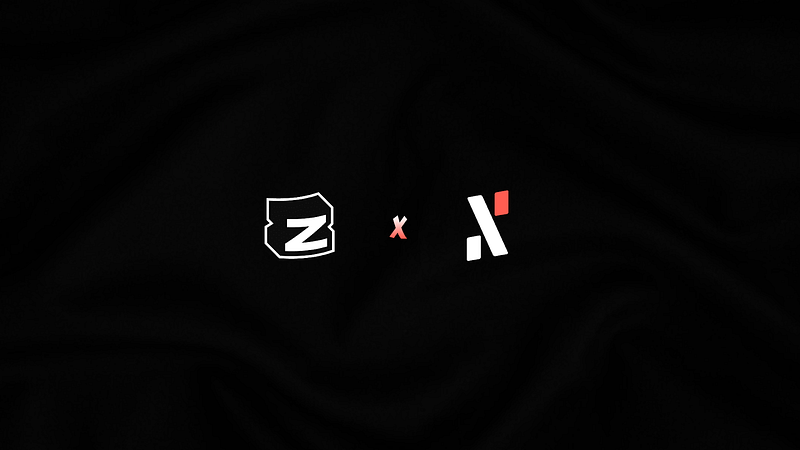
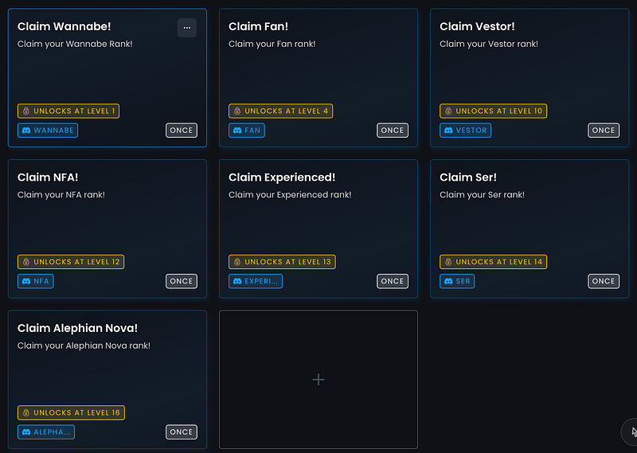
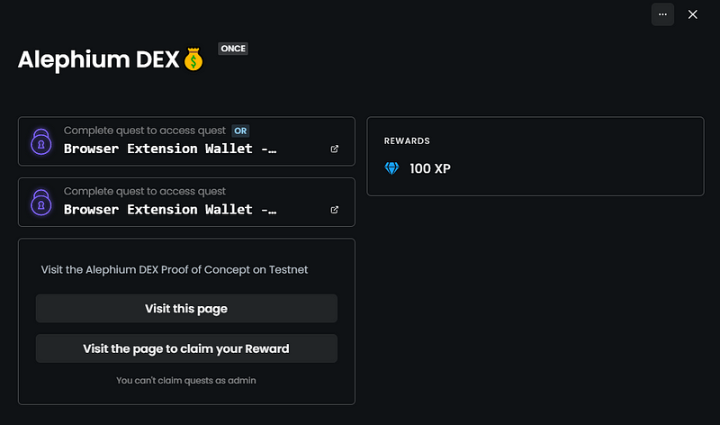

### Zealy Quests are coming!

As the community expands, and more non-tech people join us, we need different tools, and different ways of showing, exploring and explaining what Alephium is about!

Do you want to test your knowledge of Alephium?   
Do you want to explain to someone how to get in the ecosystem easily in a gamified way?  
Do you want to test new features and be in the loop of what’s coming?

Join our Zealy.io page and be on top of what is happening, while earning XP points that unlock new roles at <a href="http://alephium.org/discord" class="markup--anchor markup--p-anchor" data-href="http://alephium.org/discord" rel="noopener" target="_blank">Discord</a> and other perks that will be announced at a later point (but that are really cool!).

### How to join?

Get to our Zealy community <a href="https://zealy.io/c/alephium" class="markup--anchor markup--p-anchor" data-href="https://zealy.io/c/alephium" rel="noopener" target="_blank">here</a>. If you’re not subscribed already, create a Zealy account, it’s easy and fast!

You will see that our quests are divided into categories, which will help you go through specific areas of Alephium’s ecosystem.

For now, you’ll find:

- \#Onboarding which will let you discover all our platforms, and newcomers to find us everywhere.
- \#AllThingsAlephium which will help you discover our wallets, dApps and bridge.
- \#DailyActivities is for hardcore competitors who love XP and want those higher roles on Discord while contributing to Alephium’s visibility!

We will regularly add new quests. For example, when the v2 of the NFT marketplace will be published, we will have a dedicated set of quests to show you around!

### Quests

To engage with a quest, clickon it and a popup will appear with more information.

Remember that some quests must be done in a sequence, so you must complete the previous ones to unlock them!

Your tasks are different on each quest. Some require you to go to a website, RT or like posts on <a href="https://twitter.com/alephium" class="markup--anchor markup--p-anchor" data-href="https://twitter.com/alephium" rel="noopener" target="_blank">Twitter</a>, while others will ask you to provide a link, image, text, video, and so on.

Some are daily tasks you can do every day to increase your XP count.

### XP Levels (Ranks)

As you go through the quests, you gain XP points. The XP points are used to level up your account, and each level gives you a different role at <a href="http://alephium.org/discord" class="markup--anchor markup--p-anchor" data-href="http://alephium.org/discord" rel="noopener" target="_blank">Alephium’s Discord server</a>!

But they are hard to get!

Feel free to explore all available quests, and let us know what you think!
