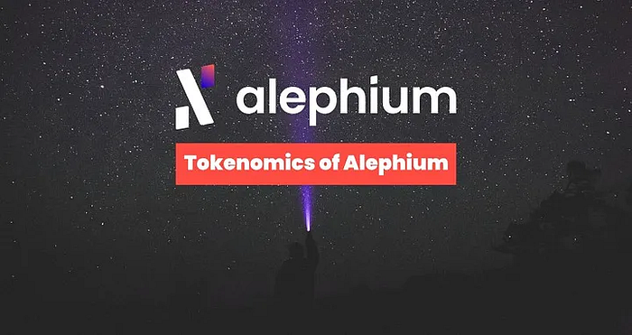
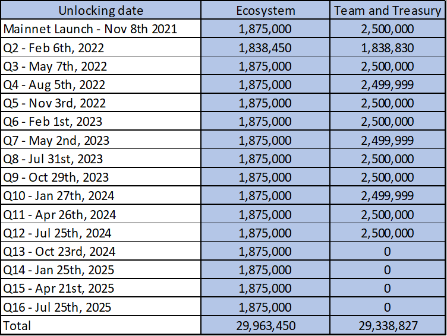

### **Alephium Tokenomics**

_Updated: The tokenomics were published on Oct 5, 2021. We updated this article in February of 2024 to better address the most frequently asked questions._

### Introducing ALPH

The Alephium token’s official ticker symbol is <a href="https://coinmarketcap.com/currencies/alephium/" class="markup--anchor markup--p-anchor" data-href="https://coinmarketcap.com/currencies/alephium/" rel="noopener" target="_blank">ALPH</a>. It contributes to the blockchain’s decentralization and overall security by incentivizing miners to process blocks on the Alephium blockchain.

Mining is a core mechanism of the Alephium blockchain: it is the mechanism by which transaction records are added and verified across the network. The token also secures the Alephium network against DDoS and spam attacks via transaction fees payable in ALPH.

### Tokenomics

The theoretical maximum of ALPH is set at 1 billion.   
Most ALPH (86% of the max supply or 860 million ALPH) will be mined over ~82 years (starting at mainnet launch in 2021).

The remaining 140 million ALPH (14% of the max supply) were minted with the genesis block for the Ecosystem, Sales, Team & Treasury allocations (and vest over time, see Genesis Allocation & Vesting Schedule section below).

<figure id="1158" class="graf graf--figure graf-after--p">

<figcaption>Total emission and Genesis Allocation</figcaption>
</figure>

### Mining Emissions

As Alephium uses <a href="https://medium.com/@alephium/tech-talk-1-the-ultimate-guide-to-proof-of-less-work-the-universe-and-everything-ba70644ab301" class="markup--anchor markup--p-anchor" data-href="https://medium.com/@alephium/tech-talk-1-the-ultimate-guide-to-proof-of-less-work-the-universe-and-everything-ba70644ab301" target="_blank">Proof of (Less) Work</a>, 860 million ALPH will be mined and distributed to the miners who secure the network as block rewards. There is no halving on Alephium, the block reward is adjusted dynamically depending on the network hashrate and timestamp.

You will find the full details & calcuations of the mining rewards in <a href="https://medium.com/@alephium/alephium-block-rewards-72d9fb9fde33" class="markup--anchor markup--p-anchor" data-href="https://medium.com/@alephium/alephium-block-rewards-72d9fb9fde33" target="_blank">this article</a>.

The core emission schedule works like this: the block reward is bound by two curves based on hashrate and timestamp. At a given time and for a given hashrate, the reward per block equals the minimum between the time-based and hashrate-based rewards.

> Block Reward = min (time-based reward, hashrate-based reward).

When this article was last updated, the average block reward was 2.43 ALPH, resulting in approximately 50’554 ALPH mined daily (you can check the calculation <a href="https://docs.alephium.org/frequently-asked-questions#how-many-coins-are-mined-per-day" class="markup--anchor markup--p-anchor" data-href="https://docs.alephium.org/frequently-asked-questions#how-many-coins-are-mined-per-day" rel="noopener" target="_blank">here</a>).

#### Deflationary forces

While inflationary, thanks to mining, Alephium also has deflationary forces:

- 100% of the transaction fees are burned. (Before the Leman Network Upgrade in March 2023, only 50% of the transaction fees were burned).
- <a href="https://medium.com/@alephium/tech-talk-1-the-ultimate-guide-to-proof-of-less-work-the-universe-and-everything-ba70644ab301" class="markup--anchor markup--li-anchor" data-href="https://medium.com/@alephium/tech-talk-1-the-ultimate-guide-to-proof-of-less-work-the-universe-and-everything-ba70644ab301" target="_blank">Alephium’s Proof of Less Work</a> will require coin burning when it’ll be triggered to internalize part of the mining cost through the upfront burning of ALPH.

### Genesis Allocation & Vesting Schedule

The genesis ALPH are allocated as follows:

- **80M** (8%) for past and upcoming **sales**, subject to on-chain lock upon sales with varying vesting periods.
- **30M** (3%) for **ecosystem development**, vesting over 4 years in quarterly unlocks.
- **30M** (3%) for **treasury and team**, vesting over 3 years in quarterly unlocks.

_Please note that according to CoinmarketCap’s official methodology, Ecosystem and Team wallets are to be excluded from the circulating supply (whether the tokens are locked or not). Therefore, these ALPH will only be counted as circulating after they leave the original wallet and not after they unlock._

#### Sales allocation vesting

Three sales events were held for ALPH: seed sale, <a href="https://medium.com/@alephium/alephium-closes-3-6m-pre-sale-from-80-contributors-to-expand-sharded-utxo-blockchain-platform-84f80492e28d" class="markup--anchor markup--p-anchor" data-href="https://medium.com/@alephium/alephium-closes-3-6m-pre-sale-from-80-contributors-to-expand-sharded-utxo-blockchain-platform-84f80492e28d" target="_blank">pre-sale</a>, and <a href="https://medium.com/@alephium/alephium-partners-with-cetacean-capital-83cf2fbea8a1" class="markup--anchor markup--p-anchor" data-href="https://medium.com/@alephium/alephium-partners-with-cetacean-capital-83cf2fbea8a1" target="_blank">private sale</a>. A total of 62,951,077 ALPH were sold and locked for periods varying between 2 to 4 years. The unlock schedule is detailed below.

The remaining 17,048,943 ALPH will be used to secure funds to ensure the long-term development and sustainability of the project. This will be done over the medium to long term, in a variety of ways, from direct sales, liquidity provisioning and OTC deals, optimizing for minimal impact on the markets while improving the liquidity, distribution & circulation of ALPH.

#### Ecosystem and Treasury allocation vesting

The ALPH allocated to the **Ecosystem** and for the **Treasury** follow this unlock schedule:

### FAQ

**Where can I see the top Alephium wallets?**

You can check the <a href="https://alph-richlist.vercel.app/" class="markup--anchor markup--p-anchor" data-href="https://alph-richlist.vercel.app/" rel="noopener" target="_blank">Alephium Rich List</a> to see the addresses with the most substantial balances. Find more <a href="https://status.notrustverify.ch/d/MggjRL1Vz/on-chain-stats?orgId=1" class="markup--anchor markup--p-anchor" data-href="https://status.notrustverify.ch/d/MggjRL1Vz/on-chain-stats?orgId=1" rel="noopener" target="_blank">stats</a> here & tools <a href="https://github.com/alephium/awesome-alephium" class="markup--anchor markup--p-anchor" data-href="https://github.com/alephium/awesome-alephium" rel="noopener" target="_blank">here</a>. The Explorer is your go-to for checking the balance of a specific wallet.

**Is Alephium deflationary?**

While Alephium has several deflationary forces, the <a href="https://medium.com/@alephium/alephium-block-rewards-72d9fb9fde33" class="markup--anchor markup--p-anchor" data-href="https://medium.com/@alephium/alephium-block-rewards-72d9fb9fde33" target="_blank">emissions of ALPH</a> still exceed them as of today.

**What is the difference between Circulating Supply, Total Supply and Maximum Supply?**

The definitions we are using for these terms come <a href="https://support.coinmarketcap.com/hc/en-us/articles/360043396252-Supply-Circulating-Total-Max-" class="markup--anchor markup--p-anchor" data-href="https://support.coinmarketcap.com/hc/en-us/articles/360043396252-Supply-Circulating-Total-Max-" rel="noopener" target="_blank">from coinmarketcap</a>. We have to comply with their definitions if we want to be correctly represented there:

_Circulating Supply:_ Circulating Supply is the best approximation of the number of assets circulating in the market and the general public’s hands. Are not part of the Circulating Supply ALPH that is locked (via smart contracts or legal contracts), allocated to the team or private sale participants, or in Ecosystem/Bounty/Marketing initiatives**.**

_Total Supply:_ This is the number of ALPH in existence today. Basically, the sum of the initial supply (minted at genesis block = 140M ALPH) plus the ALPH mined until today, minus the ALPH burned (by transaction fees burned for example).

_Maximum Supply:_ The theoretical maximum of ALPH that can exist, it is set at 1 billion. However, it will never be reached due to the various deflationary mechanisms of Alphium.

If you have extra questions, you are welcome to reach out on our <a href="http://alephium.org/discord" class="markup--anchor markup--p-anchor" data-href="http://alephium.org/discord" rel="noopener" target="_blank">Discord</a> or in the <a href="https://t.me/alephiumgroup" class="markup--anchor markup--p-anchor" data-href="https://t.me/alephiumgroup" rel="noopener" target="_blank">Alephium Telegram channel</a>. Don’t forget to follow <a href="https://twitter.com/alephium" class="markup--anchor markup--p-anchor" data-href="https://twitter.com/alephium" rel="noopener" target="_blank">@alephium on Twitter</a> to stay up-to-date.

[View original.](https://medium.com/p/7a56d0850e9d)
