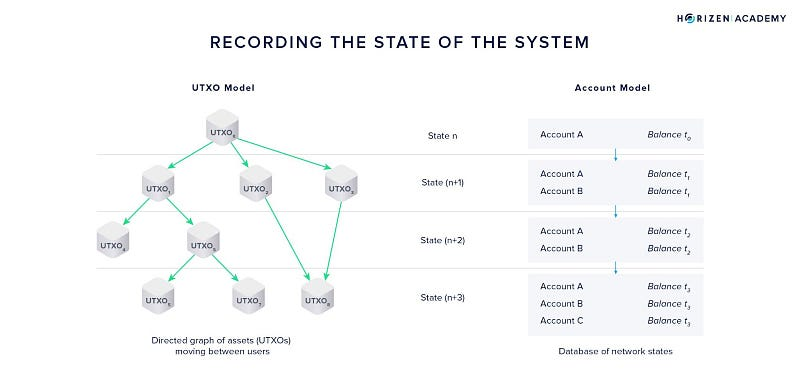
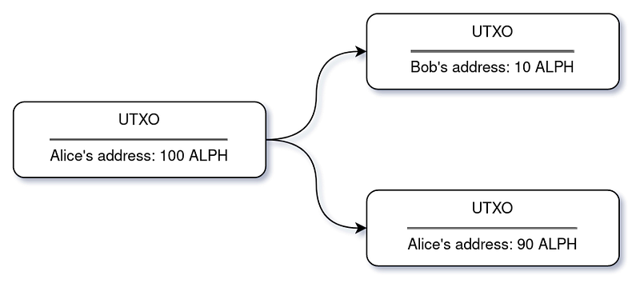

###

An introduction to the stateful UTXO model

The stateful UTXO model (sUTXO) is one of the main innovations brought by the Alephium team, along with Proof-of-less-work (PoLW), the Blockflow sharding algorithm & the Alphred Virtual Machine as well as the Ralph programming language.

You’ll find here a high-leve overview of what it is, why it was invented, how it works and what it allows for. A more detailed interview in the same vein that our <a href="https://medium.com/@alephium/tech-talk-1-the-ultimate-guide-to-proof-of-less-work-the-universe-and-everything-ba70644ab301" class="markup--anchor markup--p-anchor" data-href="https://medium.com/@alephium/tech-talk-1-the-ultimate-guide-to-proof-of-less-work-the-universe-and-everything-ba70644ab301" target="_blank">interview on PoLW</a> will follow, as well as more specific articles and threads on this important topic!

Before getting to stateful UTXO (which we’ll call sUTXO from here on), we need to recap quickly what it is here to build on, namely the UTXO model (famously brought to the world in Bitcoin) and the account model (of Ethereum fame)!

The UTXO and account-based models are the most commonly used accounting standards in blockchain networks. Both of them allow users & systems to keep track of balances of crypto assets.

### What is the UTXO Model?

The UTXO (Unspent Transaction Output) model is most famously in use to keep track of accounting in the Bitcoin blockchain, but not only, it also serves in Bitcoin Cash, Zcash, Litecoin, Dogecoin, Dash, and more…

In this standard, transactions are similar to physical cash transactions: for all transactions, there is the input (the token that will be transferred) and the output (the amount that will be sent to the recipient). The UTXO is the difference between the initial input and what was sent to the recipient, and the sender receives it as the “change” for the transaction.

In the UTXO world, every transaction spends the entirety of what it contains, creating new UTXOs.

Next time the user makes a transaction, he will use this UTXO as input. This model is suitable for accounting, but it has a significant limitation: it is immutable, and it doesn’t allow access to states. NEED A LINK TO SOMEWHERE DESCRIBING WHAT A STATE IS AND IDEALLY WHAT THE PROBLEM OF BEING STATELESS IS

The state describes a system’s current situation (for example what everyone’s balance is as of NOW) and the transactions trigger state transitions (following our example what the new balances are after Alice sent money to Bob). As the transactions are bundled in blocks, the addition of a block is what changes the actual blockchain state.

In the UTXO model, the UTXO only has state information about itself. So different models were proposed because it doesn’t have information about global states, like the extended UTXO model, stateful UTXO, and the account model.

### The account model

The account model looks more like a classic database: all transactions are linked to accounts. This means that sending funds reduces one account’s balance and increases the other’s balance like in a classic ledger. And these “state” changes triggered by the transactions are globally available in the blockchain.

The main advantage of the account model is its simplicity. Since it looks more like a classic database than the UTXO model, it’s easier for developers to program on top of. This makes for a less rigid system, that is more “expressive” in the sense that devs can build more complex & powerful programs (called smart contracts).

However, this model also has limitations. First, the blockchain makes no distinction between a token transfer and a smart contract data transaction. This means there are no native security verifications to check if a transfer can be done. The only check is if the account has enough balance to perform the transaction.

This leads to another problem. Everything is handled by smart contract programming, and this gives room for errors. Furthermore, as one of the main functions of a blockchain is to act as a financial system, the security requirements are very high. And there are a lot of bugs on smart contracts that could be prevented if the virtual machine or the system was designed differently.

### Stateful UTXO

The stateful UTXO combines the advantages of both UTXO and account model: it benefits from the security of the first and the expressiveness of the second.

It achieves that by actually using both! But for different things… The assets/token are stored in UTXOs. But the smart contracts and the states behave like in the account model.

OBS: It would be nice to have an infographic of this

Using the UTXO model as the component handling the assets, there is a unique structure for these digital assets. Therefore, it is possible to have additional verifications at the Virtual Machine level to guarantee that all operations with assets will have a different treatment.

And that is leveraged by having access to the contract states. For example, when building a dApp, it is possible to use the state to verify how many tokens are locked inside the contract. This information can be updated with all the smart contract code transactions.

The smart contract execution enables information exchange between smart contracts in the system, unlocking composability (the ability to use a previously deployed contract as the base of what will be built from there). A pure UTXO model doesn’t give access to this building architecture.

### Token Handling

Ethereum and Bitcoin don’t have native support for tokens in their system. Ethereum created a standard, the ERC20, but it is just that: a standard. The actual implementation relies/depends on the smart contract written following its specifications. It’s not built-in into the system, and this leads to problems.

The first issue is that it is hard to design such standards, and there are a lot of standards: for each new feature desired, is created something new. It creates quite some fragmentation in the ecosystem and requires a long time for the ecosystem to consolidate on the standards.

The second thing is the security issues related to the implementation. There’s no guarantee that the functions from the standard will be implemented properly.

Our approach is to have the token as a first-class citizen: meaning that the token is issued with the built-in functionality from the blockchain. Everyone uses the same approach to issue a token. And this will be highly tested in the blockchain because it’s a built-in feature.

The blockchain also adds more checks for the token. For example, there is a permission check system for all transfers to guarantee that the virtual machine can ensure that the smart contract is expecting the transfer. \[MAYBE ADD EXTRA EXAMPLES\]

It is possible to have new standards on top of Alephium’s blockchain for tokens with new features, but the core functions as the issuance, transfers, and accounting, the fundamentals are built-in the blockchain.

### Smart Contract Data Handling

### State

The state is data, information, and global variables shared between all smart contracts. This terminology is widely used in the programming and engineering industry. For example, HTTP is stateless, and TCP is stateful. It is a pattern for programming or design industries; the same is true for a blockchain.

Conceptually, it is possible to see the state as key-value storage. You can store anything with the key in the database (for example, the price of Bitcoin). This is the state of the whole blockchain. Besides that, you also have the state of the UTXO and the state of the smart contract code. So the state is a collection of these key-value pairs. And these pairs are stored in a Merkle Tree.

### Merkle tree

Merkle tree is a data structure to store key-value records, which can then be upgraded and keep the different versions. Alephium uses one Merkle Tree for the assets (the UTXO), a Merkle Tree for the contract states, and another for the contract logic. Alephium does that to be able to have special optimizations for each type of data. \[EXAMPLES?\]

### Sharding

Alephium’s blockchain is sharded, and the Merkle Trees are stored inside each group of shards of Alephium’s blockchain. This means that each group has separated states. When a block is executed, it will update the data and the state inside each group.

As a feature of a sharding system (dividing the database into smaller, segregated pieces to improve performance), the data inside one group is not available to other groups, as this would lead to syncronization issues.

However, as Alephium uses a DAG (Directed Acyclic Graph) to connect the groups and shards, it is possible to verify all dependencies between them, including double-spending verification.

These characteristics allow multiple dApps designs regarding how the data will be handled. An AMM, for example, can choose to have an instance deployed on each group, thus segregating the liquidity on each of them, or to exist at only one. Furthermore, as the users can have addresses in every group, it is possible to make token transfers between them and interact with the AMM at the group deployed.

### Additional benefits of the stateful UTXO

The stateful UTXO introduces the UTXO model to handle the tokens inside an account model, creating segregation between assets and the contract states. The virtual machine and the execution engine can take advantage of this specific structure.

As mentioned before, the EVM (Ethereum Virtual Machine) doesn’t know if a transaction is handling a token or not, but in Alephium, it’s very different. The virtual machine knows precisely \[how?\] that a token transfer is happening to a smart contract. In this case, the virtual machine verifies \[EXAMPLES\] the transfer to check if it is submitted accordingly to the smart contract rules.

Another benefit is the possibility to have, by design, the possibility of upgrading (or migrating) a smart contract if this logic is implemented on it. Alephium has a virtual machine instruction for that as a built-in feature. This allows the developers to upgrade the smart contract to restore the logic and fix bugs. The current option on EVM is to use proxy contracts to enable this migration in a very complex arrangement.

[View original.](https://medium.com/p/a3b97c591950)
