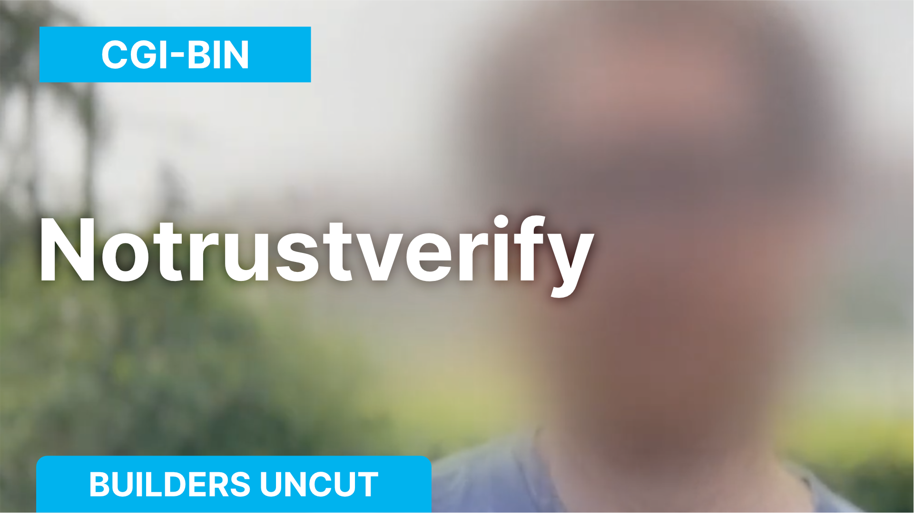
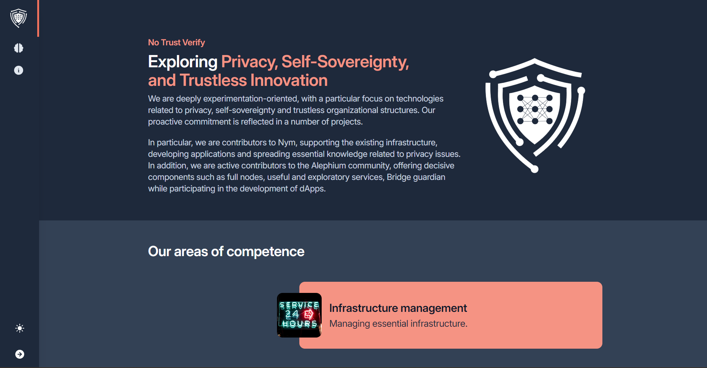
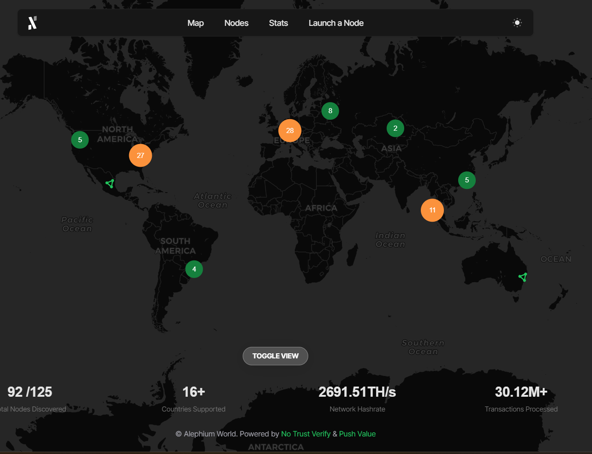

### Builders Uncut — No Trust Verify

_This interview was conducted around the Athens Builders Meetup, which took place at the end of June 2024. If you’re just discovering Alephium’s ecosystem, it’s a great way to learn about all the main projects!_

Here, <a href="https://x.com/cg1_bin" class="markup--anchor markup--p-anchor" data-href="https://x.com/cg1_bin" rel="noopener" target="_blank">cgi_bin</a>, from <a href="https://notrustverify.ch/" class="markup--anchor markup--p-anchor" data-href="https://notrustverify.ch/" rel="noopener" target="_blank">No Trust Verify (NTV)</a> shares his journey into crypto, NTV's history, its involvement with Alephium, and the tools they built for the ecosystem. He discusses their experience with the Alephium community and running a guardian for the bridge. If you prefer reading, find the full (slightly edited) transcript below.

<figure id="6bb5" class="graf graf--figure graf--iframe graf-after--p">

<h1 id="ein-fehler-ist-aufgetreten." class="message">Ein Fehler ist aufgetreten.</h1>
<a href="https://www.youtube.com/watch?v=ac3KAyAfpAw" target="_blank">Sieh dir dieses Video auf www.youtube.com an</a> oder aktiviere JavaScript, falls es in deinem Browser deaktiviert sein sollte.
</figure>

#### Who are you, and what do you do?

We are a team called No Trust Verify (NTV), focused on experimentation, self-sovereignty, and privacy. We’re a group of four, but we prefer to stay discreet and under the radar. Our work revolves around creating dApps and tools for blockchain, particularly on Alephium.

#### How long have you been working as No Trust Verify?

We’ve been around for over two years. We started with two projects, including Alephium, and decided to dive deep into its technology. We’re still here, building and contributing to the ecosystem.

#### How did you get into crypto?

I got into crypto out of interest in peer-to-peer systems and the possibility of exchanging money over the internet. This curiosity led me to explore Bitcoin and its technology, which sparked my deeper interest in the tech behind it.

#### How did you discover Alephium?

A colleague mentioned Alephium to me while it was still in the testnet phase. I joined Discord, started mining on the testnet, and after connecting with the Alephium team, we decided to begin our journey with Alephium.

#### What have you built on Alephium?

We’ve built various tools, such as the <a href="https://x.com/AlphWhale" class="markup--anchor markup--p-anchor" data-href="https://x.com/AlphWhale" rel="noopener" target="_blank">Alephium Whales Watcher</a>, <a href="https://www.alephium.world/" class="markup--anchor markup--p-anchor" data-href="https://www.alephium.world/" rel="noopener" target="_blank">Alephium World</a>, and a bot for mining notifications. During a hackathon, we also developed the <a href="https://t.me/TipAlphBot" class="markup--anchor markup--p-anchor" data-href="https://t.me/TipAlphBot" rel="noopener" target="_blank">TipAlph</a> bot, which allows users to tip others seamlessly through Telegram.

#### How has your experience with Alephium evolved?

Alephium has grown rapidly, and the team listens closely to community feedback, implementing changes and improvements. The recent developer meetup was a great opportunity to connect face-to-face with people we’ve been chatting with online for years.

#### What’s it like running a guardian for the Alephium bridge?

<a href="https://medium.com/@alephium/the-alephium-bridge-a787d90b2e4a" class="markup--anchor markup--p-anchor" data-href="https://medium.com/@alephium/the-alephium-bridge-a787d90b2e4a" target="_blank">Running a guardian</a> has been a valuable learning experience. We’ve gained insight into how the Wormhole fork works and how the bridge operates. We’re ready to expand to other chains if they become available.

#### What’s next for No Trust Verify?

We plan to continue building tools, helping projects launch, and exploring new dApps. We’re excited about the upcoming projects on Alephium and look forward to diving deeper into them.

#### How do you feel about the Alephium community?

The Alephium community is fantastic — very strong and supportive. It’s great to see everyone helping each other and being enthusiastic about new projects. We enjoy being a part of this community and contributing to its growth.

#### What advice do you have for newcomers to the Alephium community?

For newcomers, start by downloading the wallet and exploring the dApps on <a href="http://alph.land" class="markup--anchor markup--p-anchor" data-href="http://alph.land" rel="noopener" target="_blank">Alph.Land</a>. If you have questions, don’t hesitate to ask in the Discord or Telegram groups — people are always ready to help.

Builders should head to <a href="http://docs.alephium.org" class="markup--anchor markup--p-anchor" data-href="http://docs.alephium.org" rel="noopener" target="_blank">docs.alephium.org</a> for tutorials and resources. The developer channel on <a href="http://alephium.org/discord" class="markup--anchor markup--p-anchor" data-href="http://alephium.org/discord" rel="noopener" target="_blank">Discord</a> is also a great place to get direct support from the core team.

---

**Links:**  
Website: <a href="https://notrustverify.ch/" class="markup--anchor markup--p-anchor" data-href="https://notrustverify.ch/" rel="nofollow noopener" target="_blank">https://notrustverify.ch/</a>  
Twitter: <a href="https://x.com/notrustverif" class="markup--anchor markup--p-anchor" data-href="https://x.com/notrustverif" rel="nofollow noopener" target="_blank">https://x.com/notrustverif</a>  
Telegram: <a href="https://t.me/notrustverify" class="markup--anchor markup--p-anchor" data-href="https://t.me/notrustverify" rel="nofollow noopener" target="_blank">https://t.me/notrustverify</a>

---

For any questions or feedback, reach out to us on <a href="http://alephium.org/discord" class="markup--anchor markup--p-anchor" data-href="http://alephium.org/discord" rel="noopener ugc nofollow noopener" target="_blank">Discord</a> or <a href="https://t.me/alephiumgroup" class="markup--anchor markup--p-anchor" data-href="https://t.me/alephiumgroup" rel="noopener ugc nofollow noopener" target="_blank">Telegram</a>, and follow <a href="https://x.com/alephium" class="markup--anchor markup--p-anchor" data-href="https://x.com/alephium" rel="noopener ugc nofollow noopener" target="_blank">@alephium on Twitter</a> for the latest updates!
