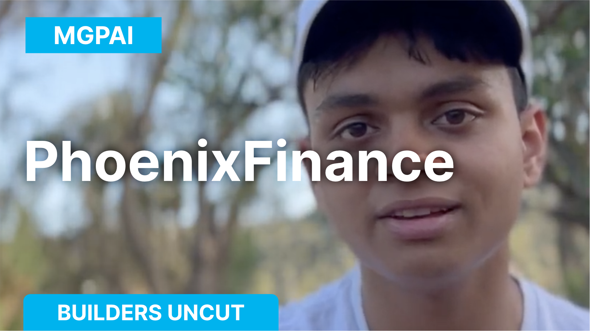
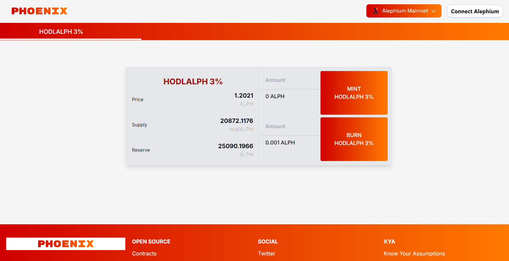

### Builders Uncut — Phoenix Finance

_This interview was conducted around the Athens Builders Meetup, which took place at the end of June 2024. If you’re just discovering Alephium’s ecosystem, it’s a great way to learn about all the main projects!_

<a href="https://x.com/shishirpai" class="markup--anchor markup--p-anchor" data-href="https://x.com/shishirpai" rel="noopener" target="_blank">Mgpai</a> shares his journey into crypto, from building gaming PCs to developing blockchain projects. He highlights his experience at the Alephium developer meetup, and how building on Alephium is easy. Find the full (slightly edited) transcript below if you prefer reading.

<figure id="3850" class="graf graf--figure graf--iframe graf-after--p">

<h1 id="ein-fehler-ist-aufgetreten." class="message">Ein Fehler ist aufgetreten.</h1>
<a href="https://www.youtube.com/watch?v=1TUzuEMt2VM" target="_blank">Sieh dir dieses Video auf www.youtube.com an</a> oder aktiviere JavaScript, falls es in deinem Browser deaktiviert sein sollte.
</figure>

#### What brought you to Alephium?

I started my journey in the crypto space back in 2019 or 2020. Initially, I was really into electronics, building my own PCs for gaming. When I discovered that I could mine crypto with my GPU to earn back the money I spent on it, I convinced my dad to buy one for me.

That’s when I dove deep into mining, starting with Ethereum. Over time, I wanted to explore more, so I began coding and working with blockchain technology. Eventually, through the Ergo community, I discovered Alephium, and I found the community here to be incredibly welcoming and supportive.

#### Can you tell us about your project?

A few months ago, during the first Alephium hackathon, I started building a project called <a href="https://www.phoenixfi.app/" class="markup--anchor markup--p-anchor" data-href="https://www.phoenixfi.app/" rel="noopener" target="_blank">Phoenix Finance</a>. I had already developed this project on other blockchains, so I decided to implement a version of it on Alephium to learn how the protocol works.

The project is a fun little game, nothing too serious, but it allowed me to get from zero to a fully functional, end-to-end project deployed to Mainnet within two weeks. The goal was to explore and experiment, and I’m happy with how it turned out.

#### What are your plans for Phoenix Finance?

Right now, the game is focused on the native ALPH token and a derivative token created by the game. My next step is to expand it so that other native tokens can use it, especially meme coins, to generate engagement and incentivize users.

I want to offer other communities the ability to deploy their own versions of the game on my platform, which could help boost their projects by providing a fun and engaging use case for their tokens.

#### What’s your take on Alephium’s developer ecosystem?

I’m really impressed with the Alephium developer community. The builders here are super focused and interested in what everyone else is doing. It’s exciting to see multiple competing DEXs being developed, each with unique protocols, and everyone here is respectful of each other’s work.

This healthy competition is great for pushing the entire ecosystem forward, and it gives investors a real sense of what Alephium is capable of. I’m feeling very positive about Alephium’s future, and I’m eager to see these projects go live on Mainnet.

#### What’s the future of Phoenix Finance?

Looking further down the line, I see Phoenix Finance growing into a broader financial platform. Beyond the game, I’m interested in developing other financial tools, like multisig digital wallets, similar to Gnosis Safe on Ethereum.

I’m also intrigued by cross-chain possibilities and would like to explore building these tools across multiple blockchains, including Alephium. Additionally, I have some ideas around algorithmic stablecoins and oracles, based on research papers from colleagues. If time permits, I’d love to gather a group of developers to work on these concepts, as I believe they could be powerful tools when implemented correctly.

---

**Links:**

Website: <a href="https://www.phoenixfi.app/" class="markup--anchor markup--p-anchor" data-href="https://www.phoenixfi.app/" rel="nofollow noopener" target="_blank">https://www.phoenixfi.app/</a>  
Twitter: <a href="https://twitter.com/PhoenixErgo" class="markup--anchor markup--p-anchor" data-href="https://twitter.com/PhoenixErgo" rel="nofollow noopener" target="_blank">https://twitter.com/PhoenixErgo</a>  
Telegram: <a href="https://t.me/hodlCoinGame" class="markup--anchor markup--p-anchor" data-href="https://t.me/hodlCoinGame" rel="nofollow noopener" target="_blank">https://t.me/hodlCoinGame</a>

---

Mgpai was a speaker at the Athens Builders Meetup!

<figure id="ae13" class="graf graf--figure graf--iframe graf-after--p">

<h1 id="ein-fehler-ist-aufgetreten." class="message">Ein Fehler ist aufgetreten.</h1>
<a href="https://www.youtube.com/watch?v=jhzjXJjMDSk" target="_blank">Sieh dir dieses Video auf www.youtube.com an</a> oder aktiviere JavaScript, falls es in deinem Browser deaktiviert sein sollte.
</figure>

You can also find all the talks of the Athens Builders Meetup <a href="https://medium.com/@alephium/all-the-athens-meetup-presentations-f419195640ce" class="markup--anchor markup--p-anchor" data-href="https://medium.com/@alephium/all-the-athens-meetup-presentations-f419195640ce" rel="noopener" target="_blank">here</a>.

---

For any questions or feedback, reach out to us on <a href="http://alephium.org/discord" class="markup--anchor markup--p-anchor" data-href="http://alephium.org/discord" rel="noopener ugc nofollow noopener" target="_blank">Discord</a> or <a href="https://t.me/alephiumgroup" class="markup--anchor markup--p-anchor" data-href="https://t.me/alephiumgroup" rel="noopener ugc nofollow noopener" target="_blank">Telegram</a>, and follow <a href="https://x.com/alephium" class="markup--anchor markup--p-anchor" data-href="https://x.com/alephium" rel="noopener ugc nofollow noopener" target="_blank">@alephium on Twitter</a> for the latest updates!

[View original.](https://medium.com/p/98744dd31eb5)
