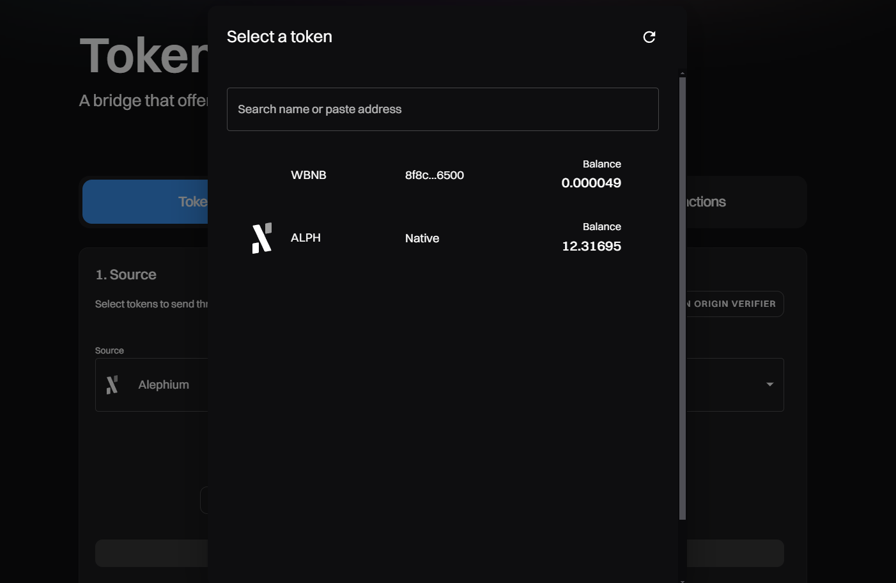
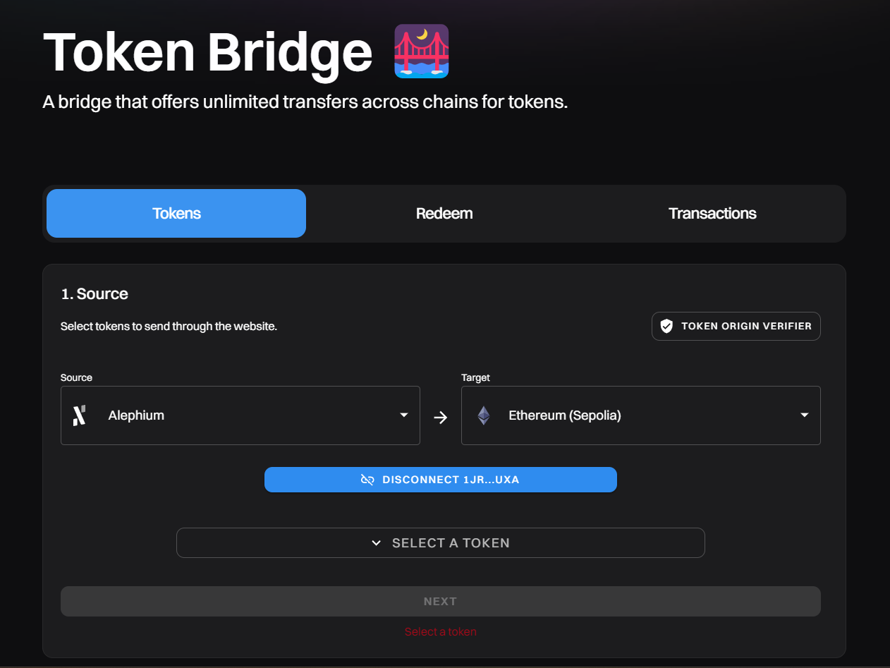
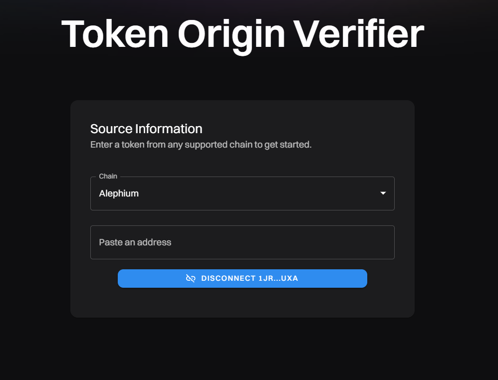
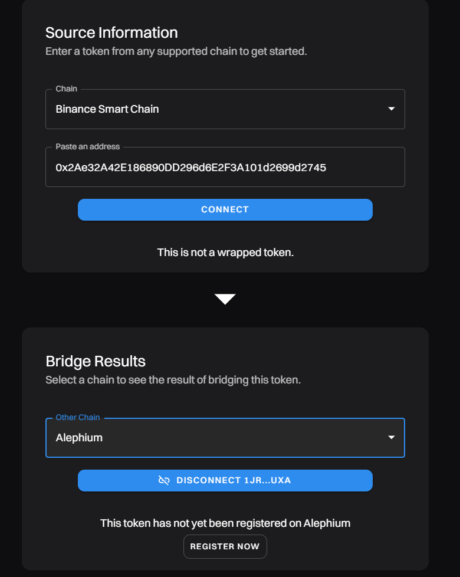
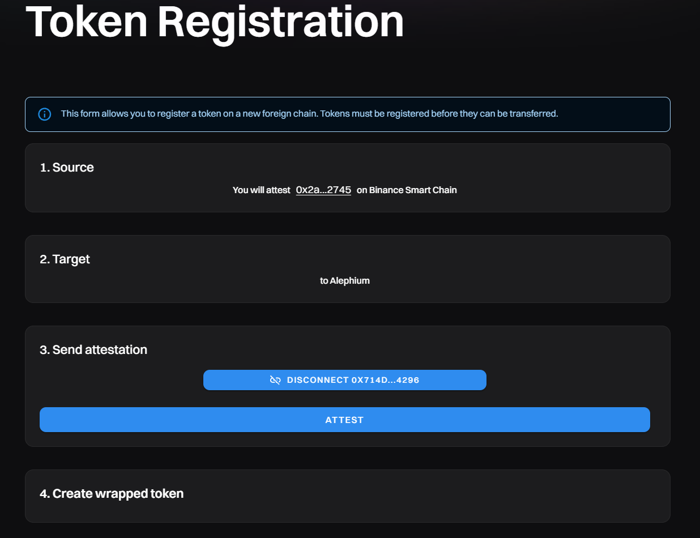
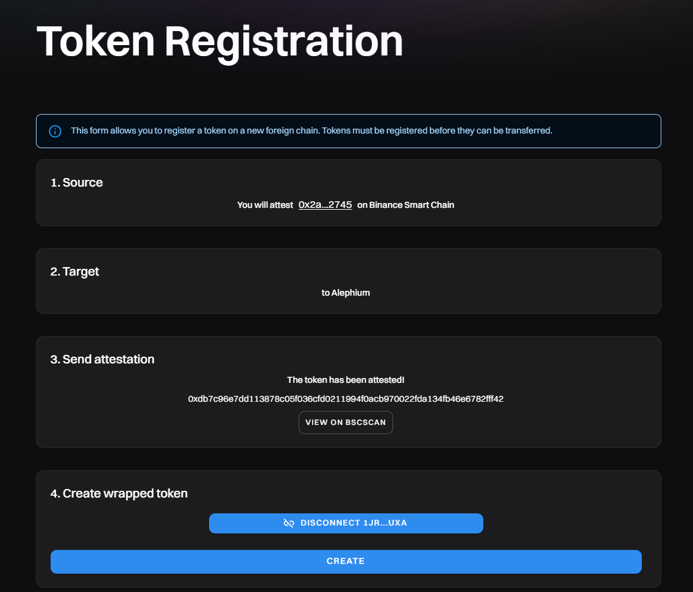
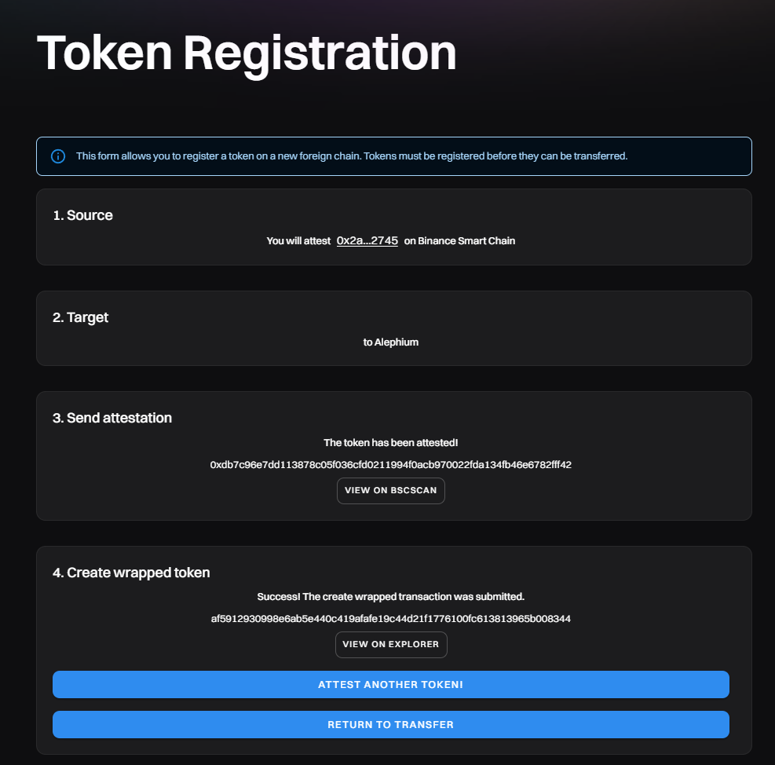
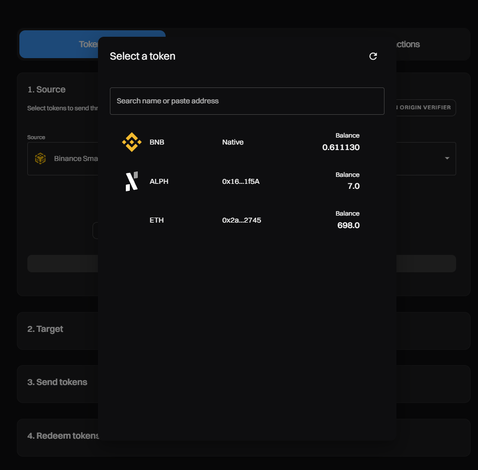

### Token Registration on the Alephium Bridge

#### Enabling bridging for new assets from and to BNB Smart Chain testnet

You wanted to bridge a token, but it was unavailable on the token selection page. What can you do?

Click on the “Token Origin Verifier” button. It will allow you to register a new token.

Select the chain and paste the token’s contract address:

The page will show you a “register now” button if the token is not registered yet.

It will ask you to “Attest” the token. This is a request to the Alephium Bridge to add the token.

After the transaction is completed, you can create the token on the destination chain.

After completion, the token will be available for bridging.

Now, the token is available.

---

If you need help or have extra questions, you are welcome to reach out in the \# 🎨dev-dapp channel on <a href="https://alephium.org/discord/" class="markup--anchor markup--p-anchor" data-href="https://alephium.org/discord/" rel="noopener ugc nofollow noopener noopener" target="_blank">Discord</a>, or in the Alephium <a href="https://t.me/alephiumgroup" class="markup--anchor markup--p-anchor" data-href="https://t.me/alephiumgroup" rel="noopener ugc nofollow noopener noopener" target="_blank">Telegram</a> channel. Don’t forget to follow <a href="https://twitter.com/alephium" class="markup--anchor markup--p-anchor" data-href="https://twitter.com/alephium" rel="noopener ugc nofollow noopener noopener" target="_blank">@alephium on Twitter</a> to stay up-to-date.

[View original.](https://medium.com/p/d849e8685c1b)
