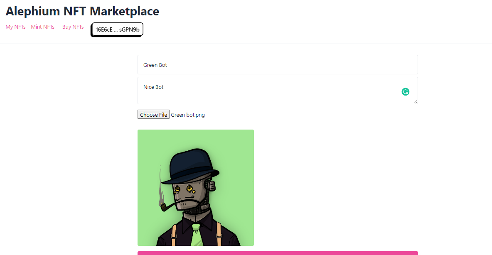

#### Download it and try the new features on Alephium Testnet!

> Important Notice

> As this is the first release of the browser extension wallet, the community is invited to download it and test the new wallet features. **_It is very important to securely store your seed phrase if you intend to use it on the mainnet_**, to be able to retrieve your funds if an error happens. In case you find any bugs, or if you want to make any suggestions for improvements, please reach out to the <a href="https://alephium.org/discord" class="markup--anchor markup--blockquote-anchor" data-href="https://alephium.org/discord" rel="noopener" target="_blank">dev-wallet</a> channel on Discord.

---

Alephium launched its browser extension wallet, designed to provide a secure and convenient way for users to manage their digital assets and interact with decentralized applications (dApps) on the Alephium network.

This wallet was based on the <a href="https://github.com/argentlabs/argent-x" class="markup--anchor markup--p-anchor" data-href="https://github.com/argentlabs/argent-x" rel="noopener" target="_blank">Argent X</a> wallet, with changes and improvements to make it suitable for the Alephium blockchain. It is **fully compatible with the current mainnet** and includes features that will be available after the Leman Network Upgrade, like Schnorr signatures, addresses book, token lists, etc. These new features can already be tried on Alephium’s testnet and are explained in more detail below.

#### ⬇️ Download the extension wallet

🔵 <a href="https://chrome.google.com/webstore/detail/alephium-extension-wallet/gdokollfhmnbfckbobkdbakhilldkhcj" class="markup--anchor markup--p-anchor" data-href="https://chrome.google.com/webstore/detail/alephium-extension-wallet/gdokollfhmnbfckbobkdbakhilldkhcj" rel="noopener" target="_blank"><strong>Google Chrome store.</strong></a>\*\*  
\*\*🟠 <a href="https://addons.mozilla.org/en-US/firefox/addon/alephiumextensionwallet/" class="markup--anchor markup--p-anchor" data-href="https://addons.mozilla.org/en-US/firefox/addon/alephiumextensionwallet/" rel="noopener" target="_blank"><strong>Firefox Store.</strong></a>

### Main Features

#### dApp Support

One of the standout features of the Alephium browser extension wallet is its robust **dApp support**. The wallet was built to be compatible with decentralized applications deployed on the Alephium network, making it easy for users to interact with their favorite dApps seamlessly.

#### Token Faucet

Another feature of the Alephium browser extension wallet is its **token faucet** support (a feature enabled on Alephium’s Devnet and Testnet only). This allows users to obtain small amounts of Alephium tokens for testing purposes easily. You just need to click on the “add funds” button and then on the “request \$ALPH” to receive the tokens.

<figure id="7d07" class="graf graf--figure graf-after--p">

<figcaption>Request $ALPH on Testnet and Devnet</figcaption>
</figure>

#### Token List

The wallet includes **token list** support, allowing users to easily view and manage their token balances and transactions. This feature makes it easy for users to keep track of their digital assets and ensure they are always up-to-date.

<figure id="f7d8" class="graf graf--figure graf-after--p">

<figcaption>Add token form</figcaption>
</figure>

#### Address Book

The Alephium browser extension wallet has an **address book** feature for users who repeatedly send transactions to the same addresses. This allows users to save frequently used addresses, helps to avoid typos, and makes it quick and easy to send transactions to the same recipient multiple times.

<figure id="8496" class="graf graf--figure graf-after--p">

<figcaption>Address book</figcaption>
</figure>

#### Schnorr Signatures

Finally, the wallet features **Schnorr Signatures**. This is a more <a href="https://en.wikipedia.org/wiki/Schnorr_signature" class="markup--anchor markup--p-anchor" data-href="https://en.wikipedia.org/wiki/Schnorr_signature" rel="noopener" target="_blank">advanced signature algorithm</a> designed to be faster and more efficient than the traditional ECDSA signature algorithm. Schnorr signatures allow users to securely sign messages and verify their authenticity, ensuring their transactions are always secure and tamper-proof. It also provides faster transaction processing times and lower transaction fees.   
This feature enables <a href="https://nostr.com/" class="markup--anchor markup--p-anchor" data-href="https://nostr.com/" rel="noopener" target="_blank">nostr</a> support, making the wallet capable of signing messages in the social network. It could also be leveraged in other Schnorr-based applications.

<figure id="fd0d" class="graf graf--figure graf-after--p">

<figcaption>Schnorr signature option</figcaption>
</figure>

### Using it on Testnet

The Alephium browser extension wallet is a powerful tool with advanced options and an intuitive design, ready to support the new features introduced with the Leman Network upgrade. You can use it on the Testnet to experience a first taste of Alephium post-Leman Upgrade!

Access the **Testnet NFT Marketplace** here: <a href="https://nft.alephium-testnet.softfork.se/" class="markup--anchor markup--p-anchor" data-href="https://nft.alephium-testnet.softfork.se/" rel="nofollow noopener noopener noopener" target="_blank">https://nft.alephium-testnet.softfork.se/</a>

**Obs: Make sure that your testnet address is on group 0!**

Choose an image and mint your NFT!

Feel free to list it and buy any NFT listed here!

---

If you need assistance, you are welcome to reach out in the community channels on <a href="https://alephium.org/discord/" class="markup--anchor markup--p-anchor" data-href="https://alephium.org/discord/" rel="noopener" target="_blank">Discord</a>, <a href="https://t.me/alephiumgroup" class="markup--anchor markup--p-anchor" data-href="https://t.me/alephiumgroup" rel="noopener" target="_blank">Telegram</a>. And follow <a href="https://twitter.com/alephium" class="markup--anchor markup--p-anchor" data-href="https://twitter.com/alephium" rel="noopener" target="_blank">@alephium on Twitte</a>r to stay up-to-date.
