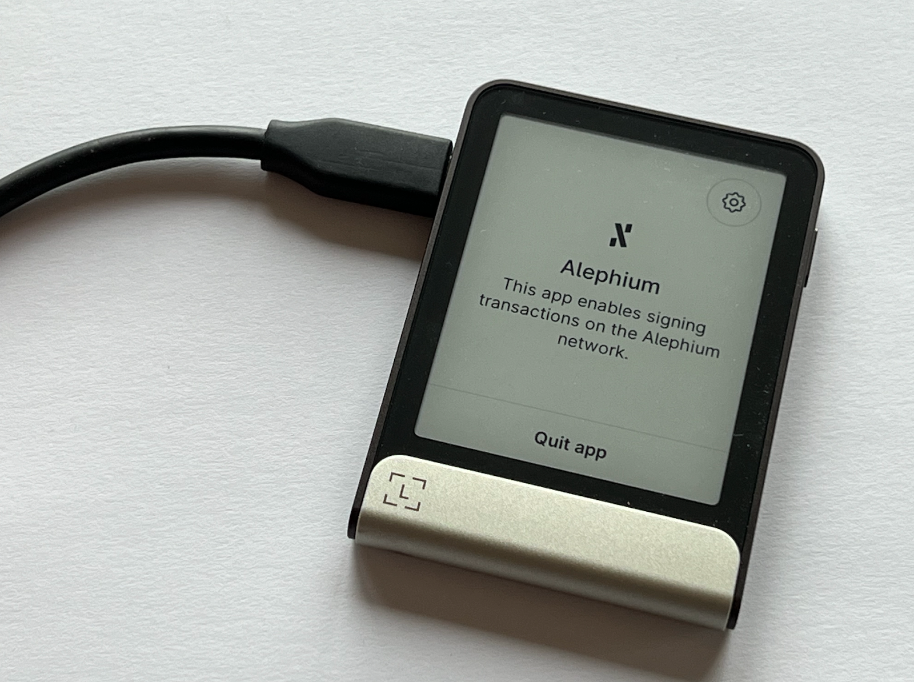

**Alephium x Ledger—**Alephium is thrilled to announce its integration with Ledger hardware wallets, which will give users enhanced security and control over their digital assets.

**Ledger Wallets** — This integration allows users to securely store, send tokens, and interact with decentralized applications (dApps) while keeping their assets protected offline with the full suite of recent Ledger HW (Nano S+ / Nano X / Stax / Flex) — (note that it’s not available for the Nano S)

**Keeping it offline** — By integrating with Ledger, Alephium provides users with a secure way to manage their digital assets, keeping their private keys offline and safe on Ledger’s hardware devices, known for their reliability and security.

**All Alephium Wallets** — Alephium has always proposed beautifully designed & easy to use wallets (<a href="https://alephium.org/#wallets" class="markup--anchor markup--p-anchor" data-href="https://alephium.org/#wallets" rel="noopener" target="_blank">see them all here</a>). From advanced <a href="https://docs.alephium.org/sdk/getting-started" class="markup--anchor markup--p-anchor" data-href="https://docs.alephium.org/sdk/getting-started" rel="noopener" target="_blank">developer tools</a> to <a href="https://alephium.github.io/alephium-toolkit/#/" class="markup--anchor markup--p-anchor" data-href="https://alephium.github.io/alephium-toolkit/#/" rel="noopener" target="_blank">multisig wallet software</a>, Alephium prides itself on helping people have more control and ownership over their assets. The ability to use Alephium’s wallets with Ledger HW is a huge step forward in helping people get extra security for their asset’s custody.

**Ledger support is available today on the** <a href="https://alephium.org/#wallets" class="markup--anchor markup--p-anchor" data-href="https://alephium.org/#wallets" rel="noopener" target="_blank"><strong>browser extension</strong></a> **and desktop wallet**. It is currently being implemented in the mobile wallet and will be available very soon!

#### **How to get started?**

1.  Open the Ledger Live, connect your Ledger device and access the “My Ledger” tab.
2.  <a href="https://support.ledger.com/article/Alephium-ALPH" class="markup--anchor markup--li-anchor" data-href="https://support.ledger.com/article/Alephium-ALPH" rel="noopener" target="_blank">Install</a> the Alephium app on your Ledger Nano S+ / Nano X / Stax / Flex.
3.  Connect your Ledger device to the Alephium Browser Extension wallet available on <a href="https://chromewebstore.google.com/detail/alephium-extension-wallet/gdokollfhmnbfckbobkdbakhilldkhcj" class="markup--anchor markup--li-anchor" data-href="https://chromewebstore.google.com/detail/alephium-extension-wallet/gdokollfhmnbfckbobkdbakhilldkhcj" rel="noopener" target="_blank">Chrome</a> and <a href="https://addons.mozilla.org/en-US/firefox/addon/alephiumextensionwallet/" class="markup--anchor markup--li-anchor" data-href="https://addons.mozilla.org/en-US/firefox/addon/alephiumextensionwallet/" rel="noopener" target="_blank">Firefox</a>.
4.  Follow the on-screen instructions to complete the setup.

For more detailed instructions, visit <a href="https://docs.alephium.org/wallet/ledger/" class="markup--anchor markup--p-anchor" data-href="https://docs.alephium.org/wallet/ledger/" rel="noopener" target="_blank">Alephium’s Ledger guide.</a>

You can also check on Ledger’s support website <a href="https://support.ledger.com/article/Alephium-ALPH" class="markup--anchor markup--p-anchor" data-href="https://support.ledger.com/article/Alephium-ALPH" rel="noopener" target="_blank">here</a>.

More is coming… Soon!

---

For any questions or feedback, reach out to us on <a href="http://alephium.org/discord" class="markup--anchor markup--p-anchor" data-href="http://alephium.org/discord" rel="noopener" target="_blank">Discord</a> or <a href="https://t.me/alephiumgroup" class="markup--anchor markup--p-anchor" data-href="https://t.me/alephiumgroup" rel="noopener" target="_blank">Telegram</a>, and follow <a href="https://x.com/alephium" class="markup--anchor markup--p-anchor" data-href="https://x.com/alephium" rel="noopener" target="_blank">@alephium on Twitter</a> for the latest updates!
