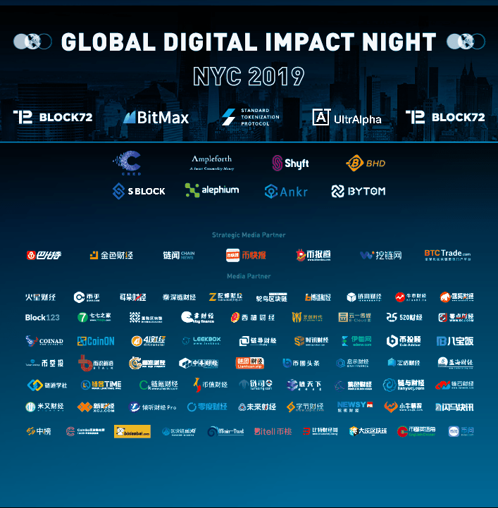

The Alephium team will be attending the Global Digital Impact Night during New York Blockchain Week 2019. Blockchain Week is a series of events, meetups, and conferences that draws thousands of global enthusiasts from all facets of the blockchain community to New York City. The affair runs from May 10th to 18th and consists of various independently organized educational and developer-focused events that aim to promote adoption of blockchain technologies by sharing first-hand information about the industry. From startups and tech developers to long-time traders and experts, enthusiasts will gather to share ideas and discuss the past, present, and future of blockchain. Hundreds of events will take place during the course of the week covering a wide array of blockchain topics.

On May 13th, BitMax.io and Block72 will host their Global Digital Impact Night. The event is designed to promote the circulation of blockchain knowledge in order to better grasp the rapidly changing market, bring together top global resources, and reinforce a united blockchain community. With sponsors Cred, BHD, Shyft, Ampleforth, S Block, Ankr and BYTOM, representatives from more than 30 top institutions and over 50 legendary investors will discuss global blockchain trends and the future of the market.

Alephium, the first scalable blockchain platform to natively support cross-shard transactions, will present their project and discuss how Alephium scales blockchain to handle tens of thousands of transactions per second in an open, secure, permission-less network. The founding team invites you to the Sky Bar in Times Square, NYC at 6:30pm local time on May 13th to learn more about their innovative project.

### ABOUT ALEPHIUM:

Alephium was founded by cryptography and distributed computing expert Cheng Wang. The project aims to scale blockchain to handle tens of thousands of transactions per second. Its core algorithm called BlockFlow combines sharding technology with DAG (Directed Acyclic Graph) and utilizes a scalable UTXO (Unspent Transaction Output) model to resolve the inefficiency of sharding performance during cross-shard transactions. By breaking down smart contracts into token protocols and data protocols, Alephium allows developers to build dApps that support high concurrency scenarios while maintaining the Turing-complete functionalities of smart contracts.
