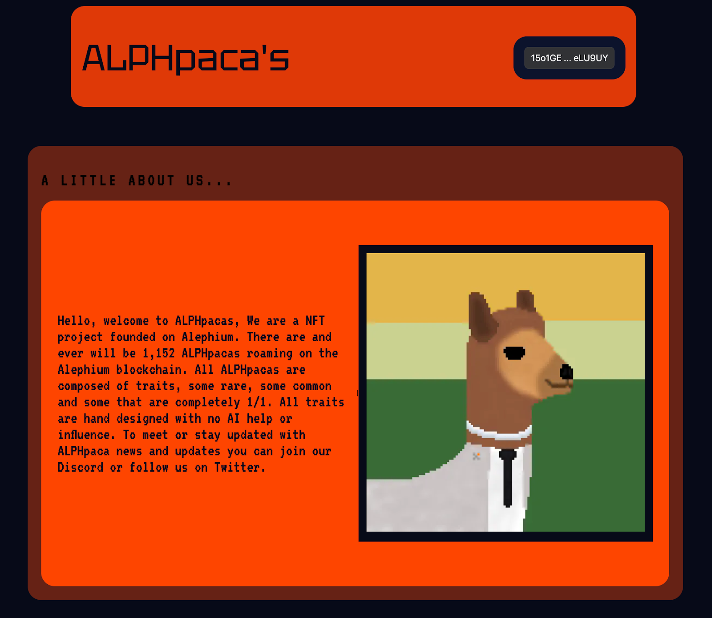
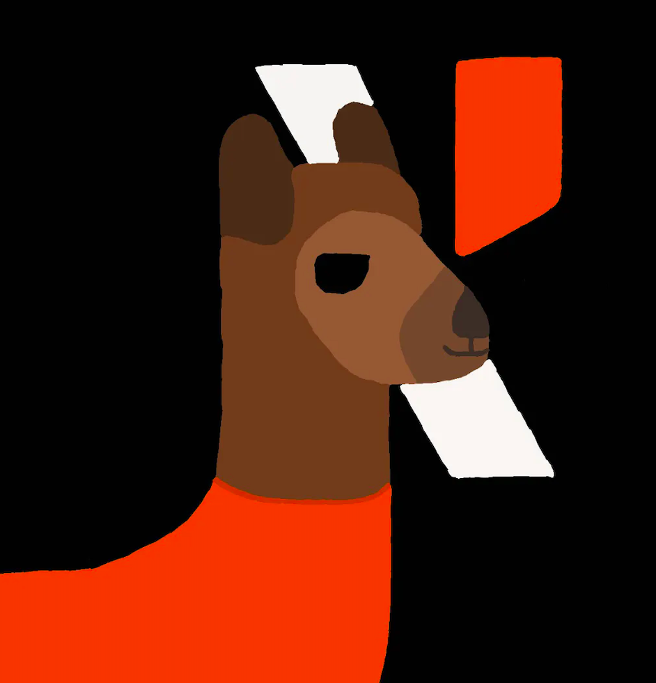

_Alephium’s ecosystem thrives with developers building amazing stuff on top of Alephium (services, dApps, etc…) that deliver a unique experience and provide real utility for the users. In the Builders Highlight series, these builders will share more about their projects, thoughts, and insights on why building on Alephium!_

_Disclaimer: While Alephium is happy to support a growing developer community, it would like to clarify that it does not endorse, audit, or review any software presented in this series and encourages all users to make informed decisions and take personal responsibility for their actions._

The third builder in the series is <a href="https://twitter.com/BenLarkey" class="markup--anchor markup--p-anchor" data-href="https://twitter.com/BenLarkey" rel="noopener" target="_blank">Benjamin</a>, the developer behind the <a href="https://testnet.nft.alephium.org/collection-details?collectionId=e0385e13db8a162d6d419b4b4665d802fe547176143dbd0c7226db02b681fb00" class="markup--anchor markup--p-anchor" data-href="https://testnet.nft.alephium.org/collection-details?collectionId=e0385e13db8a162d6d419b4b4665d802fe547176143dbd0c7226db02b681fb00" rel="noopener" target="_blank">Alphpaca NFT collection</a>. He’s a very regular, insightful & knowledgeable presence in our discord. You can check the project’s website <a href="https://www.alphpaca.dev/" class="markup--anchor markup--p-anchor" data-href="https://www.alphpaca.dev/" rel="noopener" target="_blank">here</a>, its GitHub <a href="https://github.com/larkben/Ergollamas-Alphpacas" class="markup--anchor markup--p-anchor" data-href="https://github.com/larkben/Ergollamas-Alphpacas" rel="noopener" target="_blank">here</a> or contact the project Discord <a href="https://discord.gg/9eBCchJvn7" class="markup--anchor markup--p-anchor" data-href="https://discord.gg/9eBCchJvn7" rel="noopener" target="_blank">here</a>.

#### Tell us a little bit about your project. What is it, what does it, and how does it interact with the Alephium blockchain?

ALPHpaca’s is a tea / sparkling water-driven passion project. The project itself is 1152 (128 x 128) pixel Alpacas. Alephium being able to run on 16 shards (as of now) is half the inspiration for the tokennomics and the features surrounding the art; 16 is a multiple of 1152 and 128. Alephium is an amazing place to launch an NFT project (or any project, more on that later). This is due to users’ enhanced ownership over their tokens on Alephium vs a blockchain like Ethereum.

Alephium users who decide to mint an ALPHpaca can look forward to some utility. Anything but not limited too or promised. Blockchain gaming, on-chain “loot”, and verification/trading tools. If a game is going to exist, it is a long way out, and some of our current utility lies in the ability to use \$PACA, our native token, to purchase ALPHpacas. (1000 Each). This is, however, just a small insight into what ALPHpaca NFT and \$PACA holders can potentially look forward too. The limits for me are truly unknown, and while our team is small (just me), I have an active mindset and have always been a fan of bridging the gap between gaming and blockchain (pretty much ever since I first got into crypto).

It is my promise to ALPHpaca holders to do everything my mind can comprehend to help make ALPHpacas a truly unique project, and once ALPHpacas are minted, there will be no add-on purchases to receive more from them. This is the way.

#### What motivated you to develop on Alephium blockchain, and what set it apart from other blockchain platforms?

Everyone knows the testing involved in making any project run smoothly, and for a college student like myself, paying high gas fees was just not an option. Competing with thousands of other projects for market share, albeit with more eyes, is incredibly hard for a one-man operation. Many of the top projects on Ethereum, however, are just art. I want to create something artistic yet inspirational for anyone wanting to build on Alephium (If I can do it, you can do it is the mentality).

I love seeing new art be created, so for me, just art is sometimes good enough but I wanted to create something that reflects my interests, in this case, gaming. Alephium has some basic network activity, but I want to make it so we can see just how powerful Alephium is with real-time game items coming onto the network (Burnable Items, of Course). I am motivated by nothing else but impacting something greater than myself. As far as doing this all on Ethereum or cheaper networks, I mentioned the first-class citizen token mechanics built into Alephium that are extremely innovative.

That said, the stack is getting better and more understandable every day. It didn’t make any sense at first, but a little frustration and patience are all that is required when learning something new. Practice makes perfect.

#### What tech stack did you use in your project? What did you consider when choosing the right tech stack for your project?

I so far have taken bits and pieces from multiple Alephium repos; while I’m still far from a proper minting machine at the moment, every day, I figure out something new and can build further and further towards resources that I will be making open source so every Alephium user can join in on the fun of being able to create a minting machine.

In any tech stack, if the documentation is good and the product works well, I’m in. If the documentation is not understandable or executable by a typical computer user, it needs to be simplified. While the devs are working hard towards the bridge, I am working towards updating these docs in my repos and creating applications for anyone to use.

#### What features are you most proud of?

The main things aren’t built yet, but I’m proud of my dedication to onboard tech-savvy users and just users who want to create but have no interest in learning the stack.

I plan to make anything made for ALPHpacas completely open source and extremely easily adjustable for people interested in taking their art spin on it. As for what’s built, we have an easy-to-use discord bot that is transparent in its intentions and works well with users.

The plans for this bot are to be able to display on-chain metrics such as how centralized NFTs are or if ALPHpaca whales are selling or buying, or if new whales are forming. Bringing this data to ALPHpacas and other projects brings valuable data back to users and useful data to project teams.

#### Could you tell us about some of the challenges you faced while building and how you overcame them?

I suspect there will be some very big challenges in the near future, but in my experience, the key to solving anything with code is either to explain every little part of your code to a rubber duck and have it make sense or just take a break and come back to it.

The current cycle involves swapping between the ALPH contract stack and making art/node mechanics. In this sense, it’s good to have side projects as long as you are still getting tasks done.

#### What has been the most rewarding part of developing your project, and why?

The most rewarding part of development is seeing other people happy about your project. Seeing ALPHpacas receiving more recognition tells me I’m on the right path and there’s no slowing me down. Jokes aside, I will be happy to help onboard those who lack a technical background. I think these people will make Alephium shine.

#### What do you think are some of the future potential use cases of Alephium that could be explored?

I think this idea of Alephium users having first-class rights over their tokens rather than a contract in most cases allows for some interesting things; I don’t know a lot, so I’m sure Cheng could fill in the gaps where I am mistaken or where things need clarification but to me, it sounds like some interesting opportunities lie there.

I think one of the use cases that is never mentioned but should be is that Cheng is a resource; he’s here to help anyone build something, no matter what exactly it might be.

#### Lastly, what advice would you give to someone looking to build on Alephium, based on your experience?

Based on my little experience developing, I’d say my developer career officially started in May of this year. That doesn’t sound long but I have learned a lot, to say the least, no matter where I went, I never felt as valued as I did talking, developing, and just being a part of the Alephium space.

If you want to develop on Alephium, just go for it; eventually, you’ll finally push that first smart contract or test token contract to mainnet, and a whole world of new things opens up at your fingertips. The community is active, thriving, and motivational. I’ll stop there: it’s better for you to see it yourself.

Thanks, Benjamin, for your answers! Alephium is thrilled to have such talent builders in the community! You can find the Alphaca NFT collection on testnet on <a href="https://testnet.nft.alephium.org/collection-details?collectionId=e0385e13db8a162d6d419b4b4665d802fe547176143dbd0c7226db02b681fb00" class="markup--anchor markup--p-anchor" data-href="https://testnet.nft.alephium.org/collection-details?collectionId=e0385e13db8a162d6d419b4b4665d802fe547176143dbd0c7226db02b681fb00" rel="noopener" target="_blank">Alephium’s NFT marketplace</a>!

Have you built something or have a nice idea and want to request a grant or reward? You can access the <a href="https://github.com/alephium/community/blob/master/Grant%26RewardProgram.md" class="markup--anchor markup--p-anchor" data-href="https://github.com/alephium/community/blob/master/Grant%26RewardProgram.md" rel="noopener" target="_blank">Alephium Community Grants &amp; Reward Program page</a> for more info!

If you need help or have extra questions, you are welcome to reach out in the \# 🎨dev-dapp channel on <a href="https://alephium.org/discord/" class="markup--anchor markup--p-anchor" data-href="https://alephium.org/discord/" rel="noopener" target="_blank">Discord</a>, or in the Alephium <a href="https://t.me/alephiumgroup" class="markup--anchor markup--p-anchor" data-href="https://t.me/alephiumgroup" rel="noopener" target="_blank">Telegram</a> channel. Don’t forget to follow <a href="https://twitter.com/alephium" class="markup--anchor markup--p-anchor" data-href="https://twitter.com/alephium" rel="noopener" target="_blank">@alephium on Twitter</a> to stay up-to-date.
