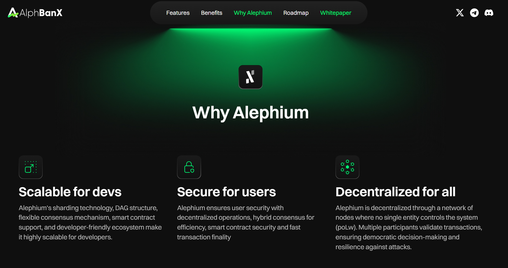

_This interview was conducted around the Athens Builders Meetup, which took place at the end of June 2024. If you’re just discovering Alephium’s ecosystem, it’s a great way to learn about all the main projects!_

Here, Timothy, the founder of <a href="https://www.alphbanx.com/" class="markup--anchor markup--p-anchor" data-href="https://www.alphbanx.com/" rel="noopener" target="_blank">AlphBanx</a>, shares his journey into crypto, his discovery of Alephium, and the innovative approach of AlphBanx in the DeFi space. He discusses the project’s focus on user-friendly design, the importance of community involvement, and plans for integration with the Alephium ecosystem. Find the full (slightly edited) transcript below if you prefer reading.

`video: https://www.youtube.com/watch?v=OE3rCD0i12M`

#### What is your name and what do you do?

My name is Timothy, and I’m the founder of <a href="https://www.alphbanx.com/" class="markup--anchor markup--p-anchor" data-href="https://www.alphbanx.com/" rel="noopener" target="_blank">AlphBanx</a>. We’re focused on building a stablecoin on the Alephium blockchain.

#### How did you get into crypto?

I got into crypto in 2016 when I was invited to a meetup in Switzerland by friends. It was my first exposure to smart contracts and DeFi, and it really opened my eyes to the possibilities. Since then, I’ve been deeply involved in the space, from opening a Bitcoin shop to consulting and working with various crypto projects.

#### How did you find out about Alephium?

I found out about Alephium through a friend who was already invested in it. After checking out his investments, I was particularly drawn to Alephium because of its team and technology. The user-friendly design of their desktop wallet impressed me, and I saw great potential in their blockchain, especially with their unique sharding algorithm and proof of less work approach.

#### What is AlphBanx?

AlphBanx is a DeFi project that allows users to put up ALPH as collateral and mint a stablecoin called AlphBanx Dollar (ABD), similar to MakerDAO or Liquity. We’ve built in multiple layers of protection to maintain the peg, including a 150% collateral ratio, auction pools for liquidations, and a redemption option that ensures the stablecoin’s value remains consistent.

#### Who is your target audience for AlphBanx?

Our main focus is on user experience. We want to make sure that anyone, even a ten-year-old with €50, can use our platform without needing to read extensive documentation. The goal is to create a DeFi platform that is accessible to millions of users, making complex financial tools simple and easy to use.

#### How do you plan to integrate with the Alephium ecosystem?

We’ve been building relationships with other projects in the Alephium ecosystem, like <a href="http://ayin.app" class="markup--anchor markup--p-anchor" data-href="http://ayin.app" rel="noopener" target="_blank">Ayin</a> and <a href="http://sezame.app" class="markup--anchor markup--p-anchor" data-href="http://sezame.app" rel="noopener" target="_blank">Sezame Wallet</a>. The goal is to create seamless integrations that allow users to manage their loans and interact with other DeFi services directly from their wallets. This will increase the utility of both AlphBanx and the overall ecosystem.

#### How important is community to AlphBanx?

The community is everything for us. We’re developing AlphBanx as a DAO with a strong focus on community governance. The community will help decide on upgrades and new features, making them a crucial part of our project’s evolution.

#### What is your timeline for launching AlphBanx?

We’re currently in the testing phase, and if everything goes well, we’re looking at a launch within the next two to three months. However, our priority is ensuring everything is secure, so we won’t rush the process.

#### How do you ensure the security of AlphBanx?

Security is our top priority. We’ll be working with at least two independent auditing firms to thoroughly review our smart contracts before launch. Additionally, we’re in discussions with the Alephium team to see if they can provide further insights or improvements.

#### What was your experience at the Alephium builders meetup in Athens?

The Athens meetup was amazing. It was great to see so many young and motivated developers already working on Alephium. It really confirmed that Alephium is built for the long term, and I’m excited to see how these developers grow and contribute to the ecosystem in the years to come.

This is the end of our interview. Thank you, Timothy, for taking the time to do this interview with us!

---

Links:

Website: <a href="https://www.alphbanx.com/" class="markup--anchor markup--p-anchor" data-href="https://www.alphbanx.com/" rel="nofollow noopener" target="_blank">https://www.alphbanx.com/</a>  
Twitter: <a href="https://twitter.com/alephiumbank" class="markup--anchor markup--p-anchor" data-href="https://twitter.com/alephiumbank" rel="nofollow noopener" target="_blank">https://twitter.com/alephiumbank</a>  
Discord: <a href="https://discord.gg/56rgKJ9HGW" class="markup--anchor markup--p-anchor" data-href="https://discord.gg/56rgKJ9HGW" rel="nofollow noopener" target="_blank">https://discord.gg/56rgKJ9HGW</a>

---

Timothy was a speaker at the Athens Builders Meetup!

`video: https://www.youtube.com/watch?v=9hAYzsLmIBc`

You can also find all the talks of the Athens Builders Meetup <a href="https://medium.com/@alephium/all-the-athens-meetup-presentations-f419195640ce" class="markup--anchor markup--p-anchor" data-href="https://medium.com/@alephium/all-the-athens-meetup-presentations-f419195640ce" rel="noopener" target="_blank">here</a>.

---

For any questions or feedback, reach out to us on <a href="http://alephium.org/discord" class="markup--anchor markup--p-anchor" data-href="http://alephium.org/discord" rel="noopener ugc nofollow noopener" target="_blank">Discord</a> or <a href="https://t.me/alephiumgroup" class="markup--anchor markup--p-anchor" data-href="https://t.me/alephiumgroup" rel="noopener ugc nofollow noopener" target="_blank">Telegram</a>, and follow <a href="https://x.com/alephium" class="markup--anchor markup--p-anchor" data-href="https://x.com/alephium" rel="noopener ugc nofollow noopener" target="_blank">@alephium on Twitter</a> for the latest updates!
