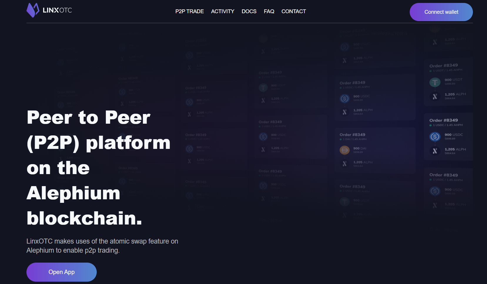

_This serie of interviews was conducted at the Athens Builders Meetup, which took place at the end of June 2024. If you’re just discovering Alephium’s ecosystem, it’s a great way to learn about all the main projects!_

Here, Radu, from <a href="https://x.com/linx_labs" data-href="https://x.com/linx_labs">Linx Labs</a> shares the latest developments on <a href="https://linxotc.com/" data-href="https://linxotc.com/">Linx OTC</a>, plans for the upcoming lending platform and his vision for the future of Alephium’s DeFi Ecosystem.Find the full (slightly edited) transcript below if you prefer reading.

`video: https://www.youtube.com/watch?v=yfgOOLGjp4E`

#### Can you present yourself briefly and the project that you are building?

I’m Radu, a co-founder of Linx. We are building on Alephium. We started as a DeFi project and began our journey a couple of years ago on a different chain, where we built a <a href="http://LinxWallet.xyz" data-href="http://LinxWallet.xyz">wallet</a>. We solved the user experience problem effectively, so users no longer have to care about shards and can enjoy a smooth experience sending tokens. We then switched to Alephium to make everything easier.

Recently, we launched a platform called <a href="https://linxotc.com/" data-href="https://linxotc.com/">Linx OTC</a>, allowing users to swap tokens without a middleman. Alephium enables this unique feature, allowing OTC trades without an escrow, which is quite amazing. Next, we are working on a peer-to-peer lending platform, simplifying lending to the bare minimum. You can choose the duration of the loan, the collateral as a lender, and the interest you want to earn. It’s as simple as possible.

#### So it’s more the Aave type than the MakerDAO type, right?

It’s not like Aave. Aave uses a model where users pool funds, while our approach is more of a marketplace. It’s literally peer-to-peer without a fund pool for borrowing or depositing collateral.

#### So, the risk is completely segregated from one person to the next.

That’s right. Each loan stands alone.

#### Does it have to do with the fact that it’s UTXO-based and that atomicity is involved?

We leverage UTXO for swaps, but not for lending.

#### For the lending protocol, if I’m a lender with 100,000 USD to lend, can a borrower take part of the loan, or do they need to take everything?

In the initial version, they need to take everything. However, partial loans are high on our feature list for v2. We’ve received feedback on this and will address it.

#### You already have a roadmap. What has changed since the hackathon six months ago, especially with the recent Rhône upgrade?

When we started building, we were amazed by how well the Alephium tooling was put together. The Alephium team has made it super easy for any developer from a different chain to get started. They deliver updates consistently. With the release of SDK 1.0, it keeps getting better, which is rare and impressive.

#### What are your next steps for Linx OTC?

We launched OTC on Mainnet with swaps. The next step is to launch lending on Mainnet, completing our v1 of OTC.

#### How do you see the evolution of the DeFi ecosystem on Alephium in the next two years?

I envision a tight community of builders working together instead of competing. Building solid, user-friendly core products will help onboard new users easily. Collaboration will lead to products that are well-integrated and user-friendly.

#### What improvements would help you build better, faster, and stronger?

It’s not necessarily about building faster or better, but fostering connections between builders in the community. More hackathons, meetups, and workshops would help people get to know each other and what everyone else is building. This collaboration will lead to products that are well-integrated and provide an amazing user experience.

#### Is there anything you would like to add?

Go Alephium, that’s all.

---

#### Links:

Website: <a href="https://linxotc.com/" data-href="https://linxotc.com/" rel="nofollow noopener noopener">https://linxotc.com/</a>  
Twitter: <a href="https://x.com/linx_labs" data-href="https://x.com/linx_labs" rel="nofollow noopener noopener">https://x.com/linx_labs</a>  
Telegram: <a href="https://t.me/linx_wallet_chat" data-href="https://t.me/linx_wallet_chat" rel="nofollow noopener noopener">https://t.me/linx_wallet_chat</a>  
Discord: <a href="https://discord.com/invite/g434BaWTFb" data-href="https://discord.com/invite/g434BaWTFb" rel="nofollow noopener noopener">https://discord.com/invite/g434BaWTFb</a>

---

For any questions or feedback, reach out to us on [Discord](/discord) or <a href="https://t.me/alephiumgroup" data-href="https://t.me/alephiumgroup" rel="noopener ugc nofollow noopener noopener noopener noopener noopener">Telegram</a>, and follow <a href="https://x.com/alephium" data-href="https://x.com/alephium" rel="noopener ugc nofollow noopener noopener noopener noopener noopener">@alephium on Twitter</a> for the latest updates!
