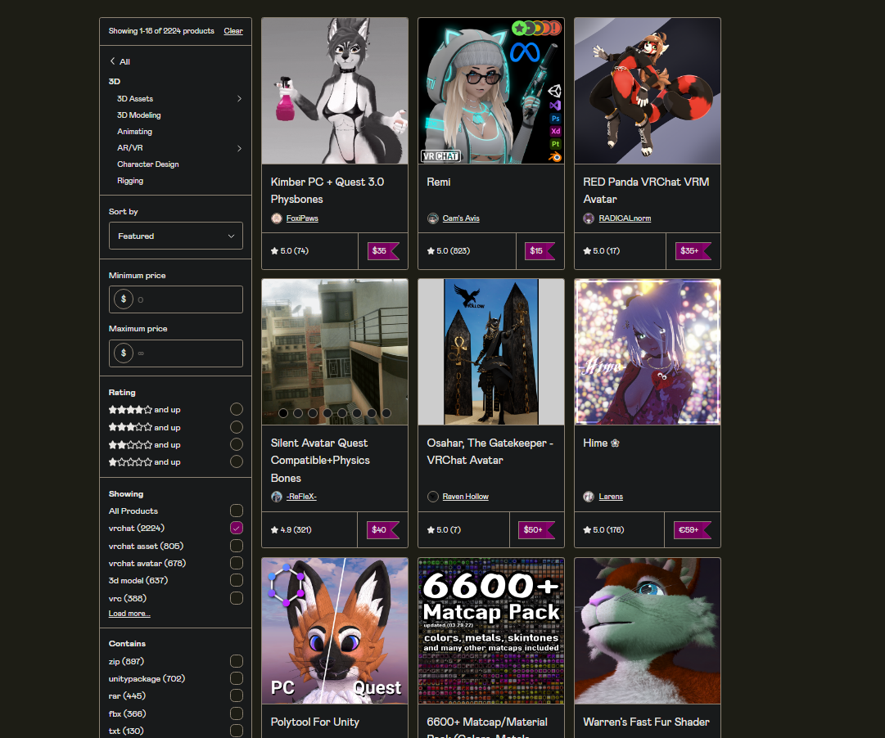

### Community Highlight \#4, MontaiL

#### Once in a while, the spotlight is put on one active member of the Alephium community. This is an opportunity to showcase community members’ contributions to the ecosystem, what drives them and what they are passionate about! More episodes: <a href="https://medium.com/@alephium/community-highlight-wilhelm-k%C3%A4llstr%C3%B6m-aka-oracleuggla-81d3938c5692" class="markup--anchor markup--h4-anchor" data-href="https://medium.com/@alephium/community-highlight-wilhelm-k%C3%A4llstr%C3%B6m-aka-oracleuggla-81d3938c5692" target="_blank"><em>#1 here</em></a>_,_ <a href="https://medium.com/@alephium/community-highlight-cgi-bin-c102cc106f19" class="markup--anchor markup--h4-anchor" data-href="https://medium.com/@alephium/community-highlight-cgi-bin-c102cc106f19" target="_blank"><em>#2 here</em></a>_,_ <a href="https://medium.com/@alephium/community-highlight-3-digdug-48a7ec868504" class="markup--anchor markup--h4-anchor" data-href="https://medium.com/@alephium/community-highlight-3-digdug-48a7ec868504" target="_blank"><em>#3 here</em></a>_,_ <a href="https://medium.com/@alephium/community-highlight-5-txn-71c4fd76ffe8" class="markup--anchor markup--h4-anchor" data-href="https://medium.com/@alephium/community-highlight-5-txn-71c4fd76ffe8" rel="noopener" target="_blank">#5 here</a> and <a href="https://medium.com/@alephium/community-highlight-6-waldi-zkit-beats-37af1f6df3b8" class="markup--anchor markup--h4-anchor" data-href="https://medium.com/@alephium/community-highlight-6-waldi-zkit-beats-37af1f6df3b8" rel="noopener" target="_blank">#6 here</a>.

**This young blood is a creative and engaged Alephium OG. Joining the** <a href="https://alephium.org/discord" class="markup--anchor markup--p-anchor" data-href="https://alephium.org/discord" rel="noopener" target="_blank"><strong>Discord</strong></a> **early on, he quickly made himself a comfortable spot in the community with a friendly can-do attitude, a steady supply of home-cooked memes and by helping many peers getting familiar with Alephium. Please give a warm applause for MontaiL!**

#### What can we call you and where should we picture you?

You can call me Monty or MontaiL. Where I am located geographically is not of importance in this space. But imagine a nerd dealing with life in a dying city. Where everyday less and less people reside. Those truly interested will find me.

#### Tell us about yourself/your persona.

Oh me, yes. I am a 21 year old Internet Adventurer. I have experimented with all sorts of hobbies and projects. I have gone from Hosting Minecraft Discord and other Groups/Servers, to creating virtual content for a game called VRChat, dabbling with Game Making, Content Creation, Video Editing and even Art.

I have been in the crypto scene ever since 2012, when Bitcoin made one of its many big moves. At the time I was just a bystander since my parents were not willing to buy any of it. I made sure to tell them how ignorant they were about it and how much they missed out on.

I am a big Japanese Cars Guy. I can name you almost every car there is. And I dream of owning one but, sadly due to the quality of the local infrastructure, I do not dare buy something that I will feel bad about driving on the roads here. Or should I say really tracks.

I am a big nerd, while by my profile picture most can tell that I am a furry. Well _was_ a furry, until it became popular and ultimately ruined. I remained but a survivor of what once was a community. But I made the art and it does represent me.

#### How did you find out about Alephium?

Not too long ago, on a fateful evening, a person whom I’ve met in real life introduced me to Alephium. At first I was skeptical of it but then I looked deeper into it and I was already hooked.

I am actually surprised by how unpopular and under the radar this project has remained so far. I do speculate that it might be because of the recent Bear Market. So hopefully with the end of this bear-cycle we will see some attention flow into Alephium, bringing us some new comrades.

#### What excites you about Alephium?

Oh man, while I may not be fully aware of what’s coming, I do feel anxiety from the news revealed so far. <a href="https://medium.com/@alephium/announcing-the-leman-network-upgrade-c01a81e65f0e" class="markup--anchor markup--p-anchor" data-href="https://medium.com/@alephium/announcing-the-leman-network-upgrade-c01a81e65f0e" target="_blank">Leman upgrade,</a> <a href="https://github.com/alephium/wormhole-fork" class="markup--anchor markup--p-anchor" data-href="https://github.com/alephium/wormhole-fork" rel="noopener" target="_blank">Bridge,</a> CEX, <a href="https://github.com/alephium/alephium-web3" class="markup--anchor markup--p-anchor" data-href="https://github.com/alephium/alephium-web3" rel="noopener" target="_blank">DEXes</a> it’s the buzzwords most crypto lovers love to read. Including me.

But what I am concerned about is if the project suddenly gained a ton of traction would it fizzle out just as quickly? We have seen this happen times over again with many different projects. Which also worries me. I am the kind of guy to try to look on both the good side and bad side of things. So we will see where that goes.

I do have high hopes for the Alephium ecosystem. With the sleek designs I’ve seen so far I have been very impressed. Most projects prefer to make simple but functional UI. But on Alephium it is just mind boggling! Because it has both a very <a href="https://medium.com/@alephium/the-front-end-leman-upgrade-948a98a3e2d" class="markup--anchor markup--p-anchor" data-href="https://medium.com/@alephium/the-front-end-leman-upgrade-948a98a3e2d" target="_blank">endearing and eye-pleasing UI</a> and the Functionality in one package. I think in the future this functionality and design will attract more people due to how easy it makes it to work with it. And I hope the ecosystem follows the same direction.

#### How do you contribute to the Alephium ecosystem?

I am usually around cheerleading, and doing a bit of newbie trolling. I find it very fun to make a little fun of the people who have not spent the time to sit down and read but instead come asking what the contract address for Alephium is, haha!

I will be honest: I am not a blockchain developer. But at least i know about code to read some C# scripts and fix a thing or two in Unity Engine. However, I do try to contribute with useful advice and words. Like helping miners figure out settings and what miners to use. What overclocks they should make, And where they can buy some Alephium from.

I was around when the <a href="https://medium.com/@alephium/diffbomb-day-postmortem-334b3fdccc5" class="markup--anchor markup--p-anchor" data-href="https://medium.com/@alephium/diffbomb-day-postmortem-334b3fdccc5" target="_blank">DiffBomb</a> happened and tried my best to keep the atmosphere positive by joking or telling people to quit spreading FUD (Fear, Uncertainty, and Doubt) and that everything was alright. Even though not all of them listened to me since this is the Crypto space; once something goes kaput everybody freaks out. But I believe I did my service as the one insignificant guy trying his best to prevent panic and doing his best to help the project in dire need. Such as keeping my miner running even when my reward was close to zero.

I have also done a creative thing or two, like 3D Renders and animations. Other than that, I stick around and poke my nose here and there. I do have a different humor than most community members, which could be because of our age differences coming from different generations etc. Humor is subjective.

#### What makes you excited about the future of Alephium?

I am very curious to see to what extent Alephium will grow. Will it survive the Bear Market? What will happen once CBDCs and Digital IDs roll around? Will crypto get regulated so badly that it will have to go Lunarpunk? Will the entire space make it out of these terrible times of recession, financial crises and even war?

Even through all of that I am hopeful to see Alephium grow an ecosystem of functional and easy to comprehend applications. Which will bring utility for the average Joe and hell, even corporate entities since we can’t seem to do anything without those. I will happily use my own funds to help a project in the future if I can afford to, just to see them boom or help them take off. I believe in the future and, whether we like it or not, we will see FPGA or ASIC mining come into play to secure the Alephium network. GPUs just aren’t going to cut it. We have evidence of that; all we have to do is look at Bitcoin.

Good Luck team and I will be here for a while! I hope you are ready for more of my humor.

#### How do you envision the interactions between blockchain tech and tools for building digital worlds in the future?

This is complicated. First we need to understand some things: people want convenience, people don’t like spending money and they don’t like trying new things. We have seen it happen over and over again with the Play-to-earn Metaverse projects: they get a boom, they gain a lot of players, the players run the project dry and then they leave. But while the Play-to-earn model may not work anymore, I believe there is a way to connect both blockchain tech and the tools for building digital media.

If we take for example Unity Engine which is what I use along with the VRChat SDK, players are supposed to make their own Games inside Unity using the Game’s SDK. Then they need to upload it so they can play it with their friends in the game itself. Well, while that is all good, there is an untapped market for actual ASSET/PREFAB items which could be made easier to purchase. Let’s take the Asset Stores such as <a href="https://gumroad.com/" class="markup--anchor markup--p-anchor" data-href="https://gumroad.com/" rel="noopener" target="_blank">Gumroad</a> or <a href="https://www.vrcarena.com/" class="markup--anchor markup--p-anchor" data-href="https://www.vrcarena.com/" rel="noopener" target="_blank">VRCArena</a>, which are both websites where players of VRChat can buy assets for their Avatars or their worlds including of course the <a href="https://assetstore.unity.com/" class="markup--anchor markup--p-anchor" data-href="https://assetstore.unity.com/" rel="noopener" target="_blank">Unity Asset Store</a>. The problem with most of these webstores is that they charge the creator a large fee in order to sell their prefabs there.

So if I had to imagine an interaction between blockchain and digital worlds, I’d definitely see something like an Asset Store working with blockchain. It all comes down to the way people see things in the real world. They don’t see crypto as something that is easy to get into. So they would much rather just buy the assets off of something that offers them FIAT payments.

If a Digital World wants to connect the Real World with blockchain, it needs to offer a service that is easy to comprehend and that people are familiar with and in which they can see a purpose. Not NFTs. Though an Asset Pack could be considered an NFT. We just need to address them with a different term. It’s all about what you tell people and what you promise them. If they hear the buzzwords everyone is familiar with but have a bad opinion on, they will outright ignore any attempts made to market a blockchain marketplace to them.

And it’s important to remember this quote. “PEOPLE DO NOT LIKE SPENDING MONEY”

#### This concludes \#4 of the community highlights. Thank you MontaiL for staying true to yourself and bringing your quirky humor to the community. The future feels safer with people like yourself taking part in building it!

#### You can follow MontaiL on <a href="https://twitter.com/therealmontail" class="markup--anchor markup--h4-anchor" data-href="https://twitter.com/therealmontail" rel="noopener" target="_blank">Twitter</a>.

**We’ll be back with another episode of the community highlights in February 2023! Meanwhile you can follow Alephium on** <a href="https://github.com/alephium/" class="markup--anchor markup--p-anchor" data-href="https://github.com/alephium/" rel="noopener" target="_blank"><strong>Github</strong></a>**,** <a href="https://twitter.com/alephium" class="markup--anchor markup--p-anchor" data-href="https://twitter.com/alephium" rel="noopener" target="_blank"><strong>Twitter</strong></a>**. Join the conversation on** <a href="https://alephium.org/discord" class="markup--anchor markup--p-anchor" data-href="https://alephium.org/discord" rel="noopener" target="_blank"><strong>Discord</strong></a>**,** <a href="https://t.me/alephiumgroup" class="markup--anchor markup--p-anchor" data-href="https://t.me/alephiumgroup" rel="noopener" target="_blank"><strong>Telegram</strong></a> **or** <a href="https://www.reddit.com/r/alephium" class="markup--anchor markup--p-anchor" data-href="https://www.reddit.com/r/alephium" rel="noopener" target="_blank"><strong>Reddit</strong></a>**.**
