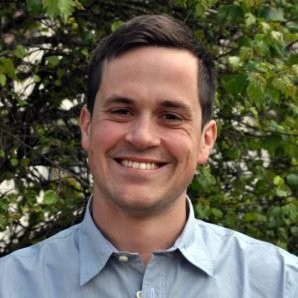
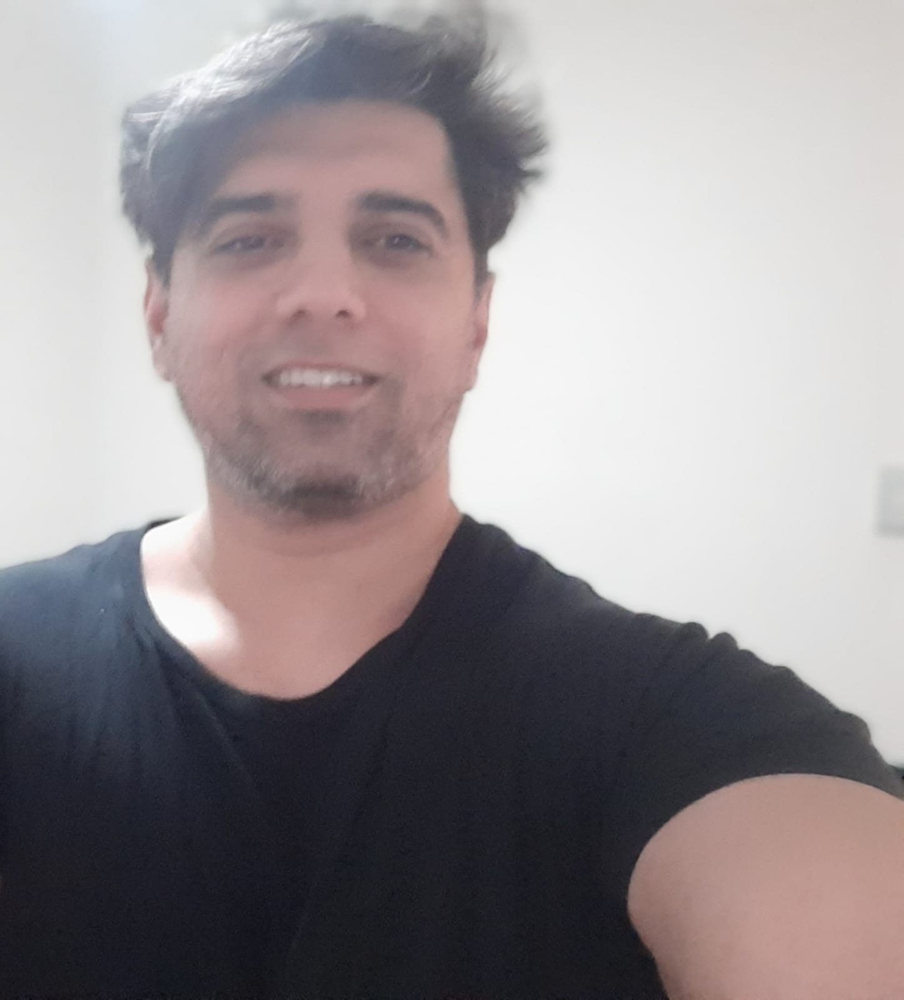
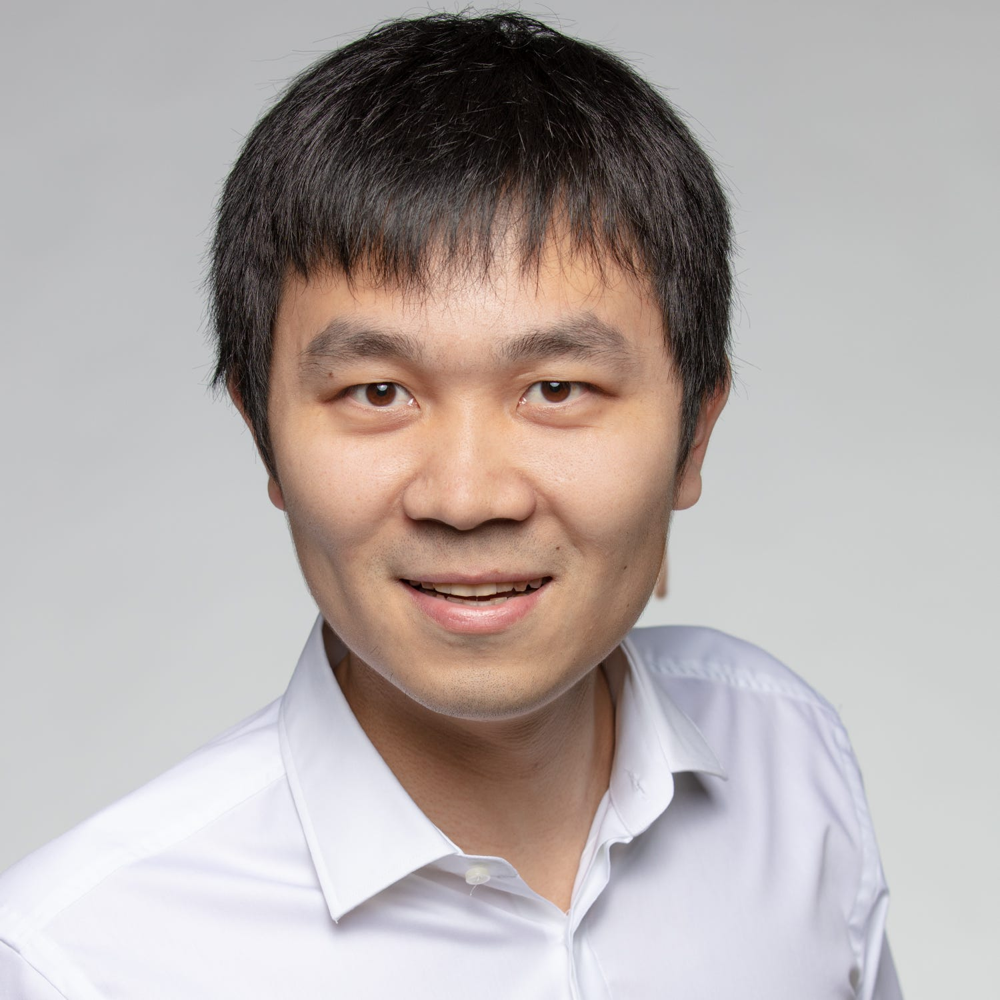

#### Presenting the humans developing the Back-end.

**This article was updated:** <a href="https://medium.com/@alephium/alephium-contributors-f35eeaeaf0a0" data-href="https://medium.com/@alephium/alephium-contributors-f35eeaeaf0a0" rel="nofollow">https://medium.com/@alephium/alephium-contributors-f35eeaeaf0a0</a>

_For its team, Alephium is privileging agility and efficiency over hyper-growth. We do not stay at a human size because we think it is more efficient, but because Alephium strives to be a decentralized, community driven project. This means the project in itself is much larger than a team can ever be. Communication, trust, openness and transparency is paramount in such a set-up._

_To shed some light on who we are and what we do, we decided to share a little about ourselves with the community through a small series of interviews._

Read the <a href="https://medium.com/@alephium/core-team-interview-series-episode-1-3472f8295af6" data-href="https://medium.com/@alephium/core-team-interview-series-episode-1-3472f8295af6">1st part here</a> and the <a href="https://medium.com/@alephium/core-team-interview-series-episode-2-bec6e6908d2f" data-href="https://medium.com/@alephium/core-team-interview-series-episode-2-bec6e6908d2f">2nd part here.</a>

The Back-end is the heart of the system, but it is also a less obvious part of the development to the average observer: the less a back-end gets noticed the better job it is doing.

**6 individuals are building the back-end and we are happy to introduce you to Thomas, muchen, h0ngcha0, Benoit, Simer and Cheng.**

### Thomas

#### How should we call you and where are you located?

Simply Thomas, I’m located in the Lausanne area.

#### What/where did you study? What are your past notable experiences?

I studied computer science at EPFL, where I did a bachelor/master degree. Before cryptos I worked in the autonomous vehicles field.

#### Do you have funny, sporty, geeky or cranky hobbies?

I used to do traditional Swiss wrestling: <a href="https://www.youtube.com/watch?v=TN3MCKCTtrg" data-href="https://www.youtube.com/watch?v=TN3MCKCTtrg">https://www.youtube.com/watch?v=TN3MCKCTtrg</a>

Now I’m more into music: guitar/alphorn/singing.

#### How/when did you come across crypto?

I heard a lot about it, but really went into it when joining Alephium :)

> I already worked with Cheng and the rest of the team, I knew I would love to work with them again, so I dived more into the project.

#### How did you come across Alephium and what attracted you to the project?

I already worked with Cheng and the rest of the team, I knew I would love to work with them again, so I dived more into the project. I didn’t know much about crypto back then, but this all sharded-decentralized network technology looked awesome to build. I think I discovered a bit later the potential of Alephium compared to the other blockchains.

#### What are you doing at Alephium? What is your title (if you have one, what would it be, if you don’t)? What are you good at?

I’m a core developer, as I joined quite early the project I had the opportunity to work on almost every part of the project. Then I concentrated on all the surrounding of the blockchain itself: the node-wallet, the explorer-backend, all the APIs, everything that helps interacting with the blockchain itself.

#### What is it you care the most for in our creation?

I would say our team, even though it’s a small one, everyone is where they should be and we built great stuff thanks to that.

### muchen

#### How should we call you and where are you located?

I’m muchen, I’m located in HeFei, China.

#### What/where did you study?

I studied Communication Engineering at Anhui University(HeFei, China) and got my bachelor’s degree.

#### Do you have funny, sporty, geeky or cranky hobbies?

No.

#### Got links?

- <a href="https://github.com/lbqds" data-href="https://github.com/lbqds">https://github.com/lbqds</a>

#### How/when did you come across crypto?

I learned about Bitcoin from my college roommate, I found blockchain interesting and started working on it in 2017.

> I read the Alephium whitepaper and I think BlockFlow is the best sharding algorithm I know.

#### How did you come across Alephium and what attracted you to the project?

I read the Alephium whitepaper and I think BlockFlow is the best sharding algorithm I know.

#### What are you doing at Alephium?

I’m working on the bridge now, I’m good at reading codes and understanding how it works.

#### What is it you care the most for in our creation?

What I care about the most is how we can attract more developers.

---

### h0ngcha0

#### How should we call you and where are you located?

h0ngcha0, Sweden.

#### What/where did you study ?

SEU, China; CTH, Sweden.

#### Got links?

- <a href="https://hongchao.me" data-href="https://hongchao.me">https://hongchao.me</a>
- <a href="https://github.com/h0ngcha0" data-href="https://github.com/h0ngcha0">https://github.com/h0ngcha0</a>

#### How/when did you come across crypto?

Read <a href="https://www.economist.com/leaders/2015/10/31/the-trust-machine" data-href="https://www.economist.com/leaders/2015/10/31/the-trust-machine">The trust machine</a> article in the Economist magazine in 2015.

> I like Bitcoin. Alephium builds upon Bitcoin’s core abstractions and improves in both scalability and expressivity.

#### How did you come across Alephium and what attracted you to the project?

Through Cheng.

I like Bitcoin. Alephium builds upon Bitcoin’s core abstractions and improves in both scalability and expressivity.

#### What are you doing at Alephium?

Core contributor.

#### What is it you care the most for in our creation?

Build alternatives in this increasingly polarizing world.

---

### Benoit

#### How should we call you and where are you located?

My name is Benoit, killerwhile, or @0xa05e30471e8a on Discord. I’m mostly based in Switzerland.

#### What/where did you study? What are your past notable experiences?

I graduated from EPFL, Lausanne where I learnt software engineering, But what I love overall in computer science is infrastructure and plumbing. I was DevOps before the word DevOps became trendy.

#### Do you have funny, sporty, geeky or cranky hobbies?

I’ve been snowboarding for more than 20 years, teaching trampoline to my kids, and playing volleyball when I want to socialize.

#### Got links?

- <a href="https://www.linkedin.com/in/benoitperroud/" data-href="https://www.linkedin.com/in/benoitperroud/">https://www.linkedin.com/in/benoitperroud/</a>

My socials are probably not interesting enough to be shared.

#### How/when did you come across crypto?

I learned about crypto back in 2010, and followed this trend from a technical perspective, running an ETH full node and nowadays ETH2.0 validators and Alephium full nodes.

> Simplicity and elegance of blockflow \[attracted me\] because I come from a distributed processing world, and I found in blockflow lots of echo from other components I admire and have contributed to in the past.

#### How did you come across Alephium and what attracted you to the project?

I know a guy who knew Cheng, and got introduced. Both the early stage and the simplicity of blockflow hooked me up with Alephium. Early stage because the whole ecosystem still needs to be built, and I love building things. Simplicity and elegance of blockflow because I come from a distributed processing world, and I found in blockflow lots of echo from other components I admire and have contributed to in the past.

#### What are you doing at Alephium? What is your title (if you have one, what would it be, if you don’t)? What are you good at?

At Alephium, I’m mostly in charge of the infrastructure, i.e. running a significant amount of full nodes to ensure the stability of the network. I don’t care much about titles, and Alephium’s infrastructure reliability speaks on my behalf.

But if I was forced to choose a title, I’d call myself Plumbing engineer. Or CFO, for Chief Fondue Officer. Because apart from building infrastructure, I’m amazingly proficient with cheese, being Fondue or Raclette.

#### What is it you care the most for in our creation?

Blockflow technology is so simple that many other projects are asking themselves why they didn’t think about it already. And bringing stability and resiliency to this awesome technology is what I care the most about this creation.

---

### Simer

#### How should we call you and where are you located?

Simer. Sydney, Australia.

#### What/where did you study ?

Bachelors in IT/Majored in Software Engineering.

Griffith University, Brisbane, QLD, Australia.

#### Do you have funny, sporty, geeky or cranky hobbies?

Working out at Gym.

Computational geometry & physics.

#### Got links?

- <a href="https://twitter.com/SimerPlaha" data-href="https://twitter.com/SimerPlaha">https://twitter.com/SimerPlaha</a>
- <a href="https://github.com/simerplaha/" data-href="https://github.com/simerplaha/">https://github.com/simerplaha/</a>
- <a href="https://linkedin.com/in/simerplaha" data-href="https://linkedin.com/in/simerplaha">https://linkedin.com/in/simerplaha</a>
- <a href="https://dev.to/simerplaha" data-href="https://dev.to/simerplaha">https://dev.to/simerplaha</a>

#### How/when did you come across crypto?

In 2015 I read an article about Bitcoin on TechCrunch but didn’t read much into it until years later.

> Open-source connecting devs with other devs :)

#### How did you come across Alephium and what attracted you to the project?

Through GitHub. Cheng started a discussion on one of my projects. Open-source connecting devs with other devs :)

#### What are you doing at Alephium?

Core DB Dev.

Database related software development.

#### What is it you care the most for in our creation?

1.  Alpehium’s scalability.
2.  High performance & testable code.

---

### Cheng

#### How should we call you and where are you located?

Cheng Wang — Lausanne.

#### What/where did you study?

I had 2 Ph.D research experiences (both dropouts). First Ph.D in number theory, the second Ph.D in distributed algorithm.

#### Do you have funny, sporty, geeky or cranky hobbies?

Math and coding are my hobbies …

#### Got links?

- <a href="https://github.com/polarker" data-href="https://github.com/polarker">https://github.com/polarker</a>
- <a href="https://twitter.com/wachmc" data-href="https://twitter.com/wachmc">https://twitter.com/wachmc</a>

#### How/when did you come across crypto?

My second Ph.D research was about consensus algorithms, which led me to crypto eventually.

> The greatest part of working for the project is that we are building something no other teams have achieved.

#### How did you come across Alephium and what attracted you to the project?

I decided to found Alephium as I have a brand new algorithm to solve the scalability challenge of blockchain. The greatest part of working for the project is that we are building something no other teams have achieved.

#### What are you doing at Alephium?

I am involved in all of the technical stuff in Alephium. I focus more on the core full node design and development.

#### What is it you care the most for in our creation?

To solve the scalability and security challenge of blockchain with high quality code.

---

**This concludes this serie of interviews. I you have any questions or want to get to know us better, come say hi to us on our** <a href="https://discord.gg/JErgRBfRSB" data-href="https://discord.gg/JErgRBfRSB"><strong>discord</strong></a>**! We’re looking forward to see you there!**
