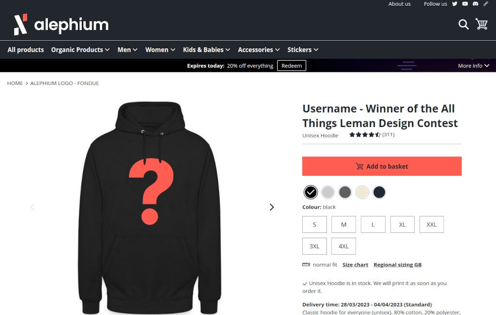

#### The best design will be featured in Alephium’s SWALPH shop!

The Alephium community is invited to participate in a design contest to celebrate the <a href="https://medium.com/@alephium/leman-network-upgrade-activation-on-march-30th-606884904c0c" data-href="https://medium.com/@alephium/leman-network-upgrade-activation-on-march-30th-606884904c0c">Leman Network Upgrade activation</a>! Use your creativity to come up with cool new Alephium-related graphic material!

### “Wen”? How?

The contest will start on March 27th at 15:00 pm CEST and end on April 10th at 15:00 pm CEST. All participants must access the following form to submit their work:

🗳️ <a href="https://forms.gle/34fkokgqAj3VqzGXA" data-href="https://forms.gle/34fkokgqAj3VqzGXA"><strong>https://forms.gle/34fkokgqAj3VqzGXA</strong></a>

The Alephium Jury will review the designs, considering creativity, quality, and stickiness to the rules.

**The general rules are the following:**

- _The contest will follow all the rules of the_ <a href="https://github.com/alephium/community/blob/master/RewardProgramRules.md" data-href="https://github.com/alephium/community/blob/master/RewardProgramRules.md"><em>Grant &amp; Reward Program Rules</em></a>
- _Alephium reserves the right to disqualify any entry._
- _All submissions must be made through_ <a href="https://forms.gle/34fkokgqAj3VqzGXA" data-href="https://forms.gle/34fkokgqAj3VqzGXA"><em>the form provided</em></a>_._
- _The design submitted to the jury can be low-resolution. But to win, participants must be able to deliver their work in high-resolution JPG, PDF._
- _By submitting their work, participants agree it is bound to a Creative Commons license_ <a href="https://creativecommons.org/licenses/by/4.0/" data-href="https://creativecommons.org/licenses/by/4.0/"><em>CC-BY</em></a> _or_ <a href="https://creativecommons.org/publicdomain/zero/1.0/" data-href="https://creativecommons.org/publicdomain/zero/1.0/"><em>CC-0</em></a>_._

### Winner Announcement & Prizes

The winner will be announced on April 14th on Alephium's social media channels.

The design will be featured and available for purchase in Alephium’s shop with the participant’s username in the product description as “**Username — Winner of the All Things Leman Design Contest**.”

The winner will also receive a 300 ALPH prize, per rules defined in the <a href="https://github.com/alephium/community/blob/master/RewardProgramRules.md" data-href="https://github.com/alephium/community/blob/master/RewardProgramRules.md"><strong>Grant &amp; Reward Program Rules</strong></a>.

You can share your design with the community using the hashtag <a href="https://twitter.com/search?q=%23allthingsleman&amp;src=typed_query&amp;f=top" data-href="https://twitter.com/search?q=%23allthingsleman&amp;src=typed_query&amp;f=top">#allthingsleman</a> on <a href="https://twitter.com/alephium" data-href="https://twitter.com/alephium">Twitter</a> and <a href="https://t.me/alephiumgroup" data-href="https://t.me/alephiumgroup">Telegram</a> and in the \#🤝contribution channel on the [Discord server](/discord).
