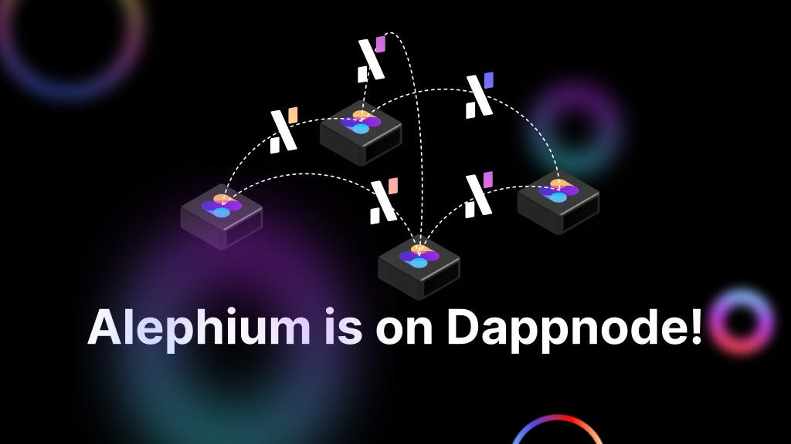

### **Pushing for decentralization, Alephium and Dappnode join forces to make self-hosted blockchain infrastructure accessible**

**_Neuchâtel, Switzerland & Zug, Switzerland September 22nd, 2022 _**— <a href="https://alephium.org/" class="markup--anchor markup--p-anchor" data-href="https://alephium.org/" rel="noopener" target="_blank">Alephium</a>, a highly performant, secure, and energy-efficient sharded blockchain network for DeFi & dApps and <a href="https://dappnode.io/" class="markup--anchor markup--p-anchor" data-href="https://dappnode.io/" rel="noopener" target="_blank">Dappnode</a> an open source, censorship-resistant platform for deploying and hosting DApps, P2P clients and blockchain nodes, announce today their collaboration to advance decentralization, security, and accessibility of critical infrastructure.

As of today, Alephium full-node, explorer, and wallet backend packages are available on Dappnode, allowing anyone to run and build on their own Alephium infrastructure in a few clicks.

A truly decentralized world can only be achieved once anyone can easily run and host its infrastructure without relying on 3rd parties. This partnership is a step forward in the adoption of decentralized technologies.

Dappnode is actively addressing the decentralization bottleneck by allowing anyone to easily deploy Decentralized Apps and Blockchain Nodes on their machines and to access them directly via a decentralized protocol without using any centralized gateways or gatekeepers.

Alephium proves that blockchain scalability and programmability can be achieved without compromising decentralization and security. The network can natively achieve over 10’000 transactions per second, thanks to the functional sharding of its brand new UTXO model. In addition, it benefits from its unique Proof of Less Work algorithm, an energy-efficient take on Bitcoin’s Proof of Work.

_“It is a key milestone for Alephium to be available on Dappnode. We are very excited about what is only the start of a continuous collaboration. Both organizations understand that the full benefits of a decentralized network can only be achieved through accessibility.”_ said Maud Simon Alephium’s COO.

_“We are so happy to participate in Alephium’s decentralization process. Thanks to our software, Alephium will become a truly decentralized network, and everyone in our communities will be able to run nodes easily and without complications”_ said Pol Lanski, Dappnode’s COO

#### **About Alephium**

<a href="https://alephium.org/" class="markup--anchor markup--p-anchor" data-href="https://alephium.org/" rel="noopener" target="_blank">Alephium</a> is the first operational layer1 sharded blockchain scaling and improving Bitcoin core technologies, Proof of Work & UTXO. It delivers a highly performant, secure, and energy efficient network that focuses on usability and accessibility.

#### **About Dappnode**

<a href="https://dappnode.io" class="markup--anchor markup--p-anchor" data-href="https://dappnode.io" rel="noopener" target="_blank">Dappnode</a> is a free and open source software that allows users all over the world to participate in creating a decentralized infrastructure layer to power web3 and be rewarded for it.
