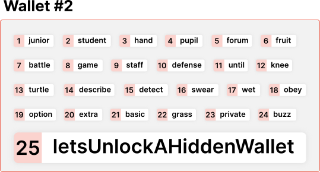

### Introduction

On Thursday, August 4th, on <a href="https://discord.gg/JErgRBfRSB" data-href="https://discord.gg/JErgRBfRSB">our Discord</a>, during the latest TTxOO, our good friends from <a href="https://hodling.ch/" data-href="https://hodling.ch/">Hodling</a> joined us to talk about the different levels of crypto-assets custody and their benefits, requirements, and challenges in a presentation called **“The Road to secure self-custody.”**

This article is a recap of the presentation and Q&A we had with the community.

<figure id="02cc" class="graf graf--figure graf-after--p">

<figcaption>Our friends from Holding graced us with their time and expertise</figcaption>
</figure>

<a href="https://hodling.ch/" data-href="https://hodling.ch/"><em>Hodling SA</em></a> _provides non-custodial bitcoin storage solutions for owners of large bitcoin balances. They have developed procedures backed by years of Bitcoin and finance expertise to help users securely and efficiently manage their funds. In addition, they offer multisignature wallet services, cryptocurrency concierge services, and workshops on Bitcoin fundamentals._

### Problem

Finding the best way to manage your crypto assets is overwhelming. There are many options, but all point to two concepts: Custody and financial Sovereignty.

Custody is _“to have direct access or control; to be in charge of the protective care or guardianship of someone or something.”_ So when talking about crypto assets, their custody can be yours or somebody else’s.

<a href="https://www.britannica.com/topic/sovereignty" data-href="https://www.britannica.com/topic/sovereignty">Sovereignty</a> is a political concept related to _“the authority of a state to govern itself or another state.”_ Managing your assets is related to who _“de facto”_ takes the decisions about them.

When thinking about this topic, a good solution has to take into account the following:

- What part of your wealth is stored in crypto?
- How tech-savvy are you?
- What amount of time and money are you willing to spend on this?

Hodling’s talk presents a ladder of seven incrementally more secure & sovereign custody levels. As you move up, these setups are incrementally more technically complex and pricey. Before choosing its setup, one must consider the trade-offs and be careful not to overcomplicate things. **The complexity level must make sense for the capital at stake.**

<figure id="f00c" class="graf graf--figure graf-after--p">

<figcaption>The road to self custody is steep! And masterfully illustrated by <a href="https://medium.com/u/3341dd76fc9a" class="markup--user markup--figure-user" data-href="https://medium.com/u/3341dd76fc9a" data-anchor-type="2" data-user-id="3341dd76fc9a" data-action-value="3341dd76fc9a" data-action="show-user-card" data-action-type="hover">Set Hallstrom</a></figcaption>
</figure>

_These seven steps on the road to self-custody are tailor-made for the state of the Alephium ecosystem of tools and services as it is today. Even if most of these steps are adaptable for other crypto-assets, the talk focused on what’s possible for ALPHs today._

### 1/7 — Custody on an Exchange

<figure id="2c57" class="graf graf--figure graf-after--h3">

<figcaption><a href="https://medium.com/u/898f59563d67" class="markup--user markup--figure-user" data-href="https://medium.com/u/898f59563d67" data-anchor-type="2" data-user-id="898f59563d67" data-action-value="898f59563d67" data-action="show-user-card" data-action-type="hover">Andreas M. Antonopoulos</a> rules</figcaption>
</figure>

**Pros **— To buy and hold your assets on a centralized exchange has advantages. First, you don’t need a crypto wallet. It is the simplest way to have some kind of interaction with crypto assets.

**What to look for — **It is essential to research each exchange’s security features, reputation and if you can open an account based on your jurisdiction.

**Cons — **However, it also has a <a href="https://cryptonews.com/guides/why-it-is-risky-to-leave-your-cryptocurrency-in-exchange.htm" data-href="https://cryptonews.com/guides/why-it-is-risky-to-leave-your-cryptocurrency-in-exchange.htm">lot of risks</a>. “Not your keys, not your coins” is a catchy way to highlight that if the assets are in somebody else’s custody, your access to them will only exist if the counterparty allows it: this is called _the counterparty risk_. Other associated risks include regulatory risks (a government freezing the assets at the exchange), liquidity risks (and other financial risks), hacks, and personal information leaks.

**Verdict — **This type of custody is easy, but it’s external, and you have access to your assets until you don’t (your saying on the matter is limited). It’s optimal for quick movement of funds (i.e., trading) but not for long-term custody.

### 2/7 — Phone/Computer Hot Wallet with a Proper Backup

<figure id="7571" class="graf graf--figure graf-after--h3">

<figcaption>We said Proper Backups!</figcaption>
</figure>

**Pros — **To have direct access to your assets using your computer or phone is an improvement from the previous level in terms of custody. And you dispose of your own backups.

**What to look for — **Computers and phones are general purpose devices, meaning they’re suitable for doing/executing different programs, but that doesn’t mean they’re a good place to store sensitive information. In this context, you own your keys but need to find a good way to keep them safe to prevent unauthorized access to your assets.

**Cons — **It’s hard to properly backup your seed phrase (also called a Secret Recovery Phrase), but it is a must-have to guarantee that you can restore your access in case of equipment failure or loss. A good practice is the “<a href="https://www.backblaze.com/blog/the-3-2-1-backup-strategy/" data-href="https://www.backblaze.com/blog/the-3-2-1-backup-strategy/">3–2–1 rule</a>”: 3 copies of the backup, on two different media, with one copy off-site (stored in a remote place more than 80km away).

One improvement to this setup is to have the wallet installed on a device that is never connected to the internet (an offline device). This way, the device is less likely to suffer any attack as it is completely disconnected from the internet and uses a minimal interface (such as a µSD card or QR codes) to exchange data with an online device.

**Verdict — **Now, the control of the funds is in your hands, as is the responsibility (and risks!) associated with this freedom. There will be no support to call to try to recover a lost device or seed phrase. **You are now your own bank!**

### 3/7 — Phone/Computer Hot Wallet with a Proper Backup & a Passphrase

<figure id="48bb" class="graf graf--figure graf-after--h3">

<figcaption>This is actually a good PassPhrase that no-one would think of</figcaption>
</figure>

**Pros — **Adding a passphrase to the previous setup will increase the security level of your backups and your access to funds. <a href="https://github.com/bitcoin/bips/blob/master/bip-0039.mediawiki" data-href="https://github.com/bitcoin/bips/blob/master/bip-0039.mediawiki">Codified by BIP39</a>, it offers the option to add a passphrase on top of your seed phrase (12 or 24 words) for enhanced protection.

<a href="https://medium.com/@alephium/bip39-passphrase-implementation-f87adecd6f59" data-href="https://medium.com/@alephium/bip39-passphrase-implementation-f87adecd6f59">Alephium Desktop wallet last update added the passphrase feature</a>, which gives our users an extra layer of protection.

This configuration also allows you to use plausible deniability in situations where something may compromise your security or put you at risk. For example, you can use the same seed phrase to manage different segregated wallets where each wallet has an additional passphrase. In addition, you can create addresses for specific purposes, like a situation requiring a valid address, but you don’t want to provide your main one.

**What to look for — **You need to be very cautious to store your passphrase exactly, character by character, as you may lose access if you make a mistake. Please use capital and lower cases, numbers, and special characters in your passphrase. Ideally, make it \> 12 mixed characters. Always store your seed phrase and the passphrase separately, and an attacker would not get control over your funds even if he gained access to your the seed phrase.

**Cons **— It increases complexity as you’ll have more backups and a passphrase to store separately, and if you forget, lose or misremember your passphrase, you lose access to your funds.

**Verdict — **Adding a PassPhrase opens new possibilities and helps you securely manage your seed. However, your security management overhead will also increase for each new additional passphrase.

### 4/7 — Phone/Computer Hot Wallet with a Proper Backup, a Passphrase & a Full Node

<figure id="5284" class="graf graf--figure graf-after--h3">

<figcaption>Philosoraptor knows.</figcaption>
</figure>

**Pros — **So far, the connection between your wallet and the blockchain used remote nodes, where a bad actor could access your informations. An upgrade in your setup’s custody, security, and sovereignty is to connect it to <a href="https://en.bitcoin.it/wiki/Full_node" data-href="https://en.bitcoin.it/wiki/Full_node">a full blockchain node</a> that you control.

It will provide extra privacy, as the wallet will share no information about the transactions, and there will be no censorship of your movements because there will not be any intermediary between you and the blockchain.

**What to look for — **It is a good practice to have dedicated equipment to run the node, separate from your everyday computer. This action will help to reduce the attack surface and lower the workload on the device (besides all the issues that can happen with a personal/professional regular device).

This hardware can be anything supported by <a href="https://en.wikipedia.org/wiki/Java_virtual_machine" data-href="https://en.wikipedia.org/wiki/Java_virtual_machine">JVM</a> and <a href="http://rocksdb.org/" data-href="http://rocksdb.org/">rocksdb</a> — a <a href="https://wiki.alephium.org/full-node/Full-Node-Starter-Guide" data-href="https://wiki.alephium.org/full-node/Full-Node-Starter-Guide">computer</a>/<a href="https://wiki.alephium.org/full-node/Full-node-on-raspberry-pi/" data-href="https://wiki.alephium.org/full-node/Full-node-on-raspberry-pi/">raspberry pi4</a> or another general-purpose computing device running our <a href="https://github.com/alephium/alephium/" data-href="https://github.com/alephium/alephium/">full node</a>. Alephium node can be run standalone or deployed using <a href="https://github.com/alephium/alephium/tree/master/docker" data-href="https://github.com/alephium/alephium/tree/master/docker">Docker</a> or available via appliance distributions such as <a href="http://dappnode.io" data-href="http://dappnode.io">DAppNode</a> and their <a href="https://shop.dappnode.io/" data-href="https://shop.dappnode.io/">pre-installed physical nodes</a>.

**Cons — **Your equipment will need constant attention because the blockchains are getting bigger and consuming a significant amount of space on disk. In addition, synchronizing the node with the network can sometimes take a bit of time, and the ability to send and receive transactions rely only on your node running correctly.

**Verdict — **This configuration gives extra privacy, resilience, and censorship resistance concerning transactions. It gives you higher sovereignty over your actions but is harder to run, requiring good technical skills.

### 5/7 — Node Wallet

<figure id="06ec" class="graf graf--figure graf-after--h3">

<figcaption>Swagger is awesome</figcaption>
</figure>

**Pros **— The next step is an improvement on the flexibility of your setup, as the <a href="https://wiki.alephium.org/wallet/Wallet-Guide" data-href="https://wiki.alephium.org/wallet/Wallet-Guide">node wallet</a> (which is directly included in the node’s code) has many more features than the desktop wallet. For example, it can do time-locked transactions, create multi-signature wallets, and/or interact with smart contracts.

<a href="https://blog.bitstamp.net/post/what-is-a-multisig-wallet/" data-href="https://blog.bitstamp.net/post/what-is-a-multisig-wallet/">Multisig wallets</a> allow multiple signers to make a transaction ready for broadcast into the network, and <a href="https://en.bitcoin.it/wiki/Timelock" data-href="https://en.bitcoin.it/wiki/Timelock">Time-locked transactions</a> are a mechanism that locks out a transaction until a predetermined time (or block height) is reached.

**What to look for — **It’s advisable to self-host your node and not rely on an external service such as AWS or google cloud.

**Cons — **More challenging to run, as the UX is less user-friendly than the desktop wallet, it can also be a bit of a pricey option as in practice it involves dedicated equipment, and the node needs to keep up with the network speed.

**Verdict — **This is an excellent solution for technical users, complex transactions, and smart-contract-related transactions & experimentation.

### 6/7 — Air-Gapped Node Wallet

**Pros — **An Air-gapped computer is purposefully left without access to the internet to minimize the risks of infection by viruses, trojans, and targeted attacks. It is often used to perform a specific task requiring a high-security level. In our context, this machine will be the signing device for the transactions created on an online device that runs the full node. This allows for a very secure setup where externalities are minimized almost to the maximum.

The communication method between these machines is via a QR Code or physical media, like a USB key or an SD card, which the user must only use for this purpose (to transfer information between these two pieces of equipment).

<figure id="5641" class="graf graf--figure graf-after--p">

<figcaption>This is an air-gapped computer on a nineties diagram</figcaption>
</figure>

**Cons — **As the signer device is segregated from the internet, all transactions must be manually processed and delivered to the device. And the same process happens after the signature. But beware! Air-gapping a computer is <a href="https://shiftcrypto.ch/blog/does-airgap-make-bitcoin-hardware-wallets-more-secure/" data-href="https://shiftcrypto.ch/blog/does-airgap-make-bitcoin-hardware-wallets-more-secure/">not a silver bullet!</a> Remember <a href="https://en.wikipedia.org/wiki/Stuxnet" data-href="https://en.wikipedia.org/wiki/Stuxnet">Stuxnet</a>? But it is a good enough solution in the absence of hardware wallet support.

**Verdict — **You have complete control over all the steps of a transaction. This level of detail is better suited for users doing large high-net-worth transactions or corporations doing significant movements in their cold wallets. But it still requires a lot of care and precautions.

### 7/7 — Node Multisignature Wallet with Offline Cosigners

<figure id="fbce" class="graf graf--figure graf-after--h3">

<figcaption>Multisigs are important security tools</figcaption>
</figure>

**Pros — **The last and most secure/sovereign setup for Alephium is a full node wallet with a multisignature wallet. For each transaction to be broadcasted to the network, it must be signed by a specific number of cosigners.

For instance, a multisig of 5 out of 9 will require a quorum of 5 signers (among nine potential co-signers) to co-sign a transaction before it can be sent. This makes it extremely difficult for a hacker to compromise a wallet: instead of hacking one person, the hacker would need to hack at least five distinct people.

**What to look for — **For increased security & minimizing risks (political, accident, etc.), the cosigners should be located in different locations & jurisdictions. It is also recommended to have tech-savvy and accessible co-signers!

**Cons — **Difficult setup, requiring several steps to perform a transaction, making it a very slow & cumbersome process. Signers must have individually good security, or the wallet can still be compromised, as <a href="https://halborn.com/explained-the-ronin-hack-march-2022/" data-href="https://halborn.com/explained-the-ronin-hack-march-2022/">in the Ronin Hack.</a>

**Verdict — **This solution is more fit for a DAO, a custody company, or to manage a corporate company’s treasury, as the multisig main goal is to prevent a bad actor from accessing the funds by compromising one private key.

### Final Considerations

The setups presented here come with some benefits and specific complexities. If there are a few takeaways to keep in mind, they would be the following:

- Work on a simple yet comprehensive backup policy for yourself. And think of what happens if you disappear or become incapacitated!
- Keep your setup as straightforward as possible for your needs. Do not overcomplicate and do things you don’t feel comfortable technologically with. (this is called <a href="https://en.wikipedia.org/wiki/KISS_principle" data-href="https://en.wikipedia.org/wiki/KISS_principle">KISS</a>: Keep It Simple Stupid)
- If you want to improve your setup, do it gradually and take the time to do it well (and understand what you’re doing!).
- If possible, try to run your own node; this is already a significant improvement in the sovereignty part of owning and transacting crypto-assets.

A couple of all-purpose, digital hygiene best practices on top:

- Using two-factor authentication and specialized open-source software are good practices, as well as encryption on your local disk and communication channels. Things like <a href="https://www.yubico.com/" data-href="https://www.yubico.com/">Yubikey</a> or <a href="https://www.nitrokey.com/" data-href="https://www.nitrokey.com/">Nitrokey</a> are great! Even your <a href="https://www.ledger.com/" data-href="https://www.ledger.com/">Ledger</a> can act as a 2FA key with <a href="https://www.ledger.com/fido-u2f" data-href="https://www.ledger.com/fido-u2f">FIDO</a>.
- Lastly, as recent hacks showed us, do not use the same password on different online accounts, and <a href="https://www.coindesk.com/business/2022/08/03/solanas-latest-6m-exploit-likely-tied-to-slope-wallet-devs-say/" data-href="https://www.coindesk.com/business/2022/08/03/solanas-latest-6m-exploit-likely-tied-to-slope-wallet-devs-say/"><strong>do not reuse</strong></a> **your seed phrase on other wallets**. Instead, keep them specific for each wallet you use. You can use Password managers like <a href="https://bitwarden.com/" data-href="https://bitwarden.com/">Bitwarden</a> or others too.

We at [Alephium](/) want to thank Polto & Darko from <a href="https://hodling.ch/" data-href="https://hodling.ch/">Hodling SA</a> for taking the time to come and give us this insightful and rich presentation. We hope to host them again in one of our tech talks soon!
