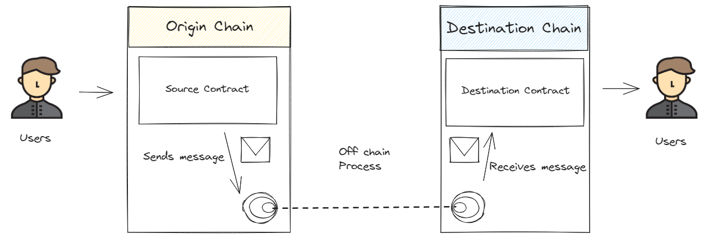
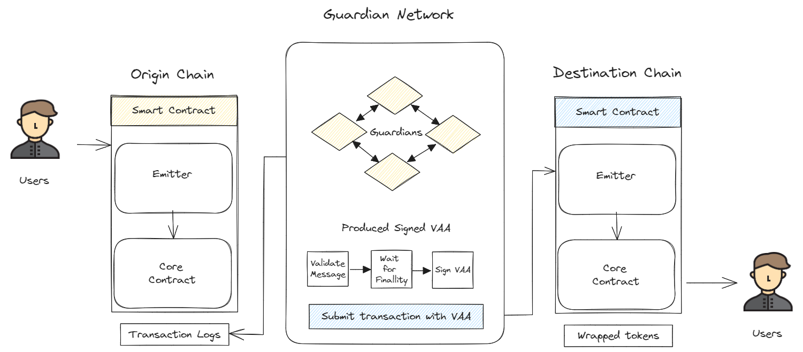
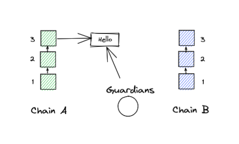
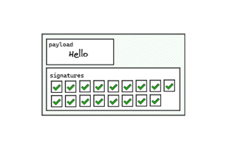
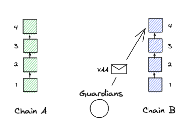
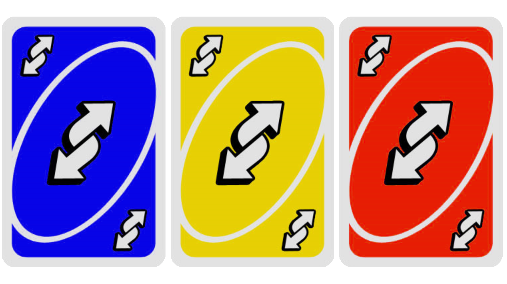

#### How does it work? How to use it? About the guardians, and more…

_This article was updated to reflect the new conditions after the_ <a href="https://medium.com/@alephium/rh%C3%B4ne-network-upgrade-activated-cbeb298585fe" class="markup--anchor markup--p-anchor" data-href="https://medium.com/@alephium/rh%C3%B4ne-network-upgrade-activated-cbeb298585fe" target="_blank"><em>Rhône Network Upgrade</em></a>_: bridging from Alephium to Ethereum requires at least 205 blocks_ **_and_** _at least 55 minutes._

The need for secure and efficient cross-chain transfers is growing with the emergence of the multichain world. Alephium’s core contributors have invested significant efforts to build a battle-tested solution for its first bridge to/from Ethereum (and other chains might follow).

Use it now: <a href="https://bridge.alephium.org/#/transfer" class="markup--anchor markup--p-anchor" data-href="https://bridge.alephium.org/#/transfer" rel="nofollow noopener" target="_blank">https://bridge.alephium.org/</a>

_Tl;dr — In this article, you will find a breakdown of the Alephium Bridge components, how they work together to allow for secure bridging of tokens both ways, the various ways to interact with the bridge, the bridge faucet, information on token registration and more details on the guardians network!_

### How does the Alephium Bridge works?

**Where does the Alephium bridge come from?**

The Alephium Bridge is a sophisticated system with various components that work together to achieve efficient cross-chain communication. It is what’s called a <a href="https://li.fi/knowledge-hub/bridge-classification/" class="markup--anchor markup--p-anchor" data-href="https://li.fi/knowledge-hub/bridge-classification/" rel="noopener" target="_blank">lock &amp; mint bridge</a>, built on top of a fork of <a href="https://docs.wormhole.com/wormhole/" class="markup--anchor markup--p-anchor" data-href="https://docs.wormhole.com/wormhole/" rel="noopener" target="_blank">Wormhole</a>.

Out of all the available options (and there are <a href="https://zeeprime.capital/the-bridges-are-dead-long-live-the-bridges" class="markup--anchor markup--p-anchor" data-href="https://zeeprime.capital/the-bridges-are-dead-long-live-the-bridges" rel="noopener" target="_blank">many</a>), Alephium chose to build on wormhole precisely because it’s open source with considerable TVL and has survived multiple incidents in the past, it has shown resilience and strength like no other bridge protocol. It is also very well <a href="https://docs.wormhole.com/wormhole/" class="markup--anchor markup--p-anchor" data-href="https://docs.wormhole.com/wormhole/" rel="noopener" target="_blank">documented</a>!

You can find the Alephium Bridge code <a href="https://github.com/alephium/wormhole-fork" class="markup--anchor markup--p-anchor" data-href="https://github.com/alephium/wormhole-fork" rel="noopener" target="_blank">here</a>.

**Do tokens actually travel between chains?**

No! It’s very important to understand that neither the native token nor the minted wrapped token ever leave their respective chains. At the end of the day, the “bridge” word is a misnomer in the world of blockchains.

This bridge is built on top of a <a href="https://docs.wormhole.com/wormhole/" class="markup--anchor markup--p-anchor" data-href="https://docs.wormhole.com/wormhole/" rel="noopener" target="_blank">generic message-passing protocol</a> that enables communication of messages between blockchains. It routes and verifies the locking, minting and unlocking events from one chain to another, effectively exchanging messages between the chains. This ensures that the assets can’t be used simultaneously on both chains, maintaining the integrity of the bridging process.

**What are the Main Components of the Alephium Bridge?**

The Alephium Bridge has several components working together to create a secure and scalable interface between the Alephium blockchain and Ethereum blockchain (and others, in the future). The bridge has three main components: guardians, contracts & messages.

**The guardians** play a crucial role in validating messages from the core contracts and producing the VAA multisig process. Together, they constitute the guardian network, composed at the launch of 4 guardians.

**The core contracts** (<a href="https://explorer.alephium.org/addresses/23Fj7xr1pxWfYLixz3aBC3u5dUJVpAjXArbpiYWxeGjQT" class="markup--anchor markup--p-anchor" data-href="https://explorer.alephium.org/addresses/23Fj7xr1pxWfYLixz3aBC3u5dUJVpAjXArbpiYWxeGjQT" rel="noopener" target="_blank">Alephium</a> and <a href="https://etherscan.io/address/0x579a3bDE631c3d8068CbFE3dc45B0F14EC18dD43" class="markup--anchor markup--p-anchor" data-href="https://etherscan.io/address/0x579a3bDE631c3d8068CbFE3dc45B0F14EC18dD43" rel="noopener" target="_blank">Ethereum</a>) are the system’s heart. Guardians monitor these contracts, which are pivotal for cross-chain communication. These contracts are deployed on each chain.

**The emitters contracts** initiate and interact with the core contract to publish messages on the origin chain and receive them on the destination chain. There is one on each side of the bridge.

**Transaction Logs** are blockchain-specific logs that guardians use to observe messages from the core contracts.

**VAAs (Verifiable Action Approvals)** are signed confirmations of messages observed from the core contracts.

**What do the VAAs contain?**

VAAs are messages running on the Guardian Network and are used to verify if the transaction the user wants to make is possible. They consist of two main components:

_Header:_ Contains metadata about the VAA, the active guardian set, and the accumulated signatures.

_Body:_ Contains relevant information for the users, such as the timestamp, nonce, emitter chain and address, sequence, consistency level, and payload. It is derived from an on-chain message, ensuring that any two guardians derive the exact same body. This ensures a one-to-one relationship between VAAs and messages, preventing double processing.

_How do these components play out together? How does the bridge actually work? And how do the guardians play into this? Keep reading!_

**How does a cross-bridge transaction unfold (via our front end)?**

Alephium provides a front end for the bridge (called the bridge UI). Inspired by <a href="https://www.portalbridge.com/" class="markup--anchor markup--p-anchor" data-href="https://www.portalbridge.com/" rel="noopener" target="_blank">the Portal Bridge</a>, the wormhole bridge frontend, it is an easy-to-use and convenient interface to bridge both ways (see more below).

Now let’s assume Alice wants to send some USDT from Ethereum to Alephium to trade on a DEX, for example. She goes to the bridge website, connects her Ethereum wallet (extension, mobile or desktop), and sends 100 USDT to Alephium. (of course she has checked before on the DEX if there was liquidity for her USDT!)

What happens under the hood?

1 — Those 100 USDT are sent to the core contract on the “native chain”, in this case Ethereum, where they are locked.

2 — The Core Contract emits a confirmation message indicating the token locking event.

3 — Since Guardians actively monitor the blockchains connected to the Alephium Bridge, they capture the transaction logs related to this message.

4 — They verify the validity of the message. Each guardian performs this step in isolation, independently and automatically.

5 — Once a quorum of guardians reaches consensus on the message’s validity, it is combined with the guardian signatures to form a Verifiable Action Approval (VAA).

6 — The VAA is relayed to Alephium, which is the “destination chain” in this case. Triggered by the VAA validated on Alephium, the Core Contract mints an equivalent amount of “wrapped” tokens.

Alice then clicks to “redeem” her tokens on Alephium and the contract transfers them to the designated destination. Alice now owns 100 USDT on Alephium!

Now, what happens if she buys something from Bob and pays him 100 USDT, and Bob wants to redeem them on Ethereum?

When Bob decides to redeem the native tokens, the wrapped tokens are returned to the smart contract on Alephium and the native tokens on Ethereum are unlocked. The redemption process is exactly the same as the previous one in reverse, except for the first and the last one steps:

1 — Bob returns the wrapped USDT tokens from his wallet to the Wormhole Core Contracts on Alephium.

(…) The Core Contract emits a confirmation message indicating the token return event. The guardians verify the validity of the message. and form a VAA, which is relayed to Ethereum. (…)

6 — The Core Contracts on Ethereum will unlock an equivalent amount of native USDT tokens and will transfer them to Bob’s designated address upon request from said address (eg. when Bob performs the “redeem” step of bridging).

_Now that you know how a transaction flows across the bridge and back, it’s time to talk a bit more about tokens, token registration and alternative ways of using the bridge!_

### Interacting with the bridge & token registration

**Alternative ways to use the bridge**

The bridge is an infrastructure and a governance mechanism. There are several different ways to interact with the bridge, catering to different use cases!

First, anyone can use the bridge directly via smart contracts (<a href="https://explorer.alephium.org/addresses/23Fj7xr1pxWfYLixz3aBC3u5dUJVpAjXArbpiYWxeGjQT" class="markup--anchor markup--p-anchor" data-href="https://explorer.alephium.org/addresses/23Fj7xr1pxWfYLixz3aBC3u5dUJVpAjXArbpiYWxeGjQT" rel="noopener" target="_blank">Alephium</a> and <a href="https://etherscan.io/address/0x579a3bDE631c3d8068CbFE3dc45B0F14EC18dD43" class="markup--anchor markup--p-anchor" data-href="https://etherscan.io/address/0x579a3bDE631c3d8068CbFE3dc45B0F14EC18dD43" rel="noopener" target="_blank">Ethereum</a>), without any kind of front-end interface. This will be very useful for dApps & other services that might want to use the bridge programmatically, with no human interaction.

Second, anyone can run its own front-end if they so wish. Hey, you can even <a href="https://github.com/alephium/wormhole-fork" class="markup--anchor markup--p-anchor" data-href="https://github.com/alephium/wormhole-fork" rel="noopener" target="_blank">fork the bridge</a> (that is open source) and create your own guardian network!

Third, Alephium provides <a href="https://bridge.alephium.org/" class="markup--anchor markup--p-anchor" data-href="https://bridge.alephium.org/" rel="noopener" target="_blank">its own interface</a>, a front-end to use the bridge in a simple and convenient way.

**Which tokens can I bridge through Alephium’s front end?**

Alephium’s front end is just one of the ways one can bridge tokens. Because it is run by the core contributors, for operational and legal reasons, there are some constraints on which tokens can be bridged through it:

From Alephium to Ethereum, <a href="https://etherscan.io/token/0x590f820444fa3638e022776752c5eef34e2f89a6" class="markup--anchor markup--p-anchor" data-href="https://etherscan.io/token/0x590f820444fa3638e022776752c5eef34e2f89a6" rel="noopener" target="_blank">ALPH</a> is registered, and all tokens on this <a href="https://github.com/alephium/token-list" class="markup--anchor markup--p-anchor" data-href="https://github.com/alephium/token-list" rel="noopener" target="_blank">token list</a> can be registered and available for bridging.

From Ethereum to Alephium, wBTC, ETH, USDT, USDC & DAI will be bridgeable on Alephium’s front end bridge UI. They will also appear as “verified” on Alephium’s family of wallets (desktop, mobile and browser extension).

Please, before bridging for swapping purposes, make sure there’s liquidity on the DEX for the token you’re bridging!

Furthermore, any token that is on <a href="https://tokenlists.org/token-list?url=tokens.1inch.eth" class="markup--anchor markup--p-anchor" data-href="https://tokenlists.org/token-list?url=tokens.1inch.eth" rel="noopener" target="_blank">this list</a> can be registered by anyone, using the token registration page <a href="https://bridge.alephium.org/#/register" class="markup--anchor markup--p-anchor" data-href="https://bridge.alephium.org/#/register" rel="noopener" target="_blank">here</a> and subsequently bridged through the bridge UI. But it won’t appear as “verified” in the wallets. If you want the token to appear as verified, you’ll need to do a push request on the token list <a href="https://github.com/alephium/token-list" class="markup--anchor markup--p-anchor" data-href="https://github.com/alephium/token-list" rel="noopener" target="_blank">here</a>.

If anyone wants to register and bridge a token that is not on the list, it is still possible by interacting directly with the smart contracts and the Guardian APIs.

**How long does it take to cross the bridge?**

From Ethereum to Alephium, bridging is fairly fast! Get the transaction validated on ETH side, let the guardians do their magic, et voilà! You should be out in no time, or roughly 20 minutes.

From Alephium to Ethereum, it will take a bit more time. For security reasons, and because the max chain reorg on ALPH is 200 blocks, the transaction needs to meet two conditions: _at least 205 blocks_ **_and_** _at least 55 minutes._. Then, after the user starts the redeeming process, the transaction goes through the guardians and on the Ethereum side, taking more or less 15 minutes. So in total, the full process takes a little bit more than 1 hour.

This might evolve to be shorter in the future as the hashrate increases, but for now the decision was taken to ensure the best trade-off in terms of security vs transaction time.

**Token faucet**

As the core contributors want to do everything they can to ease people’s use of the bridge and onboarding on Alephium, a decision has been taken to implement a faucet for people bridging from Ethereum towards Alephium.

At launch, every transaction in the ETH -\> ALPH direction, bridging any token originating from Ethereum, using any means of bridging (smart contracts interactions, Alephium’s frontend, or any other frontend) will receive 1 ALPH on the destination address.

That will allow newcomers to have enough ALPH to perform initial transactions and experiment the joys of transacting on Alephium! This will be topped up periodically, from the ecosystem fund, for a little while, until it isn’t anymore, so get bridging early!

The whole system rests on an effective guardian network. So, what does it mean to be a guardian? Who are they? Why are they selected?

### The Guardian Network and the Guardians

**What does it mean to be a guardian?**

The Guardian Network is the backbone of the Alephium Bridge, serving as its oracle component and connecting one chain to another. The Guardians constitute a p2p network to collect the VAAs broadcast them and verify and approve the messages representing the funds the users want to send between chains.

Each guardian has to run or connect to a node on each chain the bridge connects (currently, Alephium and Ethereum), to be able to verify the transactions on these chains. It also has to set up some specific infrastructure to be part of the Guardian Network. This involves hardware, software and a stable connection to ensure they are always online and that the Alephium Bridge is permanently running.

**How is the guardian set selected?**

To achieve robust decentralization and mitigate single points of failure, the Alephium Wormhole Bridge will incorporate a minimum of four guardians and operators, requiring a \>2/3 quorum. The number of guardians will increase as the total locked value increases. The current design involves 4 Guardians with equal stakes, forming a <a href="https://en.wikipedia.org/wiki/Proof_of_authority" class="markup--anchor markup--p-anchor" data-href="https://en.wikipedia.org/wiki/Proof_of_authority" rel="noopener" target="_blank">Proof of Authority</a> consensus mechanism.

The Guardians of the Alephium Bridge were chosen because of their technical proficiency, expertise in infrastructure projects, good reputation and limited interconnectedness. By carefully considering these criteria, Alephium aims to establish a strong and reliable network of guardians who can effectively support the decentralized nature of the bridge.

**Who are the guardians?**

> _By serving as guardian, we can contribute to the reliability of the bridge, and thus foster the growth of the Alephium ecosystem and its interoperability. _— NoTrustVerify

<a href="https://bity.com/" class="markup--anchor markup--p-anchor" data-href="https://bity.com/" rel="noopener" target="_blank">Bity</a> is an OG & key player in the Swiss crypto ecosystem founded in 2014 in Neuchâtel. A regulated crypto broker and a financial service provider, it is also running a network of crypto ATMs across the country. On top of great technical expertise and a wide range of services pertaining to crypto, it has a great reputation and a valuable network in the crypto space.

<a href="https://alt.co/" class="markup--anchor markup--p-anchor" data-href="https://alt.co/" rel="noopener" target="_blank">Alt</a> (formerly Altconomy) is a Swiss financial intermediary and crypto-broker specializing in high-end over-the-counter (OTC) transactions, clearing, and payment. Established in 2017, it has positioned itself as a leading expert, assisting numerous individuals, corporations, and banks in navigating stringent regulatory requirements. Its technical skills and deep financial knowledge make it a very valuable partner of stellar standing.

<a href="https://notrustverify.ch/" class="markup--anchor markup--p-anchor" data-href="https://notrustverify.ch/" rel="noopener" target="_blank">No Trust Verify</a> is a group of dedicated individuals focused on advancing the next generation of privacy infrastructure. Their sense of mission to ensure that every individual has the right to privacy and digital sovereignty is visible in their passion & work for the Nym project. Their technical expertise also!

Finally, <a href="http://www.alephium.org" class="markup--anchor markup--p-anchor" data-href="http://www.alephium.org" rel="noopener" target="_blank">Alephium</a> also runs a guardian node to help deliver a smooth launch and actively monitor the performance of the bridge in the early days. After writing the code, and preparing the operational requirements & necessary software, it is important to be able to contribute and be a stakeholder in this critical piece of infrastructure in the early days.

**How can the guardian set be updated? Can the smart contracts be updated?**

The Wormhole Core Contracts encompass a range of predefined governance actions that can be carried out. These actions are initiated through governance VAA (Verifiable Action Approvals) and require the consensus of the guardians network to be executed. Smart contract updates and updates to the guardian set are governance VAAs.

More details can be found <a href="https://github.com/wormhole-foundation/wormhole/blob/main/whitepapers/0002_governance_messaging.md" class="markup--anchor markup--p-anchor" data-href="https://github.com/wormhole-foundation/wormhole/blob/main/whitepapers/0002_governance_messaging.md" rel="noopener" target="_blank">here</a>.

**Do guardians have control of the funds going through the bridge?**

Guardian operators do not have direct control over the funds stored in the smart contracts on the source and destination chains. They are unable to withdraw the funds directly. The transfer of funds from the core contracts on the destination chain can only be initiated by a valid and verified VAA relayed from the source chain.

While it is theoretically possible for Guardians to collude and sign a fraudulent message or payload in an attempt to trigger a token transfer on the destination chain, the structure of the payload makes it extremely challenging to fabricate. The payload follows a strict and specific format, ensuring the integrity and security of the transfer process.

Guardians operators cannot tamper with the blockchain or smart contracts, or make any other unauthorized actions.

### What is next?

<a href="https://twitter.com/alephium/status/1579824159273541632" class="markup--anchor markup--p-anchor" data-href="https://twitter.com/alephium/status/1579824159273541632" rel="noopener" target="_blank">As was</a> <a href="https://twitter.com/alephium/status/1582368148631695361" class="markup--anchor markup--p-anchor" data-href="https://twitter.com/alephium/status/1582368148631695361" rel="noopener" target="_blank">detailed in</a> <a href="https://twitter.com/alephium/status/1587440588692934656" class="markup--anchor markup--p-anchor" data-href="https://twitter.com/alephium/status/1587440588692934656" rel="noopener" target="_blank">multiple updates</a> <a href="https://twitter.com/alephium/status/1715361062823079937" class="markup--anchor markup--p-anchor" data-href="https://twitter.com/alephium/status/1715361062823079937" rel="noopener" target="_blank">over the</a> <a href="https://twitter.com/alephium/status/1716858711493493013" class="markup--anchor markup--p-anchor" data-href="https://twitter.com/alephium/status/1716858711493493013" rel="noopener" target="_blank">past year</a>, the bridge has been patiently and relentlessly built, software brick by process brick. This is the first iteration and it will still evolve in the future. Core contributors are considering adding more chains to connect to other ecosystems, new bridge features (such as bridging NFTs), and depending on usage and value transferred, relayers and different guardians configurations might be examined.

The Alephium Bridge marks a very important milestone in Alephium’s early infrastructure buildup since it marks the beginning of its direct interconnection to the multichain world. Combined with the birth of an ecosystem, born in the spring from the Leman Network Upgrade, it ushers in a new chapter in the life of Alephium’s biotope.

As we move on towards the next network update, with a constant effort to facilitate the onboarding of new projects, developers and community, the future looks bright on our side of the bridge!
