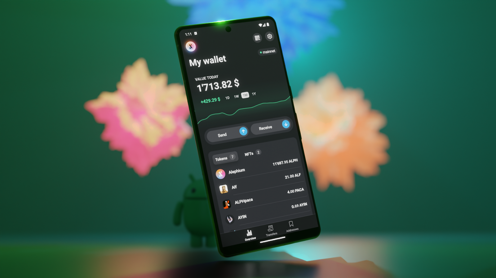
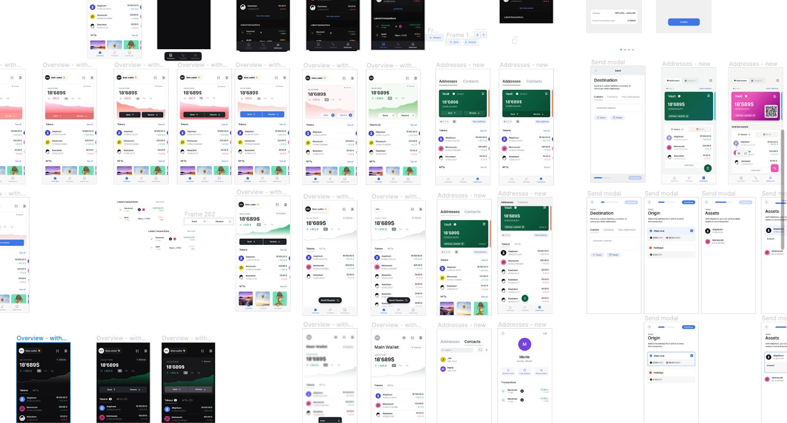
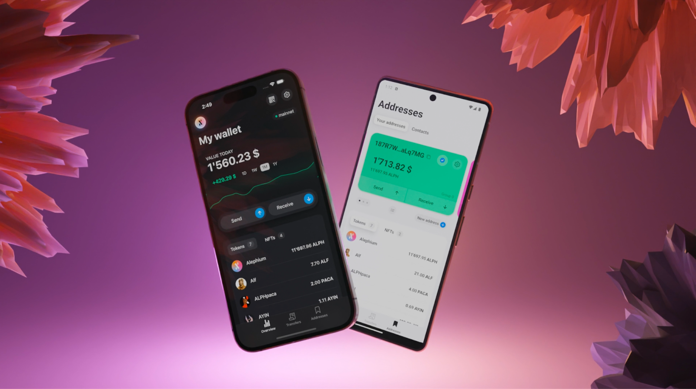
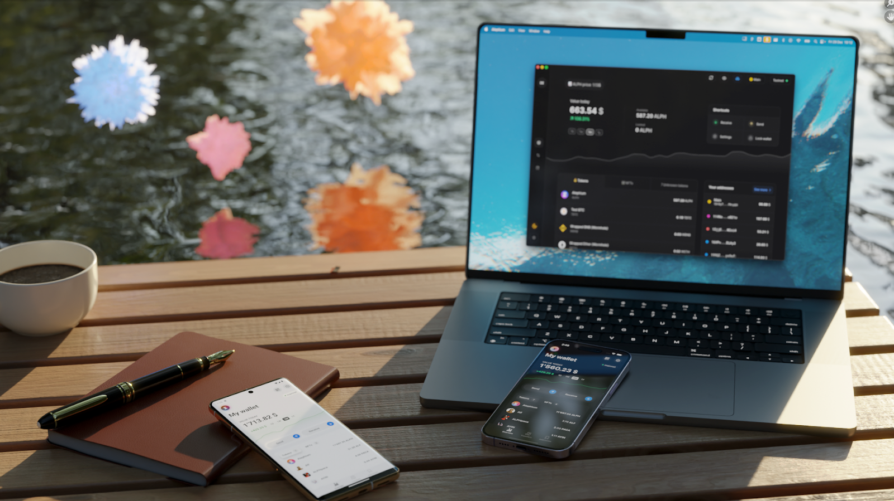

_The Alephium Mobile Wallet is a great addition to the current set of wallets developed by the core contributors. It is available for_ <a href="https://play.google.com/store/apps/details?id=org.alephium.wallet" class="markup--anchor markup--p-anchor" data-href="https://play.google.com/store/apps/details?id=org.alephium.wallet" rel="noopener" target="_blank"><em>Android</em></a> _and_ <a href="https://apps.apple.com/ch/app/alephium-wallet/id6469043072?l=en-GB" class="markup--anchor markup--p-anchor" data-href="https://apps.apple.com/ch/app/alephium-wallet/id6469043072?l=en-GB" rel="noopener" target="_blank"><em>iOS</em></a>_. It’s easy to use, fun and good-looking! Try it!_

_Here’s a free conversation on the conception, challenges, and choices made by_ <a href="https://twitter.com/mika_pote" class="markup--anchor markup--p-anchor" data-href="https://twitter.com/mika_pote" rel="noopener" target="_blank"><em>Mikaël Vaivre</em></a> _and_ <a href="https://twitter.com/_nop33" class="markup--anchor markup--p-anchor" data-href="https://twitter.com/_nop33" rel="noopener" target="_blank"><em>Ilias Trichopoulos</em></a> _while building the mobile wallet. We give it to you as is, because it’s important to show what’s going on behind the scenes, in the technical-designer minds of the front-end contributors! It seems so easy when you’re using the wallet, yet to get there… the journey is long and arduous, full of research, experiments, technological challenges and a hardcore dedication to user-centric design!_

### Genesis of the Alephium Mobile Wallet & Biggest Challenges

**Vladimir Moshnyager: When did you start working on the Alephium Mobile Wallet?**

**Mikaël Vaivre:** It started around a year ago. We initially focused on security, encryption, and creating a prototype that could import a seed. We conducted extensive research to find the right technical components.

We looked at other open-source wallets on strategies for managing encryption and biometrics, as well as how to manage secure storage and state management (that’s quite technical, but is the way you manage the state of the application in a way that is understandable for the developers and easy to maintain).

After a few months, we applied what we learned to the <a href="https://alephium.org/#wallets" class="markup--anchor markup--p-anchor" data-href="https://alephium.org/#wallets" rel="noopener" target="_blank">v2 of the Desktop Wallet</a> (launched in May 2023), ensuring a consistent approach across our products and going back and forth between the two, helping reinforce both.

**Vladimir Moshnyager: How long did the development take, and was it a continuous process?**

**Mikaël Vaivre:** It took around nine months, but not full-time. We often switched between different projects, including the <a href="https://github.com/alephium/alephium-web3" class="markup--anchor markup--p-anchor" data-href="https://github.com/alephium/alephium-web3" rel="noopener" target="_blank">SDK</a>, <a href="https://explorer.alephium.org/" class="markup--anchor markup--p-anchor" data-href="https://explorer.alephium.org/" rel="noopener" target="_blank">Explorer</a>, and <a href="http://www.alephium.org" class="markup--anchor markup--p-anchor" data-href="http://www.alephium.org" rel="noopener" target="_blank">website</a>, and also focused on the desktop wallet v2 during this period.

**Vladimir Moshnyager: What were the biggest challenges? How did you manage the differences between iOS and Android platforms?**

**Mikaël Vaivre:** To be more precise, we use <a href="http://expo.dev" class="markup--anchor markup--p-anchor" data-href="http://expo.dev" rel="noopener" target="_blank">Expo</a>, a layer on top of the native development that simplifies the developer experience a lot. But we had a hard time with build issues. You build something that works on Android, but it’s not working on iOS. Then you manage to have something running, but later you discover a totally different behavior on IOS and Android, so you need to find a good way to build an app that works on both platforms…

The usability and technical construction paradigms on Android and iOS are so different that the way you navigate through the apps is different. Because of this, I took some time (it was quite a long process) to actually build a User Interface (UI) that would work well on both platforms. My personal goal was to avoid having many differences between the apps. I wanted it to look the same on both platforms. The other approach we could have taken was: We have two different-looking apps, but then it’s way more work for us to maintain, and it is a process more prone to errors.

If you look at the Android hardware (the models), the devices that could run your app are so different! Some smartphones have a very small screen; others are huge. Some are super slow. On iOS people tend to upgrade their phones quite regularly, but on Android, it’s not the same: you still have a lot of older devices. To ensure that the app works on many devices is quite challenging.

**Vladimir Moshnyager: So Android had constraints not present on iOS. But was that the only issue?**

**Mikaël Vaivre:** While Android and iOS UIs differ, with Android favoring floating action buttons and iOS utilizing header-based navigation, we’ve developed a unified UI that effectively accommodates both user groups.

Our approach harmonizes these differences, ensuring seamless navigation and usability across both operating systems.

Making the app efficient and smooth was also something that we focused on, and we had to add several components by hand (meaning we had to code them) to create this experience that shares the same visuals and feeling as the desktop wallet.

### Reflection on the Process

**Vladimir Moshnyager: Did you enjoy the process of building the mobile app?**

**Mikaël Vaivre:** Yes, I enjoyed it, but it was more challenging than expected, especially designing the UI. <a href="https://medium.com/@alephium/techtalk-11-how-to-onboard-the-next-billion-people-to-crypto-d1f4904b3eea" class="markup--anchor markup--p-anchor" data-href="https://medium.com/@alephium/techtalk-11-how-to-onboard-the-next-billion-people-to-crypto-d1f4904b3eea" target="_blank">Making something look simple is really hard</a>. Up to the end of the process, I was tweaking UI elements to ensure they felt smooth on the mobile phone.

I had the basic UI layout ready quite early in the design process. But I faced challenges in managing contrasts. One question arose as to whether to encase the content within boxes or allow it to float freely in the UI. I also deliberated on whether to use borders in certain areas, considering the limitations of a small screen which can be used in various settings.

Designing for mobile requires different considerations than for a desktop environment. Bright outdoor conditions necessitate a distinct approach to UI design and color palette selection. Consequently, this led to numerous iterations to refine the mobile app design. It was crucial to enhance contrast and incorporate design elements like shadows to make sure some features stand out, particularly in the light theme. Since mobile usage occurs in diverse environments, a desktop simulator cannot fully capture the subtleties experienced on a sunny day, for example. These factors significantly influenced the design process.

**Vladimir Moshnyager: What are the most important features of a mobile crypto wallet?**

**Mikaël Vaivre:** The onboarding process is crucial. It should be simple and fast while educating the user about security, like the importance of backing up their seed phrase. The mobile app is really easy to access: you go to the app store, and with one click, it is on your phone. And we must ensure it is still easy for the user to enter your ecosystem.

To do that, you need to reduce the onboarding steps as much as possible while keeping the security high. On one of the wallets we researched, it takes 5 seconds to enter the app, but it is really easy to forget to properly save your seed. We wanted to make sure that doesn’t happen in our case.

**Vladimir Moshnyager: Can you tell us more about the technical features you are most proud of?**

**Mikaël Vaivre:** I really like the wallet import process with the animated QR code. It allows users to easily transfer their wallet and metadata from the desktop wallet to the mobile wallet. Now, you have a new installation of that seed in a different device. In that way, you can have access to your Alephium Wallet on the go.

The work done on the Wallet Connect integration is also something I’m proud of. To be able to implement most of the features that we have on the desktop wallet is a great achievement. For the first version (v1), to be this feature-rich and to run smoothly is really cool.

### Research about Mobile Wallets

**Vladimir Moshnyager: Which wallets did you research, and which ones do you use yourself?**

**Mikaël Vaivre:** I use <a href="https://www.revolut.com/" class="markup--anchor markup--p-anchor" data-href="https://www.revolut.com/" rel="noopener" target="_blank">Revolut</a> and <a href="https://www.postfinance.ch/" class="markup--anchor markup--p-anchor" data-href="https://www.postfinance.ch/" rel="noopener" target="_blank">Post Finance</a> for traditional banking, and here we have something interesting. Despite the user interface not being so great, nowadays, people are used to making financial transactions on their mobile phones. And the paradigm shift to onboard on crypto, the gap, is still big.

I remember how it was the first time for me, back in 2016, when I was using a crypto app, and there were, on the main screen, two sections: My account, where my money was, and another one: my Wallet. I was thinking: Why do I have two accounts? Where should I put my money? That was confusing. The key to making technology more accessible is to be able to translate it into things people are used to. So I took inspiration from those more traditional banking apps in that regard.

We researched many crypto wallets like MyEtherWallet, MetaMask, Rainbow, and Ledger Live. Regarding UI/UX, we focused on the most used ones. We also considered the design similarities between mobile and extension wallets, because there are many things in common there.

One that really stood out was Rainbow, as it was really user-friendly. We can say that our wallet is a mix of both worlds, trying to be something that is familiar to new users and that has a balance between being too serious and funny. As we are dealing with money, we need to make the user feel that it’s a safe space, is not complicated, but also it is not a joke.

### Target Audience and Usage

**Vladimir Moshnyager: Who is the target audience for the mobile wallet?**

**Mikaël Vaivre:** The target has shifted over time, initially focusing on miners, then developers, and now aiming to create a product that is accessible and user-friendly for a broader audience. Basically, people who are using Revolut should be able to use our mobile wallet

**Vladimir Moshnyager: Will the mobile wallet have all the features of the desktop wallet?**

**Mikaël Vaivre:** Not necessarily. About 80% of the features will be the same, but very advanced features will remain exclusive to the desktop wallet.

**Vladimir Moshnyager: Can users delete their personal information?**

**Mikaël Vaivre:** We had to say yes to comply with app store policies, but we don’t actually store any personal information. We only collect analytics that are anonymous (you cannot identify a certain user in particular), and it’s really just about simple interactions, things that we use to better understand how the app is used. But apart from that, we don’t have user accounts. We don’t have to store user data.

**Vladimir Moshnyager: What do you think will be the main use of the mobile wallet?**

**Mikaël Vaivre:** Of course, finding the Easter Egg! (_Note: there is an Easter Egg on the mobile wallet; try to find it!_)

More seriously, it’s more likely to check balances, transaction statuses, and send small to medium-sized transactions on the go. And of course it’s super practical for interacting with dApps, in part due to the phone’s camera for scanning QR codes.

### The tech under the hood (and the creation process)

**Vladimir Moshnyager: What are the basic technologies used?**

**Mikaël Vaivre:** We’re using React Native, which allows us to use TypeScript for most of our logic, animations, and UI layout. This enables us to share some logic between our desktop and mobile wallets. We have an SDK that we use internally for that, and this makes our code cleaner and more efficient.

This was our choice because apps written in React Native can deliver a smooth experience on mobile, and that is what the user expects: that the app is not sluggish, and that the animations and transitions feel just right. We use Expo to handle the development on different platforms (iOS and Android), which saves a lot of time and helps us publish both app stores.

**Vladimir Moshnyager: How does the building process work?**

**Mikaël Vaivre:** I approach my design process in three main stages:

_Mock-up Creation:_ To start with, I spend time on the mock-ups to establish a solid foundation. These aren’t just wireframes; they’re detailed mock-ups that include layout elements like colors, borders, and margins. My aim here isn’t to achieve pixel-perfect precision but to create a visual that represents roughly 80% of the final application’s appearance. I’m aware that some designers, especially in larger companies, are expected to produce pixel-perfect mock-ups. I believe that the effort to achieve such a level of detail in mock-ups isn’t necessary for us. So, I work until the mock-ups are ‘good enough’ — that is until they’re close to the peak of the productivity curve. Then, I stop refining them further.

_Development and Iteration:_ Once the mock-ups are at that ‘good enough’ stage, I move on to development. I might still tweak a few things here and there, sometimes changing the layout slightly, but the main goal is to finalize the layout. This way, when we implement the code, it’s final. I want to avoid completely changing the layouts after the coding is done because it’s just a waste of time.

_Testing and Final Tweaks:_ The last phase involves testing and refinement. It encompasses the remaining fifth of the entire procedure. As someone who works on design but also into development, I implement the last adjustments directly within the application during this stage.

### Looking at the future

**Vladimir Moshnyager: What’s the roadmap for the wallet?**

**Mikaël Vaivre:** First, we wanted to release V1, then an intermediary release to tweak things after feedback. We’ll then focus on the desktop wallet and improving interaction with apps. I have many small (and not so small!) improvements in mind for the mobile wallet.

**Vladimir Moshnyager: Is it conceivable that at some point it’s an SDK and a marketplace of apps that go into the wallet?**

**Mikaël Vaivre:** We talked about improving how you interact with apps, possibly using a web environment in the wallet. There are two ways to do it: to open a web browser inside the wallet (the way Metamask does it), or to have an external marketplace of dApps. Right now the focus is to deliver a stable connection with dApps using WalletConnect 2.0.

**Vladimir Moshnyager: When can I have multiple wallets in my mobile wallet?**

**Mikaël Vaivre:** We supported multiple seeds internally but had issues with encryption, so the option was to release the wallet supporting only one seed phrase. We want to be extra sure we do it right. This is a feature that not all wallets support, as it is complex. We will be going for it in the future, as soon as we’ll be comfortable with the solution we find for it.

**Vladimir Moshnyager: Do you have any plan to implement or give any thought about the trend of account abstraction or to become a multi-chain wallet?**

**Mikaël Vaivre:** Everything is possible, but I believe it’s too soon for us. We need to make sure that we are delivering a great experience and we have a solid foundation to move forward with new features. We are proud of what we have now, and a list of things that will keep us busy for some time!

If you want more about Mika and his design process, he has spoken in past summer’s techtalk, explaining his vision of UI & UX, for which you can find the video <a href="https://www.youtube.com/watch?v=QHmb87sT9nI" class="markup--anchor markup--p-anchor" data-href="https://www.youtube.com/watch?v=QHmb87sT9nI" rel="noopener" target="_blank">here</a>, the slides <a href="https://slides.com/mikaelvaivre/deck" class="markup--anchor markup--p-anchor" data-href="https://slides.com/mikaelvaivre/deck" rel="noopener" target="_blank">there</a> and a <a href="https://medium.com/@alephium/techtalk-11-how-to-onboard-the-next-billion-people-to-crypto-d1f4904b3eea" class="markup--anchor markup--p-anchor" data-href="https://medium.com/@alephium/techtalk-11-how-to-onboard-the-next-billion-people-to-crypto-d1f4904b3eea" target="_blank">full article</a>! If you enjoy this type content, we also created a Twitter space dedicated to UI/UX and wallets <a href="https://twitter.com/alephium/status/1695058454233174520" class="markup--anchor markup--p-anchor" data-href="https://twitter.com/alephium/status/1695058454233174520" rel="noopener" target="_blank">here</a>.

The Alephium Mobile Wallet blends robust technology, user-centric design, and a vision to provide a seamless crypto management experience. It is available on <a href="https://play.google.com/store/apps/details?id=org.alephium.wallet" class="markup--anchor markup--p-anchor" data-href="https://play.google.com/store/apps/details?id=org.alephium.wallet" rel="noopener" target="_blank">Google Play</a> and on the <a href="https://apps.apple.com/us/app/alephium-wallet/id6469043072" class="markup--anchor markup--p-anchor" data-href="https://apps.apple.com/us/app/alephium-wallet/id6469043072" rel="noopener" target="_blank">iOS App Store</a>.

If you have any feedback, you can reach us through <a href="https://discord.gg/XsGpZ5VDTM" class="markup--anchor markup--p-anchor" data-href="https://discord.gg/XsGpZ5VDTM" rel="noopener" target="_blank">Discord</a>, <a href="https://t.me/alephiumgroup" class="markup--anchor markup--p-anchor" data-href="https://t.me/alephiumgroup" rel="noopener" target="_blank">Telegram</a> and <a href="https://twitter.com/alephium" class="markup--anchor markup--p-anchor" data-href="https://twitter.com/alephium" rel="noopener" target="_blank">Twitter</a>.
