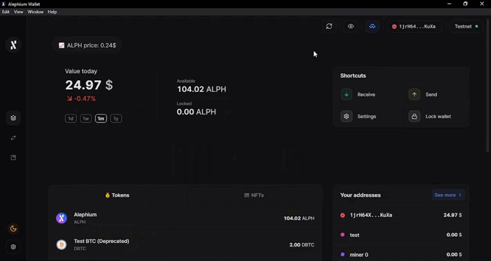

#### It’s a big one! Token support, dApp connectivity, and a lot more in this feature-rich release!

Alephium is thrilled to announce the release of Desktop Wallet 2.0. You can upgrade directly (since version 1.5.0) from your wallet by clicking on the pop-up that will appear when you access the wallet, or by downloading <a href="https://github.com/alephium/desktop-wallet/releases/latest" class="markup--anchor markup--p-anchor" data-href="https://github.com/alephium/desktop-wallet/releases/latest" rel="noopener" target="_blank">the latest release</a>.

The <a href="https://medium.com/@alephium/the-leman-network-upgrade-is-live-f52c89b7dd6a" class="markup--anchor markup--p-anchor" data-href="https://medium.com/@alephium/the-leman-network-upgrade-is-live-f52c89b7dd6a" target="_blank">Leman Network Upgrade</a> and the capabilities it unleashed on the network made it the perfect timing for a redesign of the wallet. It now provides many new features and an even more intuitive User Interface.

### A New Design

It’s a complete redesign, but you won’t feel lost! The Desktop Wallet 2.0 features smoother transitions between screens and a cleaner interface, full of space, making it easy to navigate, in an enjoyable and simple experience.

The handy overview page now includes your holdings (ALPH & tokens), your balances in the chosen network, and shortcuts to the most important actions. You can also see a chart that represents the historical value of your holdings (it will appear after 3 days of your first transaction)

The Transfers page shows all transactions of your wallet addresses and allows you to make filtered searches to find any specific transaction you choose. It’s very useful if you want to review all past swaps, only transactions received or filter specific token transactions!

The Addresses & contacts page now has a new look, and you can filter the addresses by assets, addresses, or other keywords!

### Token support

The Desktop Wallet now supports tokens transfers. And it does in a big way: you can send multiple assets in one transaction!

For those coming from the EVM context, there is no need to create multiple transactions for multiple assets: send it all at once and save on fees!

### Welcome WalletConnect

The Desktop Wallet can now interacts with dApps directly using the WalletConnect protocol. You can comfortably use this <a href="https://walletconnect.com/" class="markup--anchor markup--p-anchor" data-href="https://walletconnect.com/" rel="noopener" target="_blank">awesome open-source protocol</a> to connect to dApps. When you connect your wallet to a dApp through WalletConnect, it’s easy to sign transactions, view account balances, and more.

The example below shows a swap transaction in the <a href="https://alephium.github.io/alephium-dex" class="markup--anchor markup--p-anchor" data-href="https://alephium.github.io/alephium-dex" rel="noopener" target="_blank">Alephium DEX</a> (on testnet).

### Easy CSV Exports

Export all your transactions from your wallet to a CSV file! With a CSV export, you can analyze the transaction data, calculate gains and losses, and use this input to generate tax reports. It provides a convenient way to keep track of all the activity in a wallet, especially for those who make frequent transactions.

On the Desktop Wallet, you can now export your transactions history in the following way:

- Go to the Addresses section;
- Choose which address you want to export the transactions from;
- Click on export;
- Select the time period;
- Save the CSV file;
- _Et voilà!_

### Developer tools: Private key export and deploy/call contract buttons

Now,developers using the Desktop Wallet can easily deploy or call contracts directly from the wallet interface, as well as export their private keys.

The wallet will guide you through the process, and if any assistance is needed, you can always reach out to the core developers in our <a href="http://www.alephium.org/discord" class="markup--anchor markup--p-anchor" data-href="http://www.alephium.org/discord" rel="noopener" target="_blank">Discord</a>.

### Import Wallet: Automatic recovery

Now, after importing your wallet using the recovery phrase, the wallet can scan the connected network to discover all the active addresses you have used in the past. An active address is one that has at least one transaction. That’s how you do it:

- Go to the Addresses section;
- Click on the wrench icon next to the “+ New address button”;
- Click on the “Search” button in the “Discover active addresses” option

Now the Desktop wallet shows all active addresses linked to this recovery phrase.

### What’s next?

The Front End contributors will closely monitor the performance of this new release to make sure that everything is working as expected and, of course, are already working on the next big release: the mobile wallet.

If you have questions or suggestions, please come to Alephium’s <a href="http://alephium.org/discord" class="markup--anchor markup--p-anchor" data-href="http://alephium.org/discord" rel="noopener" target="_blank">Discord</a>, <a href="https://t.me/alephiumgroup" class="markup--anchor markup--p-anchor" data-href="https://t.me/alephiumgroup" rel="noopener" target="_blank">Telegram</a>, or reach out on <a href="https://twitter.com/alephium" class="markup--anchor markup--p-anchor" data-href="https://twitter.com/alephium" rel="noopener" target="_blank">Twitter</a>!
