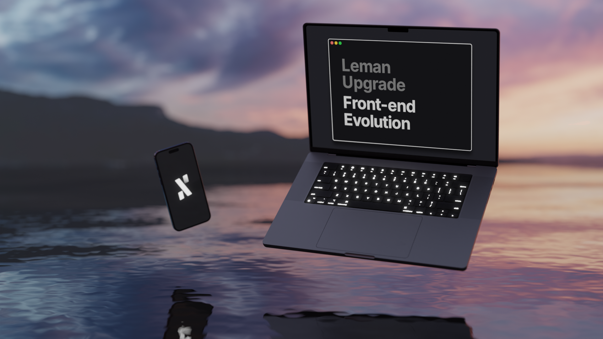
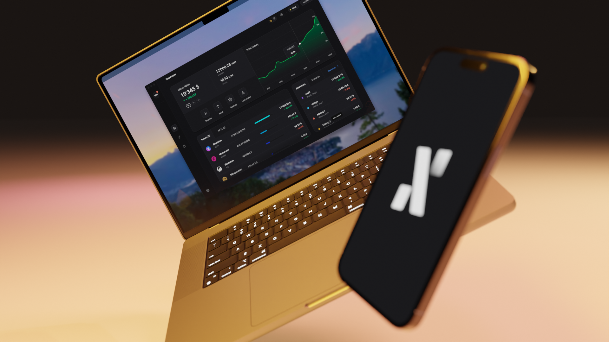
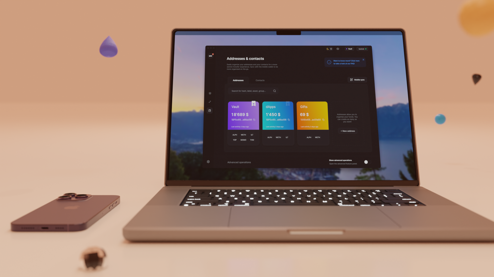
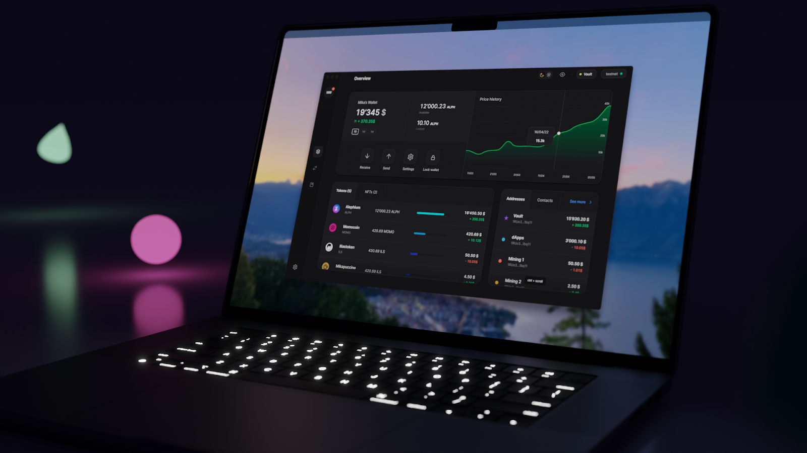
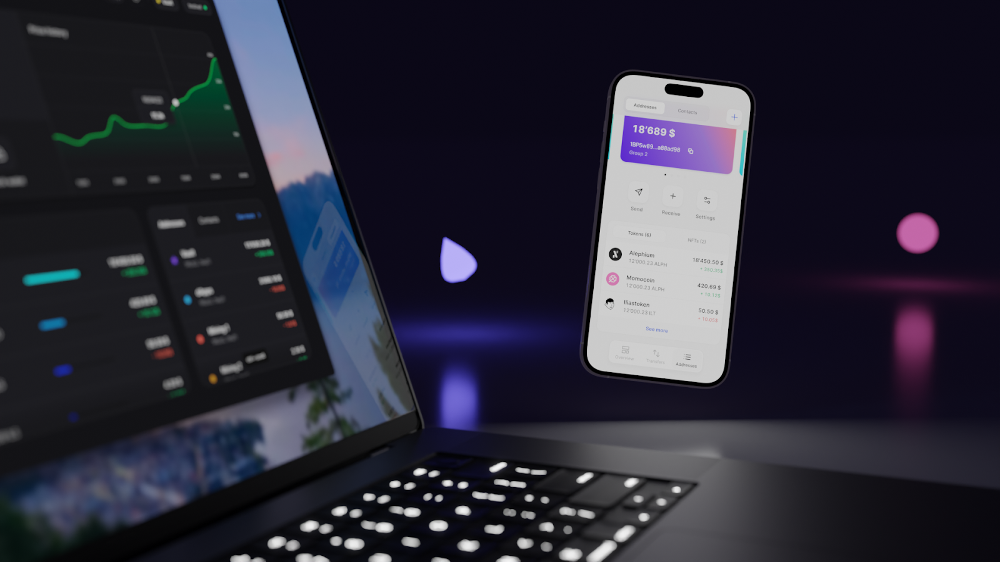
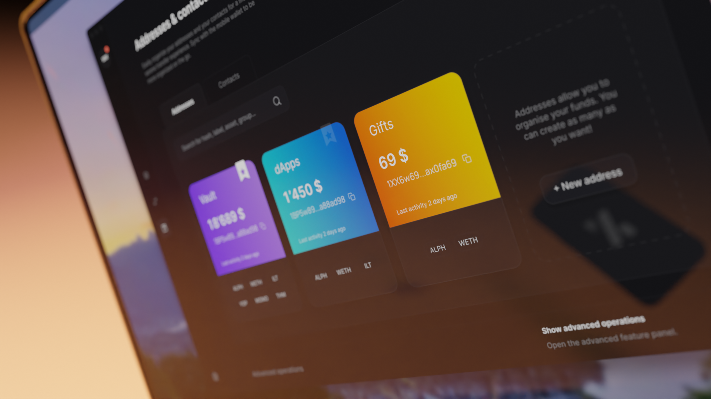
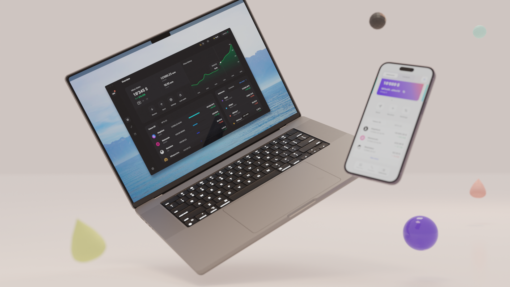
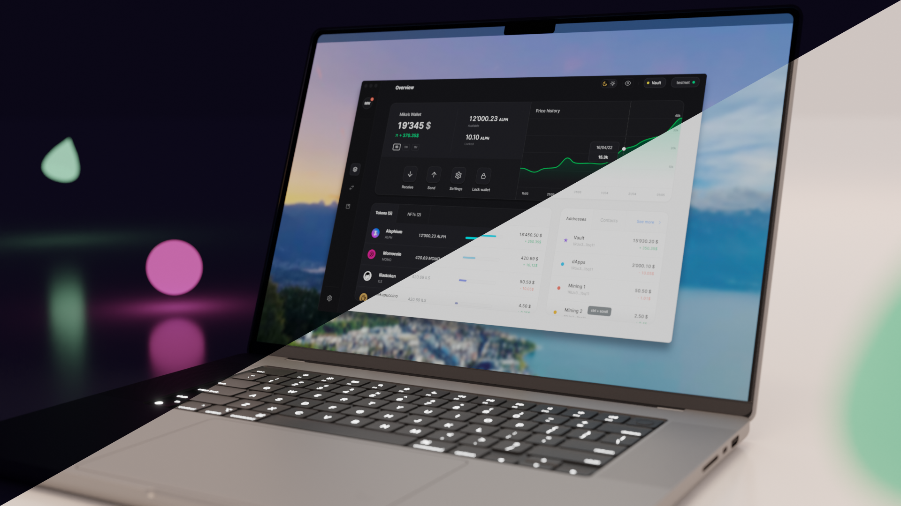
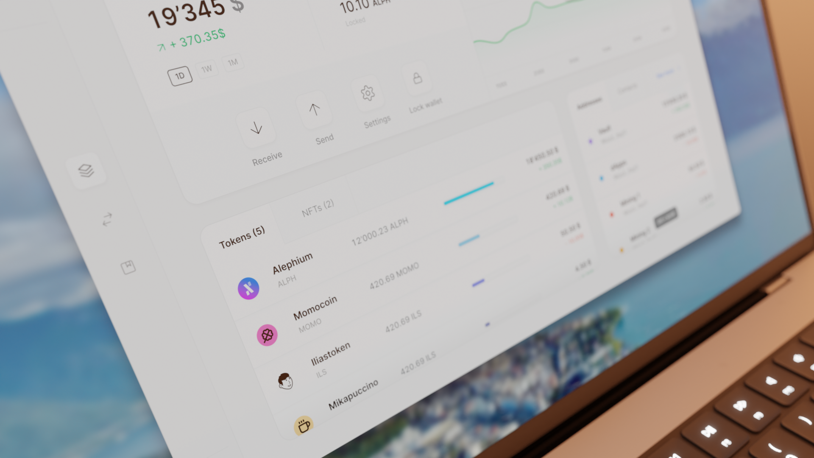

### **The Front End Leman Upgrade**

#### _The coming_ <a href="https://medium.com/@alephium/announcing-the-leman-network-upgrade-c01a81e65f0e" class="markup--anchor markup--h4-anchor" data-href="https://medium.com/@alephium/announcing-the-leman-network-upgrade-c01a81e65f0e" target="_blank"><em>Leman upgrade approaches.</em></a> _Simultaneously, the front-end suite of tools is seeing more than a simple refresh._

The front end covers all the parts of Alephium that users interact with: the explorer, website, and desktop wallet are its most visible parts. All of these will see a significant evolution of their functionality and UX in the first quarter of 2023.

_What’s changing?_

**The ecosystem is growing** — After many months of building, the mobile wallet and the browser extension are coming. The family of wallets will finally be complete and will be fully interconnected. Users will be able to go from one to the other easily, as it should be!

**Global update of the navigation in-apps **— Less-is-more for the user experience, the wallets will get a navigation update! Only 3 menus are left for all users’ needs. The overview landing page, transfer & transactions page, addresses & contact lists. It’s easier than ever to get to every feature and to find all the information needed.

**Smart-contract/tokens ready **— As the Leman upgrade will facilitate the development of a diverse and rich Alephium ecosystem, the wallets are getting ready to welcome smart contract interactions, assets collections, and multiple native token integrations.

_Some details!_

**The Desktop wallet** gets a big upgrade. It will have a whole new system for version update (no more needing to download a new version from GitHub), a fully functional WalletConnect experience with deep-linking, desktop-to-mobile wallet sync, a contact list, automatic address discovery, display of prices, the often requested CSV export feature, and other really cool features…

**The** **Mobile wallet** makes its grand debut! It will have 80% of the features of the desktop wallet from the first release and a special mechanism to make it easy to interact between desktop and mobile. The development has been intense and quick, the first commit was in April ’22! It’s built with React Native, which means we will eventually release the app on both Android and iOS platforms.

**The Browser extension** is a favored way to interact with dApps for most crypto users in the biggest ecosystems… Now it’ll also be available to Alephium users. As the screen estate of an extension is rather limited, we designed a simple and lightweight UI, tailored for interacting with dApps and execute daily operations.

**The website & the explorer** will keep evolving as well and get some love at the same time as the rest of the stack. New pages will be added to the website to showcase the growing tech and ecosystem, and the explorer will receive more features to make it ever-more-useful.

_To the future!_

**From 0 to 1 **— The first year of the front-end has been a time of bringing tools into existence. Alephium went from nothing to a fully-featured, diverse ecosystem of multiplatform tools allowing users to transact on-chain, interact with smart contracts, check activity on the explorer and discover Alephium on its website.

**That magic feel — **The coming times will be used to stabilize everything into a proper ecosystem. Making sure everything works together flawlessly. Want to go from discovering a dApp in-browser to interacting on mobile? No problem. Want to transfer assets from your desktop and check on mobile? Easy… « It just works ». The user shouldn’t have to read docs, Alephium wants to keep working on “that magic feel” UX.

**Stay hungry, stay foolish **— Next year will be a year of smart contracts, dApps & creativity. New things will emerge from the technology that has been brought into existence. Alephium is gearing to give the community the tools it needs to exploit to the maximum the possibilities opened by the Leman Upgrade. Expect libraries of useful tests and fun experimentations!

_Motivation, vision & principles_

**A focus on UX — **Since the beginning, Alephium has put a specific focus on producing a rich and consistent ecosystem of consumer-facing apps. This is rare among L1s, where there’s often not a fully-featured ecosystem of wallets provided by the core team. Part of Alephium’s mission, on top of the cypherpunk’s ideals of decentralization, security & scalability, is to create tools offering people the best, easiest and most secure user experience.

**Balance, over all things **— The crypto design space is full of contrast. Gamification vs. technicality is one of those. Some wallets make the user experience feel like a video game, full of colors, animations, and dopamine-rush-inducing features. Others optimize for technical exhaustivity. Alephium opts for the best of both worlds: an effective yet agreeable experience. In a similar fashion to its Swiss roots, Alephium carefully balances trust and disruption, conservatism (using the battle-tested tech) & experimentation (optimizing for freedom).

**Experiments, curiosity, iteration** — The team studies what’s available on other chains, tests all features, find problems, and looks for solutions. An iterative process takes the team from the initial idea to a polished product. How should we play with our color palette in order to highlight crucial information? What changes occur when dark mode is enabled? How to optimize for fewer user mistakes when checking an address? There’s a lot of work going into the UI that completely changes the user experience!
